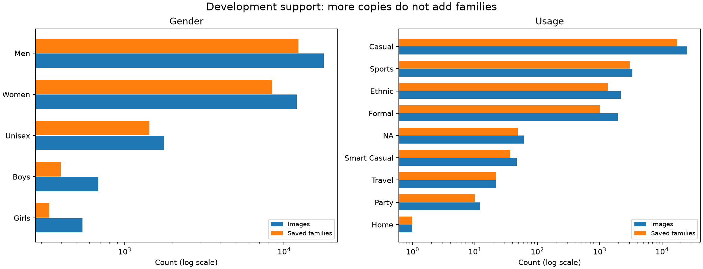
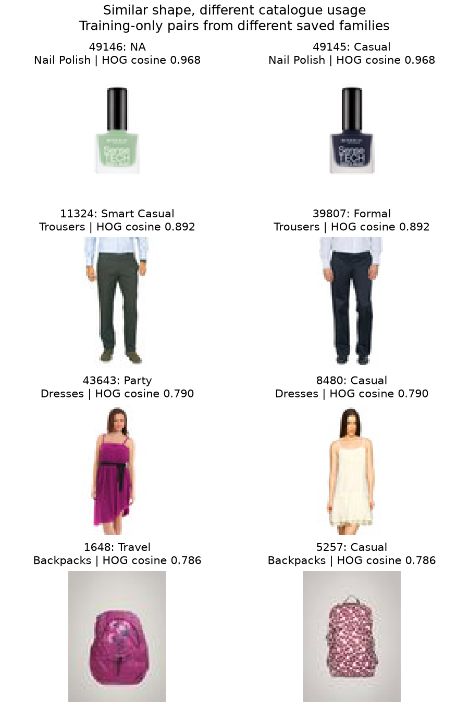
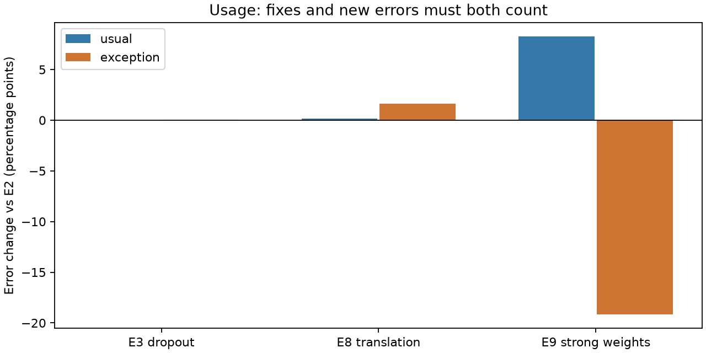
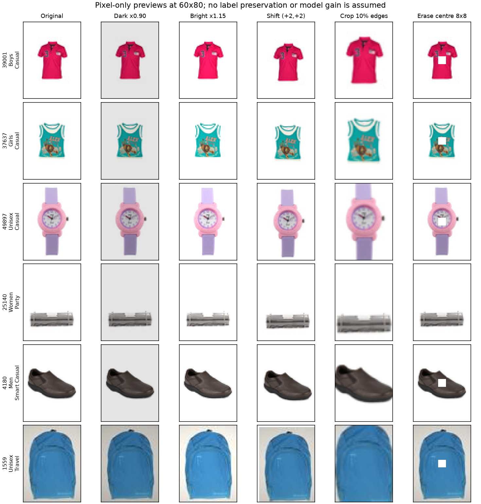

# Task 3: a tested data-intervention plan

Research snapshot: 5 September 2026. Branch: `task-3-gender-usage-classification`.

## Main judgement

**Use a targeted data plan, but do not assume that more augmentation will fix both tasks.** Gender has a useful, measured position-tolerance result. Usage has a much harder mix of scarce examples, weak image-only class boundaries, memorisation, and changes that help one group while hurting another.

G2 is complete. Its five-fold macro-F1 is **0.750217**, versus E6's **0.733521**. All five folds and all five class F1 scores improve. Its clean training F1 is still **0.994435**, and the train–validation gap is **0.244191**. It fails the existing dark-image guard. It is a useful research result, **not an accepted all-gates winner**.

Architecture has also helped: the GeM result rose from the SmallCNN baseline's 0.7118 to 0.7335. Most tested data interventions did not produce a safe win. The evidence supports prioritising a specific data failure now, not a general claim that data work always beats architecture.

The best next action needs no training: finish the two blind human reviews and make the saved decision checks complete. If one data experiment is later authorised, choose **G2 plus a small chance of mild darkening**. For Usage, do not duplicate the tail to force equal class sizes. Repair U2 before considering its one fixed screen; consider mild exception weighting only if human review supports the labels. Home cannot support a trustworthy learned class today.

This report challenges the earlier research task's stale “finish G2” advice and its blanket rejection of untested augmentation variants. The completed G2 evidence supersedes its status. Failed broad brightness, strong exception balancing, and foreground/component experiments constrain the next test; they do not prove every weaker or differently targeted variant must fail.

## Scope and evidence strength

Only canonical development labels and teacher development pixels were analysed. Pixel previews and new HOG neighbours use **folds 1, 2, and 3**, the shared training pool for screens on folds 0 and 4. No protected holdout/test labels or pixels entered the analysis. No model was trained or run for new predictions. No data, split, label, notebook, registry, or old report was edited. Transform previews are scientific illustrations stored in this report, not training images.

The review read the main notebook and saved source/output text for 04a–04s, the latest fit review, the earlier failure review, G2 readbacks and manifest, training/data/augmentation/metric code, the rubric, and the assignment spec. The final response of the previous research task was read. `notebook_readback.txt` preserves the inspected notebook source and text outputs, including historical statements that are now stale.

Evidence levels used below:

- **Direct:** current hashes, canonical counts, saved OOF predictions, fold metrics and measured pixel changes.
- **Descriptive:** within-class correlations, hand-picked image cases, HOG neighbours, and prior balanced diagnostic probes. These help form hypotheses, not prove causes.
- **Proposed:** an unrun experiment or a decision threshold chosen for the next study. No expected score gain is represented as measured.

All development folds have been used repeatedly for model choices. They are not fresh independent final-test evidence. Family bootstraps describe uncertainty within this development sample; they do not remove selection bias or measure seed variation.

## 1. What can be trusted in the EDA package?

A fresh read-only audit rehashed **all 32,773 development teacher images** and matched every hash to `splits.csv`. The current split digest, Task 3 label-scope digest, teacher-image manifest digest, and EDA source-code hash match the saved `92b53b…` audit contract. The new full hash is `74cb33…` because the recorded Linux kernel changed from 7.1.12 to 7.1.13. This environment change is separate from the older `da1880…` mismatch.

All **44/44** files in the old artifact manifest match their listed hashes. The image-diagnostic file also matches its own contract. Its IDs, folds, paths and family IDs match current development rows. A deterministic sample of **160 images** was remeasured: maximum numeric difference was **1.78e-15**, and foreground fallback flags matched. The diagnostic values and fresh counts are sound enough for this report.

However, `completion.json`, the view-probe contract, and the neighbourhood contract still point to `da1880…`. The full original payload for that hash is not present in those files. Matching artifact bytes does **not** reconstruct that missing provenance chain. The saved probe predictions were checked against canonical development labels and their reported scores; these are historical diagnostic observations, not certification of a currently reproducible fitted pipeline. Do not replace hashes in old files to make them agree. Archive the mismatch and rebuild only the needed cache under a new contract when a future run needs it.

Sources: [fresh contract](fresh_audit_contract.json), [provenance verdict](provenance_verdict.json), [44-file check](old_manifest_check.csv), [160-image recheck](diagnostic_recheck.csv), [old probe readback](old_probe_readback_check.csv).

The current development set contains 32,761 native 60×80 images and **12 small size exceptions**. CNN loading uses its existing aspect-preserving transform; U2's fixed HOG path explicitly resizes to 60×80. Keep these existing contracts when comparing descendants. The 385 new pixel-preview samples are all native 60×80.

## 2. Rechecked fitting diagnoses

There are **27 completed configurations and 28 comparison rows**, because G2's two-fold screen and five-fold completion are separate scopes. U2 remains unrun. Recomputed validation means match 27 available fold-metric ledger rows to **5.6e-17**; Usage E1 lacks local fold metrics and retains its recovered histories/notebook evidence. The four full curve sheets were visually inspected, including the new G2 curves.

| Evidence | Diagnosis | What it does not establish |
|---|---|---|
| Gender E6: clean train 1.0000, validation 0.7333; G2: 0.9944 vs 0.7502 | Large memorisation/generalisation gap; G2 trims it by 0.0224, about 8.4% | That a larger network or more epochs will solve it |
| Gender CompactBlur: train 0.8723, validation 0.7069; HOG screen: 0.8535 vs 0.6606 | Lower fitting freedom lowers the gap but also loses useful prediction quality | That the smallest gap is the best model |
| Usage E2: online train 0.9385, validation 0.4043; E3 clean 0.9291 vs 0.4140; E4 clean 0.9762 vs 0.3858 | Strong overfitting, with different class boundaries and confidence | That all Usage errors are due only to imbalance |
| Usage type cascade: train 0.3815, validation 0.3194 | Clearest underfit pattern: low and close scores | That model size alone caused it; representation and the type bottleneck also matter |
| Usage TinyConvNeXt: clean train 0.6838, validation 0.3474; rising late validation loss | Poor fit under the tested optimiser/budget, plus later overfitting | That more training is a safe cure |
| Usage E8: clean train 0.7905, validation 0.4155, pooled 0.4194 | Useful position regularisation, remaining gap and harmful tail/dark trade-offs | “Simply underfit” |

Online train F1 mixes changing weights, training-mode batch normalisation, and sometimes augmentation. Clean final-model F1 uses one finished checkpoint on unmodified training rows. These are different measurements. G2's final online F1 is roughly 0.963, far below its clean 0.9944; using online values understates its remaining memorisation. U2's clean-gap route also needs a clean E2 parent measurement that E2's current metrics do not contain.

Early Gender E1–E3 validation F1 swings substantially during epochs 5–20, then settles during epochs 25–30. E1's mean curve ranges from 0.3572 to 0.6480 in the earlier window. The code uses AdamW, a cosine learning-rate schedule, batch size 128, and BatchNorm. Evaluation explicitly switches to inference mode. The logs do not distinguish learning-rate sensitivity, poorly matched running batch statistics, or unstable minority decisions. They do rule out a simple story of monotonic validation deterioration from the first few epochs. Do not invent a BatchNorm bug or choose an early loss minimum as a proven fix.

A later no-training diagnostic could compare a saved checkpoint's predictions across evaluation batch sizes and ordering, and inspect BatchNorm running statistics. If statistics are recalibrated, use only the original fold-training images and a separate checkpoint copy; this becomes a new post-processing candidate requiring its own evaluation. Final checkpoints cannot recover the missing intermediate states of E1–E3.

G2 probability quality also improves: NLL **0.432520 → 0.290449**, ECE-15 **0.064217 → 0.030258**. Its loss curve is much healthier than E6 even while its F1 gap stays large. Lower NLL/Brier can reflect both discrimination and calibration; ECE alone is not a rare-class guarantee. [Official calibration guide](https://scikit-learn.org/stable/modules/calibration.html).

G2's shift-induced mean F1 drop improves **−0.146509 → −0.027319**. Darkening changes worsen **−0.204218 → −0.236211**, a **0.031993** regression against the frozen 0.020 guard. The arithmetic gates available locally were recomputed: the dark guard fails, while the other available five-fold numeric gates pass. Fresh/full paired bootstrap and complete checkpoint/registry/OOF integrity remain uncomputed here. Saved 04r output shows all five registry checks passed; that is saved-run evidence, not a new registry certification. All **11** local Drive text readbacks match their manifest hashes.

Sources: [full existing ledger](../fit_review_20260905/all_experiments.csv), [27-row recheck](fit_ledger_recheck.csv), [G2 fold changes](g2_matched_fold_recheck.csv), [class changes](g2_matched_class_recheck.csv), [frozen gate readback](g2_frozen_gate_readback.csv), [Drive manifest](../fit_review_20260905/g2_readback_manifest.json).

## 3. Deeper data findings

### Independent support is much smaller than image count

A saved product family is the available grouping proxy, not proof that two different families are statistically independent. Family rules may miss related catalogue items. Accepted visual components are stricter pixel-similarity groups; neither grouping is a new split.

| Target / label | Images | Saved families | Accepted visual components |
|---|---:|---:|---:|
| Gender: Boys | 684 | 397 | 486 |
| Gender: Girls | 543 | 336 | 404 |
| Gender: Men | 17,753 | 12,345 | 17,436 |
| Gender: Unisex | 1,766 | 1,428 | 1,760 |
| Gender: Women | 12,027 | 8,401 | 11,924 |
| Usage: Casual | 25,151 | 17,637 | 24,489 |
| Usage: Ethnic | 2,183 | 1,351 | 2,176 |
| Usage: Formal | 1,949 | 1,016 | 1,869 |
| Usage: Sports | 3,346 | 3,020 | 3,339 |
| Usage: NA | 61 | 49 | 56 |
| Usage: Smart Casual | 47 | 37 | 46 |
| Usage: Travel | 22 | 22 | 22 |
| Usage: Party | 12 | 10 | 12 |
| Usage: Home | 1 | 1 | 1 |



The visual-component rebuild found **32,009 components**, 629 multirow components, and 1,393 rows in those components. The largest has six images; none crosses a canonical fold. Saved families also have zero fold crossings. This verifies the frozen grouping rules, not that every possible near duplicate has been detected.

Removing all accepted duplication cannot create new Party or Travel information: each of those rows is already in its own accepted visual component. Gender Boys and Girls are more repetitive. But G3's component-weight experiment already failed to improve Gender, and U1 did not fix Usage. Also, these tested components are not identical to all product families: a gentler family-aware sampler remains untested, but has weaker priority than the present evidence suggests for photometric testing or label review.

Family concentration further reduces the practical variety in a row-weighted sample. For example, the size-based concentration index `(sum family sizes)^2 / sum(size^2)` is 8 for Party and 28.7 for Smart Casual. This is a weighting/concentration diagnostic, **not an estimated statistical effective sample size** or a human ceiling.

Usage outer training folds contain only 7–9 Party families; inner SVM fitting folds can have **5–6**, and an inner calibration fold may contain only **one** Party family. Home's single image is in fold 4. When fold 4 is validation there are zero training Home examples. In other outer folds, at least one inner fit or calibration side lacks Home. Neither augmentation nor a different random split fixes this valid evaluation problem.

Sources: [class support](class_independent_support.csv), [all outer/inner counts](fold_class_support.csv), [visual-component contract](visual_component_contract.json).

### Diversity and ambiguity are different problems

Party spans six article types, but seven of its 12 images are Dresses. Smart Casual has nine types, yet 18/47 images are Watches. Travel has five types and 10/22 Backpacks. NA spans 14 types, including shoe-care items. `NA` is an explicit valid Usage class in the current contract; one separate missing Usage label remains excluded. Never let a CSV parser silently turn the string `NA` into missing data.

There are **238 mixed-Usage families with 1,232 images**, but only **two mixed-Gender families with 14 images**. Accepted near-duplicate pairs include Casual/NA nail-polish labels (49105/49157 and 49078/49098), and Men/Unisex (8673/8712). These pairs warrant review. Close pixels or a shared name do not establish which label is wrong; family grouping itself can be imperfect. “Conflicting family labels cause all overfitting” is not supported by these small counts.

New fixed HOG neighbours were computed without fitting anything, using only training folds 1/2/3, at most 450 families per Usage class, and the exact full-RGB HOG feature routine. Neighbours exclude the query's saved family and match its article type. Similar-looking examples can carry different occasions: trousers 11324/39807 are Smart Casual/Formal; dresses 43643/8480 are Party/Casual; backpacks 1648/5257 are Travel/Casual. HOG is a shape descriptor and may miss meaningful fabric or styling cues. These are review cases, not a measured accuracy ceiling.



Visual inspection shows both product-only pictures and worn clothing, small objects surrounded by white, and some Travel bags with grey backgrounds. The clues needed for occasion may be missing or tiny. It is not possible to settle intended age/audience or occasion reliably from this visual inspection alone. No demographic identity of pictured people was inferred.

The existing two **367-row** blind forms remain the right human test. Each person should review the images alone, without teacher labels or names, and record a label plus clear/uncertain/cannot-tell. Lock both forms before joining teacher labels. Report judgeability, raw agreement, Cohen's kappa, disagreement with the catalogue and counts by target/class/type; report uncertainty by family. These 367 selected images are not a random population sample. A proposed triage rule is ≥70% judgeable and kappa ≥0.60 to justify further rare-class exploration; <50% judgeable or kappa <0.40 is evidence against expecting an image-only fix; the middle is inconclusive. Do not call these universal thresholds or automatically relabel from them. Original human reviews are still incomplete.

[Confident Learning](https://research.google/pubs/confident-learning-estimating-uncertainty-in-dataset-labels/) gives a principled way to rank possible label errors, under a class-conditional noise assumption. Here use such scores only to select a **human review queue**. Subjective catalogue occasions may violate that assumption, and confident model disagreement may reflect the model's shortcut instead of an incorrect teacher label.

Sources: [type diversity](class_article_diversity.csv), [mixed labels](mixed_labels.json), [accepted development pairs](accepted_development_pairs.csv), [new HOG pairs](rare_training_hog_neighbours.csv), [rare image sheet](rare_usage_contact_sheet.png), [existing human forms](../../../results/evidence/task3/clean_slate_eda/observability_review).

### Object size, brightness and fold differences

Boys/Girls have median proposed foreground fractions of **0.207/0.208**, versus **0.401 for Men** and **0.349 for Women**. Their median full-image brightness is also higher: **0.914/0.936**, versus **0.830/0.860**. This is compatible with more empty white area around child-labelled products. It is not evidence that a model uses brightness as its decision rule. The mask is a border-connected near-white heuristic and can confuse pale products, shadows and backgrounds.

Within each sufficiently supported class (train and validation counts ≥50), the largest measured fold mean difference among brightness, foreground area, white fraction and object centres is about **0.28 training standard deviations**. This does not show a huge general fold shift. Tail counts are too small to make the same claim for rare Usage. Fold-training quartiles and type modes were computed separately for each outer fold; no fold's validation labels defined its transformations or exception map.

Usage fold 1 has weak macro-F1 but is **not** the worst common-class error fold for E2. Its nine-class F1 is 0.3818 while total error is 10.71%. Its Casual/Ethnic/Formal F1 are 0.9326/0.8689/0.7715; Travel, Party and Smart Casual F1 are zero. Direct standardisation of common-class × usual/exception error rates covers about 99.5% of rows and changes fold errors only slightly. This does not test the tail's macro-F1 instability. It rejects the broad suggestion that fold 1's score can simply be explained by a bad common-class composition. The equal contribution of very small tail classes is important.

Sources: [fold-local thresholds](fold_training_thresholds.csv), [within-class shifts](within_class_fold_shifts.csv), [OOF class counts](saved_oof_class_counts.csv), [common-class standardisation](usage_fold_standardization.csv). The latter is a descriptive rate adjustment, not a causal decomposition of macro-F1.

### Usage type exceptions: count both fixes and harm

The fold-safe E2 audit reproduces 29,394 usual rows at **6.586% error**, 3,359 exceptions at **48.050% error**, and 19 rows without fold-training article-type support. An exception means its label differs from the most common Usage for that article type **in that fold's training rows**; it does not mean its label is wrong.

| Child vs E2 | Exception error | Usual error | What changed |
|---|---:|---:|---|
| E3 dropout | 48.080% | 6.563% | Essentially unchanged type-slice trade-off |
| E8 translation | 49.658% | 6.733% | Position tolerance did not improve exception errors |
| E9 strong exception weights | 28.878% | 14.847% | Many exceptions fixed, much larger usual-row harm |

E9 fixes 700 old exception errors and creates 56 new ones. On usual rows it fixes 452 old errors but creates **2,880** new ones. That supports changing the loss priority as a mechanism, not automatic label cleaning or “more overfitting.” A 1.5× multiplier is a plausible untested alternative to roughly 9× relative balancing, but a benefit is not assured.



Sources: [paired transitions](usage_error_transitions.csv), [full slices](saved_oof_error_slices.csv), [diagnostic review queue](usage_exception_review_queue.csv). The queue is labelled and must not replace the blind human forms.

## 4. Which augmentation and manipulation are justified?

New pixel checks used **385 images** from folds 1/2/3, sampled across both targets with family diversity. Foreground calculations exclude ten failed masks, leaving 375. This is a deliberately varied sample, not a population-weighted estimate. No classifier was tested on these new previews.

- Across all 25 integer shifts in `{-2,-1,0,1,2}²`, the median worst removed foreground fraction is zero; the 95th percentile is **3.30%**. Three images lose more than 5% in their worst shift. This supports small shifts as relatively gentle, not universally harmless.
- Removing 10% from each image edge loses a median **1.73%** of proposed foreground and a 95th percentile of **17.67%**; 147/375 exceed 5%. Resizing the crop changes object scale and interpolates tiny details.
- A centred 8×8 erasure covers only 1.33% of the 60×80 canvas but removes a median **4.38%**, and a 95th percentile **8.99%**, of foreground. The preview visibly removes a watch face and clothing detail. Random erasing could miss the object or hit its key cue; this centred test is a sensitivity illustration, not its expected random damage.
- Brightening by 1.15 newly clips a median **10.96%** of foreground channel values, with 95th percentile **49.94%**. Some are pale background-like pixels inside the proposed mask, so this is not a measured semantic-information loss. It provides a concrete reason to avoid repeating broad brightening blindly.
- Global darkening by 0.90 makes every pixel fall below the old white threshold 245. It changes both item lighting and background tone. Do not recompute the white-threshold foreground mask on that image and claim the object suddenly fills the canvas. Preserve the original mask for paired pixel diagnostics.



| Intervention | Mechanism and dataset-specific benefit | Risk and judgement |
|---|---|---|
| G2's ±2-pixel, p=0.5 translation | Direct five-fold evidence of much better position tolerance | Keep as parent evidence. Do not widen to ±8, crop, or alter G2's frozen run |
| Mild darkening, p=0.25, factor 0.90–1.00 | Targets G2's observed lighting/background vulnerability without bright saturation | Best conditional Gender test. It may teach background tolerance, lighting tolerance, or both; not yet proven |
| Mild contrast 0.95–1.05 or saturation 0.95–1.05, low probability | Could reduce sensitivity to small camera changes while preserving shape | Lower priority; colour and low-contrast detail may be useful. Preview both ends, then separate single-factor tests only if a measured failure motivates them |
| Rotations/shears, large shifts, zoom/crops, aggressive brightness/colour/blur | Broad invariance or regularisation | Can cut items, erase logos/texture, rotate text or destroy garment orientation. The exact tested crop/mask failures constrain these choices; untested mild variants remain uncertain |
| Horizontal flip | Preserves many product shapes cheaply | Worn pose, text/logos and handed accessories can change. Requires class/type-specific image review; no blanket guarantee |
| Class-conditional augmentation | Can give scarce classes more exposure to realistic within-class variation | Applying darkening only to Girls, for example, makes synthetic darkness a class cue. Prefer equal transform law across Gender. If later class-conditional, match nuisance coverage across classes and audit induced label correlation |
| Random oversampling | Gives rare rows more gradient exposure | Adds no independent families; can accelerate memorisation and distort confidence. Do not combine with strong existing class weights without a new controlled objective |
| Family-aware sampling | Spreads exposure across products instead of repeatedly selecting one family | Broad family balancing is untested; uniform families can underrepresent legitimate diverse large families. Prefer a bounded mixture only after auditing support, and do not equate it with the failed visual-component weighting |
| Majority undersampling | Saves compute and raises minority proportion | Discards useful variation among 17,637 Casual families and can damage usual-class precision. Poor priority here |
| Mixup | Blends two images and their labels, which can reduce memorisation | At 60×80 it overlaps small products and fades cues. Most unrestricted pairs involve Casual. Not blanket-rejected: a weak same-label, different-family variant (e.g. alpha 0.1, p=0.1) is an unrun fallback, after the simpler intervention, not an image source |
| CutMix | Combines image regions, often mixing labels in proportion to canvas area | Empty background occupies much of these images, so patch area can badly mismatch object evidence. Foreground-aware variants are possible but depend on an unreliable mask; deprioritise |
| Random Erasing | Encourages robustness to occluded details | A tiny region can remove the only visible cue; defer unless real occlusion failures are demonstrated |
| Label review/filtering | Could remove confirmed wrong training supervision | Name disagreement and model confidence are not truth. Do not remove hard exceptions, whole mixed families, or validation rows. A future authorised filter must be fixed from independent review and applied to training only |
| Synthetic images | Could vary appearance beyond simple pixel transforms | Do not assume correct occasion or new independent information. A generator trained on ten Party families can copy them; a pretrained generator brings outside knowledge and needs an explicit scope review. Not authorised or recommended now |

Small-shift vulnerability is established beyond this dataset, but the local G2 comparison is the strongest evidence for this project. [Zhang, ICML 2019](https://proceedings.mlr.press/v97/zhang19a.html). Mixup, CutMix, erasing and AugMix have positive results on other benchmarks; those results justify consideration, not transfer of their gains or label-preservation assumptions to these tiny images. [Mixup](https://arxiv.org/abs/1710.09412), [CutMix](https://arxiv.org/abs/1905.04899), [Random Erasing](https://arxiv.org/abs/1708.04896), [AugMix](https://arxiv.org/abs/1912.02781).

Effective-number weighting accounts for diminishing returns from overlapping examples, but it does not create missing diversity. The local E2/E9/U1 comparisons matter more than a general long-tail recipe. [Cui et al., CVPR 2019](https://arxiv.org/abs/1901.05555). Separating representation learning from the final classifier is another researched option, but would be a new pipeline requiring its own controlled comparison; it is not evidence that a new architecture is needed here. [Kang et al., ICLR 2020](https://arxiv.org/abs/1910.09217).

## 5. Would adding more images fix imbalance?

**Genuinely new, correctly labelled, independent products could help. Copies cannot solve missing class information.** The expected value depends on visual evidence and label quality, not matching every class to 25,151 images.

| Kind of “more images” | What it adds | Current scope |
|---|---|---|
| Repeated file / same product photo | Exposure/weight only | Researchable as sampling, but no dataset edit authorised |
| Shifted, darkened or blended old image | An assumed invariance or regularisation constraint | Can be tested later on fold-training data, keeping original family/fold |
| Different colour/view of the same product | Some appearance variety, still correlated | Same family/fold; do not count it as independent support |
| Generated synthetic image | Uncertain new appearance; label and source independence unverified | Not authorised; not a reliable rare-class shortcut |
| New independent labelled products | Potentially new class boundaries and coverage | Requires explicit Task 3 scope change and lawful accessible provenance; not collected here |
| Protected holdout/test image | Evaluation information | Never turn it into training data |

The assignment itself permits extra collection where necessary and requires the resulting dataset to be accessible to assessors. It also requires submitted systems trained from scratch, with pretrained systems used only for comparisons. **Decision 0015 is the narrower current project rule:** Tasks 1–3 use teacher images only; external high-resolution data is not currently a Task 3 option. Do not misstate the teacher-only rule as a universal ban in the assignment PDF. [Decision 0015](../../../docs/decisions/0015-teacher-only-shared-image-preparation.md); [assignment spec](<../../../docs/COSC2753_2026B_Assignment 2.pdf>), especially pages 4 and 6.

If scope later changes, prioritise independently labelled rare Usage families with the same article types, varied suppliers/backgrounds and the same task definition. Audit exact/near duplicates and family relationships against every existing role without exposing protected labels. Match the final 60×80 evaluation domain; downloading higher-resolution versions of the same IDs does not create independence. Establish canonical assignments through the existing data contract with explicit approval, never a second `train_test_split`. Keep any genuinely external evaluation collection separate from training. These are design requirements, not permission to collect or edit now.

Under today's constraints, the available gains are **better exposure to existing evidence, fewer unsupported claims, and better invariance**, not a new source of independent tail examples. For Home there is no empirical way to validate generalisation from one family. For Party/Travel/Smart Casual, some learning may be possible, but current data and incomplete human review do not support a promise of a trustworthy rare-class model.

## 6. Ranked next work and no-training checks

| Rank | Work | Benefit / evidence | Risk | Cost |
|---|---|---|---|---|
| 1 | Complete blind human review; finish G2/U2 decision and provenance checks | Strong evidence of missing review and executable gate gaps; resolves whether further tail work is meaningful | Biased review if labels are revealed; avoid it | Human time; small CPU checks; no training |
| 2 | One Gender mild-darkening descendant of completed G2 | Strong local failure mechanism; benefit of this exact change remains untested | Clean/minority or shift regression | Two screen folds, then three only if justified; about 8.2–8.3 training minutes/fold in saved G2 hardware, plus diagnostics |
| 3 | Usage U2 only after repair; mild 1.5× exception weighting is a lower-priority alternative if review supports it | U2 offers a different representation/classifier test. Mild weighting tests an evidenced trade-off at lower strength | Tail calibration instability or usual-class harm | U2 CPU screen with frozen resource cap; weighting costs roughly an E2 screen |

The first audit phase was partly done here: hashes and development support are repaired as evidence; the G2 dark failure and Usage error trade-offs are recomputed. Remaining no-training steps:

1. Read the complete G2 registry, OOF and checkpoint evidence from the saved Drive source when available. Verify exact expected IDs, one OOF prediction per ID, fold/family match, run IDs and probability columns. Run the written paired family-bootstrap rules; do not treat missing evidence as pass. No extra G2 confirmation training is needed.
2. With the saved parent/child checkpoints, evaluate a **25-shift map** and dark factors **0.85, 0.90, 0.95, 1.00** on each corresponding development validation fold. Use inference mode and the original fold-training normalisation. Save per-image probabilities and clean/perturbed pair IDs. This is model evaluation, not training; it was not run here because complete G2 checkpoints are not in this readback. Record mean/worst F1 drops, class recalls and prediction flips. The old shift test is only (+2,+2), not a full map.
3. Report those differences by class and by original-image foreground/brightness quartiles whose cutoffs come only from the corresponding training complement. Use original masks for darkened-image diagnostics. As a mechanism probe, compare changing proposed background alone versus foreground alone; failed masks are a separate category. Such artificial probes cannot prove real illumination causality.
4. Complete both unchanged 367-row human forms. Do not fill them with model guesses. Do not automatically relabel or filter afterwards.
5. Repair U2's documented issues before any user-run training. These repairs are described next and were not made to shared source in this research task.

## 7. Implementation-ready proposed Gender experiment

**Proposal G-D1: completed G2 plus mild darkening only.** This is a new, unrun hypothesis, not a reinterpretation of G2's frozen acceptance. The following rules are to be recorded before any optimiser step, with a fresh experiment/config ID.

- Parent: each corresponding completed G2 seed-2753 fold checkpoint/config, for comparison only. Child weights are **new scratch initialisation**, not a warm start. Same GeM architecture, 30 epochs, batch 128, optimiser/schedule, ordinary CE, uniform row sampling, labels, split and original fold RGB statistics.
- Data order: load original RGB; apply **exact existing G2** translation (`p=0.5`, integer dx/dy uniform −2…2, white fill and existing interpolation); independently with `p=0.25`, apply PIL brightness factor `Uniform(0.90,1.00)` to the whole image, including any fill; use the existing full-image transform and parent fold normalisation. No brightening, masking, crop, additional sampling or loss change. Validation remains clean except explicitly named diagnostic copies.
- Use a separate seeded RNG stream for the new darkening decision so the original translation draws and sampler sequence can be reproduced. No persistent extra training files; every derived tensor keeps its original ID, family and training fold. Record transform law and seeds in the config. No development-wide learned normalisation.
- Screen folds 0 and 4 once at seed 2753 against the **same-fold G2 and E6**. Continue only if clean pooled F1 drops ≤0.005 vs G2, neither fold drops >0.010, every pooled class F1 drops ≤0.020, dark-induced mean F1 change improves ≥0.030 vs G2, and shift-induced change worsens ≤0.010 vs G2. Both screen folds must improve the dark-induced change; the family-bootstrap lower 95% bound on the pooled clean change vs G2 must be ≥−0.005. These are proposed descendant gates, not changes to G2's gates.
- If the screen passes and training is authorised, run only folds 1–3. Report those fresh descendant folds separately: positive mean dark-induced improvement, at least two of three folds improve that measure, no clean fold loss >0.010 vs G2. Pool all five only after showing this scope.
- Five-fold success: clean F1 **≥0.7462** and clean change vs G2 ≥−0.005; paired family-bootstrap lower 95% clean-change bound ≥−0.005 vs G2 and >0 vs E6; at least four clean folds improve vs E6 and no fold loses >0.005 vs E6; SD ≤0.0209; gap ≤0.2466 and ≥0.020 smaller than E6, with no E6 fold gap worsening >0.005. Preserve mean Boys/Girls/Unisex ≥0.6013, Men ≥0.9188, Women ≥0.8950, and every class loss ≤0.020 vs G2. Keep NLL/ECE within G2+0.020 and within the original E6 no-harm ceilings.
- Mechanism success: dark-induced mean F1 change improves **≥0.030 vs G2**, and the original dark guard vs E6 now passes. No other old corruption worsens >0.020 vs E6; shift-induced change stays within 0.010 of G2 and improves ≥0.030 vs E6. Check 0.90/0.95 and the full shift map as diagnostics, so improvement at the single known 0.85 corruption is not described as universal robustness.
- Resampling method for proposed comparisons: join parent/child by canonical ID; draw whole saved families with replacement **within fold**, retain all their rows and fixed class order; use 10,000 paired draws, seed 2753, percentile 2.5/97.5 bounds. Never omit a class in a draw because it has no support. Count all reused screen rows explicitly; no claim of independent final testing.
- Resource/stop rules: keep model size and original memory limit; stop if training time exceeds 1.5× the corresponding parent absent a logged hardware reason, if probabilities or IDs fail integrity, or if a frozen gate fails. Inspect and report the failure; no factor/probability/seed fishing. No automatic new runs. Only a justified candidate would later get authorised seed replication and one sealed final evaluation.

This tests whether mild photometric exposure helps preserve G2's shift benefit without repeating E2's always-on 0.85–1.15 brightness range. It does not establish a new way to collect images or promise higher clean F1.

## 8. Usage: repair U2, then decide whether a data test is worth it

### U2 repair specification

Current U2 code writes Route A/B as strings after calling a generic parent-minus-0.020 gate. That generic result can say pass while the real rules fail. It also passes the same sample weights into `CalibratedClassifierCV.fit`, which the installed scikit-learn source forwards to calibration. Save an explicit per-rule evaluator and derive the final decision from it; never from the generic flag.

Keep `C=1`, pure full-RGB HOG, max 20,000 iterations, four canonical inner folds, sigmoid calibration, no augmentation, and E2 as the matched parent. The corrected version needs a fresh config hash. A win compares an entire fixed-feature/SVM/calibration pipeline with a CNN; it is not a one-factor proof about HOG alone.

For outer fold f and each inner fold j among the other four:

1. Inner base fitting uses only rows outside f and j. Compute effective-number class weights **inside that subset**, beta 0.999 and cap 5. Keep the existing weighted scaler policy, also fit only there. Fit the weighted SVM there.
2. Calibrate its margins on the untouched natural-frequency rows of j, **without class/sample weights** and without oversampling. The same inner base model must not have seen those rows. Average the four calibrated model probabilities for outer-fold prediction.
3. An implementation can compute weights inside the base estimator's `fit(y)` and call the calibration wrapper without outer `sample_weight`, or explicitly fit/calibrate each pair. Do not compute inner SVM weights from all four outer-training folds, since that includes the held-out calibration labels. Pin and test the routing behaviour of the installed scikit-learn version. [Official calibration guide](https://scikit-learn.org/stable/modules/calibration.html). The inspected local helper source is saved in [sklearn_calibration_readback.txt](sklearn_calibration_readback.txt).
4. **Home is unsupported/report-only:** exclude it from all inner fitting and calibration, expose a fixed nine-class probability vector with `P(Home)=0`, and renormalise the eight modelled classes. Keep its true evaluation row and zero class F1 in the official nine-class metric. Do not relabel it as Casual or drop it from the official score. NLL must retain the existing explicit epsilon (1e-12); report the resulting Home contribution and a separate no-Home metric. Zero output is a support policy, not a claim that future Home products cannot exist.
5. Define the no-harm guard's supported set in advance as **all eight non-Home classes**: Casual, Ethnic, Formal, NA, Party, Smart Casual, Sports, Travel. They have positive outer/inner support here, but the rare ones are not thereby statistically trustworthy. Fail closed if an expected inner side has zero positive support for one. Report common-four and rare-four metrics separately; do not narrow the guard after seeing results.

Natural-distribution calibration is needed if probabilities are meant to describe the natural data. Weighted calibration may be useful for a deliberately reweighted decision objective, but that is a different probability target. Removing weights is a principled probability-contract choice, **not proof it must improve macro-F1**. Tiny Party calibration support remains a major limitation even after the repair.

U2's frozen routes remain:

- Route A: pooled folds-0/4 macro-F1 ≥**0.417319**, paired family-bootstrap lower 95% bound >0 vs matched E2.
- Route B: macro-F1 ≥**0.402319**, plus ≥25% clean-gap reduction **or** ≥10% NLL or Brier improvement. Until E2 clean training is evaluated on its saved checkpoint, the clean-gap branch is **unavailable**; do not substitute E2's online curve. Even after that check, U2's ensemble train score is a mixed in-sample/calibration exposure measure; use the probability branch as stronger evidence than a smaller gap alone.
- ECE-15 ≤0.050; no supported class F1 loss >0.030. Rare prediction count ≤five times true support for each of NA, Party, Smart Casual and Travel; report per-fold and pooled counts, treating zero-support slices as allowing zero predictions. Home predictions are zero by design. Natural calibration does not replace this cap.
- Add the missing no-harm diagnostic before running: each old corruption's **induced F1 change** must be no worse than matched E2 by more than 0.020. Report clean and corrupted F1 as well. Keep the existing CPU limits of 90 minutes per fold and 7 GiB host memory, plus registry, ID/family and probability checks. If neither route passes, stop this exact pipeline. Do not infer that every fixed feature method fails.

### Conditional alternative: mild exception weighting

This is a lower-ranked proposal, not a recommendation to run both paths. First require human evidence that the reviewed exceptions are visually judgeable and their catalogue labels credible. If that fails, spend effort on an honest class limitation statement, not more weight on uncertain labels.

Parent: **Usage E2**, scratch SmallCNN and the same fold-only effective class weights. For each outer fold, derive its usual article-type map from **training rows only**, using count maximum and a frozen alphabetical tie-break. Retain every valid training row. Multiply only exception rows by **1.5**, then normalise the combined effective sample weights to mean one. Use a sample-weighted CE divided by the sum of batch sample weights; no weighted sampler, augmentation, dropout, label smoothing, filtering or model change. All validation rows remain unchanged, including exceptions, unsupported types and Home. Do not merge tail labels into a new task.

Screen folds 0/4 once at seed 2753 against matched E2. Frozen proposed gates: exception error at least 5 percentage points lower; usual error no more than 1 point higher; pooled nine-class F1 no worse than E2−0.005 and family-bootstrap lower bound ≥−0.005; every non-Home class F1 loss ≤0.020; NLL and ECE increases ≤0.020; old corruption-induced F1 changes within 0.020 of E2; same rare-prediction cap as above. Both folds must avoid >0.010 macro-F1 loss. If passed and authorised, confirm folds 1–3 with the same unchanged rules and evaluate all five. Stop after a failure; do not move the multiplier until it passes.

This is a one-change **loss-exposure ablation**, not extra independent data. A smaller multiplier might reduce E9's harm, but it might also lose its exception gains. The prior results do not choose the answer in advance.

Any future two-image mixing must use source images from the same canonical training fold within the current training complement, record both source IDs and families, and never become an independent evaluation row.

For a later family-aware alternative, the exact candidate should be defined separately: mixture sampling `p(i)=0.75/N + 0.25/(F*n_family(i))` within each training subset, N draws/epoch, no added class-uniform sampling. This limits dominance by big families while retaining 75% natural row sampling. If used, do not stack the 1.5× exception change into the same test. It remains lower priority: no current result demonstrates its benefit.

## 9. What an honest final judgement can say

“Gender improved with small position changes, but still overfits and remains sensitive to lighting. Usage works much better on several common classes than on the rare tail. The available family support and incomplete observability evidence do not justify a reliable Home/rare-occasion claim. Reweighting changed the error trade-off, and more transformed copies did not create new class information.”

That is a useful outcome even if the next experiment fails. The [rubric](../../../rubrics/RUBRIC.md) rewards comparison, justified choices, failure analysis and clear ultimate judgement. It has no separate raw-accuracy criterion; the assignment still asks for performance evaluation. Preserve the required separate predictions and fixed submission format `id,gender,articleType,season,usage`. Keep every future authorised training run in `fashion.train.registry`. Run local analysis through `./.venv/bin/python`; GPU training remains a manual Colab action for the user.

## Reproduce the new read-only analysis

From the repository root:

```bash
./.venv/bin/python reports/task3/data_intervention_20260905/analyse_data.py
./.venv/bin/python reports/task3/data_intervention_20260905/analyse_errors.py
./.venv/bin/python reports/task3/data_intervention_20260905/inspect_pixels.py
./.venv/bin/python reports/task3/data_intervention_20260905/check_evidence.py
```

These scripts write only into this new report folder and do not fit models or change shared evidence. The first command rehashes development images. The third computes fixed HOG descriptors and scientific image previews, not predictions or generated training data. G2 fold/class readback CSVs are also retained as inputs to the gate-check script.

Limitations: no new training, checkpoint inference, fresh-seed replication, complete G2 OOF/bootstrap acceptance audit, new duplicate search over all possible pairs, human labels or final-holdout evaluation. The pixel mask is approximate; HOG similarity is not semantic equivalence; natural fold correlations are not causal tests. Literature supports mechanisms on other datasets and cannot supply missing evidence for these labels.
