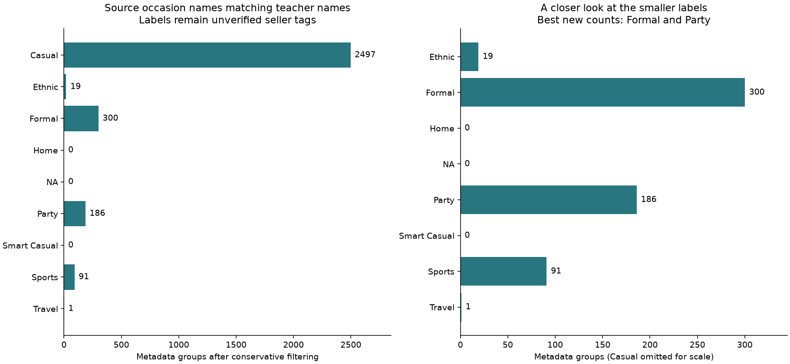
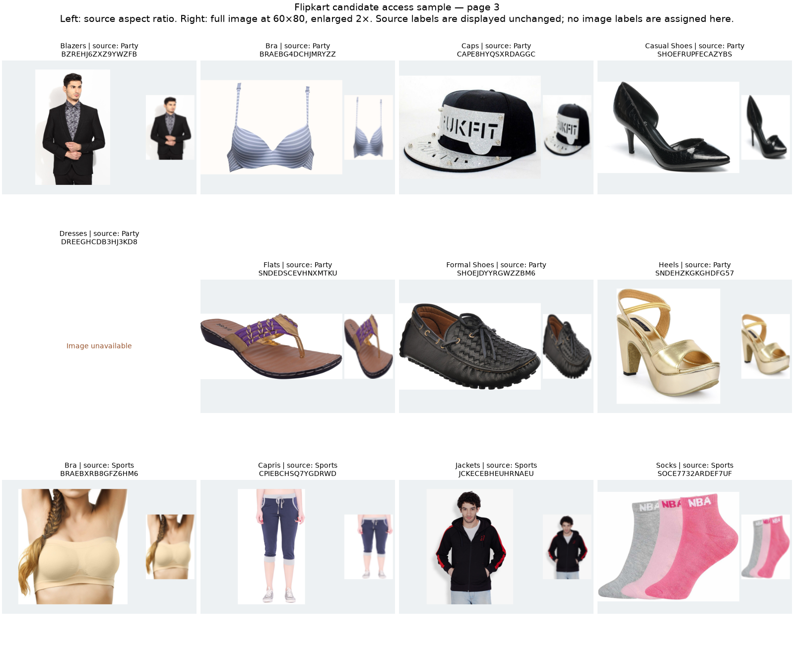

# Flipkart: product coverage, source labels and image access

5 September 2026. **Feasibility result: a small auxiliary-label trial is plausible. No training data has been admitted.**

The useful lead is extra source-labelled Formal and Party products. Flipkart is not a complete source for all 124 teacher types or all nine Usage classes. The measured availability is encouraging, but noisy merchant labels and source-image differences remain material limits. There is no measured model improvement in this audit.

## What was checked

The original [PromptCloud release](https://www.kaggle.com/datasets/PromptCloudHQ/flipkart-products), dataset 2506/version 1, is a 5,765,116-byte archive containing a 38,114,963-byte CSV. Its archive SHA-256 is `54a91fcd0b3d1923e3adb52c27e4dde557a7cd948dba066e3cb5bca542da1b9f`. It has 20,000 rows, 19,998 distinct product IDs and 19,997 rows with image URLs. The source snapshot, hashes and declared terms are saved in [source_provenance.json](source_provenance.json) and [publisher_metadata.json](publisher_metadata.json).

Source metadata is kept separate from the canonical teacher split. The 124 teacher type names and their counts come only from the development taxonomy and development class summary. The duplicate check uses explicit image-only columns across all teacher roles; protected Usage labels are not used.

## How much product coverage is real

| Check | Result |
|---|---:|
| Teacher article types | 124 |
| Types with an accepted metadata match | 85 |
| Types with no accepted match under these rules | 39 |
| Source rows assigned one teacher type | 11,347 |
| Rows with uncertain type evidence | 407 |
| Rows without an exact type rule match | 8,246 |
| Matched rows carrying any Occasion | 9,588 |
| Matched rows with one exact shared occasion name | 5,650 across 52 types |
| Final conservative candidate pool after grouping | 3,094 groups across 50 types |

The 85 matched type names account for 31,712 of 32,773 teacher development products. That is breadth by type name, not proof that external examples cover their full visual range. The full [124-row table](TYPE_COVERAGE.html) and [CSV](teacher_type_coverage.csv) include every type, even zero matches.

The map uses exact category segments and exact `Type` values, with explicit aliases. It withholds mixed garment/material names, conflicting type evidence and known hardware/accessory homonyms. Generic shoes do not automatically become sports or formal shoes. Unmapped is not proof of absence: some source bins combine scarves/stoles, leggings/jeggings or other types. [COVERAGE.md](COVERAGE.md) records the rules and limits; [coverage_assignments.csv](coverage_assignments.csv) gives the evidence for all 20,000 rows.

## How many labelled candidates remain

The source has 9,954 Occasion rows. Of these, 8,142 contain one distinct token and 1,812 contain several. There are 489 rows with more than one canonical Usage name. Choosing the first would invent a single-label target.

The coarse label filter requires one exact canonical-name token and a broad fashion category. The type filter independently requires an accepted fine type match. Missing image URLs, metadata groups with different known occasion sets, and within-group type disagreement are withheld. One deterministic representative is retained per remaining group.

| Source occasion name | Candidate groups | Candidate teacher types |
|---|---:|---:|
| Casual | 2,497 | 47 |
| Ethnic | 19 | 4 |
| Formal | 300 | 20 |
| Home | 0 | 0 |
| NA | 0 | 0 |
| Party | 186 | 17 |
| Smart Casual | 0 | 0 |
| Sports | 91 | 11 |
| Travel | 1 | 1 |



The full source collapses to 11,640 metadata groups using product ID, exact normalised name plus brand, or shared image asset path. There are 158 groups with differing known occasion sets. These are conservative grouping hints, not proven independent product families; generic names may over-group products, while visually related products may still escape grouping. [metadata_group_summary.json](metadata_group_summary.json) and [candidate_summary.json](candidate_summary.json) make these distinctions explicit.

Party includes 67 dress groups, 29 heels, 26 tops, 20 bras and 16 shirts, plus smaller groups. Formal includes 109 shirts, 47 formal shoes and 47 watches, plus other types. Sports includes 45 sports shoes and 17 watches. This is broader than the earlier dress-only iMaterialist proposal, but the gaps remain substantial.

All source Ethnic tokens are in footwear. Workwear is almost entirely jewellery: 770 of 777 rows. The single retained Travel group is a handbag. These patterns argue against automatic synonyms such as Workwear → Smart Casual or Festive → Ethnic. Missing Occasion must not become NA. See [TERMS_LABELS.md](TERMS_LABELS.md) for the complete label policy.

## Image availability and overlap

| Probe | Products | Decoded images | Failed | Recorded requests |
|---|---:|---:|---:|---:|
| Broad product/rare-source-tag sample | 48 | 41 | 7 | 55 |
| Exact-label candidate sample | 41 | 37 | 4 | 45 |

The second probe was necessary because the first used rare source strings, including tags outside the proposed exact-label pool. It uses at most eight metadata-group representatives per available source label and visits different product types in deterministic order. This is a purposive diagnostic sample, not a random estimate of whole-source availability.

The candidate results were Casual 7/8, Ethnic 8/8, Formal 6/8, Party 7/8, Sports 8/8 and Travel 1/1. Each product tried its first source image URL; a failed HTTP request allowed only an HTTPS scheme change. Final failures were 403 responses, sometimes following an initial HTTP 404. No alternative CDN paths or access bypass were used. The 78 successful local files occupy 15,090,509 bytes. An earlier development rerun repeated the first probe once; the saved tables describe the final probe outcomes, not total historical network traffic. Both access scripts now default to cache verification with zero requests.

Each successful image was checked against the existing image-only SHA/dHash cache for **44,441 teacher images**: 32,773 development, 5,778 holdout, 61 quarantine and 5,829 prediction. Cache ID/path/SHA coverage matches the current canonical manifests. There were no exact-byte or dHash-distance-at-most-two candidates. This establishes only the result for these 78 files under that detection rule. It does not clear the full candidate list, transformed duplicates outside the rule, or wider product-family overlap.

The [broad access record](ACCESS.md), [candidate access record](CANDIDATE_ACCESS.md), [candidate image outcomes](candidate_image_access.csv), and both duplicate CSVs retain the evidence. Every future selected image must undergo the all-role duplicate check before training admission.

## What the actual images show

All four candidate contact sheets and the first 24 broad-sample slots were visually inspected. They display the original aspect ratio beside a full-image 60×80 resize. The previews contain studio products, models wearing clothes, multi-item packs and collages. Long/wide images lose shape or fine detail under the same small full-frame resize used for the teacher task.

The previews also expose apparent source-type problems. Product `SHOEFRUPFECAZYBS` is tagged Casual Shoes but shows a high-heeled pump. Another source item is labelled Formal Shoes while showing a rugged lace-up shoe. This is not a systematic relabelling audit or an estimated error rate. It is enough to reject treating the metadata map as verified image ground truth. No source labels were corrected or manually selected for training.

Seller occasion judgments can also differ from the teacher convention. A Formal-tagged backpack illustrates that ambiguity; its occasion cannot be settled from appearance alone. The source tag should be preserved as uncertain supervision, not silently copied into the teacher target.

[Candidate sheet 1](../../../results/figures/task3/flipkart_feasibility/candidate_contact_1.png) · [Sheet 2](../../../results/figures/task3/flipkart_feasibility/candidate_contact_2.png) · [Sheet 3](../../../results/figures/task3/flipkart_feasibility/candidate_contact_3.png) · [Sheet 4](../../../results/figures/task3/flipkart_feasibility/candidate_contact_4.png)



## Decision and bounded next step

Use the source only for a small **separate source-tag learning task** first. Casual/Formal/Party have the strongest retained counts for a balanced pilot. Sports, Ethnic and Travel remain recorded candidates but lack 100 retained groups per label; Smart Casual, Home and NA have no exact source labels.

The [intake plan](pilot_intake_plan.json) caps the next source subset at **150 usable images per label, 450 total**, with a fixed selection order and a minimum of 100 per label after access and duplicate exclusions. It preserves seller tags and never overwrites teacher Usage labels. No part of that larger intake or model training was run here.

A later model comparison must start from scratch, keep canonical teacher folds and score all nine Usage classes. A shared feature extractor with a separate source-label output is the proposed mechanism. The teacher-only control and external-data treatment need fixed teacher exposure, optimisation steps, resource caps and scoring rules before fits start; a favourable source score alone is not success. The full intake, source-use record and this comparison recipe are the remaining preparation steps. The existing repository teacher-only training contract remains unchanged by this audit.

## Source terms and reproducibility

The publisher declares **CC BY-SA 4.0** for the released dataset. The [licence deed](https://creativecommons.org/licenses/by-sa/4.0/) requires attribution and share-alike conditions for adapted licensed material when shared. The metadata declaration does not itself establish rights to redistribute every remotely hosted photo. [TERMS_LABELS.md](TERMS_LABELS.md) records verified terms and unresolved image-rights scope; this is not a finding that research use is prohibited.

Metadata attribution: Flipkart Products, PromptCloud / PromptCloudHQ, version 1, via Kaggle, CC BY-SA 4.0. Changes: specification parsing, category matching, grouping and candidate filtering. Keep source URLs, release/version, hashes and this attribution with derived metadata.

Run the following from the repository root to reproduce the saved-data checks. The source archive is reused after hash verification. The image scripts verify saved files and make zero network requests unless `--refresh` is explicitly supplied.

```bash
./.venv/bin/python reports/task3/flipkart_feasibility_20260905/scout.py
./.venv/bin/python reports/task3/flipkart_feasibility_20260905/coverage.py
./.venv/bin/python reports/task3/flipkart_feasibility_20260905/label_audit.py
./.venv/bin/python reports/task3/flipkart_feasibility_20260905/metadata_groups.py
./.venv/bin/python reports/task3/flipkart_feasibility_20260905/pilot_candidates.py
./.venv/bin/python reports/task3/flipkart_feasibility_20260905/access.py
./.venv/bin/python reports/task3/flipkart_feasibility_20260905/candidate_access.py
./.venv/bin/python reports/task3/flipkart_feasibility_20260905/verify_audit.py
./.venv/bin/python reports/task3/flipkart_feasibility_20260905/render_audit.py
```

No training, model installation, canonical split edits, registry edits, commits or pushes were made. Existing concurrent work was preserved. [verification.json](verification.json) stores the count/hash checks and their limits.
