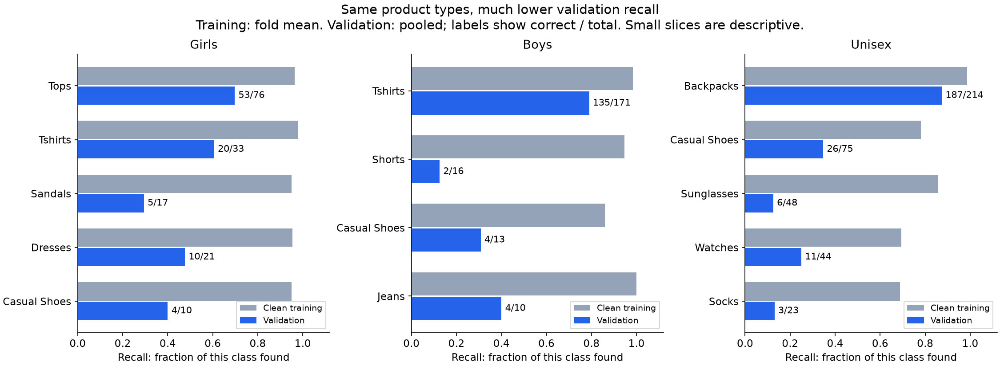

# Why Girls, Boys and Unisex still have large gaps

**The main problem is poor transfer to new products, with sparse training
coverage and unclear catalog boundaries contributing. The three classes need
different attention. Grayscale fixed part of the color problem, but most clean
errors were already present in earlier models.**

This inspection uses the completed 10% grayscale model, the direct darkening
parents and G2 on the same canonical validation folds 0 and 4. It examines all
13,110 validation rows, the new model's clean training predictions, development
metadata, and 73 distinct product images across 84 selected panels. The eight
contact sheets and comparison chart were rendered and visually inspected.

## Where the gap comes from

| Class | Training images per fold | Mean clean training F1 | Mean validation F1 | Gap |
|---|---:|---:|---:|---:|
| Girls | 434–436 | 0.9626 | 0.6179 | 0.3447 |
| Boys | 546–548 | 0.9720 | 0.6723 | 0.2997 |
| Unisex | 1,411–1,413 | 0.8980 | 0.6000 | 0.2980 |
| Women | 9,622 | 0.9863 | 0.9145 | 0.0718 |
| Men | 14,201–14,203 | 0.9870 | 0.9347 | 0.0523 |

Girls, Boys and Unisex make up only 1,198/13,110 validation images (9.1%), but
**88.4% of the mean macro-F1 gap**. Macro-F1 gives each class equal weight. This
is an exact decomposition of the measured gap, not a causal attribution.

The apparent image counts also overstate independent variety: each training
fold has only 266–272 Girls product families and 315–318 Boys families. Closely
related products are kept together by the canonical split. No family or exact
image hash crosses training/validation within either inspected fold.

Reweighting training recall to match the validation mix of article types barely
changes it: at most about 0.7 percentage points in these six class/fold cases.
The large recall gaps remain. Giving each product family equal weight also
leaves large gaps. Thus a different mix of product types or repeated images
alone does not explain the result. The composition check excludes the few
validation article/class combinations with no training counterpart and reports
their counts separately.



Recall means the fraction of that catalog class correctly found. Training bars
are fold means; validation bars pool folds 0 and 4. Small slices describe these
examples and should not be treated as precise population estimates.

## Boys: good on T-shirts, poor on several small groups

The model misses **93 of 274** Boys items. It sends 43 to Men, 18 to Women,
16 to Girls and 16 to Unisex. Adult predictions account for 61/93 misses.

- T-shirts: **135/171 correct (78.9%)**. This is the largest group, not the
  weakest: it accounts for 171/274 validation items.
- Shorts: **2/16 correct (12.5%)**, despite about **94.7% training recall**.
  Each fold has only 37–39 training shorts from 20–22 families. Eleven of the
  fourteen missed shorts become Men.
- Casual shoes: **4/13 correct (30.8%)**. There are only 17–18 training examples
  per fold, from 14–16 families.
- Fold 4 has five Boys watches and one blazer in validation with **zero** Boys
  training examples of those article types. This is a concrete coverage hole,
  though it explains only six of the 93 Boys misses.

The [missed-image sheet](boys_misses.png) shows ordinary shorts, shoes and shirts
photographed without a size reference. Their appearance can overlap adult
catalog classes. It also shows decorated children's items missed by all three
models, so missing scale information is not a complete explanation. These
observations support limited transfer from the small training set; they do not
prove what internal feature the network used.

## Girls: adult confusion plus weak footwear coverage

The model misses **89 of 216** Girls items: 43 become Women, 25 Boys, 14 Unisex
and 7 Men. Both folds remain weak: validation recall is 57.9% and 59.6%.

- Tops: **53/76 correct (69.7%)**; T-shirts: **20/33 (60.6%)**.
- Sandals: **5/17 (29.4%)**, against about **95.1% training recall**.
- Dresses: **10/21 (47.6%)**, against about **95.3% training recall**.
- Casual shoes: **4/10 (40.0%)**. Each fold has only **8–10** training examples
  from 8–9 families.

The [image examples](girls_misses.png) include tops and dresses predicted as
Women, and printed shirts predicted as Boys. Catalog names often agree with
the Girls label in these false negatives. Grayscale training helped, but it
did not make these clean-image class boundaries reliable. Removing color from
the new model still breaks 36 previously correct Girls predictions while
fixing 13 errors: 127 correct in color versus 104 in grayscale.

## Unisex: a strong backpack group hides weak accessories and shoes

The model misses **332 of 708** Unisex items. Of these, **312 become Men or
Women**: 194 Men and 118 Women. It assigns confidence of at least 0.90 to
115 of the 332 misses. This is not just a collection of low-confidence ties.

| Unisex product type | Correct validation predictions | Training recall, fold mean |
|---|---:|---:|
| Backpacks | **187/214 (87.4%)** | 98.7% |
| Casual shoes | **26/75 (34.7%)** | 78.1% |
| Sunglasses | **6/48 (12.5%)** | 85.8% |
| Watches | **11/44 (25.0%)** | 69.3% |
| Socks | **3/23 (13.0%)** | 68.8% |

Backpacks supply almost half the correct Unisex predictions. Across all other
Unisex articles, only **189/494 (38.3%)** are correct. Sunglasses, watches and
socks are weak in both folds; this pattern does not depend on a single split.

Training labels are strongly linked to article type. For example, fold 0 has
421 Unisex backpacks versus 36 Men and 27 Women backpacks. For watches it has
88 Unisex versus 869 Men and 553 Women. This is consistent with category-based
associations contributing to errors, but counts alone cannot prove a shortcut.

The [misses](unisex_misses.png), [false positives](unisex_false_positives.png)
and [correct controls](unisex_correct_controls.png) show shoes, bags and
accessories with overlapping appearance across catalog labels. Example 20938
is a Men-labeled backpack predicted as Unisex; example 9571 is a Unisex-labeled
shoulder bag predicted as Women. These are observations about catalog classes,
not claims about who can use the product.

Most Unisex mistakes are not explicit name–label conflicts: **300 of 332**
missed rows contain only the Unisex class cue in the product name. Image-only
classification may not capture every seller's audience choice. The evidence
does not establish an irreducible error rate. Also, training recall itself is
only about 69% for Unisex watches and socks: their problem includes poor fit,
not only a large gap after fitting the training data.

## Label wording complicates the child-class scores

Among predictions counted as false positives:

- **32/83 false Boys predictions** match explicit Boys wording in the name,
  while the catalog class differs.
- **28/68 false Girls predictions** match explicit Girls wording.

The [checked examples](name_label_conflicts.png) include:

- ID 17811: catalog Men, name “Chhota Bheem Kids Boy Krishna Balram Multi
  Tshirt”, prediction Boys.
- ID 5009: catalog Women, name “Gini and Jony Girl's Pacey Blue Kidswear”,
  prediction Girls.
- ID 4920: catalog Women, name “Gini and Jony Girl's Veeya Pink Infant
  Kidswear”, prediction Girls.

These are audit candidates, not confirmed wrong labels. Names and labels come
from the same catalog and neither is an independent ground truth. This audit
uses a conservative rule: exactly one explicit Boys/Girls/Men/Women/Unisex
cue in the name. It flags 350 development rows for review. It cannot justify
relabeling validation examples or interpreting all remaining errors as noise.

## What this means for the next step

**407 of the 514 current misses across the three classes were also wrong in
both G2 and the direct darkening model.** Most of the problem predates the new
augmentation. These shared errors and the article-level gaps give stronger
reason to inspect data coverage and catalog consistency than to assume another
global dropout or grayscale increase will solve everything.

I would prioritize:

1. **More varied, verified training examples in the weak groups:** Boys shorts
   and shoes; Girls footwear and dresses; Unisex sunglasses, watches, socks
   and shoes. More copies of the same few families do not add new product
   variety. Any added data must be checked against the canonical evaluation
   images and families before training.
2. **A documented training-label audit** for the explicit child-name conflicts,
   together with a clear rule for the Unisex catalog target. Do not use the
   inspected validation errors to rewrite evaluation labels.

Keep the 10% grayscale result. It addresses an observed failure mode, but it
has not met the existing gap rule. This inspection does not select a new model,
launch training, change labels, alter splits, or relax any acceptance threshold.

## Evidence and reproducibility

Run from the repository root:

```bash
./.venv/bin/python reports/task3/gender_class_gap_inspection_20260905/inspect_classes.py
```

The script verifies the hashes of 14 saved prediction CSVs, their IDs, labels,
folds and family membership against the canonical development split. It checks
training/validation separation by family and exact image hash, and verifies the
hash of every displayed image. No checkpoints were loaded or inference rerun.
The earlier grayscale result review verified the complete run artifacts.

Outputs include [gap contributions](class_gap_contributions.csv),
[confusions](confusions.csv), [article errors](article_errors.csv),
[training coverage](training_support.csv), [training article recall](training_article_recall.csv),
[composition check](recall_composition_check.csv),
[confidence and shared errors](confidence_and_persistence.csv),
[name-conflict candidates](development_name_conflicts.csv),
[input hashes](input_hashes.json) and [visual selections](visual_selection.csv).

Image selections favor confident errors across article types, with one image
per family within each selection, plus correct Unisex controls. They are not
random prevalence samples. All counts come from the full saved prediction
sets. The same two development folds have been inspected repeatedly; these
findings are exploratory and do not provide independent final-test evidence.
