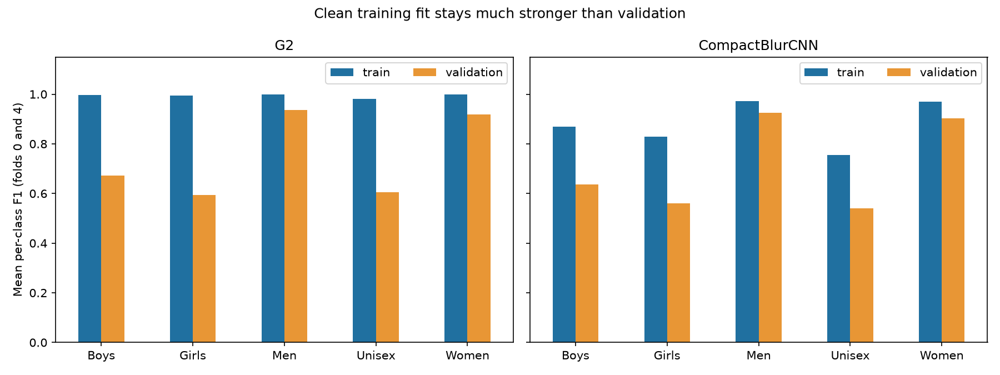

# Gender inference diagnostic review

The saved models restored correctly. The completed GPU diagnostic remains **review_required** because its probability-stability tolerance failed. This is not a training failure or a new model-selection decision.

Source: Drive `MLA2/task3/diagnostics/gender_generalization/20260905T083631345679Z`. Runtime: NVIDIA L4, PyTorch 2.11.0+cu128, CUDA 12.8. No training was performed.

`review.py` verifies all four source bundles against the diagnostic hashes, the diagnostic module and canonical split hashes, 131,092 clean prediction rows, exact canonical IDs/labels/metadata, probability validity, saved validation probabilities, overall/per-class F1, slice counts and accuracies, and the recorded sample/comparison coverage. Verification passed; see `verified_review.json`. All 32,773 development image contents were verified by the GPU run. The local Compact evidence had different auxiliary-file bytes; downloading its exact Drive sources resolved every hash mismatch without changing the local evidence.

| Model | Fold | Clean training F1 | Validation F1 | Gap |
|---|---:|---:|---:|---:|
| G2 | 0 | 0.993147 | 0.760498 | 0.232649 |
| G2 | 4 | 0.994583 | 0.730461 | 0.264122 |
| CompactBlurCNN | 0 | 0.872132 | 0.717581 | 0.154551 |
| CompactBlurCNN | 4 | 0.885618 | 0.708529 | 0.177088 |

All four training and validation scores reproduced exactly. Saved validation probabilities reproduced within 0.000000030. The GPU run reports unchanged model weights and BatchNorm buffers. Peak allocated GPU memory was 177,898,496 bytes for G2 and 135,195,648 for Compact, below 3,000,000,000 bytes.

G2's largest class F1 gaps are Girls, Unisex and Boys. Mean training/validation F1 across the two folds is roughly 0.995/0.595 for Girls, 0.982/0.604 for Unisex, and 0.996/0.673 for Boys. Men and Women have smaller gaps. Compact reduces training fit and performs worse on validation overall. These results do not establish that narrowing G2 will help, nor that all remaining error is memorization.

The figure was visually inspected. Class scores are means over folds, not pooled F1.

## Unresolved probability drift

Of 72 batch/order comparisons, 64 exceeded the frozen maximum absolute probability tolerance of 0.00001. The maximum difference was **0.0021536350250244**, or about 0.2154 percentage points. There were **zero predicted-label changes** in these comparisons. Each partition used 160 fixed samples, up to 32 per gender class. These are sampled checks, not proof of stability over every image. The original batch-128 full-dataset results still reproduce.

Local verification checks the saved stability summaries and sample IDs. It cannot independently reproduce their probability deltas or unchanged-weight checks without another GPU inference run.

## Consultation and next step

The other task reviewed the completed results and recommends a small numerical-precision check before training a narrower model. Reuse the same checkpoints, sample IDs and prepared image tensors; compare original settings against full FP32 with TF32 disabled for convolution and matrix multiplication. Record those settings and retain the current tolerance and `review_required` result. Numerical arithmetic is a possible explanation for the drift, not an established cause.

If that check explains the drift, a frozen experiment reducing G2's final layer from 256 to 64 channels can be considered. No such experiment has been implemented or run in this review. No code, notebook, checkpoint or registry was changed; only these local review artifacts were added.
