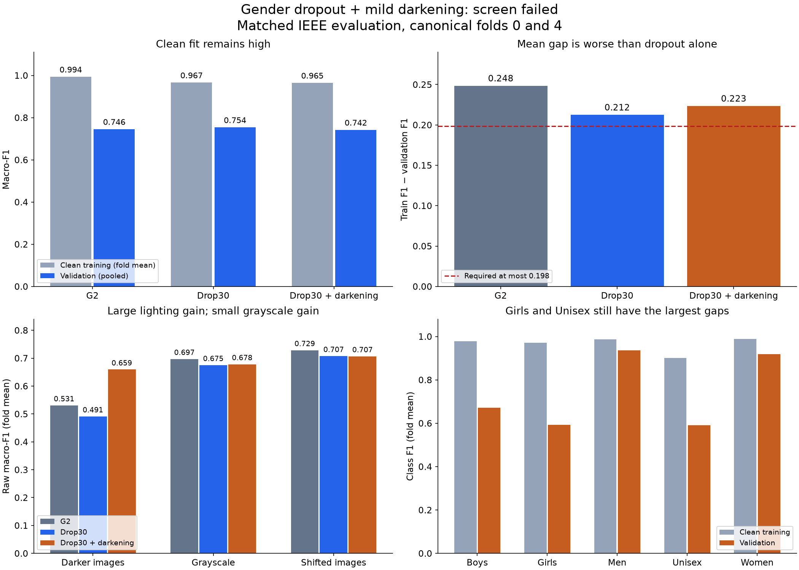

# Gender dropout plus mild darkening: verified review

**The screen failed 2 of 19 checks. Dark-image handling improved strongly, but the
clean training–validation gap worsened versus dropout alone. Do not promote this
candidate or expand it to folds 1–3.**

Both new runs completed 30 epochs from scratch on canonical folds 0 and 4, seed
2753. Their config digest is `cfbed3f0fed4`. The exact two parent runs, full widths
`[32, 64, 128, 256]`, GeM p=3, dropout 0.30, darkening probability 0.25 with factor
0.90–1.00, batch 128, weight decay 0.0001 and final-epoch rule all match the plan.
Run IDs and all checked source hashes are in `verified_review.json`.

| Model | Mean clean training F1 | Pooled validation F1 | Mean clean gap |
|---|---:|---:|---:|
| G2 | 0.993865 | 0.745726 | 0.248385 |
| Dropout 0.30 | 0.966516 | 0.754255 | 0.212412 |
| Dropout + mild darkening | 0.965007 | 0.742180 | 0.223359 |

The gap uses the mean of each fold's training F1 minus its validation F1. It is
not training F1 minus pooled validation F1. All values use matched IEEE FP32
evaluation with dropout disabled; online augmented-training scores are different.

The two failed checks are:

- **Mean gap reduction versus G2: 0.025027; required at least 0.050.** Both folds
  improve versus G2, but the resulting mean gap 0.223359 exceeds the maximum
  0.198385. Versus dropout alone, the gap grows on both folds: +0.009655 and
  +0.012239. Mean training F1 falls only 0.001509, while validation falls more.
- **Grayscale-induced F1 change versus E6: −0.027437; required at least −0.020.**
  The miss is 0.007437. The other four corruption checks pass.

The clean validation budget, paired confidence bound, both fold validation
budgets, pooled class guards and confidence-quality checks all pass against G2.
Validation falls 0.003546 versus G2, with a paired 95% interval of
[−0.018217, +0.011570], within the agreed 0.030 budget. Versus dropout alone it
falls 0.012075, with interval [−0.025312, +0.001214]. These intervals include zero;
the observed decline is not proof of a reliable decline beyond these screen folds.

## What the darkening change did

| Corruption | Dropout raw F1 | New raw F1 | Raw difference | Difference in induced change |
|---|---:|---:|---:|---:|
| Darker images | 0.490961 | 0.659267 | +0.168305 | +0.180761 |
| Brighter images | 0.712020 | 0.711500 | −0.000520 | +0.011936 |
| Grayscale | 0.674948 | 0.678156 | +0.003208 | +0.015664 |
| JPEG compression | 0.719021 | 0.714623 | −0.004398 | +0.008058 |
| Translation | 0.707461 | 0.706693 | −0.000769 | +0.011687 |

These are means over the two folds. An induced change is corrupted F1 minus that
model's clean F1. Dark-image F1 increases on both folds, so the large lighting
gain is visible in raw scores too. Grayscale's raw gain is small and mixed across
folds. The better induced-change figures for brightness, JPEG and translation do
not establish better raw performance; the lower clean baseline helps those figures.

The largest remaining class gaps are Girls (0.378944), Unisex (0.310967) and Boys
(0.305447), using fold means. Girls' pooled validation F1 falls 0.037612 versus
dropout alone, although it remains only 0.002801 below G2 and passes the fixed G2
class guard. Mean Girls training F1 is still 0.971216. The class gap, rather than
the lighting check, is now the main unresolved problem.

The figure was rendered and visually inspected.

## Recommended next step

Preserve this as a useful lighting result, not an accepted model. For continued
refinement, I would keep mild darkening fixed and make the next single change
stronger post-GeM dropout: hiding more pooled features during training. Dropout
has shown more useful gap reduction than the earlier width-only or stronger
weight-decay trials, while darkening has repeatedly helped lighting rather than
training fit. This is a direction to predeclare and test, not a predicted gain;
stronger dropout could further hurt the minority classes and may not fix grayscale.

Keep the current class, validation, gap, grayscale and memory rules. Do not stack
another augmentation or change several controls at once. No new recipe was
implemented and no training, inference, commit or push was performed in this review.

## Verification and limits

Downloaded the [saved decision](https://drive.google.com/file/d/1VlNluXbLKR3z4uJYj3nUlqLt8USXBzVk/view)
and its accompanying evidence. `review.py` independently checked:

- Eight original run bundles: both new runs plus G2, E6 and dropout on folds 0/4.
  Registry rows, exact recipes, lineage, checkpoint SHA-256/byte sizes/ZIP
  integrity, 30-epoch histories and recorded metrics agree.
- All 72 files in the eight IEEE evaluation manifests, and their source and
  evaluation-code hashes. Code hashes match notebook-reported commit
  `67e71e5cc762fcc2573f3a215c1f43ffd578b041` and the current relevant source files.
- All 32,773 development image hashes, canonical splits and labels, and 524,384
  saved evaluation rows across clean training, validation and all corruptions.
  The combined 13,110 validation rows also match the per-fold files exactly.
- Overall and class metrics, both 10,000-draw whole-family confidence intervals,
  all 19 gates, and every incremental dropout comparison reproduce.
- The saved 04w precision prerequisites still reproduce from their probability
  arrays and their hashes match the new source audit.

Recorded peak allocated training GPU memory is 475,258,880 / 475,029,504 bytes,
below 3 GB. Recorded training time is 502.9 / 501.3 seconds; there is no speed cap.
The checkpoints were not unpickled, and no GPU inference was rerun. Restoration,
unchanged weights/buffers, actual runtime and measured GPU resources remain
recorded GPU evidence. The six G2/E6 bundles on folds 1–3 listed in the source
audit were not independently downloaded in this review. Reusing development
folds leaves model-selection bias; this is not independent test evidence.

Reproduce locally with
`./.venv/bin/python reports/task3/gender_dropout_darkening_result_20260905/review.py`.
Original downloads remain under `saved/`, `parents/` and `runs.csv`.
