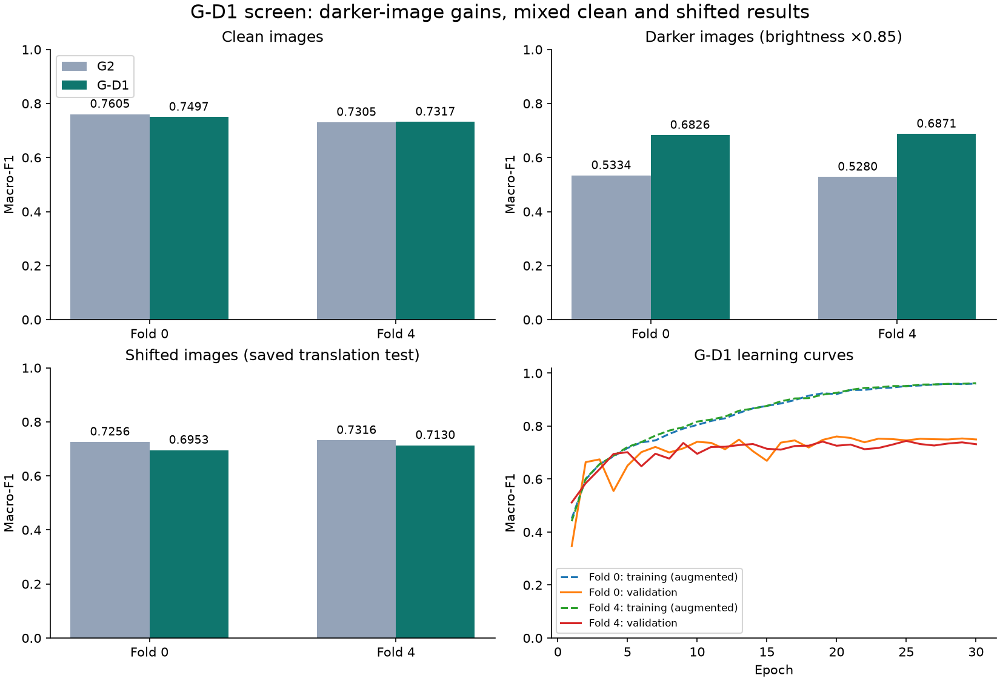

# G-D1 Gender screen review

Decision: **reject this screen; do not run confirmation folds 1, 2 and 3.** Both screen folds (0 and 4) completed 30 epochs from scratch. No new training was started during this review.

| Measure | G2 | G-D1 |
|---|---:|---:|
| Pooled clean macro-F1, folds 0/4 | 0.745726 | 0.741158 |
| Fold 0 clean macro-F1 | 0.760498 | 0.749705 |
| Fold 4 clean macro-F1 | 0.730461 | 0.731734 |
| Mean dark-image macro-F1 | 0.530711 | 0.684867 |
| Mean shifted-image macro-F1 | 0.728570 | 0.704158 |

Darkening training helped the intended weakness. The average dark-image score rose by 0.154156. After accounting for each model's clean score, the dark-induced loss improved by 0.158916. Both folds improved on that check.

Three frozen prediction-quality rules failed:

- Paired clean-score 95% interval: **−0.018251 to +0.009511**. Its lower end must be at least −0.005. The evidence does not rule out a meaningful clean-score loss; it does not establish a statistically certain loss either.
- Shift-induced loss worsened by **0.019652**, beyond the allowed 0.010.
- Fold 0 clean macro-F1 fell **0.010793**, beyond the allowed 0.010. Fold 4 improved 0.001273.

The pooled clean loss of 0.004569 and all pooled class margins passed. The largest class loss was Girls: 0.015323. The screen passes 10 of 13 checks; its rule requires every check to pass.

Normal GPU execution worked. Each fold used **477,585,408 bytes (0.478 GB)**, below the revised strict 3 GB cap, and took about **8.4 minutes**. Speed and latency are reported, not capped. The final clean-training F1 scores were 0.992991 and 0.993531, versus validation 0.749705 and 0.731734. Large training/validation gaps remain. The figure's training curves use the online augmented-training scores, not these separate final clean-training scores.

## Verification and limits

The two child bundles and all ten G2/E6 source bundles passed registry, configuration, lineage, split, label, checkpoint-byte, prediction-hash, metric, history and robustness checks. The screen decision was recomputed from per-image saved predictions using 10,000 whole-family paired resamples. Every decision and gate matches; the only numeric readback difference was 1.7e−16 in G2 calibration error from floating-point rounding.

The saved version-2 prerequisites match the local code/data and child runtime, including the zero-step GPU memory probe and the record that all ten clean checkpoint outputs reproduced. All 70 prerequisite source hashes matched. **167 of 301** diagnostic files were downloaded and their hashes checked; the remaining diagnostic files were not downloaded in this review. Their manifest is retained. No new GPU inference was performed locally. This is a two-fold development screen, not independent test evidence.

Files: `verified_decision.json`, `gates.csv`, `fold_comparison.csv`, `reproduce.py`, and `plot_review.py`. Original downloads remain in `gender/`, `prerequisites/`, and `runs.csv`.
