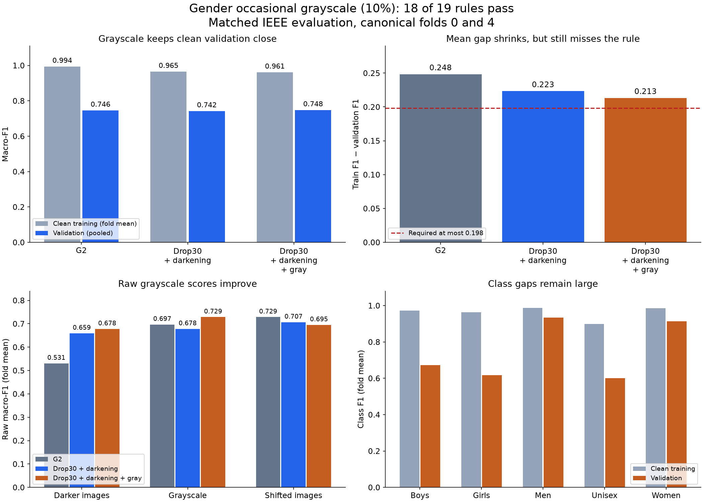

# Gender occasional grayscale: verified results

**18 of 19 rules pass. Occasional grayscale improves grayscale handling, but
the clean training–validation gap remains too large. The screen still fails.**

Both 30-epoch runs completed from scratch on canonical folds 0 and 4, seed 2753,
at notebook commit `a944853bb441c2d8cf8a4fd410b800344cf42001`. The verified recipe
keeps dropout 0.30 and mild darkening, adding grayscale with probability 0.10.
The configuration digest is `eb37119b7e68`. The direct parents are the exact
completed 04aa runs. No acceptance rule changed.

## Clean scores and the remaining failure

| Model | Mean clean training F1 | Pooled validation F1 | Mean clean gap |
|---|---:|---:|---:|
| G2 | 0.993865 | 0.745726 | 0.248385 |
| Dropout 0.30 + darkening | 0.965007 | 0.742180 | 0.223359 |
| Add 10% grayscale | 0.961170 | 0.747944 | 0.213274 |

The gap is the mean of each fold's training F1 minus its validation F1. Training
scores use clean inputs and disabled dropout, not online augmented-training
scores. Subtracting pooled validation F1 from mean training F1 gives a different
quantity and is not the acceptance rule.

The only failure is **mean gap reduction versus G2: 0.035112, required at least
0.050**. The new mean gap is 0.213274; the maximum allowed is 0.198385. It misses
by 0.014888. Both folds improve versus G2, but their average does not improve
enough. All class, validation, confidence-quality, corruption, parameter and
memory guards pass.

Versus the direct darkening parents, pooled validation F1 rises by 0.005764.
Its paired 95% interval is **[−0.011505, +0.022671]**. This includes zero, so the
small clean gain is not clear evidence of a reliable gain beyond these folds.
Versus G2, the point difference is +0.002218 and the interval is
[−0.016246, +0.020474]. Both comparisons use 10,000 paired whole-family draws.

The direct-parent results differ across folds:

| Fold | Clean validation change | Gap change; negative is better |
|---|---:|---:|
| 0 | −0.012340 | +0.010172 |
| 4 | +0.024836 | −0.030342 |

The average gap improvement versus darkening alone is 0.010085. Mean training
F1 falls only 0.003837. The largest remaining class gaps are Girls (0.344650),
Boys (0.299691) and Unisex (0.297992), using fold means. The model still fits
those training classes much better than their validation examples.

## What grayscale training helped

Mean raw grayscale F1 rises **0.678156 → 0.728661**, a gain of 0.050506. It rises
on both folds: +0.027795 and +0.073217. The average grayscale drop from each
model's clean score shrinks from 0.063492 to 0.019235. Thus the improvement is
visible in raw scores as well as relative drops. The fixed grayscale guard
against E6 moves from −0.027437 (fail) to +0.016821 (pass).

| Catalog class | Correct grayscale predictions: parent → new | Grayscale F1: parent → new | Clean F1: parent → new |
|---|---:|---:|---:|
| Boys | 159 → 169 / 274 | 0.609195 → 0.647510 | 0.671642 → 0.672862 |
| Girls | 60 → 104 / 216 | 0.379747 → 0.548813 | 0.595238 → 0.618005 |

For Girls on grayscale inputs, 49 old errors are fixed and 5 previously correct
predictions become wrong. This supports the intended color-sensitivity
hypothesis on these screen folds. It does not prove a universal cause or settle
catalog-label ambiguity. Girls still has 112 grayscale errors. Clean correct
Girls predictions rise only 125 → 127, so the main gain is under color removal.

Other changes are mixed. Raw dark-image F1 rises 0.659267 → 0.677816 on average,
but falls on fold 0. Shifted-image F1 falls **0.706693 → 0.695184**, on both
folds. Its induced-change comparison with the direct parent worsens by 0.017756,
although the fixed E6 translation guard still passes at +0.087247, above +0.030.
Passing fixed reference rules does not mean every score improved over 04aa.



The figure was rendered and visually checked.

## Decision and next step

Keep 10% grayscale as a useful research result and a reasonable base for further
work. Do not promote this model, expand to folds 1–3, or relax the gap rule.
The next investigation should target the remaining class gaps. This result
does not establish that increasing grayscale probability will close them;
changing that probability would need a new predeclared trial. No further
training or label edits were performed in this review.

## Verification and limits

[review.py](review.py) independently reproduced both confidence intervals,
all 19 checks and the saved direct-parent comparisons. It checked eight original
run bundles, 72 evaluation artifacts and their hashes, 524,384 saved prediction
rows, all 32,773 development image hashes and the exact canonical split/labels.
The combined 13,110 validation rows match the fold files. Recipes, lineage,
registry records, checkpoint file integrity, recorded precision evidence and
evaluation-code hashes agree with the run commit.

Saved peak training memory is 475,258,880 / 475,029,504 bytes; both are below
3 GB. Recorded training time is 515.9 / 519.8 seconds. These hardware measurements
were not repeated locally. Checkpoints were not unpickled and inference was not
rerun. Six listed G2/E6 reference bundles on folds 1–3 were not independently
downloaded for this review. The two reused development folds do not remove
model-selection bias or provide an independent final-test estimate.

Reproduce from the repository root:

```bash
./.venv/bin/python reports/task3/gender_grayscale_result_20260905/review.py
```

Detailed outputs: [verification](verified_review.json),
[all gates](verified_gates.csv), [fold scores](verified_folds.csv),
[raw robustness](verified_robustness.csv),
[clean and grayscale class scores](verified_clean_grayscale_classes.csv),
and [paired prediction changes](verified_prediction_switches.csv).
