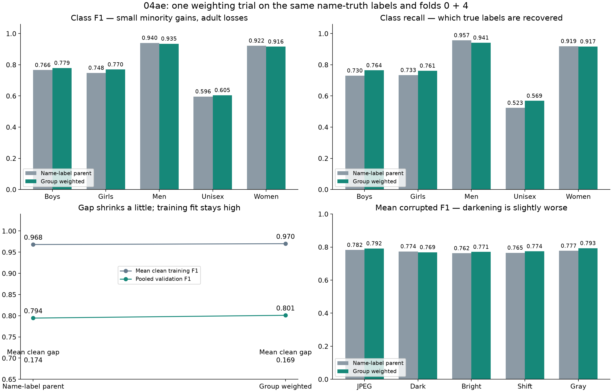
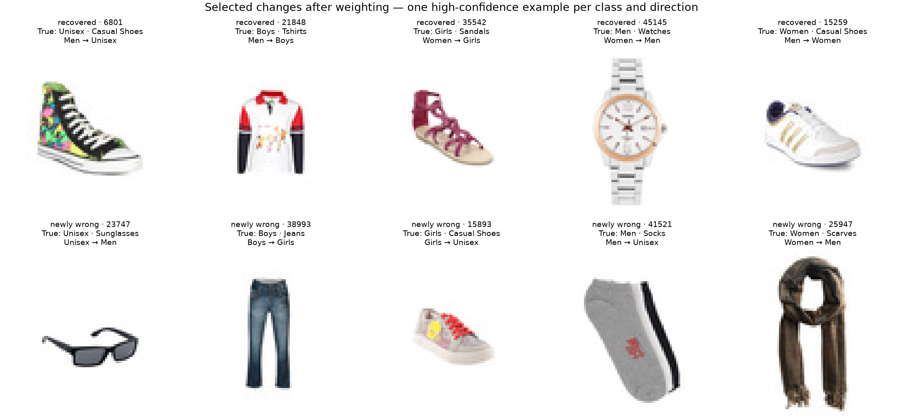

# 04ae result: a small minority-class gain, with more errors overall

**18 of 19 checks pass. The screen still fails.** Weighting helps some rare
gender/product groups, especially Unisex casual shoes. The overall gain in
macro-F1 is small and uncertain; Men and Women lose some F1. Keep this as
research evidence rather than replacing the unweighted name-label parent.

## Direct comparison with 04ad

Both models use the same name-truth labels and validation images. Scores below
pool folds 0 and 4 unless marked as a mean. Macro-F1 gives each class equal
importance; accuracy gives each image equal importance.

| Measure | Name-label parent | Group weighted | Change |
|---|---:|---:|---:|
| Validation macro-F1 | 0.79444 | 0.80099 | +0.00655 |
| Accuracy | 90.88% | 90.37% | −0.50 percentage points |
| Total errors / 13,110 | 1,196 | 1,262 | 66 more |
| Mean clean training F1 | 0.96802 | 0.96997 | +0.00196 |
| Mean clean train–validation gap | 0.17379 | 0.16925 | −0.00454 |
| NLL, lower is better | 0.27523 | 0.27970 | Slightly worse |
| ECE, lower is better | 0.02341 | 0.01581 | Better |

The paired whole-family bootstrap gives a 95% interval for the F1 gain of
**[−0.00604, +0.01918]**, using 10,000 draws within folds and seed 2753.
It includes zero. These two reused development folds do not establish a
reliable improvement or remove the bias from choosing trials after seeing
development results.

Weighting fixes **218** old errors and creates **284** new errors; 978 errors
persist. Boys, Girls and Unisex gain 52 correct predictions in total. Men and
Women lose 118, leaving 66 fewer correct images overall. The F1 increase and
accuracy decrease are compatible because the metrics weight classes differently.

| Class | Parent F1 | Weighted F1 | Change in correct images |
|---|---:|---:|---:|
| Boys | 0.7658 | 0.7794 | +12 |
| Girls | 0.7478 | 0.7695 | +8 |
| Men | 0.9401 | 0.9350 | −108 |
| Unisex | 0.5963 | 0.6050 | +32 |
| Women | 0.9222 | 0.9161 | −10 |

## Unisex recall improves, but false positives grow

Unisex recall rises **52.3% → 56.9%**: more actual Unisex images are found.
Precision falls **69.3% → 64.6%**: more images predicted as Unisex belong to
other catalog classes. There are 32 more correct Unisex predictions, alongside
**56 more false Unisex predictions**. Men → Unisex grows from 84 to 124;
Women → Unisex grows from 48 to 64.

| Group | Parent errors | Weighted errors | Validation images |
|---|---:|---:|---:|
| Unisex casual shoes | 50 | 31 | 75 |
| Unisex watches | 31 | 28 | 44 |
| Unisex sunglasses | 40 | 40 | 48 |
| Unisex flip flops | 27 | 22 | 47 |
| Unisex socks | 21 | 18 | 23 |
| Unisex backpacks | 27 | 31 | 213 |
| Men backpacks | 23 | 22 | 23 |
| Girls casual shoes | 8 | 7 | 11 |
| Girls sandals | 11 | 8 | 17 |
| Boys casual shoes | 7 | 7 | 13 |
| Boys trousers | 6 | 3 | 9 |

These small groups are descriptive, not stable population estimates. The
largest loss groups include Men sports shoes (16 → 34 errors), casual shoes
(25 → 41), and watches (36 → 52). Weighting changes the balance of mistakes;
it does not solve the remaining ambiguity in sunglasses or backpacks.

## The one remaining failed check

The mean gap reduction against matched G2 is **0.02397**, below the required
**0.050**. The candidate's mean gap is 0.16925; the permitted maximum is
0.14323. All other checks pass, including both per-fold gap reductions.

| Fold | Parent clean gap | Weighted clean gap | Change |
|---|---:|---:|---:|
| 0 | 0.17918 | 0.17264 | −0.00654 |
| 4 | 0.16841 | 0.16587 | −0.00254 |

Most of the direct-parent gap reduction comes from Girls: its mean class gap
falls 0.23815 → 0.21493. Unisex's mean class gap stays essentially unchanged,
0.30415 → 0.30539. Overall clean training F1 is still about 0.97; this trial
has not substantially reduced the high training fit.

The direct-parent comparison is fair on labels: both models trained with the
same corrected labels. The historical G2 gap still involves an older label
convention, as explained in the preceding deep review. This does not change
the frozen gate or turn the current failure into a pass.

## Robustness and confidence

All frozen corruption guards pass against matched E6. Against the direct
name-label parent, mean raw corrupted F1 changes as follows:

| Corruption | Parent | Weighted |
|---|---:|---:|
| JPEG | 0.7823 | 0.7915 |
| Darkening | 0.7737 | 0.7686 |
| Brightening | 0.7624 | 0.7706 |
| Translation | 0.7653 | 0.7743 |
| Grayscale | 0.7772 | 0.7930 |

Darkening is the exception: fold 0 loses 0.01651 F1 while fold 4 gains 0.00631.
For Girls, grayscale-correct images rise from 174 to 201, but darkened-correct
images fall from 174 to 170 out of 285. A single average can hide this difference.

Confidence calibration improves by ECE, while NLL worsens slightly. The new
model makes 244 errors among 9,943 predictions with confidence at least 90%
(2.45%). These metrics describe different parts of confidence quality; do not
describe calibration as uniformly better.

Each run completes 30 epochs and uses the final checkpoint. Recorded training
time is 513.1 / 516.4 seconds, peak allocated GPU memory 475.26 / 475.03 MB,
and single-image latency 0.738 / 0.744 ms. Both models have 390,181 parameters.
These are saved GPU measurements, not fresh measurements from this review.

On the original teacher labels, pooled F1 rises 0.74251 → 0.74888. Its paired
95% gain interval is [−0.00674, +0.01955], also including zero. This is a label
sensitivity diagnostic and adds no acceptance gate.





Both images were rendered and visually checked. The example montage selects
the highest-confidence changed prediction per class and direction, with one
example per product family. It is not a random sample. Captions show dataset
labels and predictions, not a judgment about people in an image.

## Verification and next step

The review reproduced all 19 checks, both saved 10,000-draw bootstrap results,
the original-label diagnostic, and the pooled prediction export. It checked
10 source run bundles, 90 evaluation-file hashes, 655,480 prediction rows,
32,773 development image hashes, label-variant files, and code identity against
commit `095db0a7b143049ae0a121eb986b9394e4ea0051`.

Both training-weight artifacts reproduce from the four training folds only:
26,220 and 26,216 rows. Their file hashes, configured formulas, fold contracts,
and the all-group weight preview match. Article-type total weights are
preserved. The source audit lists 18 prior runs; the other eight bundles were
not all downloaded again. The previously frozen audit hashes were checked.
The direct parent's clean training and validation predictions reproduce the
previous review exactly.

No model was trained, no checkpoint was unpickled, and no new GPU inference
was run. No labels, splits, gates, or existing training code were changed.
The held-out test stayed sealed.

**Recommendation:** keep this as evidence that weighting can help Unisex
casual shoes, with costs elsewhere. Keep 04ad as the comparison baseline;
neither screen is accepted as a final model. Do not expand this run to more
folds or keep increasing weights on the strength of this small, uncertain gain.

Reproduce from the downloaded evidence with:

```
./.venv/bin/python reports/task3/gender_group_weight_result_20260906/review.py
```
