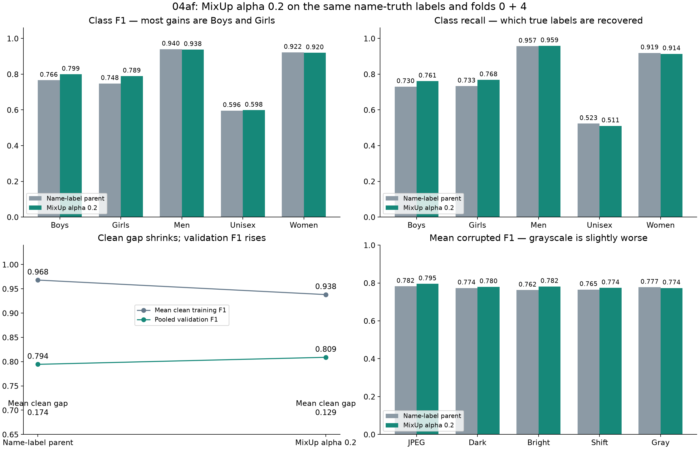
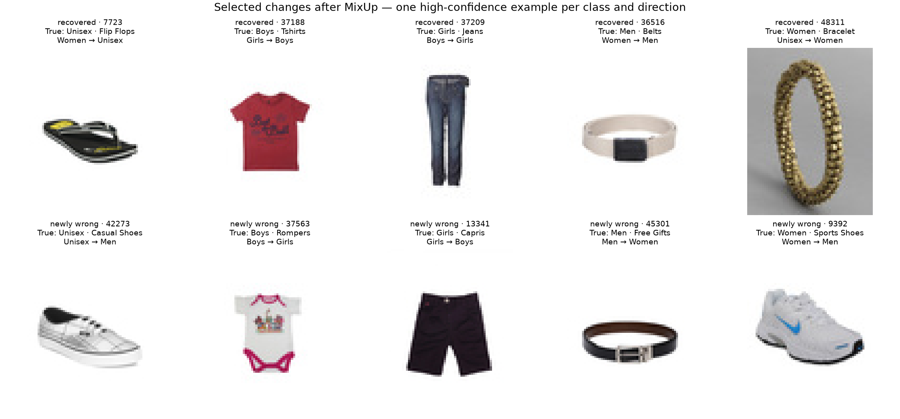

# 04af MixUp result review

**MixUp passed all 19 screen checks.** It reduced the clean training–validation
gap and improved validation macro-F1 on both folds. Keep this recipe for a
separate confirmation on the remaining canonical folds; this screen does not
accept a final model.

| Measure | 04ad parent | 04af MixUp |
|---|---:|---:|
| Pooled validation macro-F1 | 0.794440 | **0.808909** |
| Mean clean training F1 | 0.968017 | 0.938123 |
| Mean clean training–validation gap | 0.173793 | **0.129133** |
| Validation accuracy | 90.877% | 90.908% |
| Incorrect predictions, out of 13,110 | 1,196 | 1,192 |
| NLL, lower is better | 0.275228 | 0.270268 |
| ECE, lower is better | 0.023408 | 0.013196 |

Macro-F1 gives each of the five classes equal weight. Its improvement mainly
comes from Boys and Girls, so it can rise while the total error count barely
changes. MixUp fixed 216 old errors and made 212 new ones.

The gap fell by **0.044660 versus 04ad**, or about 25.7%. The formal gate uses
**matched G2**, whose gap was 0.193226. Against G2 the reduction is **0.064093**,
above the required 0.050. These are clean evaluation-mode scores on real images,
not the mixed training loss or the blank online training F1.

| Fold | Parent validation F1 | MixUp validation F1 | Parent gap | MixUp gap |
|---|---:|---:|---:|---:|
| 0 | 0.787822 | 0.811863 | 0.179179 | 0.124431 |
| 4 | 0.800626 | 0.806118 | 0.168407 | 0.133835 |

The pooled F1 gain versus 04ad is **+0.014468**, with a paired whole-family
bootstrap 95% interval of **[+0.001486, +0.028220]**. This uses 10,000 draws,
seed 2753, and keeps families together within each fold. The interval is above
zero, but it does not remove the effect of repeatedly choosing experiments
after seeing development results. Most of the gain comes from fold 0.

## Class results and remaining failures

| Class | Parent F1 | MixUp F1 | Parent correct | MixUp correct |
|---|---:|---:|---:|---:|
| Boys | 0.765832 | 0.799410 | 260 / 356 | 271 / 356 |
| Girls | 0.747764 | 0.789189 | 209 / 285 | 219 / 285 |
| Men | 0.940115 | 0.938022 | 6,719 / 7,023 | 6,735 / 7,023 |
| Unisex | 0.596293 | 0.598177 | 370 / 707 | 361 / 707 |
| Women | 0.922198 | 0.919745 | 4,356 / 4,739 | 4,332 / 4,739 |

Unisex remains the main weakness. Its precision rose from 69.3% to 72.2%, but
recall fell from 52.3% to 51.1%. The model predicts Unisex less often: 534 times
before and 500 now. It makes fewer false positives but misses nine more true
Unisex products. Its mean class gap falls from 0.304149 to 0.231175 mainly
because clean training F1 falls; validation F1 changes very little.

Unisex errors rose for casual shoes (50 → 53 of 75), watches (31 → 36 of 44),
and sunglasses (40 → 42 of 48). Women’s watches also worsened (62 → 75 of 267).
Men’s watches improved (36 → 27 of 449). These small product groups help explain
failures; they are not separate acceptance tests.

## Corruptions and label sensitivity

| Mean corrupted F1 | Parent | MixUp |
|---|---:|---:|
| JPEG | 0.782341 | 0.795323 |
| Darker image | 0.773662 | 0.780111 |
| Brighter image | 0.762390 | 0.781650 |
| Small shift | 0.765347 | 0.774244 |
| Grayscale | 0.777197 | 0.773645 |

All existing corruption guards versus matched E6 pass. Grayscale is slightly
worse than the direct 04ad parent. Darkening is mixed across folds: fold 0
loses 0.009327 raw F1, while fold 4 gains 0.022226. A larger clean score also
means the drop from clean to corrupted images can grow even when the raw
corrupted score improves. Both views are saved in the comparison.

On the **original teacher labels**, pooled F1 also improves: 0.742514 → 0.759719.
The gain is +0.017205, with a whole-family 95% interval of
[+0.002660, +0.032447]. No extra model prediction was made for this diagnostic;
the same saved probabilities were scored against the two label versions.

## What was checked

- Both final checkpoints completed 30 epochs from scratch at commit
  `68fef49ab1d55d671531113a71a3e71400a0e3fc`.
- MixUp receipts match alpha 0.2, the frozen labels, training-row hashes and
  saved metric hashes. Each fold records 6,150 batches over 30 epochs;
  row counts are 786,600 for fold 0 and 786,480 for fold 4. Online training F1
  is blank with the explicit mixed-input scope. Mixing-plan hashes are
  fingerprints, not full stored pair lists.
- Rechecked 10 source run bundles, 90 saved evaluation file hashes,
  655,480 prediction rows across all views, and 32,773 input image hashes.
- Recomputed all 19 gates, the G2 and direct-parent bootstrap comparisons,
  all 70 label-diagnostic entries, and the pooled prediction export.
- The four direct-parent clean training/validation prediction files match
  the prior review exactly. The inherited 18-run source audit matches the
  previously checked parent chain; not all 18 source bundles were downloaded again.
- Used the recorded commit's code for the review. Current local edits in
  `dataset.py`, training `data.py`, and `task3_baseline.py` differ from that run;
  they were left untouched. Saved code hashes match the recorded commit.
- No new training, checkpoint loading or GPU inference was performed. Training
  time (513.8 / 517.5 seconds), memory (476.4 MB per fold), and latency
  (0.714 / 0.729 ms) are the saved GPU measurements.

The practical next step is to **freeze alpha 0.2 and the current recipe**, then
plan confirmation on folds 1–3 with the same label basis and controls. Keep the
held-out test sealed. Do not combine this result with group weighting without
treating that combination as a new experiment.

The examples are one high-confidence case per class and direction, from
different product families. They illustrate changes, not their frequency.
“True” refers to the dataset’s product-audience label.

Detailed evidence: `verified_review.json`, `recomputed_decision.json`,
`verified_summary.csv`, `verified_class_gaps.csv`, `verified_prediction_changes.csv`,
`gender_article_error_changes.csv`, and `corruption_class_changes.csv`.
`review.py` reproduces the calculations from the downloaded artifacts.
