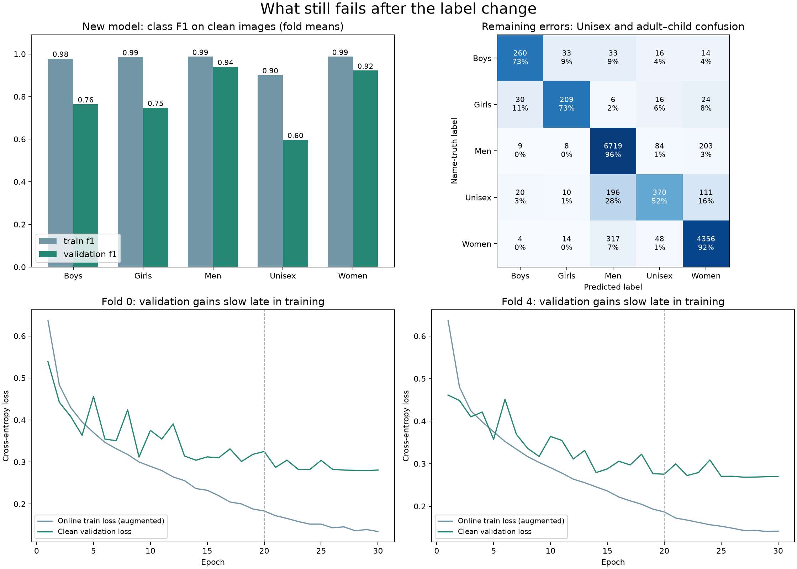
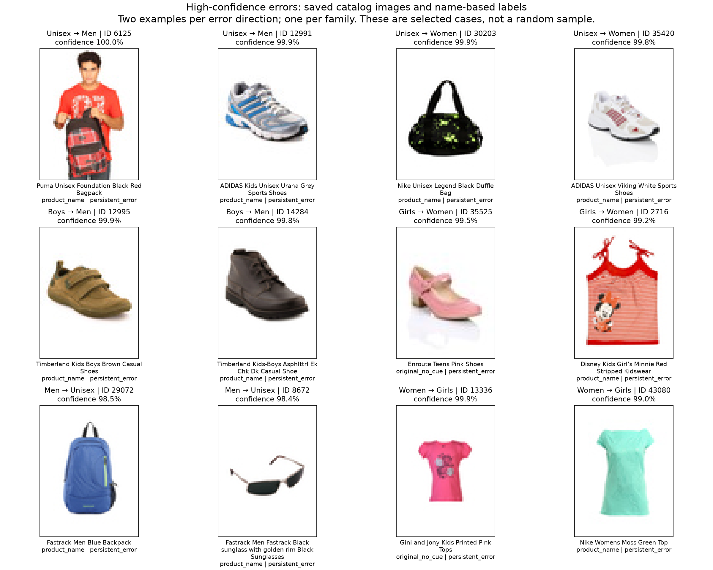

# What still fails after name-truth training

There are two problems: weak recognition of some classes, and a gap comparison
affected by changing the label convention. The recorded screen still fails.
This diagnosis does not change its rules or accept the model.

## Three classes explain 87% of the gap

Mean clean evaluation-mode scores over folds 0 and 4:

| Class | Training F1 | Validation F1 | Gap | Share of total gap |
|---|---:|---:|---:|---:|
| Boys | 0.979 | 0.764 | 0.214 | 24.7% |
| Girls | 0.986 | 0.748 | 0.238 | 27.4% |
| Unisex | 0.901 | 0.597 | 0.304 | 35.0% |
| Men | 0.987 | 0.940 | 0.047 | 5.4% |
| Women | 0.987 | 0.922 | 0.065 | 7.5% |

Macro-F1 weights each class equally. Boys, Girls and Unisex are only 1,348 of
13,110 validation images but explain **87.1% of the gap**. Children’s classes
fit training examples almost perfectly, then lose over 20 F1 points on new
families. Unisex is also difficult on training images, so its weakness is not
purely a near-perfect training fit followed by validation failure.

## Unisex is the largest remaining weakness

**337 of 707 Unisex images are wrong:** 196 become Men and 111 become Women.
Recall is 52.3%; precision is about 69.3%. Of these errors, **313 also existed
in the old grayscale model**, and 302 have an explicit Unisex name cue.

| True Unisex product type | Wrong / validation rows |
|---|---:|
| Casual shoes | 50 / 75 |
| Sunglasses | 40 / 48 |
| Watches | 31 / 44 |
| Flip flops | 27 / 47 |
| Socks | 21 / 23 |
| Backpacks | 27 / 213 |

Training data has a strong link between product type and catalog audience:
Unisex is roughly 87% of backpacks but only 8% of casual shoes, 13% of
sunglasses and 6% of watches. All **23 Men-labeled validation backpacks are
predicted as Unisex**. This is consistent with predicting the common audience
for a product type; it does not prove the network’s internal reasoning.
Overlapping appearance may also limit what can be learned from these images.

## Small child/product groups lack coverage

| Class and product | Wrong / validation rows | Training rows, folds 0 / 4 |
|---|---:|---:|
| Girls casual shoes | 8 / 11 | 9 / 10 |
| Boys casual shoes | 7 / 13 | 17 / 18 |
| Girls sandals | 11 / 17 | 31 / 30 |
| Boys trousers | 6 / 9 | 6 / 5 |

These are small descriptive groups, not stable population estimates. Both
new fold models make zero training errors on Girls sandals, yet validation
has 11 errors out of 17. The inspected child-shoe photos show isolated
products without a size reference. Missing visual cues are a plausible limit,
not proof that classification is impossible or that the labels are wrong.

## The gap comparison is partly misleading

The old model was trained on teacher labels. Rescoring its training images on
new labels lowers its training F1 from 0.961 to 0.918 with no weight changes.
That makes its measured gap smaller.

| Scoring scope | Old grayscale gap | New model gap |
|---|---:|---:|
| All rows, new labels | 0.1635 | 0.1738 |
| Only rows whose labels never changed | 0.1955 | 0.1828 |

On unchanged-label rows, the gap improves on **both folds**: 0.2034 → 0.1888
and 0.1876 → 0.1769. Pooled validation F1 rises **0.769760 → 0.784457**.
Its paired-family 95% gain interval is approximately **[+0.000042, +0.030174]**.
The lower bound is barely above zero: this is a modest, uncertain gain on a
post-hoc subset, not a strong independent claim.

The original full-data rules still fail. Fold 0’s gap grows by 0.001145 versus
G2; the Boys/Girls gap increases offset much of the Unisex improvement.
Mean gap reduction is 0.019433 rather than the required 0.050. The subset
calculation is diagnostic only and does not replace the official checks.
It shows why “the new model overfits more” is too simple a conclusion.

## More name cleanup will not explain most errors

Of **1,196 remaining errors**, 1,115 have an explicit gender cue, 81 have
unclear names, and only 31 are among changed labels. Four involve recorded
exact-image groups with conflicting name labels. There are 1,019 persistent
errors and 177 new errors relative to the old grayscale model.

There are 314 mistakes with confidence at least 90%, including 116 Unisex
mistakes. The error rate among *all* predictions above that confidence is
about 3%; selected confident errors do not imply universal overconfidence.
Restricting scoring to explicit-name rows still leaves a mean gap of 0.166.
No rows were dropped from training or the official evaluation.

## Training length and color

Late epochs continue improving training loss, with slower validation gains.
Fold 4’s validation F1 barely changes from 0.7994 at epoch 20 to 0.8006 at
epoch 30. Fold 0 still improves after epoch 20, so simply cutting both runs
there is not supported. The best recorded epochs are 21 and 27, about 0.01
F1 above each final checkpoint. Choosing them now would be another tuned
decision. Earlier checkpoints and clean training scores were not saved for
every epoch, so their clean gap cannot be verified. Online augmented training
scores must not be substituted for clean scores.

Grayscale and other robustness guards pass, but sensitivities remain.
Grayscale breaks 42 correct Girls predictions and fixes 7 errors: 174 of 285
remain correct, versus 209 on clean images. Darkening also leaves 174 correct.
These are remaining weaknesses, not additional failed acceptance gates.

Both figures were rendered and visually checked. Image cases are selected
by error direction and confidence, with one example per family. They are not
a random sample and cannot establish prevalence. The captions show catalog
labels and model outputs, not judgments about a pictured person.

## Recommended next step

Keep the label cleanup and the result as research evidence. First explicitly
decide how a label-intervention experiment should be judged: same-label
validation gains and the gap requirement should be reported separately.
Preserve this run’s recorded failure.

If another trial is approved, target **rare gender–product groups**, especially
Unisex shoes, watches and sunglasses. A single training-only sampling or loss
weighting trial is motivated by these counts. It may increase false positives,
so retain the class and validation guards. Extra weight cannot supply missing
image information. This is a direction to plan, not a chosen formula or a
prediction that it will work.

No training, inference, label edits, split changes or rule changes occurred.
The held-out test stayed sealed. All findings use two reused development folds.

Reproduce with `./.venv/bin/python reports/task3/gender_name_truth_deep_review_20260906/analyze.py`.
The script verifies selected prediction hashes, IDs, labels, folds and families,
plus the displayed image hashes. Full original run verification is in the
preceding result review. Tables, cases and the unchanged-label bootstrap are
saved beside this report. `perfect_fix_sensitivity.csv` is an artificial
upper-bound calculation, not an achievable performance claim or label edit.
