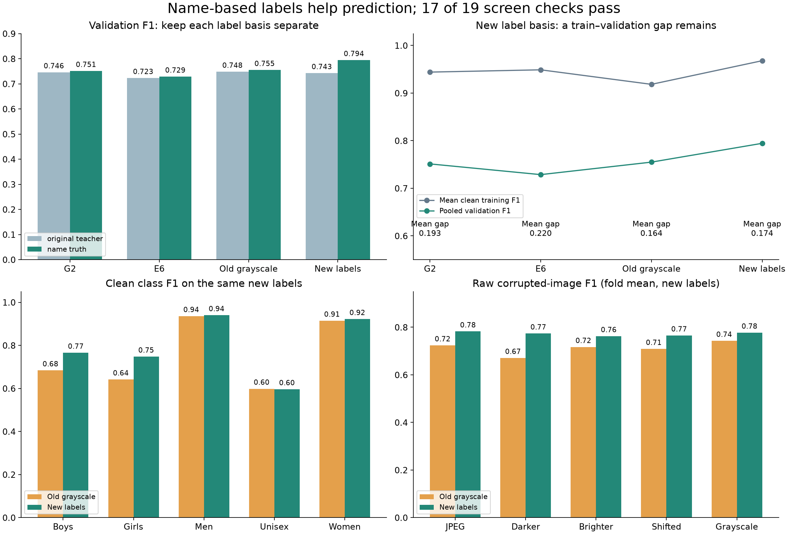

# Name-truth gender training: verified review

The new labels improve prediction under the name-based label rule, especially
for Boys and Girls. The run **fails the agreed screen: 17 of 19 checks pass**.
Keep this as a useful research candidate, not an accepted final model. Do not
automatically run more folds or change the gap threshold to make it pass.

Both scratch runs completed 30 epochs with dropout 0.30, grayscale probability
0.10, the same mild darkening, seed 2753 and 390,181 parameters. They ran on
folds 0 and 4 using commit `854d7703adcae426b584d9161abe963ba80938d3`.

## What improved

Both models below use the **same new labels for evaluation**. The old model was
trained on teacher labels; the new model was trained on name-based labels.

| Measure | Old grayscale model | New name-truth model |
|---|---:|---:|
| Pooled validation macro-F1 | 0.754923 | 0.794440 |
| Boys F1 | 0.683871 | 0.765832 |
| Girls F1 | 0.641667 | 0.747764 |
| Men F1 | 0.935941 | 0.940115 |
| Unisex F1 | 0.598563 | 0.596293 |
| Women F1 | 0.914573 | 0.922198 |
| Mean clean training F1 | 0.918372 | 0.968017 |
| Mean train–validation F1 gap | 0.163514 | 0.173793 |

The pooled validation gain is **0.039517**, or 3.95 F1 points. Its paired
whole-family bootstrap 95% interval is **[+0.024262, +0.055242]**. The gain
appears on both folds: +0.035667 and +0.043066. This interval describes these
two development folds; it does not remove the bias from repeated experiments.

Across 13,110 validation images, 283 old errors become correct and 177 old
correct predictions become wrong: 106 more correct predictions overall.
Of these, 65 come from the 157 rows whose labels changed, and 41 come from
the 12,953 rows whose labels did not change. Thus the gain is not only the
result of scoring the same predictions against different labels. Girls gains
55 correct predictions and Boys gains 48. Unisex remains weak.

## Why the screen still fails

The fixed gap checks compare against **G2, also rescored on the new labels**.

- Mean gap reduction is **0.019433**, below the required **0.050**.
  The candidate gap is 0.173793; the allowed maximum is 0.143226.
- Fold 0's gap grows slightly: **0.178034 → 0.179179**. Both folds had to
  improve. Fold 4 improves from 0.208418 to 0.168407.

Against the direct grayscale parents, the gap actually grows on both folds.
The new model's training score rises more than its validation score. Better
validation predictions and a smaller train–validation gap are different goals;
this run improves the first but does not meet the second.

There is also a limit to interpreting this gap as overfitting: the old models
were trained to match a different label convention. Rescoring their training
images on the new labels lowers their training F1, which shrinks their gap
without any change to their weights. The failed rule is still a failed rule,
but it does not erase the verified gain on validation images under the new
label rule. Any change to how this experiment is judged needs a separate,
explicit protocol decision; it must not be presented as passing this screen.

All validation, class, confidence-quality, corruption, parameter-count and
memory guards pass. Peak allocated GPU memory is about **475 MB** per fold,
below 3 GB. Recorded training time is about **8.6 minutes per fold**.

## Original labels tell a different story

The same saved probabilities were scored against both label conventions.
No extra inference or fitted parameters were used for this comparison.

| Model | Original teacher-label F1 | Name-truth F1 |
|---|---:|---:|
| G2 | 0.745726 | 0.751158 |
| E6 | 0.722955 | 0.728656 |
| Old grayscale | 0.747944 | 0.754923 |
| New name-truth | 0.742514 | 0.794440 |

On original teacher labels, the new model changes by **−0.005430** versus
the old grayscale model. The paired 95% interval is **[−0.021000, +0.010325]**,
which includes zero. It is not evidence of a clear teacher-label improvement.

Simply rescoring the old grayscale model on the new labels raises its F1 by
0.006979. Retraining adds a further 0.039517 when both models use those new
labels. The latter is the fair estimate of the retraining effect under the
chosen name-based rule. These results do not establish which convention is
objectively correct, or how a hidden teacher-labeled test would score.

## Image changes

Raw F1 on corrupted images improves across all five tested conditions:

| Condition | Old grayscale | New name-truth |
|---|---:|---:|
| Darker | 0.670889 | 0.773662 |
| Brighter | 0.716880 | 0.762390 |
| Grayscale | 0.742798 | 0.777197 |
| JPEG compression | 0.723798 | 0.782341 |
| Shifted image | 0.708784 | 0.765347 |

These are fold means on the new label basis. Grayscale's raw score improves,
but its drop relative to clean F1 becomes slightly larger: 0.012060 → 0.017027.
It still passes the fixed E6 guard. Raw scores and changes from clean scores
must be read together.

The figure was rendered and visually checked.

## Verification and limits

`review.py` independently checked eight registered model bundles, their saved
training controls, parent links, checkpoint archives and file hashes. It checked
the canonical split, all six archived label files, all 32,773 development image
hashes, the evaluation code hashes against the recorded commit, and 524,384
prediction rows across clean and corrupted views. The 72 evaluation files and
eight evaluation manifests were hash-checked.

The review reproduced all 19 checks, both saved bootstrap comparisons, and all
56 dual-label diagnostic records. It also calculated the original-label
bootstrap interval. The other source-audit entries were compared with prior
audit hashes; their full bundles were not all downloaded again.

No checkpoint was unpickled, no model was trained, and no new GPU inference was
performed. Timing, GPU memory and unchanged model state remain recorded GPU
evidence. The held-out test stayed sealed. Repeated development experiments
are not an independent final evaluation. No code or acceptance rule was changed.

Supporting files: `verified_summary.csv`, `verified_folds.csv`,
`verified_class_f1.csv`, `verified_class_gaps.csv`, `verified_robustness.csv`,
`verified_prediction_changes.csv`, `verified_gates.csv`, `verified_review.json`
and `recomputed_decision.json`. Original Drive files are preserved in `saved/`.
