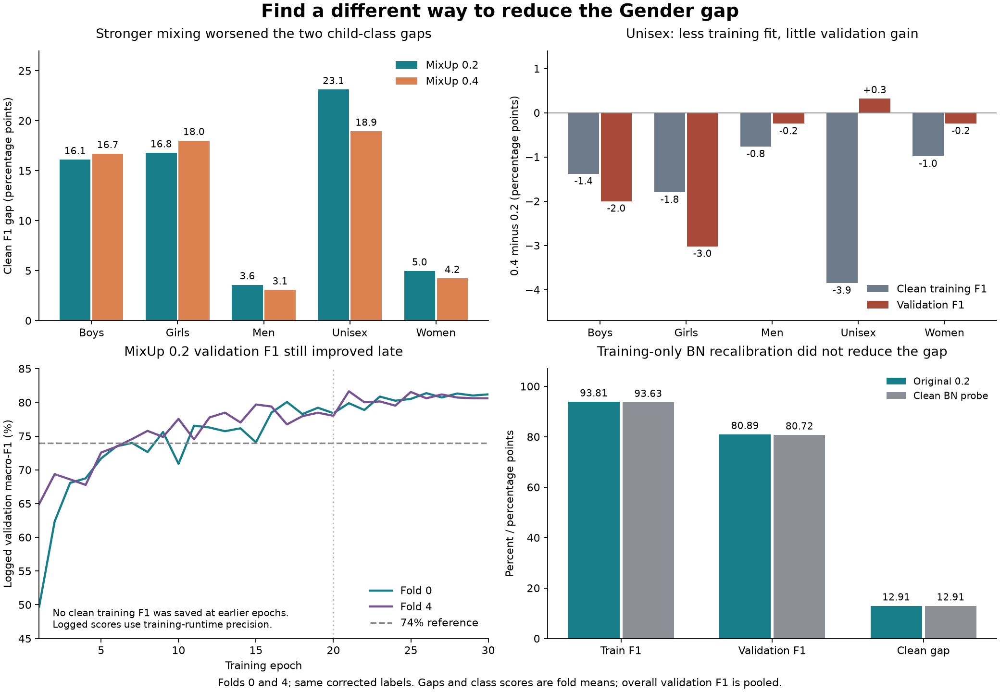

# A different route to lower overfitting

**Recommend one SAM trial on top of the successful MixUp 0.2 recipe.** SAM
changes the learning step. It is a research candidate, not a demonstrated fix
for this model. Keep the 74% validation macro-F1 floor and require the same
two-point mean gap reduction. No SAM training has been implemented or run.

This investigation rechecked the current class gaps, training-family coverage,
both MixUp learning curves, earlier experiment results and the network code.
It also ran a fixed, training-only BatchNorm recalibration probe on both saved
MixUp 0.2 checkpoints. That probe did not help.

## Stronger MixUp did not help all three weak classes

The aggregate result hid an important difference. These are means of the same
two fold-level class scores, under the same corrected labels:

- **Boys gap increased: 16.10 → 16.72 points.** Training F1 fell 1.38 points,
  but validation F1 fell more: 2.00 points.
- **Girls gap increased: 16.79 → 18.01 points.** Training F1 fell 1.80 points,
  but validation F1 fell 3.02 points.
- **Unisex gap fell: 23.12 → 18.95 points.** Training F1 fell 3.85 points,
  while validation F1 rose just 0.32 points. Pooled Unisex recall stayed at
  51.06%. This is mostly less training fit, not better recognition.

The Boys/Girls/Unisex classes account for 86.75% of the alpha 0.2 gap, and
88.03% of the alpha 0.4 gap. This is an arithmetic decomposition, not proof of
what caused the errors. Simply strengthening the same global intervention
does not treat those classes equally.

Each corrected-label training fold contains only 396–402 Boys families and
361–369 Girls families, compared with about 9,800 Men families. There are no
family crossings between the canonical training and validation sides. The
earlier article-level review also found sparse shoe and accessory groups.

About 90% of training images are Men or Women. For a fixed rare-class row,
random within-batch pairing will therefore usually choose an adult-class
partner. Raising alpha from 0.2 to 0.4 increases the probability of a
25–75% blend from 17.19% to 28.73%. These are properties of the sampling rule
and class counts. They make obscured details a plausible concern, but do not
prove that blending caused the child-class regressions.

## Tested and ruled out as the next step: clean BatchNorm statistics

BatchNorm stores internal averages and variances from training images.
MixUp trains those layers on blended images. The published MixMatch
implementation includes a separate BatchNorm pass over original inputs,
which motivated checking this possible mismatch here.
[Original implementation](https://github.com/google-research/mixmatch/blob/master/mixup.py).

Before the probe, `probe_plan.json` fixed one method: freeze all learned
parameters, disable dropout, reset the four BatchNorm buffers, and fit them
once using every clean fold-training image, shuffled with seed 2753 and batch
128. No validation or holdout image fitted the statistics. The two variants
were then evaluated on identical clean training and validation images on CPU.

- Pooled validation F1: **80.8909% → 80.7155%**.
- Mean clean training F1: **93.8123% → 93.6287%**.
- Mean clean gap: **12.9133 → 12.9130 points**, effectively unchanged.
- Unisex recall: **51.0608% → 50.7779%**, two fewer correct Unisex images.
- Fold 0's gap worsened; fold 4's gap improved by a similar amount.

The original CPU replay matched every saved training and validation class
prediction across both folds; the largest probability difference was below
1e-6. All 32,773 development image hashes and both source checkpoint hashes
were checked. Learned parameters remained exactly unchanged, and the original
checkpoint files were not modified. Two diagnostic calibration runs were
recorded through `fashion.train.registry` in `results/runs.csv`, with
`debug=true` and `submission_eligible=false`; their rows are also saved here.
There were no gradient updates. This result does not support a cheap
normalization correction as the next improvement.

## Why SAM is the first new training candidate

SAM briefly tests a small change to the weights, then learns a step that also
works at that nearby point. Its aim is to avoid solutions whose training loss
is low only in a very narrow neighborhood. The paper reports gains when
training image classifiers from scratch, and studies a fixed radius of 0.05.
It uses two backward passes per update. Those results motivate an experiment;
they do not establish that our model has a problematic sharp minimum or that
SAM will reduce its F1 gap.
[SAM paper](https://arxiv.org/html/2010.01412v3).

For this project I would wrap the existing AdamW optimizer with non-adaptive
SAM at radius **0.05**, while keeping alpha **0.2**, the model, labels, image
augmentation and 30-epoch schedule fixed. This choice preserves the useful
image signal from the accepted recipe and tests a learning-rule change.
Using AdamW here is our controlled adaptation; the paper's quoted scratch
benchmarks mainly use SGD. Radius 0.05 is a starting hypothesis, not a tuned
optimum for this network.

`next_trial_spec.json` makes the proposal concrete. It covers the exact
two-pass behavior, same MixUp batch and dropout mask, one BatchNorm buffer
update and one AdamW state update per batch, restoration after failures,
registry receipts, and CPU/GPU checks needed before a Colab run. The new
method adds no inference layers. Expect roughly twice the training compute;
actual L4 time and memory still need measurement.

The trial must keep pooled validation F1 **at least 74%**, reduce the mean
clean gap by **at least two points**, improve both fold gaps and preserve
Unisex recall. Relative fold/class F1 changes remain diagnostics. Keep the
existing non-F1 resource, probability-quality and corruption guards. Save
clean train/validation scores at epochs 10, 15, 20, 25 and 30 to show the gap
forming, while retaining the final checkpoint as the fixed selection rule.

## Why the other routes rank lower right now

- **DropBlock is the backup.** It hides contiguous regions of internal feature
  maps. Our current dropout is after spatial pooling; it still regularizes
  earlier layers through gradients, but does not directly hide feature-map
  regions. DropBlock offers a different intervention. Our final map is only
  10×7, however, so a 3×3 region covers a substantial part of a small map.
  Hiding internal regions may remove scarce useful cues. The paper's gains
  on larger networks do not decide that trade-off for these images.
  [DropBlock paper](https://arxiv.org/abs/1810.12890).
- **Stopping earlier is testable but its gap is unknown.** At epoch 20,
  MixUp 0.2 logged 78.40% and 78.01% validation F1. Both exceed 74%, but clean
  training scores and earlier checkpoints were not saved. To meet the
  two-point gap-reduction target at those approximate validation scores,
  mean clean training F1 would need to be about 89.12% or lower. We cannot
  infer that from mixed-input training loss. Late training also adds useful
  validation F1, especially on fold 0. Earlier E8 checkpoint selection only
  slightly reduced the old model's gap; that does not prove a short-budget
  MixUp trial would fail.
- **More head dropout, weight decay or width reduction** have direct earlier
  screens showing small gap gains or damaged scores. They were run with older
  recipes and labels, so their effects cannot simply be added to today's
  MixUp result. They provide less reason to repeat another strength increase.
- **Label smoothing has not been tested for this Gender recipe.** The existing
  E5 smoothing experiment belongs to Usage. Still, MixUp already supplies soft
  target mixtures, so stacking another soft-label rule is not my first test.
- **More independent training families** would directly address sparse
  coverage, but matching the catalog's audience labels and excluding existing
  image/family overlap needs a separate data-intake study. No external data
  was added here.

The held-out test stayed sealed. These are two repeatedly used development
folds, so the next screen would still need separate confirmation before final
model selection. No method here can promise a zero gap.

## Files and checks

- `mixup20_class_gaps.csv`, `mixup40_class_gaps.csv` and
  `mixup40_class_gap_folds.csv`: class gap calculations.
- `training_coverage.csv`: corrected-label training rows and distinct families.
- `notebook_epoch_history.csv`: 120 logged epoch rows across both strengths;
  rounded training-runtime scores, not substituted for final IEEE scores.
- `mixup40_fold0_metrics.json`, `mixup40_fold4_metrics.json`: saved Drive
  evaluation metrics, consistent with the preceding result review.
- `probe_bn.py`, `probe_plan.json`, `bn_probe_scores.csv`, `bn_probe_pooled.json`,
  `bn_buffer_changes.csv`, `probe_registry_rows.csv`: fixed calibration probe.
- Each calibration run folder stores its configuration, source hash, separate
  diagnostic checkpoint, four prediction CSVs and metrics. The probe imports
  the original parent's source from commit
  `68fef49ab1d55d671531113a71a3e71400a0e3fc` in a temporary checkout.
- `plot_findings.py` regenerates the figure. The rendered figure was visually
  inspected. A copy is in `results/figures/task3/` for report use.
- `analyze_saved.py` rebuilds the class, coverage and history tables without
  fitting anything; `analysis_summary.json` records their source hashes and
  the derived sampling probabilities.
- `next_trial_spec.json`: the proposed SAM trial, not executable training code.

Prior evidence: [MixUp 0.2](../gender_mixup_result_20260906/README.md),
[MixUp 0.4](../gender_stronger_mixup_result_20260906/README.md),
[stronger dropout](../gender_stronger_dropout_result_20260905/README.md),
[weight decay](../gender_weight_decay_result_20260905/README.md),
[earlier class analysis](../gender_name_truth_deep_review_20260906/README.md),
and the executed narrow-model notebook `04x`.
