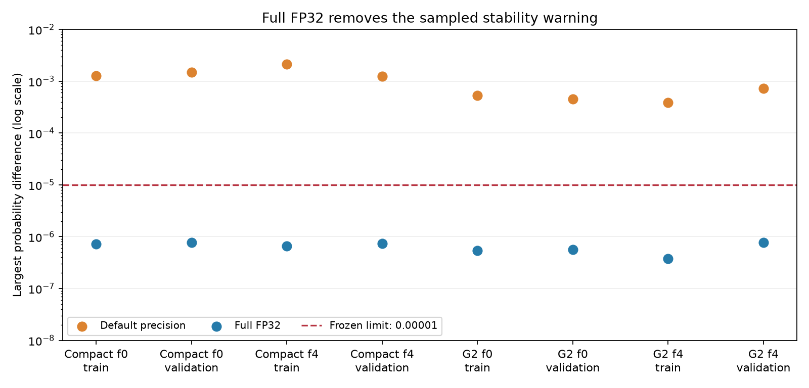

# Gender precision-check result

**All 72 sampled batch/order checks pass under full FP32.** Default precision reproduces the earlier 64 tolerance failures. No tested predicted labels changed within either mode or between their reference predictions.

The GPU precision setting explains the observed warning on these fixed samples. This does not explain away the large clean training–validation gap or prove stability over every image.

Source: Drive `MLA2/task3/diagnostics/gender_precision/20260905T085822668071Z`. Four saved models (G2 and CompactBlurCNN, folds 0 and 4), each evaluated on the earlier 160-image training sample and 160-image validation sample. Runtime: NVIDIA L4, PyTorch 2.11.0+cu128, CUDA 12.8. No training.

- Default precision: 8/72 comparisons pass; maximum absolute probability difference **0.002153635025024414**.
- Full IEEE FP32: 72/72 pass; maximum difference **0.0000007748603820800781**.
- Frozen tolerance: **0.00001**, with zero predicted-label changes required.
- Comparing default versus IEEE reference predictions gives a maximum difference of **0.0018008947372436523**, with zero label changes. The modes are not bitwise identical.

The chart was visually inspected. Each point shows the worst batch/order probability difference for that model, fold and partition. Its vertical axis is logarithmic.

## Verification

`review.py` independently recalculates all 144 comparisons from the eight saved probability archives. It verifies array dimensions, finite normalized probabilities, sample IDs, differences, labels, decisions, source hashes and comparison coverage. It also checks the diagnostic, source-code and canonical-split hashes. All default-mode summaries reproduce the earlier diagnostic within 0.0000001; all earlier predicted-label counts agree. See `verified_review.json` and `verified_comparisons.csv`.

The saved run records convolution precision as TF32 by default and all five precision controls as IEEE during the full-FP32 pass. Settings were restored after the check. All four models' weights and BatchNorm buffers remained unchanged. Maximum allocated GPU memory was 187,765,760 bytes for G2 and 145,062,912 bytes for CompactBlurCNN, below 3,000,000,000 bytes.

Image tensors were prepared once and reused in both modes. Their hashes and the original sample-ID hashes are saved. Input preparation, backend settings and unchanged weights are attested by the GPU run; there was no local GPU rerun. The historical 04v run did not record precision flags, but its drift summaries were reproduced here.

Keep 04v's original `review_required` result as historical evidence. This follow-up resolves its sampled numerical warning; it does not accept G2 or CompactBlurCNN, change prior model-selection results, or authorize training another candidate. The large clean training–validation gaps remain as established by 04v.

The other task independently recomputed the comparisons and agrees that the sampled precision warning is resolved. It recommends one controlled screen of narrower G2: reduce only the final layer from 256 to 64 channels (390,181 to 167,653 parameters), using scratch fits on folds 0 and 4. This is a testable capacity hypothesis, not a proven fix or evidence of better validation performance.

Its proposed limits are **not yet approved**: permit at most 0.010 validation macro-F1 loss versus matched G2, require the paired whole-family confidence interval lower bound to be at least -0.010, and require at least 0.050 reduction in the mean clean training–validation gap with both folds improving. Preserve the existing class, calibration and corruption safeguards and the strict GPU memory limit below 3 GB. Exact metric scopes and safeguards must be written down before a screen is implemented. A smaller gap with a permitted small validation loss would demonstrate a capacity/fit trade-off, not improved validation accuracy.

G2 and the candidate would need evaluation using the same explicit precision settings, while keeping historical scores separate. A switch in evaluation precision must not be mixed into an otherwise width-only training comparison without being documented. No further numerical investigation is recommended before proposing the screen.

No new training was started. No notebook, training code, registry or checkpoint was changed during this review.
