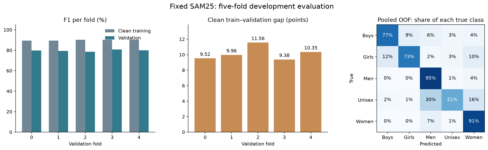
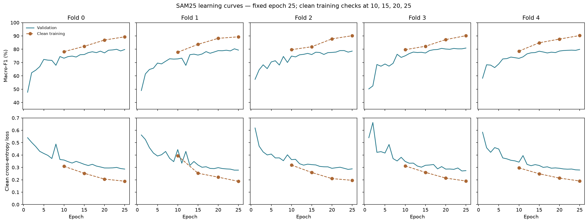

# SAM25 five-fold review — 6 September 2026

**The fixed recipe holds up across all five folds. Keep it fixed and move to
the reserved holdout evaluation.** This supports keeping SAM25 as a candidate;
it does not establish that it beats every earlier model.

All five scratch runs finished the planned 25 epochs. Their saved predictions
cover all 32,773 eligible development images exactly once, with the correct
fold, label, product family, image path, run ID and probability columns.
No holdout IDs are included. The summary metrics were rebuilt from those
predictions and match the saved results.

| Validation fold | Clean training F1 | Validation F1 | Gap (points) |
|---|---:|---:|---:|
| 0 | 89.32% | 79.81% | 9.52 |
| 1 | 89.32% | 79.36% | 9.96 |
| 2 | 90.16% | 78.60% | 11.56 |
| 3 | 90.21% | 80.83% | 9.38 |
| 4 | 90.27% | 79.92% | 10.35 |

Pooled macro-F1 is **79.73%**; each class has equal weight in this score.
Mean clean training F1 is **89.86%**, and the mean per-fold gap is
**10.15 points**. Fold F1 ranges from 78.60% to 80.83%, with a sample standard
deviation of 0.81 points. This spread is descriptive, not a confidence interval.
Accuracy is 90.46%, with 3,126 wrong predictions.

The three added folds (1/2/3) achieve **79.63%** pooled F1 and a **10.30-point**
mean gap. Screen folds 0/4 reproduce **79.86%** F1 and a **9.93-point** gap.
Their five recorded history traces—learning rate, both SAM training losses,
validation loss and validation F1—match the earlier 04aj histories exactly.
This checks recorded values, not equality of checkpoint tensors.

The original Drive summary plot was visually inspected. The figures below
were also rebuilt locally from the retrieved records and visually inspected.

The curves show continuing learning and a persistent train–validation gap.
Validation loss generally falls through epoch 25, rather than rising steadily
while training loss falls. The gap alone is not a reason to discard this run.
Fold 2 deserves the clearest failure discussion. Do not choose a different
epoch for each fold after seeing these results; retain the fixed epoch-25 rule.
Training curves below use recorded runtime diagnostics. The table above uses
the matched IEEE evaluation; small precision-related differences exist on
some folds and were checked against each saved IEEE metrics file.

| Class | F1 | Recall: share found correctly |
|---|---:|---:|
| Boys | 78.61% | 76.84% |
| Girls | 75.71% | 72.57% |
| Men | 93.54% | 95.14% |
| Unisex | 59.30% | 50.82% |
| Women | 91.47% | 91.47% |

Unisex remains the main weakness: 896 of 1,763 are found correctly.
528 are called Men and 283 are called Women. The extra folds show the same
weakness, with 50.66% Unisex recall. Small image shifts cause the largest
mean corruption drop, **4.20 F1 points**, including 6.25 points on fold 0.
Other mean drops are 0.75 for JPEG, 2.25 for darkening, 2.65 for brightening
and 2.53 for grayscale. These saved corruption summaries were checked for
consistent arithmetic; the corruption images were not evaluated again.

The label basis must be explicit. The headline **79.73%** uses the existing
name-based corrected gender labels. Re-scoring the same OOF probabilities
against original teacher labels gives **75.33%** macro-F1. That is a different
label definition, not a new test set. It matches the saved per-fold teacher-label
diagnostics. Compare models on the same images and label basis.

On the comparable folds 0/4, 04af MixUp still scores **80.89%**, versus
SAM25's **79.86%**. SAM25 has a smaller gap, not a demonstrated accuracy win.
The full five-fold result must not be compared directly with 04af's two-fold
score as if their evaluation scopes were equal. All folds are development
data, and earlier experiments have already used them. Five-model averaged
prediction performance has not yet been measured.

Recorded training time totals **39.79 minutes**, including training-loop
validation and diagnostics, plus separate setup and final evaluation time.
Peak allocated training GPU memory is **478.19 MB**, below the 3 GB limit.
Each model has **390,181 parameters**. All five checkpoint files are present
in the Drive listings and referenced by the model manifest.

The local review verified SAM/MixUp receipts, diagnostic hashes, canonical
training rows, 25 epochs, final-epoch selection, the original cosine T_max=30,
scratch flags, source-code hashes against commit `f2123af`, data hashes,
configuration and normalization hashes, and IEEE evaluation metadata.
Checkpoint hashes agree across the two saved manifests. Checkpoint bytes
were not downloaded or rehashed, the registry was not independently reaudited,
and no new model inference or training was performed. The saved
`complete_for_review` status is not an automatic model acceptance gate.

Next: evaluate the five saved models together on the reserved holdout using
their own normalization and the fixed probability-average rule. Keep the
recipe fixed. Report the remaining Unisex errors and label-definition limits.

Source: [completed five-fold result folder](https://drive.google.com/drive/folders/1jhi-nRZ10DYpVz3Cgln0CnOwU0DV8z0Z).
Exact file links are in `sources.json`. The review script, retained records,
per-fold table and verified summary are saved beside this file.
