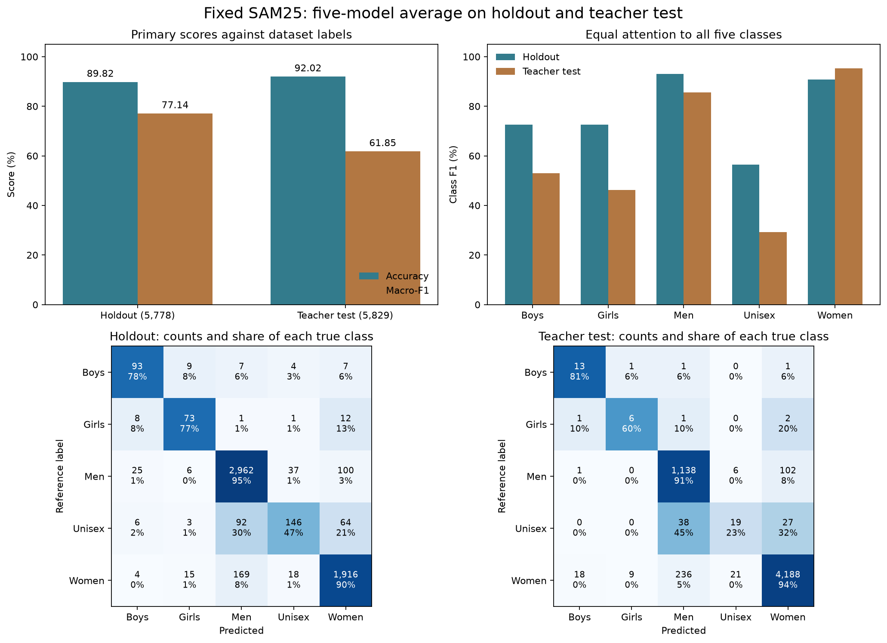
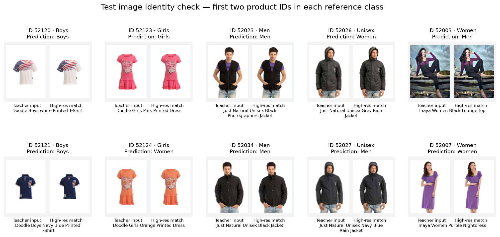

# Fixed SAM25 holdout and teacher-test evaluation

**Evaluation completed for all 11,607 images. The model holds up on the
reserved holdout, but the teacher test exposes weak smaller-class results.**
The 92.02% test accuracy must be reported together with its 61.85% macro-F1.
Macro-F1 gives each of the five classes equal weight.

| Dataset | Images | Correct | Wrong | Accuracy | Macro-F1 |
|---|---:|---:|---:|---:|---:|
| Reserved holdout | 5,778 | 5,190 | 588 | **89.82%** | **77.14%** |
| Teacher test | 5,829 | 5,364 | 465 | **92.02%** | **61.85%** |

These primary scores use the dataset gender labels. Holdout labels came from
`data/raw/teacher/train/styles_train.csv`. Test labels came from
`data/raw/external/fashion_product_images_v1_legacy_extras/fashion-dataset/styles.csv`.
All joins use product ID, with no missing or duplicate evaluation IDs.
The high-resolution CSV and per-product JSON gender fields agree on all
11,607 holdout/test products. The teacher holdout labels also agree with
high-resolution labels on all 5,778 holdout rows. No rows were excluded.

The fixed name-correction rule gives **80.45% holdout F1**, close to the
previous **79.73% corrected-label CV F1**. The corresponding raw-label CV F1
was 75.33%. Keep these label bases distinct: corrected-label holdout is a
secondary diagnostic, not a replacement for the primary 77.14% score.
CV uses one held-out model per development image; this evaluation averages
five models, so changes also include the effect of that averaging.

The rule changes 45 holdout labels and four test labels. On the teacher test,
it gives **61.08% F1** and 91.95% accuracy. It does not remove the test weakness.
No new label rule was chosen after seeing these outcomes.

| Class | Holdout count | Holdout F1 | Test count | Test F1 | Test recall |
|---|---:|---:|---:|---:|---:|
| Boys | 120 | 72.66% | 16 | 53.06% | 81.25% |
| Girls | 95 | 72.64% | 10 | 46.15% | 60.00% |
| Men | 3,130 | 93.13% | 1,247 | 85.53% | 91.26% |
| Unisex | 311 | 56.48% | 84 | 29.23% | 22.62% |
| Women | 2,122 | 90.78% | 4,472 | 95.27% | 93.65% |

The test population differs sharply from the development/holdout population:
**76.72% of test images are Women**, while Boys and Girls have only 16 and
10 images. Their F1 values are sensitive to a small number of mistakes and
false positives. There are 33 Boys predictions but only 13 correct, and
16 Girls predictions but only six correct.

Unisex is the main practical failure. The model finds **146/311** holdout
Unisex items (46.95%) and only **19/84** test Unisex items (22.62%). Of the
65 missed test Unisex products, 38 are called Men and 27 Women.
The test's class mix helps overall accuracy; it does not explain away these
misses. Confidence calibration also changes: ECE is 2.35% on holdout and
8.76% on test, where lower is better.

Five-model averaging improves F1 over the mean individual-fold F1 by
0.67 points on holdout and 1.79 points on test. Individual-fold results are
retained for explanation only; no fold was chosen using holdout/test scores.

## What was fixed before labels were opened

- The five exact final epoch-25 checkpoints from the completed SAM25 CV run.
- Equal weight 0.2 for each fold's softmax probabilities, followed by argmax.
- The original teacher RGB images, 80×60 input, saved fold-specific
  normalization, and no evaluation augmentation.
- CPU float32 inference with PyTorch 2.11.0, batch size 128, and two threads.
- Original teacher labels for primary holdout scoring and high-resolution
  dataset labels for primary teacher-test scoring.

All five checkpoint byte hashes match the saved model manifest. Each loads
strictly into the 390,181-parameter model, with matching run ID, class order,
configuration and normalization. A reproduction check used 160 validation
images per fold: maximum CPU-versus-saved-IEEE probability difference was
5.96e-7, and none of the 800 class predictions changed.

Predictions were frozen at **2026-09-06 12:43:26 UTC**. The scoring script
opened reference labels at **12:43:32 UTC**. All source checkpoint hashes,
prediction file hashes, equal-weight averages, class probabilities and
metrics were checked. Scores also agree with scikit-learn accuracy and F1.
No training, tuning, calibration fit or full-development refit was performed.
Weights and running buffers stayed unchanged. The ten inference passes
took 137.37 seconds in total, excluding preparation and scoring.

## Image matching and evaluation limits

All 11,607 teacher image files match their canonical hashes. Holdout and test
IDs and exact-file hashes are disjoint from development and from each other.
Holdout product families are also disjoint from development families.
High-resolution images and per-product JSON records exist for every scored ID.
Ten teacher/high-resolution image pairs were visually inspected and match.

The teacher test is not established as fully independent at the product-family
level. Its IDs are absent from the canonical family audit, and **797/5,829**
test rows (13.67%) have a normalized product name also seen in development.
This is a related-product warning, not proof of exact-image leakage. These
rows remain in the assigned test result. For the 5,032 rows without that name
overlap, the diagnostic score is 91.61% accuracy and 60.09% macro-F1; that
subset is not a replacement test set and has a different class mix.

Dataset labels are the requested reference, not a claim of perfect human
truth. Agreement between CSV and JSON checks consistency of the same source.
Some labels still conflict with explicit product names, as the preserved
name-rule diagnostics show. No visual or model-based relabeling was done.

The holdout has now been evaluated for this frozen method. Keep this result
as its recorded holdout evidence. Any later tuning should use development
CV and be clearly distinguished from this evaluated method.

## Saved files

- `gender_test_predictions.csv`: 5,829 rows in teacher template order,
  with `id,gender`; the original multi-target submission template is unchanged.
- `gender_holdout_predictions.csv`: 5,778 holdout predictions by ID.
- `gender_*_probabilities.csv` and `gender_*_fold_*.csv`: ensemble and
  individual-fold probabilities.
- `evaluation_summary.csv`, `per_class.csv`, `evaluation_metrics.json`,
  and confusion matrices: primary and clearly labeled diagnostic scores.
- `holdout_errors.csv` and `test_errors.csv`: every primary-label mistake.
- `inference_recipe.json`, `prediction_freeze.json`, `reference_audit.json`,
  `cpu_reproduction_checks.json`: settings, provenance and verification.
- `predict.py`, `score.py`, `render_review.py`: executed evaluation scripts.

The prediction and scoring scripts preserve their executed bytes and refuse
to overwrite a completed evaluation. No commits or pushes were made.
