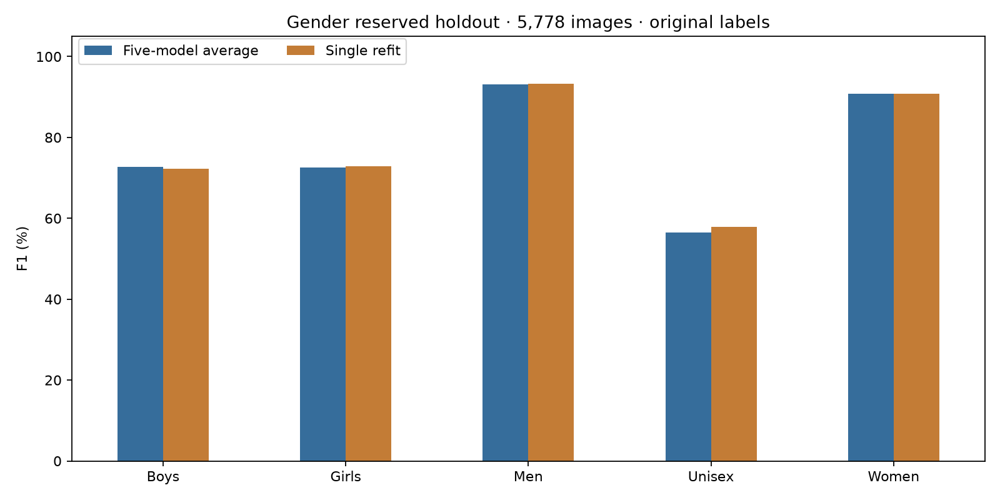

# Gender SAM25 refit: reserved holdout comparison

The single refit slightly exceeds the frozen five-model probability average on the
same 5,778 reserved holdout images. The gap is small: 10 more correct predictions.
This is a follow-up check on an already opened holdout, not a new blind evaluation.

| Original teacher labels | Five-model average | Single refit | Change |
|---|---:|---:|---:|
| Accuracy | 89.8235% | 89.9965% | +0.1731 percentage points |
| Macro F1 | 77.1374% | 77.4369% | +0.2995 percentage points |
| Correct images | 5,190 | 5,200 | +10 |
| Negative log loss (lower is better) | 0.296772 | 0.296184 | −0.000588 |
| Calibration error, 15 bins (lower is better) | 0.023504 | 0.023667 | +0.000163 |

Macro F1 gives each class equal weight. The average here is the arithmetic mean
of the five saved models' probability vectors, followed by argmax. It is not the
mean of five F1 scores. Both systems use their saved normalization and the same
60×80 images; no augmentation is applied during prediction.

| Class F1, original labels | Five-model average | Single refit |
|---|---:|---:|
| Boys | 72.66% | 72.31% |
| Girls | 72.64% | 72.92% |
| Men | 93.13% | 93.22% |
| Unisex | 56.48% | 57.87% |
| Women | 90.78% | 90.86% |

Unisex remains the weakest class. The refit correctly identifies 147 of 311 Unisex
images, versus 146 for the average. Its higher Unisex F1 mostly reflects fewer
false Unisex predictions (50 versus 60). Boys F1 falls slightly, and Girls recall
falls from 76.84% to 73.68%, despite the small rise in Girls F1. Balanced accuracy
(mean class recall) falls from 77.24% to 76.94%.

The refit fixes 65 images that the average got wrong, but makes 55 new errors;
523 images are wrong under both models. These are observed differences from one
refit. They do not establish a reliable advantage across future training seeds.
The single refit is a reasonable simpler inference candidate: one model forward
pass instead of five. Inference speed was not benchmarked here. No app or submission
model was replaced by this check.

The existing fixed product-name rule is also applied as a separate diagnostic.
It gives accuracy / macro F1 of **90.41% / 80.45%** for the average and
**90.57% / 80.78%** for the refit. Original teacher labels remain the primary result.

## Training and evidence checks

- Completed all 25 fixed epochs on all 32,773 development images in 464.21 seconds
  (7.74 minutes); peak reported GPU memory was 456.04 MiB.
- Verified every downloaded artifact against its manifest SHA-256, the checkpoint
  metadata and model weights, and matching model/config/image-processing source hashes.
- Matched saved training rows to the corrected development data across all five
  folds; confirmed no holdout image or product family appears in training.
- Checked 257 optimizer updates per epoch, both SAM passes per update, full row
  coverage for SAM and MixUp, and the fixed learning-rate schedule.
- Verified holdout image hashes, frozen average/fold CSV hashes, and that the saved
  average equals the mean of its five saved probability tables.
- Used evaluation mode with saved full-development normalization; model weights
  and buffers were unchanged by inference. Original labels matched the prior
  comparison by image ID. The teacher test set was not evaluated.

Run ID: `t3_gender_name_truth_mixup_alpha020_sam005_epoch25_refit_20260907T061926Z_db0fc1ee`.
The original training-only manifest keeps its original `holdout_evaluated: false`
status; this separate report records the subsequent authorized holdout evaluation.

## Files and reproduction

- `evaluation.json`: full metrics, confusion matrices, training summary and paired errors.
- `holdout_comparison.csv` and `holdout_per_class.csv`: exact comparison values.
- `refit_holdout_probabilities.csv`: all 5,778 refit probability vectors.
- `evaluation_provenance.json`: input and output hashes.
- `holdout_comparison.png`: visually inspected class F1 comparison; also saved to
  `results/figures/task3/gender_sam25_refit_holdout_20260907.png`.

The training artifacts are saved locally under
`results/evidence/task3/gender_sam25_refit_20260907/` and originate from the
[completed Drive run](https://drive.google.com/drive/folders/13VBCg_AHcr8cI3yp8lRDsNMF_wLw21KF).
The comparison inputs are in `reports/task3/gender_sam25_holdout_test_20260906/`.

From the repository root, with the project training dependencies installed:

```bash
./.venv/bin/python reports/task3/gender_sam25_refit_holdout_20260907/evaluate.py
```

This local evaluation used CPU PyTorch from `/tmp/task3-refit-test-deps`, via
`PYTHONPATH=/tmp/task3-refit-test-deps:src`, with two CPU threads and IEEE precision.


