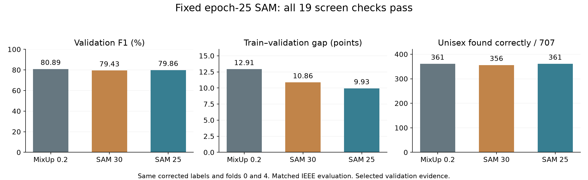

# Fixed epoch-25 SAM result — 6 September 2026

**All 19 screen checks pass.** Both folds finished 25 epochs from scratch.
The saved final models received matched IEEE evaluation and corruption checks.

| Measure | MixUp 0.2 (04af) | SAM 30 (04ai) | SAM 25 (04aj) |
|---|---:|---:|---:|
| Pooled validation macro-F1 | 80.89% | 79.43% | 79.86% |
| Mean clean train–validation gap | 12.91 points | 10.86 points | 9.93 points |
| Unisex found correctly | 361/707 | 356/707 | 361/707 |
| Total validation errors | 1,192 | 1,237 | 1,245 |

The mean gap fell by **2.98 points** versus 04af, clearing the required
2-point reduction. Fold 0 improved by 2.93 points and fold 4 by 3.03 points.
Unisex recall is unchanged at **51.06%**, exactly on the required floor.
Validation F1 remains above the agreed 74% floor.

The smaller gap does not prove better prediction. Mean clean training F1
fell from 93.81% to 89.79%, while validation F1 fell by 1.03 points.
All five classes lost F1 versus 04af: Boys 2.40 points, Girls 1.83,
Men 0.21, Unisex 0.25, and Women 0.48. There are 53 more errors overall.
SAM25 recovers five correct Unisex items in total versus SAM30, but also
has eight more errors overall; macro-F1 gives equal weight to each class.

The saved paired 95% interval for F1 change versus 04af is −2.12 to +0.07
points. It includes zero and does not correct for repeated model selection.
These are the same two folds used to select epoch 25, not independent test data.

All 14 retained G2/E6 checks pass. Confidence quality is still worse than
04af: NLL rises from 0.2703 to 0.2828 and ECE from 1.32% to 2.79%.
The calibration gates compare against G2, not 04af. The extra damage from
image translation is 1.30 points worse than 04af on average, concentrated
in fold 0. The other corruption differences range from −0.10 to +0.55 points.

The two recorded training times total **15.97 minutes**, including per-epoch
validation and clean diagnostics. Peak allocated GPU memory is
**476,876,800 bytes**, below 3 GB. The model still has **390,181 parameters**.

The saved records verify exactly 25 epochs, final-epoch selection, no early
stopping, and the original 30-epoch cosine learning-rate schedule. Both SAM
and MixUp receipts and diagnostic hashes pass against the canonical training
rows. The first 25 learning rates, both training losses, validation losses,
and validation F1 values match the old SAM histories exactly on both folds.
This is agreement of recorded values, not a comparison of checkpoint tensors.

The local review checks every saved gate against its threshold, rebuilds the
five direct-parent rules, and recomputes pooled F1 from confusion matrices.
The notebook records code commit `5f0789506239944f2e836348b00bdc5e34d5658d`.
No checkpoint download, new model evaluation, or full registry audit was done
for this review. No training code was changed or committed.

Recommendation: keep SAM25 fixed as a passing candidate and confirm it on
the remaining canonical folds before choosing a final model. Keep 04af as
the comparison; the current evidence supports a smaller gap, not a claim
that SAM25 is better overall. Keep SAM30's failed result unchanged.

Sources: [screen decision](https://drive.google.com/file/d/12PlXm9kr6Pz1wGSfJhwLu1D13wZgtSiD/view),
[direct-parent comparison](https://drive.google.com/file/d/16fUQq29O9MMHsA6nZYqe2u4-LxgDDBgG/view).
The local evidence, exact source links, review script, CSV, and JSON summary
are saved beside this file.
