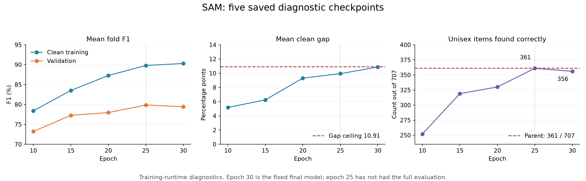

# SAM result review — 6 September 2026

SAM reduced the clean training–validation gap enough, but the epoch-30 model
failed **1 of 19 checks**. Keep the completed 04af MixUp 0.2 models as the current
candidate until another model passes the agreed checks.

Mean clean gap fell from **12.91 to 10.86 percentage points**, a reduction of
**2.05 points**. Both folds improved: fold 0 by 1.54 points and fold 4 by 2.57.
The mean target was a reduction of at least 2 points; this cleared it by only
0.051 points.

Pooled validation macro-F1 fell from **80.89% to 79.43%**, still above the
**74% floor**. Mean clean training F1 fell from **93.81% to 90.29%**.
This is a useful reduction in the gap, but it does not show better validation
prediction: all five classes lost F1. Boys lost 2.95 points and Girls 3.22.
There were 45 more total validation errors, across 13,110 images.

The sole failed check was Unisex recall: **51.06% to 50.35%**.
The final model correctly found **356 of 707** Unisex items, versus **361** before.
This is five fewer correct items in total, not a claim that only five individual
predictions changed. The saved paired interval for the overall F1 change was
−2.57 to −0.34 points; repeated model selection is not corrected by that interval.

All 14 retained G2/E6 guards passed, including memory, model size, calibration
and corruption checks. Those calibration limits compare against G2; versus
the direct MixUp 0.2 parent, NLL and ECE still rose. Peak allocated GPU memory
was **476,876,800 bytes**, well below 3 GB. Both recorded training times together
were **19.25 minutes**, including per-epoch validation and periodic clean checks.
Inference latency was about 0.70–0.73 ms per image.

The epoch-25 diagnostics are the most useful next lead. They showed pooled
validation F1 **79.86%**, mean clean gap **9.94 points**, and Unisex recall
**361/707 = 51.06%**. Compared with epoch 30, the training score rose over the
last five epochs while validation F1 and Unisex recall fell. Epochs 15 and 20
had smaller gaps, but their Unisex recall was too low.

I recommend a separate **fixed epoch-25 SAM check**, retaining the original
30-epoch cosine schedule so its first 25 epochs match this trajectory.
Changing the cosine schedule to 25 epochs would be a different recipe.
Save the epoch-25 weights and run the same full evaluation. The current
epoch-25 scores use the training runtime; they have not had matched IEEE
evaluation or the full corruption checks. The weights were not saved.
This lead was found after inspecting validation scores, and is not a new
independent test. Do not relabel the completed epoch-30 run as a pass.

This review recomputed the 19 gate outcomes and both pooled F1 scores from
saved confusion matrices. It verified both folds' SAM and MixUp receipts,
their hashes, clean diagnostic hashes, and canonical training-row contracts:
30 epochs, 6,150 optimizer steps and 12,300 gradient passes per fold.
The local notebook records commit `f0f7fd799f8977bac49cbed9b3bc1a2b804539af`.
The full checkpoint/registry audit and a new forward evaluation were not
repeated during this review. No model was trained or code committed here.

Sources: [saved screen decision](https://drive.google.com/file/d/12xGePvwatSF3ZwUas4fgRgEJkY6-T9vL/view),
[incremental comparison](https://drive.google.com/file/d/1MTfxK0u4HrOLRhjI1olLdVh821rfuMMX/view),
[fold 0 diagnostics](https://drive.google.com/file/d/1CFDdbPWvwqoZpYpc7XctI1qektSe510k/view),
[fold 4 diagnostics](https://drive.google.com/file/d/1U9uyovWBkab5aQa9wHLJEc8urUShT6-C/view).
Local copies, training receipts, `epoch_summary.csv`, `verified_summary.json`
and the analysis script are saved beside this review.
