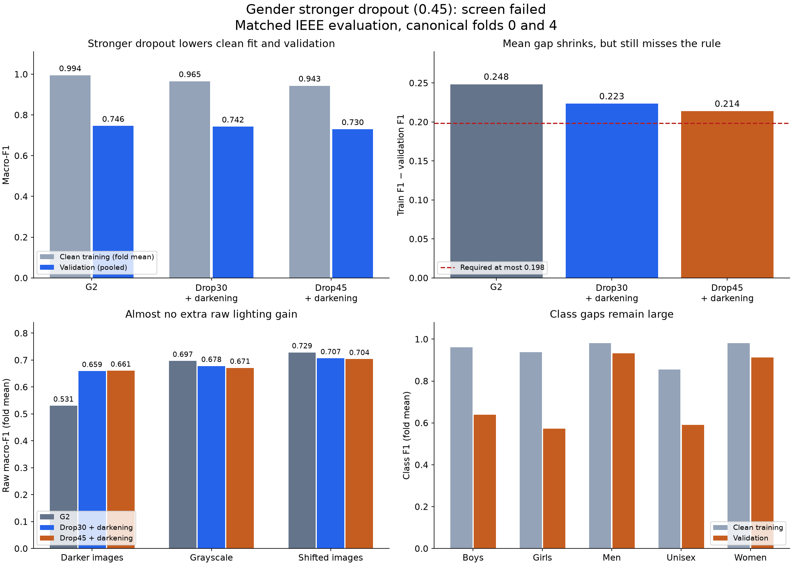

# Gender stronger-dropout result

**Decision: fail. Do not promote the 0.45 model or expand its folds.**
The code completed both runs correctly. Raising dropout from 0.30 to 0.45
reduced clean training fit, but also reduced validation F1. It did not fix the
remaining gap or grayscale weakness, and it added failures for class scores
and the validation uncertainty rule. Mild darkening was held fixed.

| Matched model | Clean training F1, fold mean | Validation F1, pooled | Gap, fold mean |
| --- | ---: | ---: | ---: |
| G2 | 0.993865 | 0.745726 | 0.248385 |
| Dropout 0.30 + darkening | 0.965007 | 0.742180 | 0.223359 |
| Dropout 0.45 + darkening | 0.943172 | 0.729580 | 0.213765 |

The gap is the mean of the two within-fold differences. It is not training
fold-mean F1 minus pooled validation F1. Training scores above come from clean
evaluation with dropout disabled, not the lower online scores logged during fit.

## Four of nineteen checks failed

All thresholds remain the ones declared before training.

| Failed check | Result | Required |
| --- | ---: | ---: |
| Validation difference versus G2, paired 95% lower bound | −0.031843 | ≥ −0.030 |
| Mean gap reduction versus G2 | 0.034620 | ≥ 0.050 |
| Pooled class F1 difference versus G2 | Boys −0.032182; Girls −0.025912 | Every class ≥ −0.020 |
| Grayscale induced-change difference versus E6 | −0.022206 | ≥ −0.020 |

The actual mean gap must be at most 0.198385; it is 0.213765. Pooled validation
loss versus G2 is 0.016146 and passes the point-score rule, but its paired lower
bound fails. Fold 0's validation difference is −0.029347, close to the −0.030
limit. Memory, parameter count, confidence metrics and the other corruption
rules pass. Recorded training peak GPU memory is about 0.475 GB on each fold,
with 390,181 parameters. Each fit took about 8.5 minutes.

## What the dropout change did

Against the direct 0.30-plus-darkening parents, pooled validation F1 falls by
0.012600. Its paired 95% interval is [−0.029126, +0.003571], so these two folds do
not establish a consistent population-level loss. They do not show a benefit.

Mean clean training F1 falls by 0.021835; mean validation F1 falls by 0.012241.
Only 0.009594 remains as gap reduction. Fold 0's gap improves by just 0.000124;
fold 4 improves by 0.019064. Boys and Girls lose 0.032237 and 0.023111 pooled F1
against the direct parents. Boys' mean class gap increases to 0.323419.

The reported induced corruption changes all improve versus the direct parents.
That does not mean corrupted-image scores all improve: a lower clean baseline
can make the drop under corruption look smaller. Raw fold-mean dark-image F1
barely changes, 0.659267 → 0.660615. Grayscale falls 0.678156 → 0.671145, shifted
images fall 0.706693 → 0.703681, and brightened/JPEG scores also fall.

I would return to 0.30 plus darkening as the research starting point. It also
fails the acceptance rules. This result gives no reason to increase dropout
again. Before another recipe, inspect errors for Boys/Girls and grayscale to
identify a specific weakness that the next single change should address.

## Verification

The local review recomputed all 19 checks and both 10,000-draw paired bootstrap
comparisons from saved probabilities. The results match the saved decision.
It checked 8 source bundles, 72 evaluation-file hashes, 524,384 prediction rows,
the canonical split, 32,773 development-image hashes, parent links, training
configuration, precision evidence and evaluation-code hashes at the notebook's
recorded commit `1caa1fa55f9b2489484b9d958a3080af1965687f`.

No training or fresh inference ran here. Checkpoints were hashed, not loaded.
GPU timing and memory are saved measurements, not new local measurements.
The six G2/E6 source bundles on folds 1–3 were not independently rechecked in
this review. Two reused development folds do not remove model-selection bias
or provide independent final-test evidence.

- [Saved Drive results](https://drive.google.com/drive/folders/1fDdr73rZXal1Xofl2P0yFf-75Pmby7yV)
- [Verification record](verified_review.json)
- [Recomputed checks](recomputed_decision.json)
- [Fold scores](verified_folds.csv)
- [Class gaps](verified_class_gaps.csv)
- [Raw corruption scores](verified_robustness.csv)
- [Review script](review.py)

