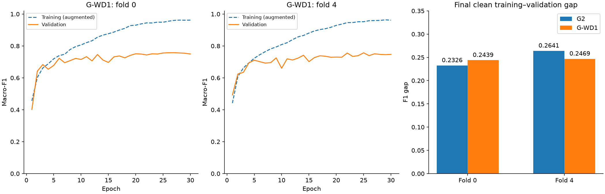

# G-WD1 weight-decay screen review

**The screen failed. Do not continue this candidate to folds 1–3.** Both screen folds completed 30 epochs from scratch with AdamW weight decay 0.01, G2 translation and no G-D1 darkening.

Pooled validation macro-F1 rose from **0.745726 to 0.748670**, a gain of only **0.002944** against the required 0.010. The paired 95% interval is **−0.010379 to +0.016240**. This is uncertain improvement, not proof of harm or reliable improvement.

Overfitting remains:

- Fold 0: final clean training F1 **0.993554**, validation **0.749616**, gap **0.243938**. Its G2 gap was 0.232649; this fold got worse.
- Fold 4: final clean training F1 **0.994164**, validation **0.747261**, gap **0.246902**. Its G2 gap was 0.264122; this fold improved.
- Mean gap: **0.248385 → 0.245420**, a reduction of **0.002965**, versus the required 0.030. Training performance stayed almost perfect.

Six rules failed: pooled validation gain, paired lower confidence bound, fold 0 validation loss, fold 0 gap growth, mean gap reduction, and dark-image robustness relative to E6. The dark-induced difference against E6 was **−0.057456**, beyond the allowed −0.020.

Memory passed at roughly **0.478 GB**. Training took **490.6 and 500.6 seconds** (about 8.2–8.3 minutes per fold). Speed is recorded without a cap. The result failed on predictive quality and the intended overfitting reduction, not resources.

The training curves use online augmented-training scores. The gap bars and numbers above use the same final checkpoint evaluated separately on unchanged training and validation images. These two training measurements must not be confused.

## Verification

All ten source bundles (five G2 and five E6) and both G-WD1 bundles passed the existing registry, configuration, lineage, split, label, checkpoint-byte, prediction-hash, history, metric and robustness checks. The saved source audit agrees with the verified source hashes and actual 0.01 configuration. Both saved aggregate CSV files agree with the per-fold predictions and metrics.

The screen decision was independently recomputed using 10,000 paired whole-family draws within folds, seed 2753. It agrees with the saved result within 1e−12 floating-point tolerance. No new training or checkpoint inference was performed locally. This remains a two-fold development screen, not independent final-test evidence.

Reproduce with `./.venv/bin/python reports/task3/gender_weight_decay_result_20260905/reproduce.py`. Read `verified_decision.json` and `verified_gates.csv` for every numeric rule. Original downloads are preserved under `gender/` and in `runs.csv`.

## Recommended next step

The consultation task reviewed the results and figure. Its recommendation is to reject G-WD1 and stop guessing new Gender settings for now. I agree: finish the comparison table and eligible-model decision, preserve each failed experiment, then perform only the required confirmation/refit and sealed evaluation under a fixed method.

The useful report finding is that different changes helped different things: a smaller architecture reduced the gap without improving validation, early stopping helped slightly, darkening improved dark-image robustness, and stronger weight decay barely changed training fit. These results do not establish an unavoidable label ceiling or prove that every stronger regularisation method would fail.

No additional training or confirmation was started during this review or consultation.
