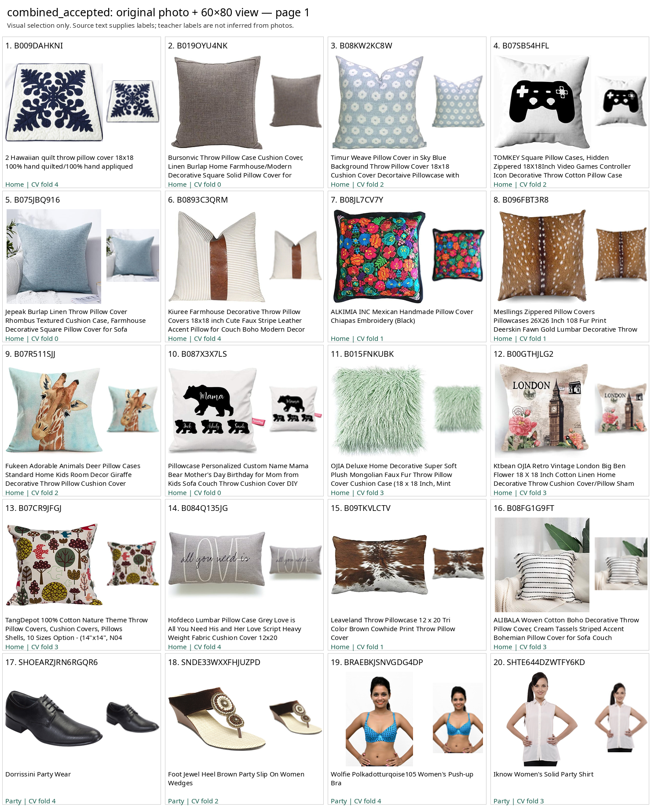
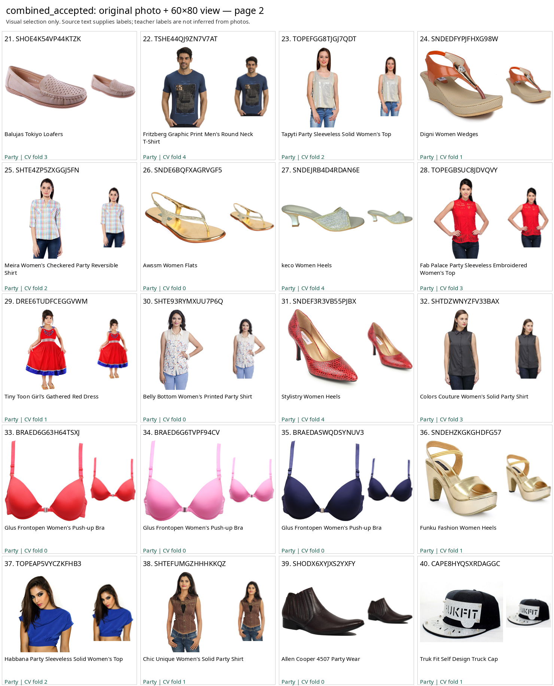
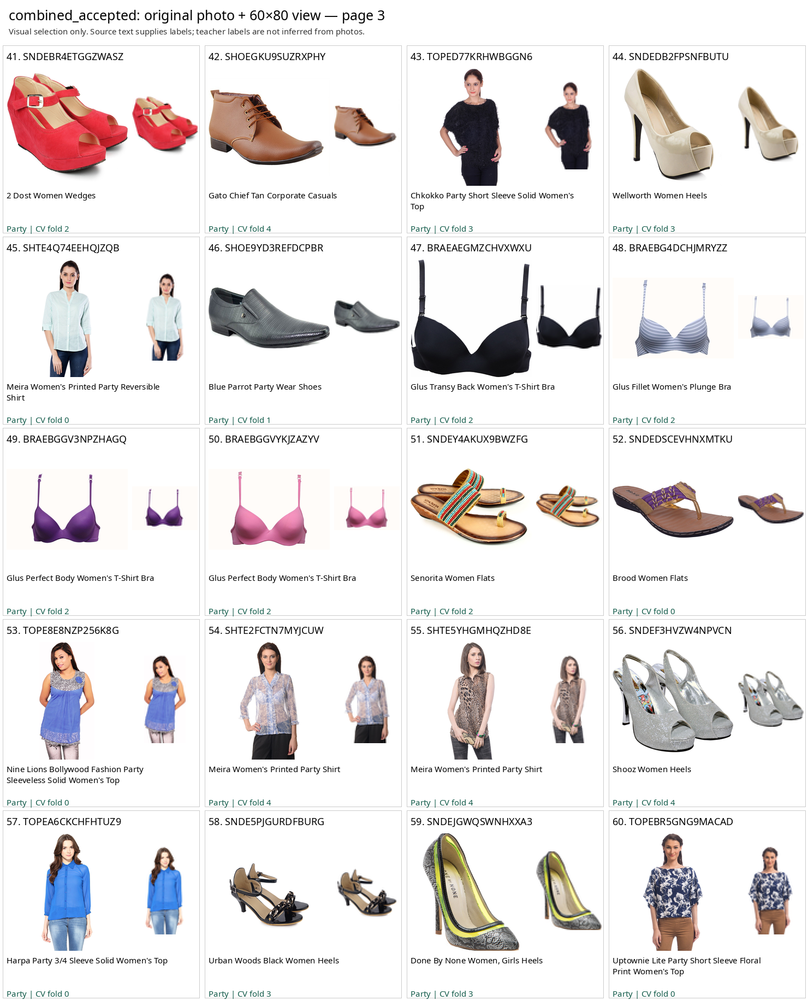
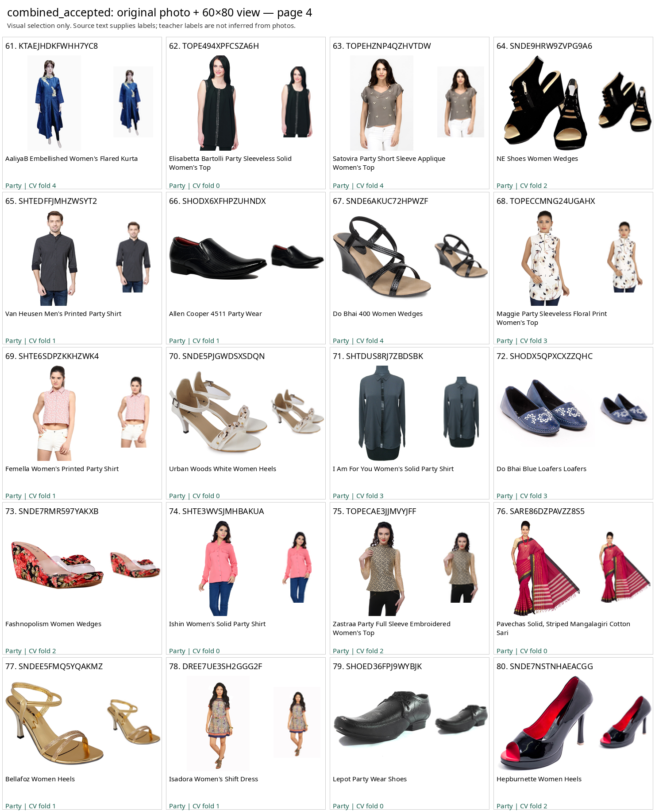
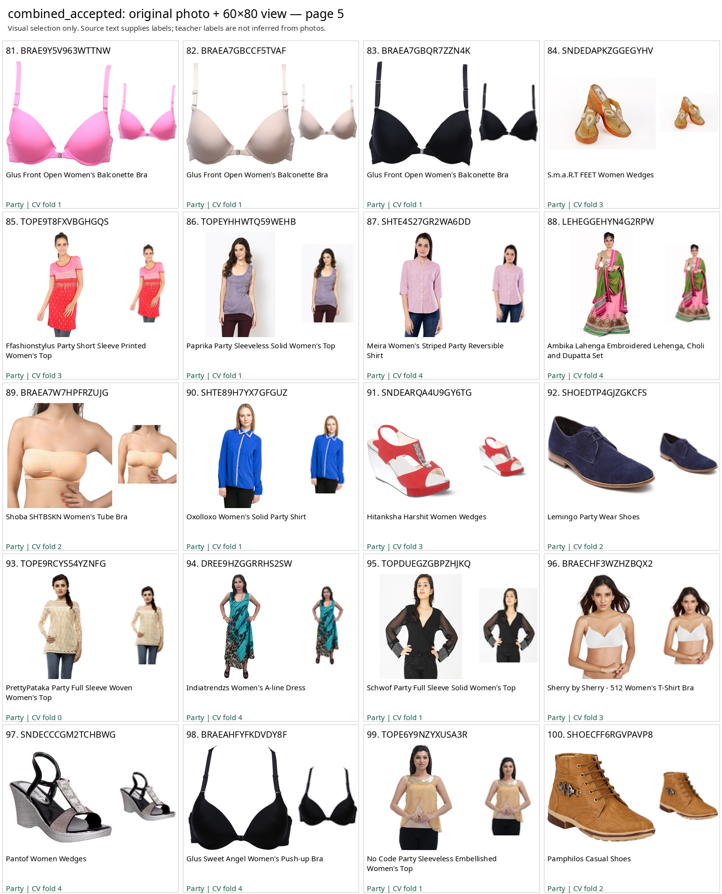
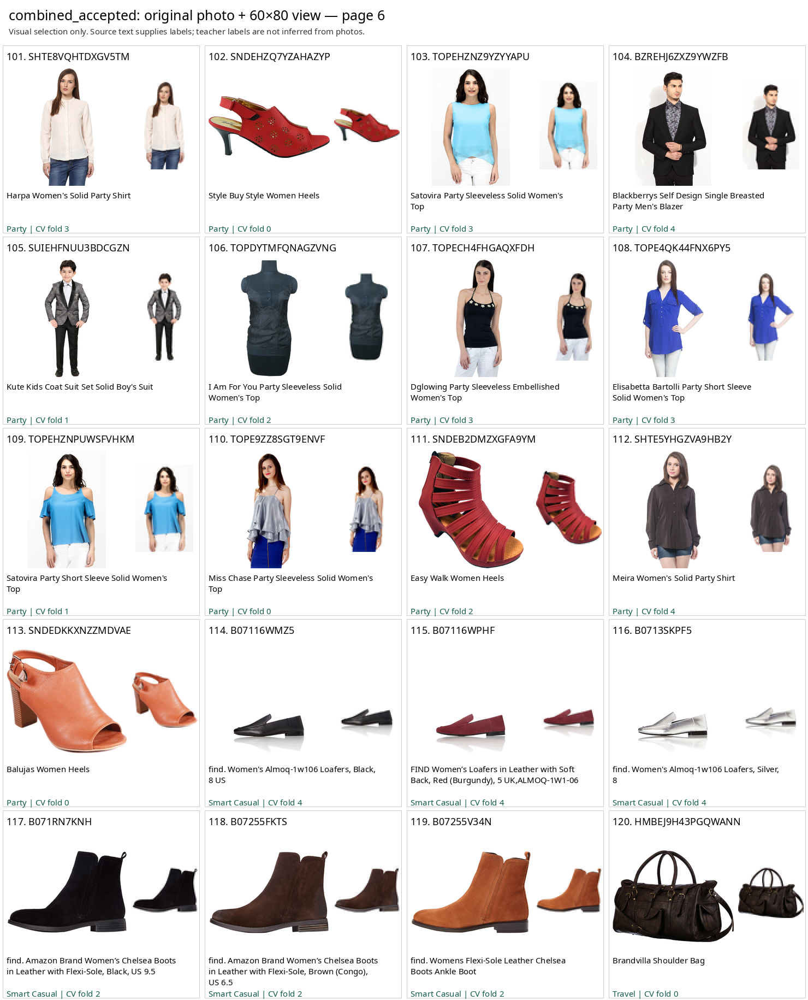

# All accepted images

Each row shows the original photo and the actual saved 60×80 PNG enlarged 2×. Names and labels come from the source. All 120 prepared images were visually inspected. Captions show their fold in the combined teacher + rare-class dataset. See [source attribution](ATTRIBUTION.md) and [the intake summary](README.md).

## Page 1

## Page 2

## Page 3

## Page 4

## Page 5

## Page 6

