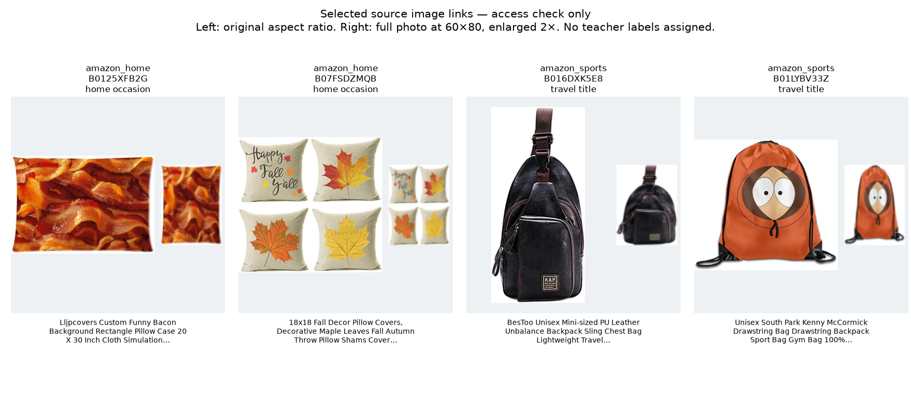
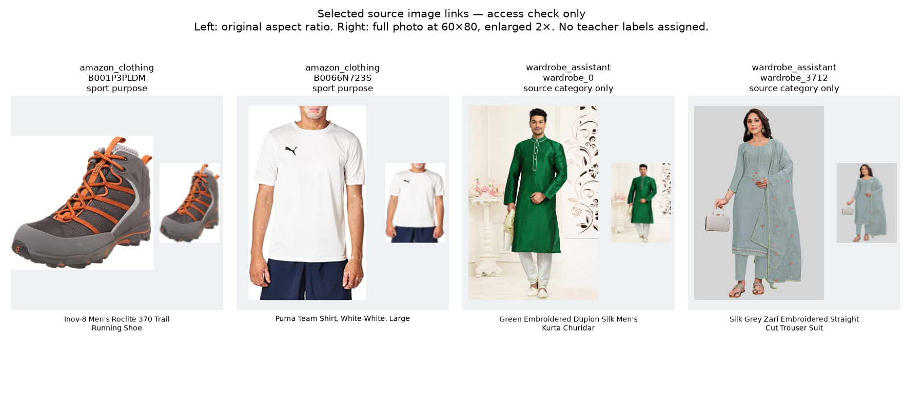

# Product catalogue checks

5 September 2026. **ABO and Amazon provide existing item-level seller evidence. The strength of that evidence varies by field.** No teacher label was assigned, no training occurred and no selected image was checked for teacher overlap in this search.

## Bounded metadata evidence

The [Amazon Reviews 2023 publisher](https://amazon-reviews-2023.github.io/) provides category files with `parent_asin`, product `images`, `categories`, `details`, `features` and `description`. Product rows were read directly from the [publisher's HF files](https://huggingface.co/datasets/McAuley-Lab/Amazon-Reviews-2023/tree/main/raw/meta_categories); no publisher Python loader was executed. Each category request used HTTP Range for bytes 0–7,999,999 and returned HTTP 206. The partial final line was excluded. These prefixes are a discovery sample, not random or complete category coverage.

| Exact saved scope | Complete rows | Unique product IDs |
|---|---:|---:|
| Clothing, Shoes and Jewelry: first 8 MB | 2,797 | 2,797 |
| Home and Kitchen: first 8 MB | 2,191 | 2,191 |
| Sports and Outdoors: first 8 MB | 2,789 | 2,789 |
| ABO: complete `listings_0.json.gz` shard, 5,446,000 bytes | 9,232 | 9,223 |

ABO has sixteen metadata shards. Only shard zero was examined; its nine repeated item IDs are not extra products. The [official ABO release](https://amazon-berkeley-objects.s3.amazonaws.com/index.html) provides multilingual names, bullet points, product types and image IDs. The saved raw files, fetch headers and SHA-256 hashes are in `raw/`; [metadata_audit.json](metadata_audit.json) records the scope and key counts. [term_hits.csv](term_hits.csv) is deliberately broad retrieval evidence, not a label file.

## Home: exact seller occasion on the relevant product type

Seven Amazon rows have leaf category `Throw Pillow Covers` and exact case-insensitive `details.Occasion=Home`. All seven have image references. IDs: `B089NRXL87`, `B0893C3QRM`, `B09TKVLCTV`, `B08SL2Y8X3`, `B0125XFB2G`, `B084Q135JG`, `B07FSDZMQB`. This is a closer semantic match than assigning Home to every household object or an at-home outfit. It still does not prove that the seller and teacher use the same policy.

The source also uses Home for curtains, glasses, candles and other unrelated products. Those do not pass the narrow cover rule. Seven is a verified count in this prefix, not a population estimate, family count, or number of clean training images.

Visual caution: the two deterministic cover samples show a flat bacon-print design and a four-cover collage. An existing Home label therefore does not guarantee a useful single-product photo. The preview exposes an image-selection issue before training; no image label was changed.

## Smart Casual: two existing ABO seller bullets

Products `B07255FKTS` (women's Chelsea boot) and `B0727R3L19` (women's loafer) have a standalone original English bullet `Smart casual`. These are **two product IDs in the inspected shard**, not all ABO support. Both main images were resolved through the official image index and downloaded successfully. [Exact joins, images and licence record](../travel/ABO_ACCESS.md).

This is merchant style text, not a teacher Usage annotation. Neither product supplies a watch example, and the boot's precise teacher article-type match has not been established. Expand by source style evidence and teacher-compatible product types before proposing a class-balancing run. Amazon's clothing prefix adds one sweater with Smart Casual in a broad multi-occasion description; this is weaker than the two standalone ABO bullets. Twelve clothing-prefix products contain Business Casual text, including a watch; Business Casual must remain a separate source phrase.

## Travel: bag-purpose clues, with mixed uses preserved

Sixteen Amazon rows match an observed bag leaf category and contain both a Travel word and a bag-type word in the original title. Their category leaves include daypacks, sports duffels, handbags and equipment bags. Known accessory leaves such as handbag organisers, rain covers and sleeping mats are excluded. The narrow rule still does **not** establish equivalence to teacher Travel or an exact article-type assignment.

Many titles also say Sports, Gym, Casual or Beach. Keep that evidence; do not reduce a list of uses to one preferred label. The ABO example `B07PGMRKSC` is explicitly named `AmazonBasics Casual Travel Backpack, Grey`, showing the same issue. The two Amazon bag image probes and this ABO backpack all decoded. The Amazon samples show a sling bag and a cartoon-print drawstring bag; this is access evidence, not proof of Travel use.

No exact Travel occasion on a matching bag was verified in these prefixes. Travel is still weaker than the Home lead. Exact Travel fields seen on mugs, bottles and tents do not solve the teacher's bag class.

## Sports and Ethnic: useful existing auxiliary labels

Eleven Amazon clothing/footwear products have a populated `Sport Type` or `Sport` field and pass the recorded clothing/title rule; `Fan Shop` rows are withheld. Existing fields include Running, Tennis and Cycling. Two deterministic images decoded: a trail-running shoe and a worn Puma shirt. This can support a separate sport-purpose task. It does not mean that every product in the Sports and Outdoors category is teacher Sports.

Wardrobe Assistant's 338,595-byte archive contains 5,443 CSV records and no bundled images. There are 3,596 men's and 974 women's Ethnic category rows, giving 4,570 rows. All 5,443 image URLs have host `assets2.andaazfashion.com`; source pages use Andaaz's UK/US domains. This narrows the publisher's broad multi-platform description: **the inspected release points to one retailer family**. Two selected male/female image URLs decoded and show models wearing multi-piece ensembles. The creator's categorical labels already exist, but their construction method is not documented. The source occasions are combined labels such as Wedding/Formal and Party/Festive. Keep them unchanged; do not map all labelled ethnic garments to a single teacher occasion. [Publisher](https://www.kaggle.com/datasets/shahzaibmalik44/wardrobe-assistant), [metadata counts and limits](../home_na/findings.md).

## Image access and visual check

The eight selected Amazon/Wardrobe URLs were source-listed main images, chosen before access results were known: two per Amazon rule and one per Wardrobe Ethnic category. All eight returned valid images under a 1 MB per-image cap. The three ABO probes also passed, giving **11/11** in the combined purposive sample. This is not an availability estimate for either full dataset. Hashes, dimensions and exact URLs are saved in [image_access.json](image_access.json) and [ABO access evidence](../travel/abo_access/access_evidence.json).

All eight images above were visually inspected. The original aspect ratio is beside the same full-photo 60×80 resize used in the earlier audits. Clothing detail is small in the full-body Wardrobe pictures. Product-only photos, collages, printed artwork and whole outfits should not be treated as one uniform image source. No new human annotation or automatic teacher relabelling was done. Source image/text ownership remains with the respective rights holders; preview changes are resizing and layout only.

## Access, reuse and next check

ABO's actual root and image release files declare [CC BY 4.0](https://amazon-berkeley-objects.s3.amazonaws.com/LICENSE-CC-BY-4.0.txt), with attribution to Amazon.com and the dataset creators. The AWS catalogue has a conflicting noncommercial label; the accompanying actual release is preserved. Amazon Reviews'23 has public files, but no explicit blanket reuse licence was found in the checked publisher card. Do not describe public download access as unrestricted image redistribution permission. Wardrobe's publisher declares CC BY-NC-SA 4.0; its retailer-photo reuse basis and annotation provenance remain unresolved.

The useful next work is a bounded full-ABO metadata scan and a larger targeted Amazon metadata scan, preserving exact original field evidence, sibling products and image identity. Follow with a small image-intake audit, including overlap checks against all teacher image roles. Wardrobe needs a clearer label/provenance basis before a training plan. Current files are research evidence, not an admitted training manifest.

Reproduce the cached checks with `./.venv/bin/python reports/task3/targeted_dataset_search_20260905/catalogue_probe.py` and `./.venv/bin/python reports/task3/targeted_dataset_search_20260905/catalogue_candidates.py`. Existing cached downloads are hash-verified; no network request is made for those files. `qualified_metadata_candidates.json` contains original evidence, and every row explicitly has `teacher_usage_assigned=false`.
