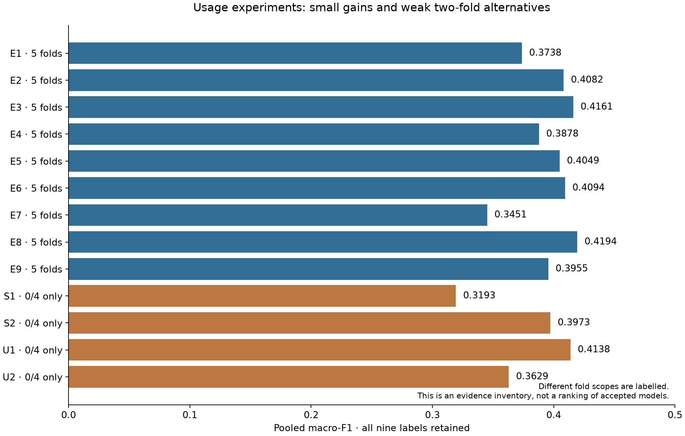
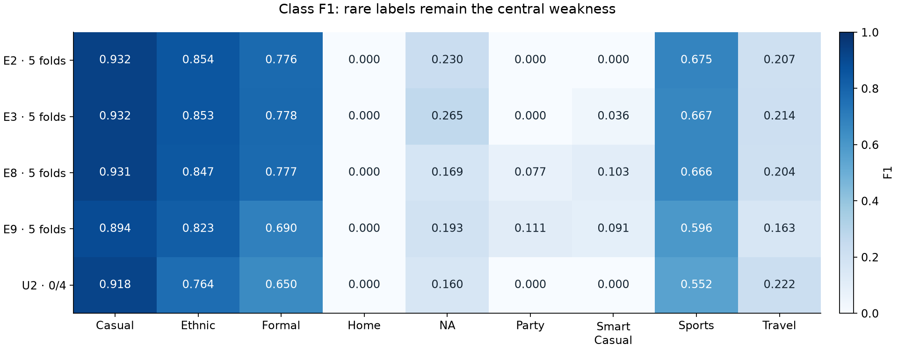
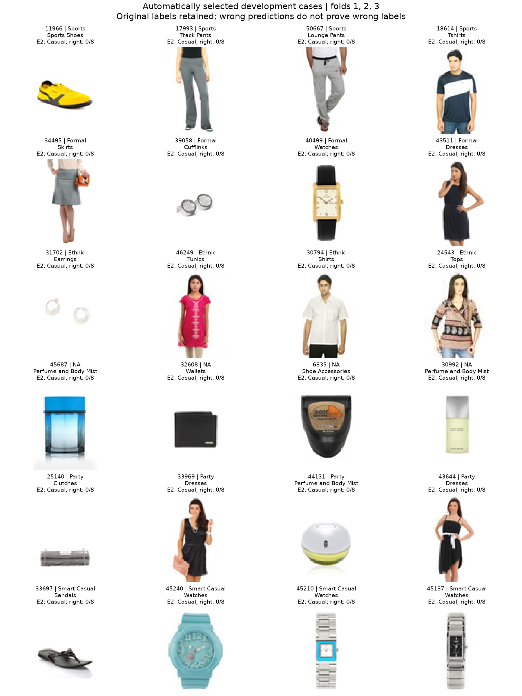
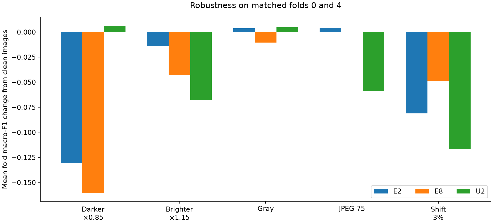
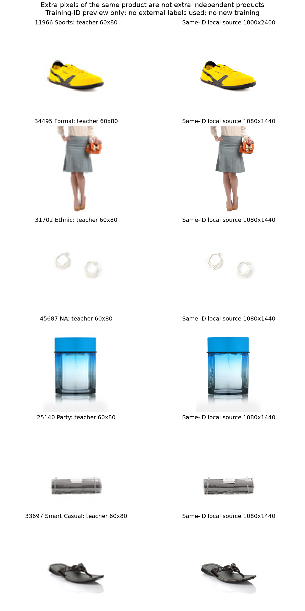

# Usage: what failed, what remains useful, and the next tests

5 September 2026. Development evidence only. This is a research record, not the five-page submission report.

**Updated after U3 and user feedback:** the equal E2/E3/E8 probability average is no longer the next test. Its saved clean predictions give 0.423147 macro-F1 over all five folds, versus E2's 0.408171, but that small gain does not establish a fix for overfitting or weak rare-class transfer. The proposed two-stage CNN has now failed as U3; see the [U3 review](../usage_u3_review_20260905/README.md). The next research direction is to check independent data with existing Usage or occasion labels, starting with metadata, label fit, usable rights and teacher-data overlap. No compatible external training set is confirmed. No human image labels are required.

The evidence supports several separate problems: scarce independent rare-class examples, poor transfer from training to unseen families, weak rare-class ranking, sensitivity to small image changes, and a calibration failure in U2. It does **not** establish an unavoidable accuracy ceiling or prove that the teacher labels are wrong.

## Scope and evidence quality

The inventory covers `notebooks/04*`, both local and mirrored run registries, ignored experiment artifacts, prior failure/fit/data/gate reports, and both blind-review forms. It contains **13 Usage experiment families and 53 fold runs**, with exact run IDs in [RUNS.md](RUNS.md) and [run_ledger.csv](run_ledger.csv). Gender-only experiments E10, G1–G3 and later gender screens were checked for scope; they are not additional Usage results. The root registry also contains 155 Usage EDA probe rows, which are distinguished from full model runs in [registry_coverage.csv](registry_coverage.csv).

The analysis reads saved configurations, learning histories, metrics, robustness tables and row predictions. Eleven experiments have local row-level out-of-fold predictions, meaning each row was predicted by a model whose outer training fold excluded it. These were matched to the canonical split and all available pooled scores were reproduced. E1 has registered confusion matrices and histories, but no local full probability vectors. Its pooled F1 was recomputed by summing those matrices; pooled ECE cannot be recovered. S2 has compact saved metrics/configurations/histories, but no local OOF vectors or matching local registry row. E9 registry evidence is in the mirrored registry. U1 has local artifacts and verified OOF scores, but neither inspected registry contains its exact run rows. These gaps remain explicit; no registry was edited.

[input_hashes.json](input_hashes.json) records 243 source hashes. [oof_verification.json](oof_verification.json) records score and row checks. Literal `NA` is one of the nine classes; it is not a missing value. All official scores retain Home. The 367-row blind-review forms contain image inputs, not completed adjudicated labels; their answers are not used or required.

## All Usage experiments

Macro-F1 gives each of the nine labels equal weight. NLL measures the quality of the predicted probabilities; lower is better. ECE measures confidence error; lower is better, but a low ECE alone can hide failure on rare labels.

| Experiment | Main change | Folds | Pooled F1 | NLL | ECE |
|---|---|---|---:|---:|---:|
| E1 | Ordinary cross-entropy SmallCNN | All 5 | 0.373756 | 0.464141 | unavailable |
| E2 | Effective-number class-weighted loss | All 5 | 0.408171 | 0.342839 | 0.033090 |
| E3 | E2 + classifier dropout 0.2 | All 5 | 0.416133 | 0.333413 | 0.026137 |
| E4 | TinyResNet18 | All 5 | 0.387820 | 0.577035 | 0.085430 |
| E5 | Label smoothing | All 5 | 0.404864 | 0.352343 | 0.030508 |
| E6 | Focal loss, gamma 1 | All 5 | 0.409385 | 0.328647 | 0.031840 |
| E7 | TinyConvNeXt18 | All 5 | 0.345094 | 0.447344 | 0.012237 |
| E8 | Random translation up to 2 pixels | All 5 | 0.419393 | 0.329213 | 0.007938 |
| E9 | Balance usual and exceptional type/usage pairs | All 5 | 0.395523 | 0.441548 | 0.012741 |
| S1 | Predicted article-type cascade | 0, 4 | 0.319324 | 0.477592 | 0.043428 |
| S2 | Scratch MicroSwin | 0, 4 | 0.397298 | 0.729627 | 0.101947 |
| U1 | Weight visual duplicate components | 0, 4 | 0.413795 | 0.347426 | 0.035837 |
| U2 | Full-RGB HOG, linear SVM, natural sigmoid calibration | 0, 4 | 0.362932 | 0.399749 | 0.032101 |

The matched E2 reference for folds 0/4 is **0.407319**, NLL **0.342403**, Brier **0.172263**, ECE **0.032938**. Do not rank two-fold models against the five-fold E2 number. Full matched comparisons are in [model_comparison.csv](model_comparison.csv).

## What the failures actually show

### Rare labels have very few independent examples

There are 32,773 development images and 32,772 valid Usage targets. The counts below use the saved product-family groups; families can contain more than one label, so their class counts are not additive.

| Label | Images | Families |
|---|---:|---:|
| Casual | 25,151 | 17,637 |
| Ethnic | 2,183 | 1,351 |
| Formal | 1,949 | 1,016 |
| Sports | 3,346 | 3,020 |
| NA | 61 | 49 |
| Smart Casual | 47 | 37 |
| Travel | 22 | 22 |
| Party | 12 | 10 |
| Home | 1 | 1 |

Home's single image is in fold 4, leaving no Home example in that fold's training data. Repeating an image does not create a new family. With zero Home F1, even perfect performance on the other eight labels would give 8/9 macro-F1; this arithmetic limit does not explain the current score by itself.

E2's F1 averages 0.8092 across the four common labels, but 0.1092 across NA, Party, Smart Casual and Travel. Party, Smart Casual and Home have zero E2 F1. E8 gets one Party true positive and six Smart Casual true positives, while NA F1 falls by 0.0609. Its small overall lead is therefore sensitive to a handful of rare examples. See [macro_f1_gain_decomposition.csv](macro_f1_gain_decomposition.csv).

### The models overfit; more capacity has not fixed that

The mean clean finished-checkpoint training/validation F1 is 0.9291/0.4140 for E3, 0.9762/0.3858 for E4 and 0.9435/0.3962 for S2. E8 narrows that gap to 0.7905/0.4156, but does not solve rare-label learning. S1's small gap, 0.3815/0.3194, mostly reflects weak fitting. A smaller gap alone is not success.

E2's 0.9385 training number is an online epoch score, not a clean finished-checkpoint score. It cannot be used as a like-for-like clean-gap baseline. [fit_summary.csv](fit_summary.csv) labels this distinction and separates pooled F1 from mean fold F1.

### Product type is useful, but leaning harder on it loses exceptions

For E2, error is 6.59% on the 29,394 rows whose Usage agrees with their article type's usual **training-fold** label, versus 48.05% on 3,359 exceptions. Another 19 rows have a type absent from their training fold. This is evidence of a difficult conditional task; it does not prove that every model internally uses type as a shortcut.

E9 changes some of those decisions: against E2 it fixes 700 exception errors and introduces 56, but on usual rows it fixes 452 and introduces **2,880**. Its fold-0 exception/usual weight ratio is about 9.25, on top of the class weights. This is a real tradeoff caused by an aggressive objective, not a new general solution. A 1.5× exception multiplier would be a milder E9 follow-up, not a novel representation. S1's failed type-only cascade also argues against making article type the only path to Usage.

### Duplicates and label ambiguity need different treatment

A fresh decoded-pixel audit verifies all 32,773 development image hashes. There are 541 exact RGB duplicate groups covering 1,193 rows, with **zero mixed-Usage groups and zero cross-fold groups**. Resizing to 60×80 gives the same result. Saved visual-component evidence has 629 multirow components/1,393 rows and no fold crossings. U1's small gain is consistent with duplicate weighting helping a little; duplicates do not explain most failures.

There are 238 product families with mixed Usage labels, covering 1,232 rows. Those are review signals, not established wrong labels: related products can have different intended uses. Do not relabel, delete or smooth them automatically merely because a model disagrees.

Across all eight full five-fold CNNs E2–E9, every model misses 10/12 Party images, 37/47 Smart Casual, 17/22 Travel, 40/61 NA and 531/3,346 Sports. The illustrated cases were selected automatically from folds 1/2/3 and inspected visually. They show small products, thin details and labels that can depend on intended occasion. They do not establish human agreement or a Bayes error bound, which would be the lowest error possible from these inputs.

### Small changes in the input still matter

E8 improves translation tolerance but worsens darkening. On folds 0/4, its induced F1 change relative to E2 is +0.0320 for translation, −0.0296 for darkening and −0.0286 for brightening. U2 improves darkening by +0.1371 but loses −0.0536 on brightening, −0.0630 on JPEG and −0.0355 on translation. A gain on one corruption is not general robustness.

## New U2 mechanism checks

Both saved model pickles and the HOG cache were hash-checked before use. Re-running prediction reproduces the saved probabilities to a maximum absolute difference below 2.8×10⁻¹⁶. All eight solvers converged; an optimizer timeout is not the explanation.

The saved U2 screen fails both admission routes. Its official paired F1 delta is −0.044388, with a whole-family 95% interval of [−0.068875, −0.024391]. Brier worsens from 0.172263 to 0.207364. The non-Home class check and brightening/JPEG/translation checks fail. Its folds take 81.60 and 88.78 minutes wall time, with 1.757 and 1.749 GB peak RAM. Resource limits pass, but nearly three hours of screen work did not buy better validation performance. The narrower error analysis below explains why a low ensemble training gap would be misleading.

| U2 readout | Fold 0 F1 | Fold 4 F1 | Pooled F1 |
|---|---:|---:|---:|
| Argmax of mean raw SVM margins | 0.385324 | 0.430258 | **0.405946** |
| Saved calibrated probabilities | 0.382163 | 0.338802 | **0.362932** |

Two of eight Party sigmoids have a reversed slope. Their calibration sets have only two or three positive rows, from one or two families. This makes unstable calibration plausible and demonstrates a damaging change in the saved decision rule. Raw margins are not well-calibrated probabilities and are not a replacement model that passes the gates. Their rare-label decisions still never predict Party or Smart Casual.

Before calibration, the base SVMs average **0.8361/0.8326 training F1** across outer folds 0/4, versus **0.3735/0.3609** on their inner held-out fold. The gaps are roughly 0.463 and 0.472. U2 therefore still overfits substantially. Its reported ensemble training F1 near 0.54 mixes base-fit and calibration exposure, masking this pattern.

The earlier balanced EDA probe is not U2: it used a standardized SGD logistic classifier with balanced class weights on a selected 4,878-row evaluation population. Its F1 is 0.4541, versus E2's 0.4090 on those same IDs. On the 1,934 IDs shared with U2, that probe gives 0.4783 versus U2's 0.3322. Different estimator, calibration, sampling and feature-contract history prevent attributing the gap to one cause. The old `92b53b…`/`da1880…` contract discrepancy also remains unresolved. U2 uses verified `74cb33…` features. Re-running the old probe under a verified contract would be a new bounded experiment, not proof that HOG already wins.

U2 uses 1,944 HOG features; RGB channel selection in HOG is not a separate rich colour-histogram representation. Each base SVM learns on three canonical folds and calibrates on one, whereas each CNN trains on four. That exposure difference also limits a pure HOG-versus-CNN causal claim.

The other saved view probes also constrain preprocessing choices. All ten available Usage OOF files were checked against canonical IDs, folds and labels; eight match the current view artifact's recorded hashes. On the same selected 4,878 rows, full RGB HOG gives 0.4541 F1, foreground masking 0.4440, grayscale 0.4314, foreground letterboxing 0.4276, silhouette 0.3646, border HOG 0.3239, colour summary 0.3069 and global geometry/colour 0.2802. Removing background or colour is therefore not an observed upgrade in this probe. The border score signals possible nuisance information, but borders can contain product pixels, so it does not prove background causality. Two older files, `foreground_hog` and `nuisance_only`, are outside the current artifact hash list and remain marked as historical. Exact scores and all 155 historical probe run IDs are in [eda_view_comparison.csv](eda_view_comparison.csv) and [eda_probe_run_ledger.csv](eda_probe_run_ledger.csv). Matching artifact bytes does not resolve the higher-level contract discrepancy described above.

The saved neighbourhood test has 423 fold-0 Usage queries and 1,096 reference rows, with no same-family neighbours. Top-one label agreement is 0.7305 for HOG, 0.7045 for raw pixels, 0.6927 for Fisher features and 0.5130 for scattering features. This supports HOG as a useful diagnostic representation; it is a small retrieval probe, not a full classification comparison or evidence to replace the failed screen's scores.

## Cheap decision tests completed here

No model was fitted and no threshold or blend weight was optimized. The prior sensitivity check was recorded before running it. All results remain development diagnostics after substantial prior use of these folds.

| Fixed operation | Scope | F1 | NLL | Meaning |
|---|---|---:|---:|---|
| Mean E2 + E3 probabilities | All 5 | 0.418203 | 0.315506 | Some complementary errors |
| Mean E2 + E8 | All 5 | 0.412454 | 0.309177 | Better probabilities, small F1 change |
| Mean E3 + E8 | All 5 | 0.418999 | 0.309544 | Similar limit |
| Mean E2 + E3 + E8 | All 5 | **0.423147** | **0.303244** | Best lead in this fixed diagnostic set |
| Mean E2 + U2 | 0, 4 | 0.414585 | 0.313646 | Modest complementarity; expensive U2 |
| Mean E2 + E9 | All 5 | 0.418062 | 0.337421 | Some useful E9 decisions survive averaging |

The three-CNN average gains 0.014976 F1 over E2. A 10,000-draw paired whole-family bootstrap, stratified by canonical fold, gives **[0.002979, 0.028875]**. NLL improves 11.55%, ECE is 0.011632, and the largest non-Home class loss is Travel at −0.006897. On folds 0/4 it gives **0.431462**, with delta interval **[0.001294, 0.054828]** and an 11.97% NLL improvement. These intervals do not remove selection bias. The average still has zero Party F1, and corruption inference is outstanding.

Multiplying class probabilities by `(training Casual count / training class count)^0.25`, leaving Home unchanged and renormalizing, gives F1 **0.414989 / 0.407900 / 0.395893** for E2/E3/E8 respectively. It helps one model and harms two; NLL worsens in all three. A blanket rare-class boost is not a reliable cure. Low rare-class average precision and top-two recall in [class_ranking_diagnostics.csv](class_ranking_diagnostics.csv) also show that thresholding alone cannot be assumed to solve the task.

## Additional images: useful routes and false leads

The local high resolution Fashion Product Images archive contains 44,441 image IDs: 32,773 development, 5,778 holdout, 61 quarantine and 5,829 teacher prediction IDs. **Zero IDs are outside those teacher roles.** This is an ID inventory, not a full cross-source pixel audit. Only six development examples from folds 1/2/3 were opened for a resolution preview; external labels were not read.

Higher resolution preserves more edges and small details. It gives additional views of the same products, not independent examples. A model trained on high resolution alone would also face a train/test input mismatch because teacher inference remains 60×80. A future scratch two-view or distillation experiment would need a low-resolution inference path and strict exclusion of all validation/holdout/test counterparts from training.

| Source | Useful existing labels or views | Decision |
|---|---|---|
| [iMaterialist 2018](https://github.com/visipedia/imat_fashion_comp) | Wish item images; named party, casual and formal dress categories, plus athletic categories | Best targeted metadata scout. Restricted type/occasion labels are closer to the problem; rules and live URL coverage still need verification. |
| [ABO](https://amazon-berkeley-objects.s3.amazonaws.com/index.html) | Product names, style/material fields, multiple catalogue views | Scout explicit seller occasion text only. No verified native nine-class Usage target. |
| [Fashionpedia](https://github.com/cvdfoundation/fashionpedia) | Garment parts, attributes and masks | Auxiliary attribute/crop learning, not direct Usage labels. |
| [DeepFashion2](https://github.com/switchablenorms/DeepFashion2) | Categories, identity, landmarks, shop/customer pairs | Auxiliary representation; access conditions and scale make it a later option. |
| [SFS](https://zenodo.org/records/833051) | Outfit-level user occasion/style tags | Metadata first; outfit labels do not directly label each product. |
| [Fashion32 paper](https://arxiv.org/html/1912.06227v1) / [FashionRec derivative](https://huggingface.co/datasets/Anony100/FashionRec) | Outfit occasion information; later repackaging exists | Raw label lineage and reuse permission are unresolved. Not ready for ingestion. |
| [FashionKE](https://github.com/mysbupt/FashionKE) | Occasion context | Repository states data cannot be released because of user authorization. Not an actionable source. |
| [GarmentIQ](https://www.kaggle.com/datasets/lygitdata/garmentiq-classification-set-nordstrom-and-myntra) | Garment type, Myntra/Nordstrom images | No direct occasion labels; Myntra overlap is a concern. |
| [Second-hand clothing dataset](https://zenodo.org/records/12518734) | Several views and garment properties | Its `usage` means reuse/repair/recycling routes, not the teacher's occasion labels. |

Access and licence details are recorded in [SOURCES.md](SOURCES.md). No source has yet been verified to supply compatible, independent, reusable examples for all nine classes. Large-scale scraping, model-generated occasion labels and arbitrary garment-to-occasion mappings would add uncertain targets rather than verified supervision.

The assignment allows collecting additional data, provided the evaluator can access it. It requires submitted models to be trained from scratch; pretrained external systems are comparison benchmarks only. The current repository decision `0015` is narrower and keeps Tasks 1–3 teacher-only. A future external-data run needs a documented source-contract extension before training. This investigation changes neither that contract nor the canonical split. See the assignment PDF, pages 4 and 6, and [source details](SOURCES.md).

## Original experiment ranking and stopping rules — superseded

This section preserves the plan made before U3 ran. It is historical: the user declined item 1, item 2 has failed its two-fold screen, and item 3 is the current research direction. Follow the updated status above and the U3 review for next steps.

### 1. Finish the fixed three-CNN average check — first experiment

This has the strongest immediate evidence and requires zero training. Freeze E2/E3/E8 with weights exactly 1/3 each. For each canonical fold, use only that fold's saved checkpoints, full 60×80 images and saved training normalization. First reproduce each clean OOF probability table within a declared numerical tolerance, then average **probabilities per image**, including for each of the five corruptions. Do not average the saved corruption F1 scores.

[next_experiment_plan.json](next_experiment_plan.json) fixes the configuration, numerical reproduction tolerances and gates. All six screen checkpoints already match their registry hashes. The inference and corruption outputs still need to be produced in the existing PyTorch runtime.

Start on folds 0/4, using all 13,110 rows, then finish the other folds if it passes. Keep exact run IDs and checkpoint hashes in a derived-evidence manifest. No training registry row should be fabricated for a prediction-only operation. Record latency and peak memory for three sequential model forwards per batch. Initial cap: 30 minutes for the two-fold inference screen, 7 GiB RAM, batch size 128; benchmark the first 256 rows and stop if the projected cost exceeds the cap. No grid search over models or weights.

Reuse the existing Usage numerical rules: F1 at least **0.417319** with a positive family-bootstrap lower bound; or F1 at least **0.402319** with at least a 10% NLL/Brier improvement or 25% improvement in a properly matched clean training gap. Also require ECE ≤0.05; each non-Home F1 delta ≥−0.03; rare prediction counts ≤5× support, pooled and per fold; and each mean corruption-induced delta relative to E2 ≥−0.02. The clean evidence satisfies the score/probability routes, but missing corruption evidence prevents acceptance. These rules do not borrow gender's three-point allowance. U2's forced-zero Home output was specific to that SVM's unsupported-class policy; CNN diagnostics keep their nine-class probability vectors intact.

If it passes, it is a useful development candidate, with about three times one-CNN inference work. If it fails, record the failed corruptions and stop blend tuning. The local `.venv` currently lacks PyTorch (`ModuleNotFoundError`), so this inference check was not run here; use the existing training runtime rather than downloading a new large stack during this investigation.

### 2. Two-stage SmallCNN — first new training method

Hypothesis: applying strong rare-class weights throughout feature learning encourages memorizing a tiny set of products. Learn general visual features first, then rebalance only the final decision layer. This is motivated by [Kang et al.'s decoupled training study](https://arxiv.org/abs/1910.09217), not evidence that it will work on this dataset. Prior adjustment targets balanced error rather than macro-F1, which also cautions against assuming it directly optimizes this score. [Menon et al.](https://arxiv.org/abs/2007.07314)

Freeze the following configuration before training: canonical folds 0/4; seed 2753; scratch SmallCNN channels 32/64/128/256; 60×80 full RGB; batch 128; no augmentation, dropout or external labels. Stage A: 30 epochs, ordinary cross-entropy, AdamW LR 0.001, weight decay 0.0001, cosine schedule to 0.00001. Stage B: freeze the feature extractor **and batch-normalization statistics**, cache only outer-training features, reset the nine-output linear classifier with a recorded seed, and train that head for 10 fixed epochs with E2's effective-number loss, beta 0.999/cap 5. Use a fresh AdamW optimizer and the same LR endpoints. Each row appears once per epoch; no simultaneous weighted sampler. All normalization and class counts come only from outer-training rows.

Save Stage A and Stage B checkpoints and clean training/validation predictions. Stage A is a mechanism control, not a second tuned candidate. The scored candidate is always the final Stage B checkpoint. This tests a two-stage policy; it does not isolate every part of that policy. Do not add per-class sigmoid calibration or tune a temperature on outer validation. A head-only inner split is not honest calibration if the backbone has already seen that inner fold.

Use the score, class, prediction-count and five-corruption checks above. A smaller gap is accepted only with the score floor and matched clean E2 evidence; that evidence is currently missing. Set a hard 90-minute/7-GiB limit per fold, including evaluation, and register every training run through `fashion.train.registry`. E2's observed training time averages 7.81 minutes per fold on its recorded hardware; roughly 10–20 minutes per fold is a planning estimate for this test on similar hardware, not a measured runtime here. Add no folds or seeds if the screen fails. If it passes, fix the method before five-fold development confirmation. The untouched holdout remains for the final locked judgement, not the next tuning round.

### 3. Targeted metadata scout, then a small external pilot

Start with iMaterialist's released label map and training metadata. Use its party versus casual dress categories; treat formal dresses as their own auxiliary label. Do not equate cocktail dresses with every Party product, suits with every Formal product, or pyjamas with Home. Preserve source labels in an auxiliary task first. This avoids pretending that two taxonomies are identical.

Metadata-only cap: 100 MB and 30 minutes. Produce a licence/access record, candidate counts, label conflicts, product/URL groups and a deterministic selection manifest. Stop if reuse conditions cannot be verified, image URLs are inaccessible, or fewer than 100 independent candidates remain for either dress group. This is a feasibility threshold, not a statistical guarantee. ABO seller text is the fallback scout; only explicit occasion fields/text may create weak auxiliary labels, with unmatched records excluded automatically.

If feasible, plan at most 2,000 external training images, ≤1 GB, with source IDs, checksums, URLs and exact mapping rules. Automatically exclude exact and near duplicates of **every** teacher role using IDs and the established duplicate audit; keep external families together. The teacher validation set, labels, preprocessing and canonical fold assignments stay unchanged. Build a fold-aware auxiliary training manifest governed by those exclusions; do not create another teacher split. Train all learned components from scratch. Compare a same-budget teacher-only control against the external auxiliary treatment, then score only on canonical teacher validation. Apply the same gates. No person needs to label, review or approve individual pictures.

### Later, only when the preceding evidence justifies it

| Idea | What would be new | Why it is lower priority |
|---|---|---|
| Joint article-type/Usage CNN with a direct Usage head | Training-only auxiliary supervision, no predicted-type bottleneck | Could help features, but could strengthen the type shortcut; S1/E9 caution against assuming a win. |
| Scratch high/low resolution paired training | Transfer detail into a 60×80 inference model | Existing archive adds views but zero new product IDs; more compute and source-contract work. |
| Verified HOG + colour + logistic control | Match the old probe's estimator under the current feature contract | Useful to isolate U2's confounded changes, but weak Party/Smart ranking and cost lower its priority. |
| Mild darkening plus translation | Joint invariance to known perturbations | Usage E8 already loses brightness robustness. Requires a fresh fixed training test, not a claim based on gender. |
| Mild exception weighting | Reduce E9's roughly 9× exception pressure | A small E9 follow-up; should not be presented as a new solution family. |

Do not spend the next budget on a larger scratch transformer, broad oversampling, dropping Home/NA from the score, automatic error-based relabeling, or a threshold search over the same OOF rows. The current evidence does not justify those choices.

## Reproduction and limits

From the repository root, use the scripts listed in [README.md](README.md). They perform no model fits or optimizer steps. The U2 diagnostic uses only verified local saved pickles; the other checks use saved predictions and development images. The report figures were rendered and visually inspected. The relevant existing tests pass: **23 tests** across HOG/SVM, decision rules and the resource worker. Python lint/format checks are recorded in [verification.json](verification.json).

No branch, worktree, training code, split, existing notebook, registry or user change was intentionally modified. New artifacts are confined to this report folder and `results/figures/task3/usage_investigation/`. No training or large download was launched. No result here proves a final held-out gain; the report supplies measured mechanisms, a promising prediction-only candidate, and a concrete next training/data path.
