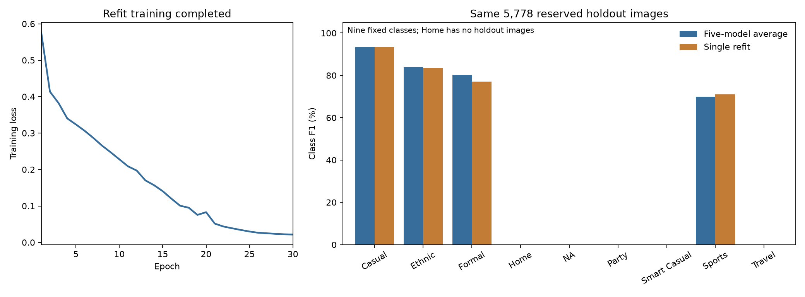

# Usage E1 refit: reserved holdout comparison

The refit trained successfully, but the saved five-model average scores slightly
better on the same 5,778 reserved holdout images. The refit gets **23 fewer images
correct**, and its confidence scores are less well matched to its errors.

| Measure | Five-model average | Single refit | Refit change |
|---|---:|---:|---:|
| Accuracy | 89.8581% | 89.4600% | −0.3981 percentage points |
| Nine-class macro-F1 | 36.3860% | 36.0900% | −0.2959 percentage points |
| Correct images | 5,192 / 5,778 | 5,169 / 5,778 | −23 |
| Mean recall, nine fixed classes | 34.9499% | 35.1027% | +0.1527 percentage points |
| Log loss, lower is better | 0.328429 | 0.430834 | +0.102405 |
| Calibration error, 15 bins, lower is better | 3.8045% | 6.6310% | +2.8265 percentage points |

Macro-F1 gives every class equal weight. All nine classes remain in this score,
including Home with zero support. The average means the equal mean of five saved
models' probability vectors, followed by the largest probability. It is not the
mean of their individual F1 scores.

## What changed

| Usage class | Holdout images | Average correct | Refit correct | Average F1 | Refit F1 |
|---|---:|---:|---:|---:|---:|
| Casual | 4,441 | 4,253 | 4,214 | 93.59% | 93.32% |
| Ethnic | 384 | 314 | 317 | 83.85% | 83.42% |
| Formal | 342 | 252 | 246 | 80.13% | 77.12% |
| Home | 0 | 0 | 0 | 0.00% | 0.00% |
| NA | 10 | 0 | 0 | 0.00% | 0.00% |
| Party | 1 | 0 | 0 | 0.00% | 0.00% |
| Smart Casual | 8 | 0 | 0 | 0.00% | 0.00% |
| Sports | 589 | 373 | 392 | 69.92% | 70.95% |
| Travel | 3 | 0 | 0 | 0.00% | 0.00% |

The refit fixes 147 errors and makes 170 new errors. Both systems miss 439 of the
same images. Sports improves by 19 correct images; Casual loses 39 and Formal
loses six. Ethnic gains three correct images, but its F1 falls because it also
produces more false Ethnic predictions.

Neither system predicts NA, Party, Smart Casual or Travel for any holdout image.
They both miss all 22 examples from those four rare classes. There are no Home
examples, so this holdout cannot measure Home performance. The high overall
accuracy is largely driven by Casual, which supplies 4,441 of the 5,778 images.

The five-model average remains the stronger quality choice in this comparison.
The single refit uses one 391,209-parameter model and a 1,581,813-byte checkpoint,
so it is a smaller option. One CPU pass over all holdout images, including image
loading and processing, took 11.86 seconds with two threads and batches of 32.
This was one measured pass, not a repeated latency benchmark. The average was
scored from its saved probabilities; its speed was not remeasured, so this check
does not establish a measured speedup for the refit.

These are results from one fixed refit, not proof of a stable ranking across
future training seeds. This review does not replace the application or submission
model. The original training files and old evaluation outputs are preserved.

## Training review

The fresh model completed all 30 planned epochs on all 32,772 eligible teacher
development images. Training took 499.11 seconds (8.32 minutes) on an NVIDIA L4.
Training loss fell from about 0.5759 to 0.0216. This shows the fit completed;
low training loss alone does not show that predictions on new images improved.

The saved recipe matches E1: ordinary cross-entropy, no class weights, no image
augmentation or classifier dropout, AdamW at 0.001, weight decay 0.0001, batch
128, seed 2753, and the fixed 30-epoch cosine schedule. Only epoch 30 was selected.
There was no validation set or early stopping during this full-development fit.

## Checks and evaluation scope

- Verified all eight saved artifact hashes, checkpoint metadata, strict weight
  loading, class order, source-code hashes and the original frozen E1 recipe.
- Matched the saved training rows to the canonical development population and
  checked every training image hash, all 30 epochs and the learning-rate schedule.
- Verified the unique completed run in the downloaded source registry.
- Matched all 5,778 holdout image IDs and hashes to the old comparison. Confirmed
  no training ID, product family or exact image hash overlaps this holdout.
- Verified the frozen five fold tables and average. Reconstructing the original
  float32 values and averaging in float64 reproduces the saved average.
- Used the refit's saved full-development normalization and evaluation mode.
  Weights and buffers stayed unchanged. Saved prediction hashes before scoring.
- Used only matching original teacher Usage labels. Literal `NA` stays a class.
  All rows were scored, and the labels match the earlier comparison exactly.
- Checked accuracy and fixed nine-class F1 independently with scikit-learn and
  direct counts. The old average's recalculated metrics match its saved report.
- Visually inspected the training-loss and class-F1 figure. Ruff lint and format
  checks passed for the evaluation script.

The holdout had already been opened during earlier comparisons. This is a fixed
model reassessment, **not a new blind evaluation**. No training, tuning, label
repair, threshold change or test-set scoring was performed in this review.
The training-only manifest's evaluation flags remain unchanged; this separate
report records the subsequent holdout evaluation.

Run ID: `t3_usage_e1_teacher_all_development_refit_dc3bc5f2d0a40f6d`.

Checkpoint SHA-256:
`d8256ee8ac25c2ff275664319ea05bae972a8e9629c413db7d3213ef92d086c0`.

Source: [completed Drive run](https://drive.google.com/drive/folders/1q14kV38ANWpHXHMpGGcnj4EGhTb0I58r),
downloaded with `rclone` to `results/evidence/task3/usage_e1_refit_20260907/`.
The source registry is preserved alongside it as `source_runs.csv`.

## Evidence

- `evaluation.json`: full scores, confusion matrices, training summary and paired errors.
- `holdout_comparison.csv` and `holdout_per_class.csv`: exact comparison values.
- `refit_holdout_probabilities.csv`: all refit probability vectors.
- `holdout_predictions_and_labels.csv`: matched predictions and original labels.
- `prediction_freeze.json` and `evaluation_provenance.json`: input/output hashes.
- `evaluate.py`: the evaluation and checks. It stops if frozen predictions exist.

The evaluation used genuine CPU PyTorch 2.11.0 through
`PYTHONPATH=/tmp/mla2-mixup-torch:src`, with the project's `./.venv/bin/python`.
No shared environment or training code was changed.

