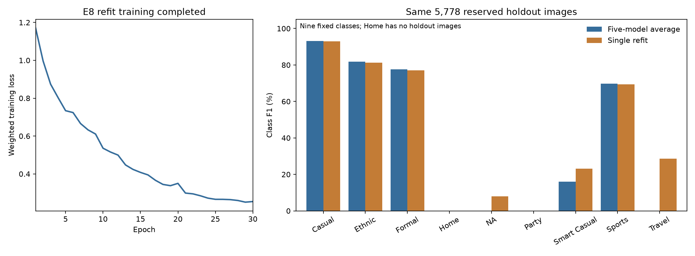

# Usage E8 + translation refit: reserved holdout review

The refit completed correctly. Compared with the original E8 five-model average,
it improves nine-class macro-F1 from **37.59% to 42.26%**, while accuracy falls
from **89.11% to 88.70%**. Both systems use the same 5,778 reserved holdout images.

| Measure | E8 five-model average | E8 single refit | Refit change |
|---|---:|---:|---:|
| Accuracy | 89.1139% | 88.6985% | −0.4154 percentage points |
| Correct images | 5,149 / 5,778 | 5,125 / 5,778 | −24 |
| Macro-F1, nine fixed classes | 37.5935% | 42.2559% | +4.6624 percentage points |
| Macro-F1, eight classes present | 42.2927% | 47.5379% | +5.2452 percentage points |
| Mean recall, nine fixed classes | 37.3687% | 43.3181% | +5.9495 percentage points |
| Log loss, lower is better | 0.312301 | 0.317325 | +0.005023 |
| Calibration error, 15 bins, lower is better | 1.5688% | 0.9519% | −0.6169 percentage points |

Macro-F1 gives each class equal weight. The primary score keeps all nine fixed
classes, assigning zero to Home. There are no Home holdout images, so that zero
is a scoring convention, not evidence of failed Home predictions. The separate
eight-class score excludes Home. Both versions use the same predictions.

The earlier **41.94%** E8 score came from development validation. It is a different
population and should not be read as the old reserved-holdout score.

## Where the gain comes from

| Usage class | Holdout images | Average correct | Refit correct | Average F1 | Refit F1 |
|---|---:|---:|---:|---:|---:|
| Casual | 4,441 | 4,221 | 4,199 | 93.19% | 92.93% |
| Ethnic | 384 | 312 | 307 | 81.89% | 81.22% |
| Formal | 342 | 251 | 247 | 77.59% | 77.07% |
| Home | 0 | 0 | 0 | 0.00% | 0.00% |
| NA | 10 | 0 | 1 | 0.00% | 8.00% |
| Party | 1 | 0 | 0 | 0.00% | 0.00% |
| Smart Casual | 8 | 2 | 3 | 16.00% | 23.08% |
| Sports | 589 | 363 | 367 | 69.67% | 69.44% |
| Travel | 3 | 0 | 1 | 0.00% | 28.57% |

The refit gets **5 of the 22 rare-class examples right**, versus 2 for the average.
It fixes 90 errors overall but makes 114 new errors; both systems miss 539 of
the same images. Casual loses 22 correct predictions, Ethnic loses five and
Formal loses four. Sports gains four, but its F1 falls slightly because false
Sports predictions also increase.

Most of the macro-F1 gain is driven by tiny class counts. The single correct
Travel image accounts for **3.17 of the 4.66 percentage-point gain**. NA adds
0.89 points and Smart Casual adds 0.79 points, while the four common classes
lose 0.19 points together. This is a useful observed improvement in rare-class
coverage, not evidence of a broad gain across classes or training seeds.

Rare-class precision remains weak: only 1 of 15 NA predictions, 3 of 18 Smart
Casual predictions and 1 of 4 Travel predictions are correct. All six Party
predictions are wrong. There is no evidence here about Home performance.

## Comparison with E1

All four rows below use the same holdout images and original labels.

| Model | Accuracy | Macro-F1, nine classes | Macro-F1, eight present |
|---|---:|---:|---:|
| E1 five-model average | 89.86% | 36.39% | 40.93% |
| E1 single refit | 89.46% | 36.09% | 40.60% |
| E8 five-model average | 89.11% | 37.59% | 42.29% |
| E8 single refit | 88.70% | 42.26% | 47.54% |

Among these four artifacts, E8's single refit has the highest macro-F1; E1's
five-model average has the highest accuracy. Against the E1 single refit, E8
gains 6.17 macro-F1 points but gets 44 fewer images correct. This supports a
trade-off between rare-class coverage and total correct predictions. It does
not make either choice a reliable all-class classifier. No application or
submission model was replaced by this review.

## Training and inference review

The model trained from scratch on all **32,772 eligible teacher development
images** for the planned **30 epochs**, taking **528.77 seconds (8.81 minutes)**
on an NVIDIA L4. The selected checkpoint is epoch 30. Weighted training loss
fell from about 1.1703 to 0.2540. Its value cannot be compared directly with
E1's unweighted training loss.

The saved configuration matches the original E8 recipe: a 391,209-parameter
SmallCNN, translation by up to two pixels with probability 0.5, effective-number
weighted cross-entropy with beta 0.999 and cap 5, AdamW at 0.001 with weight decay
0.0001, batch 128, seed 2753 and the fixed 30-epoch cosine schedule. Class weights
were recalculated on full development counts; normalization used unaugmented
development content pixels with padding excluded.

Inference used the saved normalization, evaluation mode and softmax followed
by argmax. There was no random translation or class-weight multiplication during
prediction. The 1,584,821-byte checkpoint represents one model. One CPU pass over
the holdout, including image loading and processing, took 11.45 seconds using
two threads and batches of 32. This was not a repeated latency benchmark. The
average used saved probabilities, so no relative speedup was measured.

## Verification and scope

- Verified every saved artifact hash, the frozen source recipe, current source
  hashes, saved class map, class weights and strict checkpoint loading.
- Matched saved training rows to all eligible canonical development rows;
  checked every training image hash and all 30 epochs' row counts and schedule.
- Verified the unique completed run in the downloaded source registry.
- Verified all 5,778 holdout image hashes and their exact match to the old
  comparison. No training ID, product family or exact image hash overlaps them.
- Checked the original five E8 prediction tables and their saved mean. Recovered
  float32 fold values and their float64 mean reproduce the frozen average.
- Saved and hashed predictions before scoring. Weights and buffers stayed unchanged.
- Scored only matching original teacher Usage labels; literal `NA` is preserved.
  All 5,778 rows were scored and match the old labels exactly.
- Independently checked accuracy and F1 with direct counts and scikit-learn;
  old average metrics reproduce the earlier report. E1/E8 comparison labels
  and saved evidence hashes also match.
- Inspected the rendered training-loss and class-F1 figure. Ruff lint and format
  checks passed for the evaluation script.

The holdout was already viewed during earlier comparisons. This is a fixed-model
reassessment, **not a new blind evaluation**. No training, tuning, epoch selection,
label repair or test-set evaluation was performed in this review. Original
training artifacts, evaluation flags, notebooks and earlier reports are preserved.
The training-only manifest remains unchanged; this separate report records the
subsequent holdout evaluation.

Run ID: `t3_usage_e8_translation_teacher_all_development_refit_5553be0c138243e9`.

Checkpoint SHA-256:
`18da75a4ec935ab0d18c9ebdf9d1dabb6fa87ee484ead5f439de0192c4af2747`.

Source: `gdrive:MLA2/task3/experiments/t3_usage_e8_translation_teacher_all_development_refit/usage/`,
downloaded read-only with `rclone` into
`results/evidence/task3/usage_e8_refit_20260907/`.
The source registry snapshot is saved there as `source_runs.csv`.

## Evidence files

- `evaluation.json`: full metrics, confusion matrices, paired errors and training summary.
- `holdout_comparison.csv` and `holdout_per_class.csv`: exact E8 comparison values.
- `e1_e8_comparison.csv`: all four teacher-only E1/E8 artifacts on the same holdout.
- `f1_gain_by_class.csv`: each class's contribution to the macro-F1 change.
- `refit_holdout_probabilities.csv`: all saved refit probability vectors.
- `holdout_predictions_and_labels.csv`: matched original labels and predictions.
- `prediction_freeze.json`, `evaluation_provenance.json` and
  `comparison_provenance.json`: input/output hashes.
- `evaluate.py`: one-shot evaluation script; stops if frozen predictions exist.

The evaluation used the project's `./.venv/bin/python` with genuine CPU PyTorch
2.11.0 through `PYTHONPATH=/tmp/mla2-mixup-torch:src`. No shared environment or
training code was changed.

