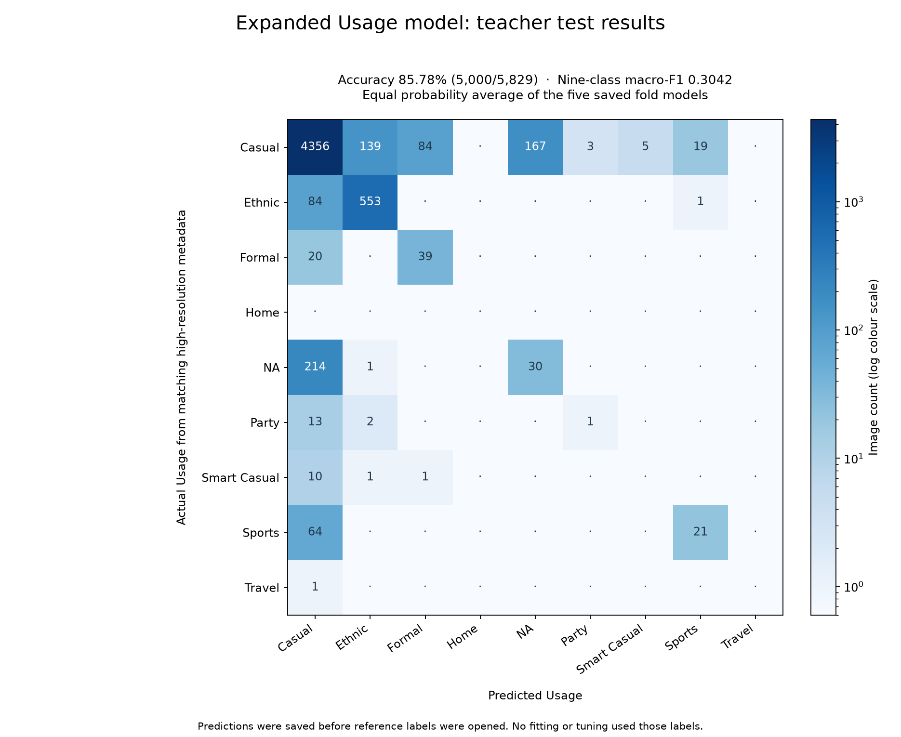

# Expanded Usage model: teacher test result

The model correctly predicts **5,000 of 5,829 test images: 85.78% accuracy**.
There are 829 wrong predictions. All 5,829 test IDs match the high-resolution
dataset metadata, and all matching Usage labels are valid. No rows are dropped.

This is the expanded E8 Usage recipe, trained from scratch with 120 added
external images. Its five saved fold models each predict every teacher test
image. Their class probabilities are averaged equally before choosing a label.
This prediction rule was fixed before reading the reference labels.

## Class results

- Casual: 4,356 / 4,773 correct (91.26%).
- Ethnic: 553 / 638 correct (86.68%).
- Formal: 39 / 59 correct (66.10%).
- NA: 30 / 245 correct (12.24%). Literal `NA` is a valid class here.
- Party: 1 / 16 correct (6.25%).
- Smart Casual: 0 / 12 correct.
- Sports: 21 / 85 correct (24.71%).
- Travel: 0 / 1 correct.
- Home: no test images, so this test does not measure its performance.

Nine-class macro-F1 is **0.3042**. This gives all nine classes equal weight and
assigns zero to the absent Home class, matching the fixed nine-class convention.
Macro-F1 over the eight classes present in this test is **0.3423**.

Most test images are Casual. Always guessing Casual would get 4,773 correct;
this model gets 227 more correct overall. The overall accuracy hides weak
performance on NA, Sports, and the small classes. A later
[original-model comparison](../usage_teacher_vs_expanded_test_20260906/README.md)
finds original E8 gets 4,989 correct (85.59%), so the added images give 11 more
correct predictions. Original E1 leads overall accuracy at 87.89%, while still
missing all NA, Party, Smart Casual and Travel test images.

## Files

- `usage_test_predictions.csv`: test IDs and predicted Usage, in template order.
- `usage_test_probabilities.csv`: the averaged probabilities for all nine classes.
- `usage_test_comparison.csv`: each prediction, matching actual Usage, and correctness.
- `usage_test_errors_or_unscored.csv`: the 829 wrong predictions; none are unscored.
- `usage_test_per_class.csv` and `usage_test_confusion_matrix.csv`: detailed counts and scores.
- `test_metrics.json`: scores, coverage, source hash, and label-access time.
- `inference_recipe.json` and `prediction_freeze.json`: model hashes, input hashes,
  the fixed prediction rule, and hashes of predictions saved before label access.
- `predict_test.py`: the exact inference source used for this run.
- `score_test.py`: scoring from the frozen predictions and matching reference labels.

## Checks and label use

All 5,829 image hashes match the saved prediction manifest. Test IDs are disjoint
from the expanded split. Every checkpoint is the saved final epoch 30, uses the
same nine-class map, and loads with its saved normalization. Inference uses the
teacher's low-resolution images and does not take any reference labels as input.

Predictions were frozen at 2026-09-06 10:42:15 UTC. The later scoring step reads
only matching test Usage labels from
`data/raw/external/fashion_product_images_v1_legacy_extras/fashion-dataset/styles.csv`.
One matching CSV row, ID 59768, has an extra comma in its final product-name
field; its earlier Usage field is retained correctly. There are no duplicate
matching IDs, missing matches, blank labels, or unknown classes.

The comparison uses those labels only to score the saved predictions. It does
not train, tune, choose a fold, change a threshold, or update model selection.
The teacher test template remains unchanged. This output covers Usage only.

The independent count of exact label matches agrees with the confusion-matrix
diagonal and the metric library. Saved prediction hashes remain unchanged after
scoring. The rendered confusion matrix was checked for readable labels and counts.
