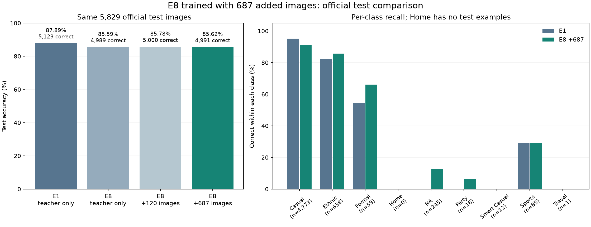

# E8 with 687 added images: official test result

**85.62% accuracy: 4,991 of 5,829 images correct.** There are 838 mistakes.
Nine-class macro-F1 is **0.3046**.

This is the completed five-fold E8 model trained with **all 687 v2 additions**.
It uses the E8 translation recipe, without MixUp or SAM. It is separate from the
earlier 120-image expansion and the later v3 replacement experiment.

## Same official test images

| Model | Correct / 5,829 | Accuracy | Nine-class macro-F1 |
|---|---:|---:|---:|
| E1: original teacher-only SmallCNN | **5,123** | **87.89%** | 0.2715 |
| E8: original teacher-only SmallCNN | 4,989 | 85.59% | **0.3085** |
| E8 with 120 added images | 5,000 | 85.78% | 0.3042 |
| E8 with 687 added images | 4,991 | 85.62% | 0.3046 |

All four use an equal average of their five saved fold probability vectors. The
new model fixes 139 original E8 mistakes but introduces 137 others: only **two
more correct predictions**, or **+0.034 percentage points**. Macro-F1 falls by
0.0039. Compared with the 120-image expansion, it gets nine fewer images correct.

The larger dataset raised teacher development accuracy from 88.85% to 89.51%,
but that improvement did not carry through to a useful improvement on this test.
These are observed results from fixed models, not evidence about all possible
ways of adding data.

**E1 remains the accuracy recommendation among these four tested models.**
It gets 132 more test images correct than the 687-image E8, a 2.26 percentage-point
lead. Original E8 remains the better choice among these four if the objective
is the test score that gives every class equal weight. E1's rare-class weakness
must remain visible in the final report.

## New model's class results

| Class | Correct / test images |
|---|---:|
| Casual | 4,348 / 4,773 |
| Ethnic | 547 / 638 |
| Formal | 39 / 59 |
| Home | No test examples |
| NA | 31 / 245 |
| Party | 1 / 16 |
| Smart Casual | 0 / 12 |
| Sports | 25 / 85 |
| Travel | 0 / 1 |

The intended rare-class benefit remains weak. There is no evidence about Home
from this test, and Travel has only one example. Literal `NA` is a valid class.
The fixed nine-class macro-F1 assigns zero to absent Home; the average over the
eight classes present is 0.3426.

## Evaluation and checks

- Used the five registered final-epoch-30 checkpoints from
  `results/evidence/task3/usage_expanded_v2_e8_20260906/`. Verified their hashes,
  scratch-training recipe, saved split, class map, fold counts, class weights,
  validation predictions and diagnostic files.
- Reproduced 81 saved teacher validation decisions locally before test inference.
  Every class decision matches. Maximum CPU/GPU probability difference is
  0.001681, below the existing 0.005 tolerance.
- Used the same full RGB 80x60 image transform as earlier tests, each fold's
  own saved normalization, and an equal five-fold average. No augmentation,
  training, normalization fitting, threshold tuning or new checkpoint selection.
- Checked every test image hash and preserved the exact template order.
  Test IDs and exact image hashes do not overlap development data. Eleven
  test images have exact matches only in quarantined rows, excluded from training.
- Froze the new predictions at **2026-09-06 17:45:46 UTC**, then read the reference
  at **17:45:52 UTC**. Matching high-resolution metadata supplied labels only.
  All 5,829 IDs match valid labels, with no missing or duplicate matches. The
  extra product-name comma for ID 59768 does not affect its Usage field.
- The reference hash matches earlier evaluations. Old predictions and the
  official teacher template remain unchanged. Direct counts, confusion matrices,
  project metrics and scikit-learn agree. Both scripts pass Ruff; the plot was
  rendered and visually checked.

The reference labels had already been inspected in earlier evaluations. This is
an authorized follow-up comparison, not a newly blind test. No reserved-holdout
evaluation, final-model promotion, commit or push was performed here.

## Files

- `usage_test_predictions.csv`: the new `id,usage` predictions in template order.
- `usage_test_probabilities.csv` and `usage_test_fold_*.csv`: saved probabilities.
- `test_summary.csv`, `test_per_class.csv`, `comparison_metrics.json`: exact results.
- `test_predictions_and_labels.csv` and `usage_test_errors.csv`: paired predictions
  and the new model's 838 mistakes.
- `inference_recipe.json` and `prediction_freeze.json`: models, hashes and timing.
- `predict_test.py` and `score_test.py`: reproducible inference and scoring.

The Usage-only output is not the complete four-target submission CSV.
