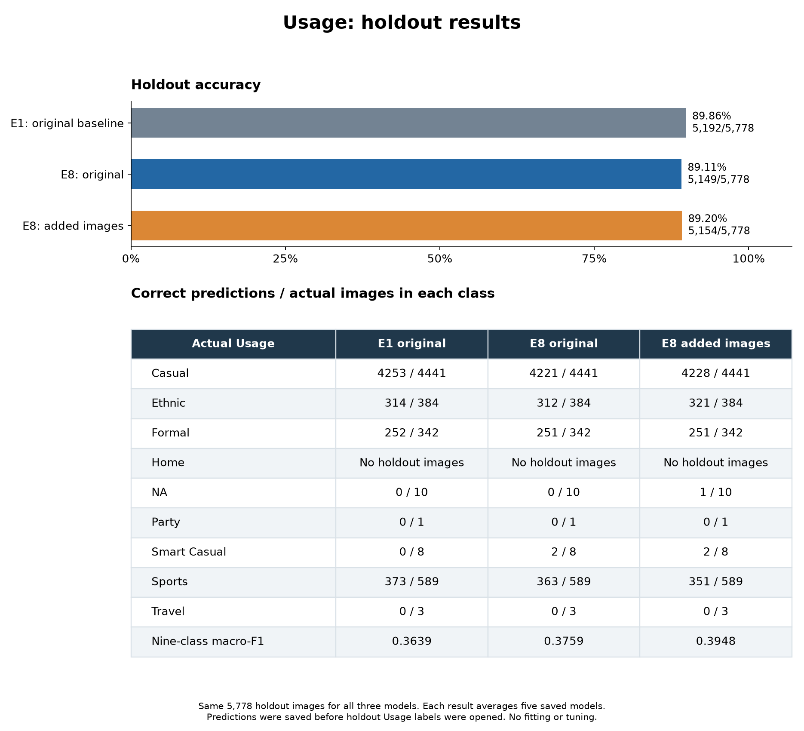

# Usage holdout comparison

**E1 again has the highest overall accuracy: 89.86%, or 5,192 of 5,778 holdout
images correct.** The added-data E8 has the highest nine-class macro-F1: 0.3948.

| Model | Correct / holdout images | Accuracy | Nine-class macro-F1 |
|---|---:|---:|---:|
| E1: original baseline | **5,192 / 5,778** | **89.86%** | 0.3639 |
| E8: original teacher data | 5,149 / 5,778 | 89.11% | 0.3759 |
| E8: teacher + 120 added images | 5,154 / 5,778 | 89.20% | **0.3948** |

These are the same three models and fifteen saved fold checkpoints used for
the teacher test comparison. Each model averages its five fold probability
vectors equally, then selects the largest class probability. All inference
uses full RGB 80x60 images and each checkpoint's saved normalization.

## What changed with added data

Against original E8, the added-data model fixes 70 holdout errors and introduces
65 new ones. This gives **five more correct predictions**, or **+0.0865 percentage
points** of accuracy. Nine-class macro-F1 rises by **0.018896**.

It gets seven more Casual, nine more Ethnic and one more NA image correct,
but twelve fewer Sports images correct. Correct counts for the other classes
are unchanged. Compared with E1, the added-data model gets 38 fewer images
correct overall, a difference of 0.6577 percentage points.

Rare-class performance remains weak. Added-data E8 gets NA 1/10 and Smart Casual
2/8 correct. All three models miss the one Party image and all three Travel
images. There are no Home images in this holdout. E1 gets none of these rare
classes correct.

The small counts matter. The single new correct NA prediction contributes
0.01587 to the 0.01890 macro-F1 gain over E8. This result does not establish a
reliable general improvement from collecting more data.

## Holdout and teacher test are different populations

| Model | Holdout accuracy | Teacher test accuracy |
|---|---:|---:|
| E1 | 89.86% | 87.89% |
| E8 | 89.11% | 85.59% |
| E8 with added images | 89.20% | 85.78% |

The holdout has 5,778 images; the official teacher test has 5,829. Their class
mix differs: holdout has 10 NA images and 589 Sports images, while teacher test
has 245 NA and 85 Sports images. Scores across these two populations are not
an isolated measure of model quality or of the effect of adding data. Within
each population, all three models see exactly the same images and labels.

## Scope and label access

The user explicitly requested this holdout evaluation. Its image membership
comes only from `partition == "holdout"` in `data/processed/splits.csv`. The
split and training data are unchanged. No holdout IDs, saved product families,
or exact file hashes overlap the expanded development data.

All 5,778 image hashes were checked before inference. The safe split loader
keeps protected targets blank. The inference dataset contains only image IDs,
paths, hashes and product families. Predictions were saved and frozen at
**2026-09-06 11:24:05 UTC**.

The scoring step then opened matching holdout Usage labels from
`data/raw/teacher/train/styles_train.csv` at **11:24:17 UTC**. All 5,778 IDs
matched unique records with valid Usage labels. There are no blank, missing or
unknown labels, and no dropped rows. Literal `NA` remains a valid class.

The labels were used only to score these fixed predictions. There was no
training, tuning, normalization fitting, model selection, threshold change or
blend-weight change. Other targets and quarantine rows were not evaluated.
The earlier teacher test labels were already inspected in the preceding
comparison; this record is a separate, authorized holdout evaluation.

Macro-F1 uses all nine fixed classes, with zero for the absent Home class.
For the eight classes present, macro-F1 is 0.4093 for E1, 0.4229 for E8 and
0.4442 for added-data E8. The fixed nine-class score stays the primary class
comparison throughout these reports.

## Verification and outputs

All fifteen checkpoint hashes match those in the preceding test evaluations.
All input and prediction hashes remain unchanged after scoring. Direct counts
of correct labels, confusion-matrix diagonals, the project metric functions
and scikit-learn agree. The three scripts pass Ruff. The figure was rendered
and checked for readable labels and complete counts.

- `holdout_summary.csv`: headline scores for all three models.
- `holdout_per_class.csv`: class counts, precision, recall and F1.
- `holdout_predictions_and_labels.csv`: all three predictions and matching truth.
- `holdout_metrics.json`: exact scores, paired changes, source hashes and access times.
- `holdout_and_test_scores.csv` and `holdout_and_test_class_mix.csv`: population comparisons.
- `E1/`, `E8/`, `Expanded/`: each fold's predictions and each model's averaged probabilities.
- `holdout_image_manifest.csv`: the exact holdout image membership, without labels.
- `inference_recipe.json` and `prediction_freeze.json`: model and prediction records.
- `unscored_holdout_rows.csv`: header only; all holdout rows were scored.

[Earlier teacher test comparison](../usage_teacher_vs_expanded_test_20260906/README.md)
