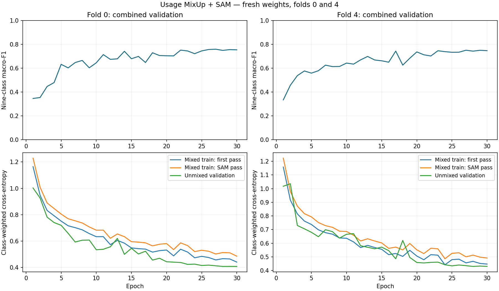

# Usage MixUp + SAM: two-fold result review

**Training completed correctly, but this recipe did not show a gain on teacher images.**
Do not extend it to the remaining folds on the current evidence.

Both fresh SmallCNN models finished 30 epochs on an A100 GPU. The dataset is the approved
teacher-plus-687 v2 dataset. The trial used MixUp alpha 0.2 and SAM rho 0.05 over AdamW,
with the existing E8 class weights, translation, seed and final-epoch rule.

## Same teacher images

All comparisons below use the same **13,110 teacher validation images** from folds 0 and 4,
with the same nine Usage classes. The baseline is expanded v2 E8 on these two folds.
Its score differs from the earlier five-fold score because the evaluation rows differ.

| Teacher macro-F1 | Expanded v2 E8 | MixUp + SAM | Change |
|---|---:|---:|---:|
| Fold 0 | 0.4024 | 0.3957 | -0.0067 |
| Fold 4 | 0.3996 | 0.3828 | -0.0168 |
| Pooled folds 0 and 4 | **0.4010** | **0.3898** | **-0.0112** |

The candidate scores lower on both folds. A paired bootstrap of 10,000 whole-product-family
resamples gives a 95% interval of **[-0.0324, +0.0086]** for the pooled change. This includes
zero: the observed decrease is not a clear statistical loss, and there is no demonstrated gain.
Only one seed and two development folds were used. This interval does not measure training-seed
variation or remove earlier model-selection bias.

## The smaller gap does not mean better validation predictions

| Mean across the same two folds | Expanded v2 E8 | MixUp + SAM |
|---|---:|---:|
| Clean teacher training F1 | 0.8182 | 0.6049 |
| Teacher validation F1 | 0.4010 | 0.3892 |
| Training minus validation | 0.4173 | 0.2157 |

The gap roughly halves because training F1 falls sharply, while validation F1 also falls.
The methods restrict fitting, but this run does not turn that into better teacher predictions.
These are fold means; the pooled score above is calculated once from all validation predictions.

## Rare classes still fail to transfer

| Teacher class | Images | E8 correct | MixUp + SAM correct |
|---|---:|---:|---:|
| Home | 1 | 0 | 0 |
| Party | 6 | 0 | 0 |
| Smart Casual | 18 | 0 | 0 |
| Travel | 8 | 2 | 1 |
| NA | 22 | 5 | 9 |

NA improves, but Party and Smart Casual remain at zero, and Travel declines. Formal and Sports
F1 also decline. Teacher Home has only one example, so it cannot support a broad conclusion.

The candidate finds **49/50 Party** and **71/74 Smart Casual** images in the new external-source
cohort. Across all new-source images, it gets 220/237 correct versus the baseline's 221/237.
This continuing source gap is consistent with differences in photo style, products or label
meaning. It does not by itself prove which explanation is responsible or that labels are wrong.

Inspection of development metadata and actual input images found concrete coverage gaps:

- Teacher Smart Casual includes **18 watches among 47 development images**. The 162 added
  Smart Casual images contain shoes and clothing, with no watches. Eight of the 18 teacher
  Smart Casual validation cases in this trial are watches; all eight are predicted Casual.
- The new 127 Party examples are dresses. Teacher Party includes seven dresses and five
  other products: a clutch, perfume, top, heels and watch. In this trial, the six teacher
  Party validation cases are four dresses, one top and one watch; all six are missed.
- Product type alone cannot determine Usage. Teacher development contains 281 Casual
  dresses versus seven Party dresses, 1,837 Casual watches versus 18 Smart Casual watches,
  and 523 Casual backpacks versus ten Travel backpacks. These counts show overlapping
  product types, not proof that individual labels are incorrect.
- The inspected teacher and retailer photos also differ in backgrounds, framing and
  product presentation. Source-specific visual cues are a plausible explanation for the
  transfer gap, but their causal contribution has not been isolated.

The practical problem is that the added images do not sufficiently cover the teacher's
examples and label distinctions. The evidence supports a data-coverage and label-alignment
audit before more model tuning; it does not establish an architecture defect or prove that
more matched images will fully solve the task.

[View actual validation examples and predictions](source_mismatch_examples.png).
The Party teacher row includes all six cases; other rows show illustrative subsets.
Counts above use development rows only, without reading further holdout/test labels.

The pooled combined teacher-plus-external F1 is **0.7527**, versus **0.7520** for the same-fold
baseline. This tiny mixed-source gain does not demonstrate a gain on the teacher task.

## Learning and robustness

The saved curves were visually inspected. Combined validation loss generally falls and becomes
steady near the end. There is no sustained late loss rise that establishes epoch 30 as the
cause of failure. Training losses use mixed images, so comparing them directly with unmixed
validation loss does not measure the clean training gap.

Some robustness diagnostics improve. Across these same two folds, JPEG lowers combined F1 by
only 0.0002 versus 0.0449 for E8. Darkening by 15% is less damaging than before, but still lowers
combined F1 from a fold mean of 0.7508 to **0.3441**. Small translations are slightly worse.
These scores include external images; they are not teacher-only robustness results.

MixUp and SAM changed together. This experiment cannot identify their separate effects, nor
prove that the network architecture causes the rare-class failure. Keep the completed result
as an honest comparison; no further folds or model promotion are justified by this screen alone.

## Verification and files

Downloaded with `rclone`. Verified both complete registry rows, 30 epochs per fold, the frozen
dataset and recipe, and all **22 candidate artifact hashes**, including checkpoints and the
MixUp/SAM training records. Both v2 baseline folds were also verified. Clean training and
validation source scores were recomputed from saved predictions. Aggregate IDs, scores and
comparison tables agree. The notebook code matches the pushed version and contains no errors.

Recorded fitting time totals **19.34 minutes**; peak allocated GPU memory is **432.69 MiB**.
The prior v2 run used an L4, so their wall times are not a same-hardware cost comparison.

No new training, checkpoint selection, holdout/test evaluation, commit or push was performed.
Earlier holdout/test evaluations already exist and are not treated as untouched data here.

- `verified_summary.json`: full comparison, source counts and uncertainty.
- `fold_comparison.csv`: matched training, validation and gap scores.
- `teacher_per_class.csv` and `source_class_scores.csv`: per-class details and correct counts.
- `combined_robustness.csv`: same-fold corruption diagnostics.
- `checks.json` and `review_result.py`: verification records and reproducible review.
