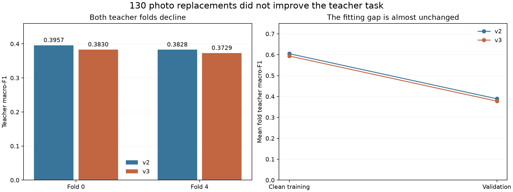
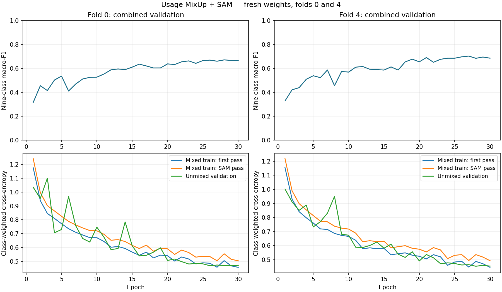

# Usage v3 result: the photo replacements did not help

**Both runs finished correctly, but v3 performed worse on both teacher folds.**
Do not extend this v3 trial to the remaining folds. Keep it as a completed data experiment
in the report. This comparison alone does not choose the final Usage model.

V3 replaced 130 outside photos while keeping the class totals, teacher rows and teacher
folds fixed. Both versions used fresh SmallCNN weights, MixUp alpha 0.2, SAM rho 0.05,
30 epochs, seed 2753 and the final-epoch checkpoint. Training weights and normalization
were fitted on each version's training fold.

## Same 13,110 teacher validation images

| Teacher macro-F1 | V2 MixUp + SAM | V3 MixUp + SAM | Change |
|---|---:|---:|---:|
| Fold 0 | 0.3957 | 0.3830 | -0.0126 |
| Fold 4 | 0.3828 | 0.3729 | -0.0098 |
| Pooled folds 0 and 4 | **0.3898** | **0.3778** | **-0.0120** |

Macro-F1 gives each of the nine classes equal weight. Teacher accuracy also falls slightly,
from 88.71% to 88.45%. V3 fixes 208 old mistakes but introduces 242 new ones.

A paired bootstrap of 10,000 whole-product-family resamples gives a 95% interval of
**[-0.0263, -0.0012]** for the pooled F1 change. That supports a decrease for these saved
predictions. It does not cover training-seed variation or remove selection bias: these
are two previously inspected development folds, not a fresh independent test.

## The rare teacher classes still fail

| Teacher class | Validation images | V2 correct | V3 correct |
|---|---:|---:|---:|
| Home | 1 | 0 | 0 |
| Party | 6 | 0 | 0 |
| Smart Casual | 18 | 0 | 0 |
| Travel | 8 | 1 | 0 |
| NA | 22 | 9 | 8 |

The only Travel example V2 got right, backpack 25885, becomes Casual in V3.
All eight teacher Smart Casual watches are still predicted Casual. None of the nine
teacher classes has higher F1 in V3. Home has only one validation image, so it cannot
support a broad conclusion about that class.

## The model does not carry learning from the new photos to unseen photos

On the **same 200 retained outside validation images**, correct predictions change from
174/200 to 172/200. Their fixed-nine-class F1 changes from 0.4093 to 0.4076.

On the **76 new replacement validation images**, V3 gets only **27/76 correct (35.5%)**:
Home 2/6, Party 11/22, Smart Casual 10/41 and Travel 4/7. The new images have no matched
V2 validation score; their identities and class mix differ from the removed images.

| New replacement images | Clean training accuracy | Validation accuracy |
|---|---:|---:|
| Fold 0 | 71/81 (87.7%) | 19/49 (38.8%) |
| Fold 4 | 99/103 (96.1%) | 8/27 (29.6%) |

The model fits many new training examples but struggles with unseen families. Filling
the product-type gaps was insufficient under this recipe. These results do not isolate
whether photo style, label meaning, limited examples or model capacity is responsible.

Outside-only F1 still averages all nine classes, even though these cohorts contain only
four true classes. Use the class counts and accuracy above to read those results.
V3's pooled combined F1 is 0.6801; it is not a matched V2 comparison because some outside
validation images changed. It also does not describe teacher-only performance.

## Learning curves and fitting gap

The saved curves were visually inspected. Validation loss generally falls and settles
near the end; there is no sustained late loss rise showing that epoch 30 caused the failure.
Mixed-image training loss and unmixed validation loss are different measurements.

Mean clean teacher training F1 falls from 0.6049 to 0.5938. Mean teacher validation F1 falls
from 0.3892 to 0.3780. The training-minus-validation gap is almost unchanged:
**0.2157 versus 0.2158**. These are fold means, distinct from the pooled scores above.

Darkening remains damaging: V3's mean combined F1 falls from 0.6766 to 0.3138 after a
15% brightness reduction. JPEG causes a smaller drop to 0.6690. These diagnostics include
outside images and cannot establish a matched teacher robustness improvement.

## Verification

Downloaded the completed run files from Drive. Verified both registry rows, 30 epochs per
fold, the frozen v3 split and class map, the full recipe, MixUp/SAM receipts, and all
**22 recorded candidate artifact hashes**, including checkpoints. Verified both V2 references.
Recomputed source scores, clean training scores and the aggregate from saved predictions.
The notebook matches pushed commit `1e72921`, has no errors, and displays the same curve
image as the saved Drive file.

Both fits used an A100. Recorded fitting time totals 19.37 minutes and peak allocated
GPU memory is 433.0 MiB. No models were trained or loaded for inference during this review.
No new holdout/test evaluation, model promotion, commit or push was performed.

Detailed numbers are in `verified_summary.json`, `fold_comparison.csv`,
`source_class_scores.csv`, `rare_teacher_predictions.csv` and `combined_robustness.csv`.
`review_result.py` reproduces the review; `checks.json` records the verification.
