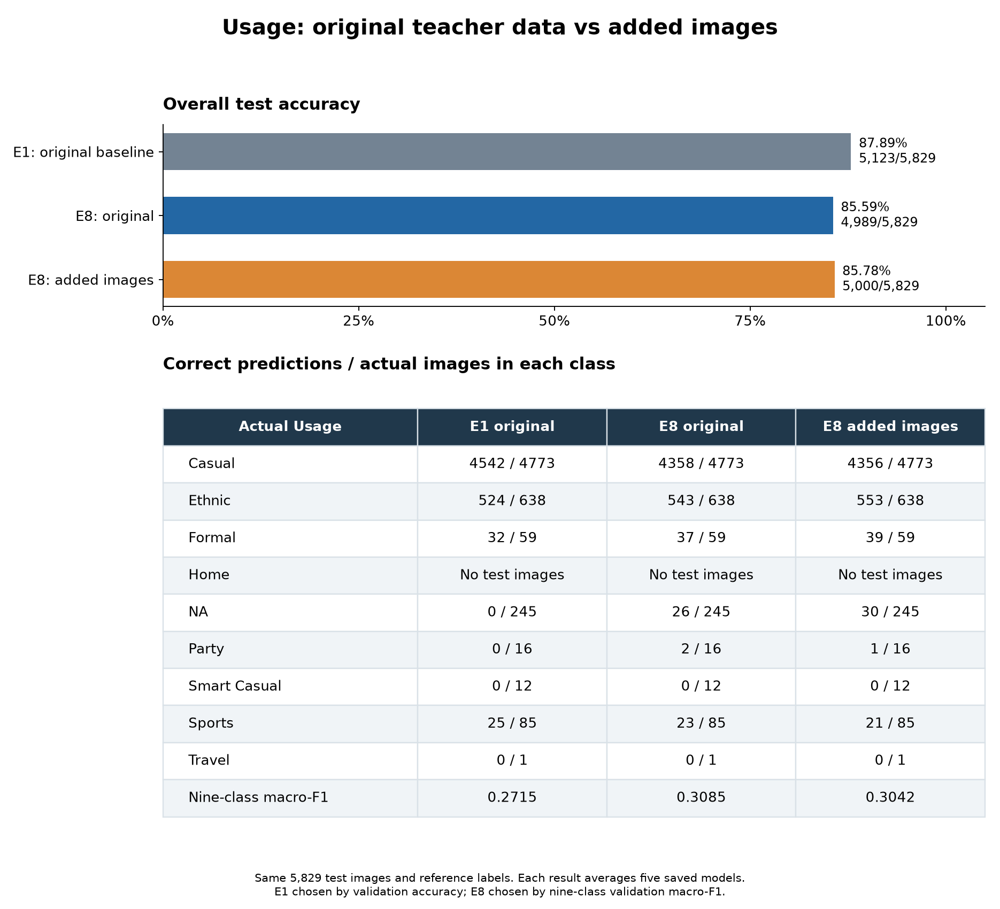

# Usage test comparison: original teacher data and added images

**The original baseline E1 has the highest overall test accuracy of these three
models: 87.89%, or 5,123 of 5,829 images correct.** It gets 123 more images correct
than the model trained with added images.

| Model | Training images | Test correct | Test accuracy | Nine-class macro-F1 |
|---|---|---:|---:|---:|
| E1: original SmallCNN baseline | Teacher only | 5,123 / 5,829 | **87.89%** | 0.2715 |
| E8: SmallCNN with translation | Teacher only | 4,989 / 5,829 | 85.59% | **0.3085** |
| E8 with added images | Teacher + 120 external | 5,000 / 5,829 | 85.78% | 0.3042 |

Every result uses an equal average of the five saved fold models' class
probabilities. All models are trained from scratch. No new training was run.

## How the original models were chosen

The selection uses original teacher validation results, not test scores. Nine
completed individual experiments, E1 through E9, cover the same 32,772 labelled
teacher development images across five canonical folds. Their pooled scores
were recomputed from the registered per-fold confusion matrices. Each matrix's
class counts match its canonical validation fold.

- **E1 wins validation accuracy:** 29,265 / 32,772, or 89.30%.
- **E8 wins validation macro-F1:** 0.419393. Macro-F1 gives each class equal weight.

Both references are included because the goal is good overall test accuracy,
while the earlier experiment comparisons focused on macro-F1. E8 also gives the
direct comparison with the added-data model using the same training recipe.
The accuracy and macro-F1 criteria were fixed before generating these two
models' test predictions.

The existing experiment inventory also contains two-fold screens S1, S2, U1,
U2 and U3. Their smaller validation population does not supply a full five-fold
ranking. EDA probes use a selected subset. The previously declined E2/E3/E8
blend is a multi-experiment diagnostic, so it is outside this individual-model
comparison. No claim is made that E1 or E8 wins every possible model blend.

## What adding the images changed

Compared with original E8, the added-data E8 fixes 95 test errors but introduces
84 others. The net change is **11 more correct predictions**, or **+0.1887
percentage points of accuracy**. Its nine-class macro-F1 falls by **0.004260**.
This is a small observed change from one pair of training runs, not evidence of
a reliable gain from collecting more data in general.

The class changes are mixed. Added-data E8 gets four more NA images, ten more
Ethnic images, and two more Formal images correct. It gets two fewer Casual,
two fewer Sports, and one fewer Party image correct. Neither E8 version gets a
Smart Casual or Travel image correct. There are no Home images in this test.

E1's higher overall accuracy comes mainly from Casual: it gets 4,542 Casual
images correct, compared with added-data E8's 4,356. But E1 gets **none** of the
245 NA, 16 Party, 12 Smart Casual, or one Travel image correct. The accuracy
winner therefore still has a clear rare-class weakness.

## Reference labels and checks

The high-resolution metadata supplies the same Usage labels for all 5,829 test
IDs. All IDs match, with no missing or unknown labels and no duplicate matches.
Literal `NA` remains a real class. The extra product-name comma in row 59768
does not affect its earlier Usage field. The reference file's hash is identical
to the first expanded-model evaluation.

The two original models' predictions were frozen at **2026-09-06 11:03:12 UTC**.
The scoring script opened the reference at **11:04:03 UTC**. The test labels
had already been seen in the earlier expanded-model comparison; this is an
authorized follow-up comparison, not a claim of a newly blind test. These
labels were used only for scoring, not training, normalization, thresholds,
model selection, or blend weights.

All test image hashes and the unchanged template order were checked. Test IDs
are absent from the original teacher split. All ten original checkpoints and
their validation prediction files match registered hashes. Their 65,544 total
validation predictions, 32,772 per model, were checked against canonical IDs,
labels, folds and product families; their scores match the registry.

A fresh CPU check reproduces the saved class decisions on 162 validation
examples across the ten checkpoints. The largest absolute probability
difference from saved GPU inference is 0.002130, within the predeclared 0.005
limit. Every model uses its saved normalization and the same full RGB 80x60
inference transform as the first test evaluation.

The project's metric functions and scikit-learn agree. Exact correct counts
agree with each confusion matrix's diagonal. All frozen original and expanded
prediction hashes remain unchanged after scoring. Both new scripts pass Ruff.
The comparison figure was rendered and visually checked.

## Outputs

- `validation_ranking.csv`: all nine complete original experiments.
- `selection_contract.json`: validation-only selection criteria and provenance.
- `E1/usage_test_predictions.csv`: the accuracy-selected baseline's Usage output.
- `E8/usage_test_predictions.csv`: the macro-F1-selected E8's Usage output.
- `E1/` and `E8/`: saved probabilities and individual fold predictions.
- `test_summary.csv`: the three-model score comparison.
- `test_per_class.csv`: class counts, precision, recall and F1 for each model.
- `test_predictions_and_labels.csv`: all three predictions and the matching truth.
- `e8_vs_expanded_changed_predictions.csv`: rows where the E8 versions disagree.
- `comparison_metrics.json`: exact metrics, paired changes, source hashes and times.
- `inference_recipe.json` and `prediction_freeze.json`: inference and integrity records.

The original teacher test template remains unchanged. Prediction files here
contain `id,usage` only; they are not a complete four-target submission file.

The [earlier expanded-model result](../usage_expanded_e8_test_20260906/README.md)
and [original experiment inventory](../usage_deep_investigation_20260905/REPORT.md)
remain available for context.
