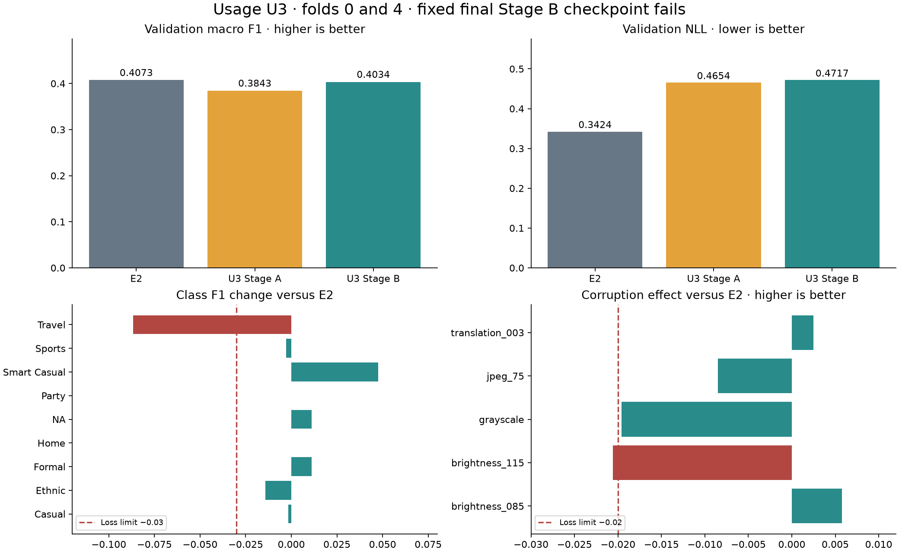
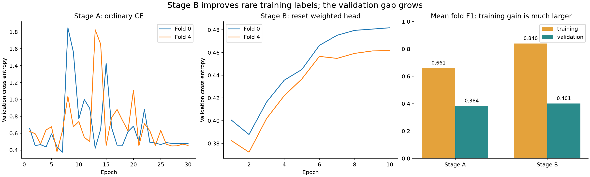

# Usage U3: two-stage SmallCNN review

Reviewed on 5 September 2026. **Numerical screen: fail. Current registry completion proof: incomplete for fold 4.** No additional U3 folds, checkpoint selection, training or inference were run for this review.

## What ran

The source notebook is `notebooks/task3_training/usage_two_stage_screen.ipynb`. The completed artifact bundles are:

- Fold 0: `t3_usage_u3_two_stage_cnn_f0_s2753_415911296044_20260905T122940_d95ccf`
- Fold 4: `t3_usage_u3_two_stage_cnn_f4_s2753_124823bd1fcd_20260905T123959_6c0791`

The earlier attempt was `t3_usage_u3_two_stage_cnn_f0_s2753_7eaa4c39632f_20260905T120059_e69628`. Its registry row says **failed**, with `FoldResourceError: Fold process RSS exceeded 7516192768 bytes`. Its last stage is `corruption_jpeg_75`. It had finished the 30+10 training epochs; it did not finish the diagnostics. It is excluded from all U3 scores below.

The new contract raises host memory from 7 to 16 GiB and retains 7 GiB for GPU memory, 90 minutes per fold, batch size 128, two loader workers, and the same training recipe. All 17 recorded source hashes match commit `67e71e5cc762fcc2573f3a215c1f43ffd578b041`. Between attempts, `task3_baseline.py` also gained unrelated gender code. Its six functions imported by U3 are unchanged. The U3 fit and resource-worker files are unchanged. Later live edits were preserved.

## Scores on the same validation rows

These are pooled scores over all 13,110 canonical development rows in folds 0 and 4. All nine classes, including Home, remain in the scores. The original CNN probabilities are used without post-hoc calibration or a forced-zero Home column.

| Model | Macro F1 ↑ | NLL ↓ | Brier ↓ | ECE ↓ |
|---|---:|---:|---:|---:|
| E2 | 0.407319 | 0.342403 | 0.172263 | 0.032938 |
| U3 Stage A, epoch 30 | 0.384302 | 0.465363 | 0.181980 | 0.068872 |
| U3 Stage B, epoch 10 | 0.403390 | 0.471720 | 0.184495 | 0.045725 |

F1 measures class prediction quality. NLL and Brier measure errors in the probabilities. ECE measures the gap between confidence and correctness. A lower ECE alone does not make the probabilities better on every measure.

The paired whole-family bootstrap, with 10,000 draws and seed 2753, gives U3−E2 F1 **−0.003929**, with 95% interval **[−0.030937, +0.023832]**. There is no evidence of a positive gain under the frozen rule. This is development evidence; the interval does not remove prior model-selection exposure.



## Stage A versus Stage B

Both stages are scored on clean training images and the same validation images, using the saved probability vectors. These clean scores are comparable; the ordinary Stage A training loss and weighted Stage B training loss have different meanings and must not be compared directly.

| Fold | Stage | Train F1 | Validation F1 | F1 gap | Train NLL | Validation NLL |
|---|---|---:|---:|---:|---:|---:|
| 0 | A | 0.648420 | 0.372698 | 0.275722 | 0.015705 | 0.475106 |
| 0 | B | 0.886942 | 0.400543 | 0.486399 | 0.036333 | 0.481788 |
| 4 | A | 0.673443 | 0.395960 | 0.277483 | 0.015495 | 0.455626 |
| 4 | B | 0.792928 | 0.402314 | 0.390614 | 0.036603 | 0.461658 |

Stage B recovers some rare-class training performance and raises pooled validation F1 by 0.019088 relative to Stage A. It still falls below E2, and both probability error scores worsen relative to Stage A. The training F1 gain is much larger than the validation gain. Freezing features did not solve the generalisation problem.

Stage B validation cross entropy is lowest at epoch 2 in both folds, then rises. This is a useful diagnosis of head overfitting. It does **not** justify selecting epoch 2 after seeing the result: the agreed candidate is epoch 10, and earlier epoch F1/corruption evidence is not saved. Any new early-stopping method would need a separately fixed, valid selection plan.



The rare-class counts make the result concrete:

| Class | E2 correct / guesses | U3 correct / guesses | True examples | U3−E2 F1 |
|---|---:|---:|---:|---:|
| NA | 4 / 9 | 7 / 30 | 22 | +0.011166 |
| Party | 0 / 0 | 0 / 23 | 6 | 0.000000 |
| Smart Casual | 0 / 2 | 1 / 24 | 18 | +0.047619 |
| Travel | 1 / 3 | 1 / 13 | 8 | −0.086580 |

Travel recall is unchanged; more false Travel guesses lower its precision. The method does not reveal a strong hidden Party signal. This agrees with the earlier investigation's concern about scarce independent occasion examples. It does not prove that Usage is impossible from images or that the labels are wrong.

## Frozen rules

| Check | Result | Evidence |
|---|---|---|
| Canonical OOF scope | Pass | Exact 13,110 IDs, folds, families, paths, labels and nine-class probabilities |
| Route A | Fail | F1 below 0.417319; interval lower bound below zero |
| Route B | Fail | F1 exceeds 0.402319, but NLL worsens 37.77% and Brier worsens 7.10% |
| Alternative clean-gap route | Unavailable | No matching clean E2 training predictions were measured |
| Pooled ECE ≤ 0.05 | Pass | 0.045724824 |
| Each non-Home class F1 loss ≤ 0.03 | Fail | Travel loses 0.086580 |
| Rare guesses ≤ 5× support | Pass | Checked separately pooled, fold 0 and fold 4 |
| Frozen features and BatchNorm | Pass | All 24 feature tensors match across A and B in each fold |
| Resources | Pass | Both folds fit the new host/GPU/time limits |

Fold 0 ECE is 0.050000389, slightly above 0.05. The agreed ECE rule applies to the **pooled** score, so this is not an additional failed gate.

The corruption check compares each model's change from its own clean F1, then averages the fold changes. U3's relative change must be at least −0.02 for every alteration:

| Alteration | U3 relative change versus E2 | Result |
|---|---:|---|
| Darkening, 0.85 | +0.005777299 | Pass |
| Brightening, 1.15 | −0.020570747 | **Fail** |
| Grayscale | −0.019588200 | Pass |
| JPEG, quality 75 | −0.008488947 | Pass |
| Translation, 3% | +0.002480815 | Pass |

Brightening misses by only 0.000570747. Keep the frozen threshold. Even waiving this miss would not fix the failed score routes or Travel guard. Every corruption score was recomputed from its saved predictions.

## Resources and implementation proof

| Fold | U3 training | E2 training | U3 full wall time | U3 peak host RSS | U3 reserved GPU memory |
|---|---:|---:|---:|---:|---:|
| 0 | 508.00 s | 467.70 s | 612.48 s | 7.289 GiB | 0.857 GiB |
| 4 | 500.10 s | 470.27 s | 593.41 s | 7.257 GiB | 0.857 GiB |

Stage B itself takes 34.9/34.3 seconds. Its cost is small, but it did not produce an accepted result. E2 has no equivalent process-tree host peak or full wall-time record. E2's GPU number measures allocated memory; U3 measures reserved memory, so those two numbers should not be treated as a direct memory ratio. Summed host RSS can count shared pages more than once; the review applies the agreed guard as implemented.

The review checks the fresh AdamW head, 2,313 trainable head parameters, 391,209 total model parameters, outer-training class counts and weights, training-only normalisation matching E2, ordered cache IDs/families, 40 recorded epochs and fixed A30/B10 checkpoint metadata. Checkpoints are read through a restricted tensor-metadata reader without importing PyTorch. All 24 feature tensors per fold, including BatchNorm mean, variance and counters, are byte-identical between A and B. Their reconstructed digest matches the cache manifest and metrics. The head weights differ.

The code fixes the feature extractor in evaluation mode, uses cached **outer-training** features only and visits each row once per head epoch. Validation scores are logged but do not control either stage. There is no validation-derived calibration. The cached feature values themselves were not saved; their reported value hash cannot be independently reproduced without inference. No new inference was done here.

## Registry issue that needs repair

The current [Drive registry](https://drive.google.com/file/d/1wk8EvVnhkSqCHqUgSqkQKV5Wft54SUqr/view), modified at **12:56:55 UTC**, has fold 0 complete and fold 4 still running. Fold 4's checkpoint hash, prediction hash, metrics and completion timestamp fields are blank. Its initial configuration, scratch flag, fold, seed, parent and row/family counts are correct.

The [saved decision and artifacts](https://drive.google.com/drive/folders/1RVc3GOPOEHNNYrAZeAzGapGjUbEf2UVO) show that fold 4 finished. Both manifests' 38 listed files verify. Recomputed scores and decisions match the saved decision, to a maximum numeric difference of 2.22×10⁻¹⁶. Fold 0 passes the repository's strict cached-run loader. Fold 4 correctly raises **“Two-stage registry proof is missing.”** Its artifact proof must not be described as full registry proof.

An inspected registry revision at **12:51:01 UTC** also has fold 4 running. The current registry contains overlapping gender runs and a later gender completion. This is consistent with a stale cross-runtime write, but the available versions do not prove the exact cause. `flock` in a Colab runtime does not by itself establish a lock shared across separate Drive mounts.

**Recover the exact completed row from the original Usage Colab `results/runs.csv` mirror if it is still available.** Reconcile it by run ID against verified artifacts while preserving later gender rows. Keep a backup and use one registry writer. Do not replace the whole current registry with an older copy, and do not rerun training to recreate a missing row. No registry file was changed during this review.

## Recommended next step

Stop this U3 recipe after the failed two-fold screen. Retain it as a useful negative result: two-stage class rebalancing did not beat the stronger one-stage weighted-loss reference.

The user declined the **equal E2/E3/E8 probability average** as the next test. Its small measured development gain remains valid evidence, but it does not establish a solution to overfitting or weak rare-class transfer. The [earlier average plan](../usage_deep_investigation_20260905/next_experiment_plan.json) is retained as an inactive historical record.

After the registry is reconciled, the next research direction is to check independent data with existing Usage or occasion labels. Start with metadata: verify label meaning, usable rights, accessible images and overlap with every teacher-data role. The [earlier source notes](../usage_deep_investigation_20260905/SOURCES.md) record unresolved candidates, not an approved training set. No new training or large download is justified until a concrete compatible source and bounded comparison are ready. This direction needs no human image labels and may still fail to yield useful data.

## Reproduce and limits

Run from the repository root:

```bash
./.venv/bin/python reports/task3/usage_u3_review_20260905/review.py
```

The script reads only the saved evidence and canonical split. It writes review tables, two figures and [verification.json](verification.json). The downloads used rclone; the inspected old registry revision was read through the Drive revision API. [Registry version metadata](registry_revisions.json) and [the old CSV text snapshot](registry_20260905T125101.csv), with line endings normalised to LF, are included for audit.

The relevant test run had **18 passed, 1 skipped, 1 failed**. The skipped test needs PyTorch. The failed test expects a blank notebook, while the supplied notebook now contains real results; all four code cells compile. No results were cleared to satisfy it. The review script passes Ruff checks. Both generated figures were rendered and visually inspected. See [checks.json](checks.json) for the exact test command.
