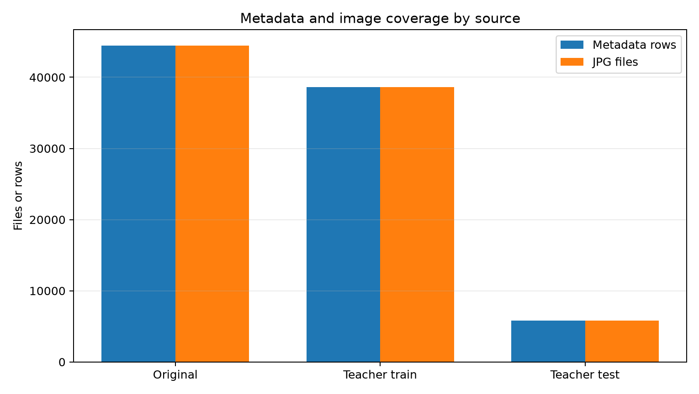
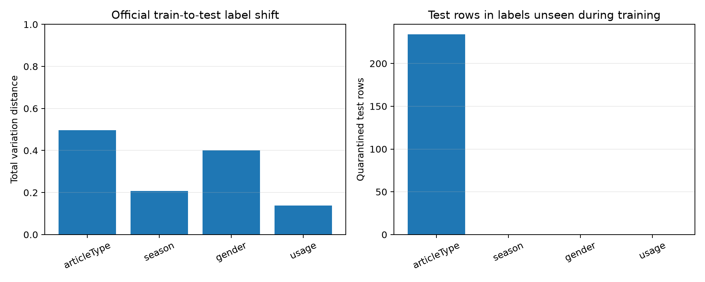
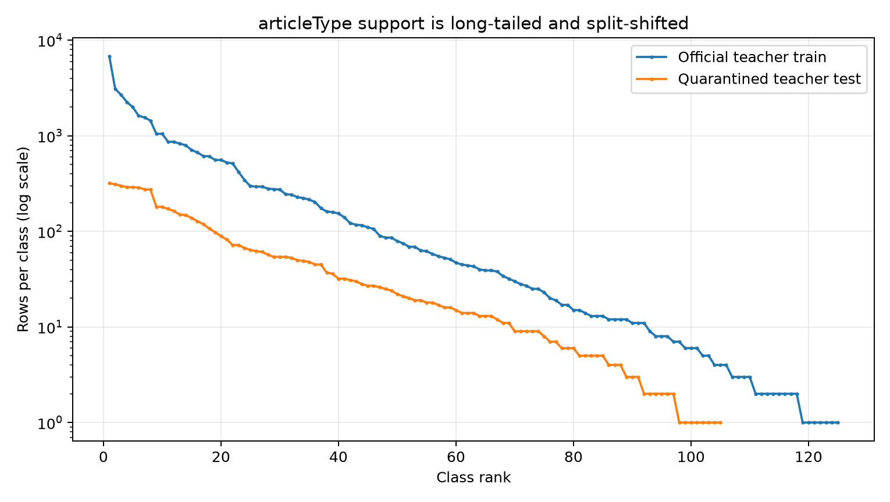
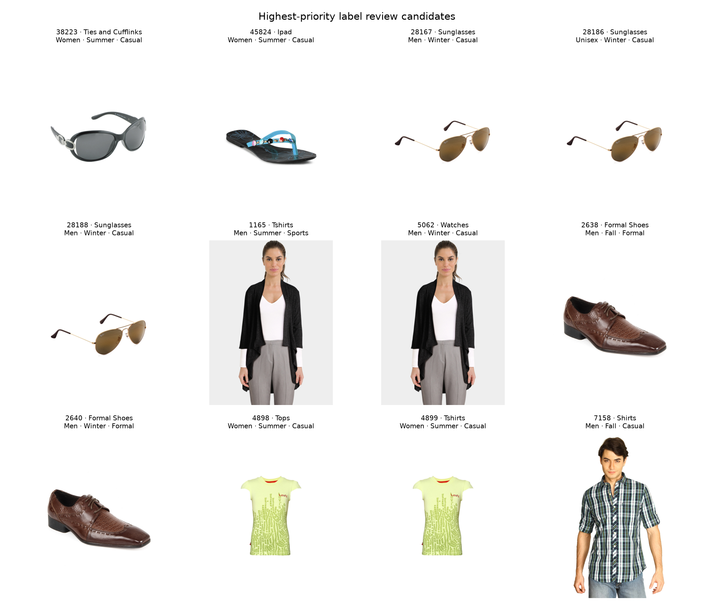

# Fashion Dataset Quality Comparison

Generated from the fresh machine-readable audit at
`results/figures/dataset-comparison/comparison-summary.json`
(2026-08-17T13:07:45.942576+00:00).

## Bottom line

The original dataset is better for **image quality**, but it is not a cleaner independent
source of labels. Every shared teacher-train label matches the original metadata, and the
restored teacher directory now has every source image available for its train IDs. The
safest assignment dataset is:

1. the official 38,617 teacher-train IDs;
2. joined to the original high-resolution images and metadata for those IDs only; and
3. with all 5,829 official test IDs and recovered labels
   quarantined from training, tuning, feature selection, and model comparison.

Training on all 44,446 original rows would expose the
official answer key and invalidate the held-out evaluation.

## What was compared

- Original source: 44,446 metadata rows,
  44,441 JPGs,
  44,446 JSON records, and
  44,446 URL records.
- Teacher train: 38,617 metadata rows and
  38,612 JPGs currently present.
- Teacher test: 5,829 blank prediction rows and
  5,829 JPGs.
- ID proof: the original IDs are exactly the disjoint union of teacher train and teacher
  test IDs.

## Teacher training copy is restored

The current `data/raw/teacher/train/images_train/` directory reconciles with the source:

- expected metadata rows: 38,617;
- present JPGs: 38,612;
- metadata rows without a JPG: 5;
- missing JPGs recoverable from the original image directory:
  0;
- known metadata-only IDs missing from both sources:
  12347, 39401, 39403, 39410, 39425;
- teacher-train image coverage among source-available rows: 100%.

The older EDA also recorded 38,612 teacher images. The five remaining gaps are
the same metadata-only IDs absent from the original image collection, so they are source
orphans rather than failed transfers.

## Label quality

### Shared labels are the same

All nine compared metadata fields match on every shared teacher-train ID. The original CSV
is therefore not an independent relabelling. It cannot be called “better labelled” merely
because it is larger.

The original JSON audit found 0 CSV-to-JSON field disagreements
across 44,446 files, with
0 JSON parse errors. This is useful corroboration,
but both artefacts come from the same catalogue source.

### The official test population is shifted

The split is ordered by product ID rather than randomly mixed: teacher-train IDs end at
51,999, while teacher-test IDs start at
52,003. This catalogue/time boundary helps explain why the
target distributions differ so much.

`articleType` has total-variation distance
0.496 between teacher train and quarantined test labels.
There are 18 article types absent from
official training but present in the test set, covering
234 test rows
(4.0%).

Those unseen labels are: Face Moisturisers (61), Face Wash and Cleanser (28), Sunscreen (25), Bath Robe (20), Hair Colour (19), Lip Care (16), Mascara (13), Mask and Peel (12), Body Lotion (6), Eye Cream (6), Nail Essentials (6), Face Scrub and Exfoliator (5), Toner (5), Beauty Accessory (4), Makeup Remover (4), Face Serum and Gel (2), Hair Accessory (1), Mens Grooming Kit (1).

This is a dataset-design limitation: a classifier cannot learn a class with zero training
examples. It also means a single random validation split from teacher train will not mimic
the official test distribution.

### Weird and suspicious labels

- `articleType` classes in official train:
  125.
- Singleton `articleType` classes:
  7.
- `articleType` classes with fewer than 10 rows:
  33.
- `articleType` hierarchy conflicts:
  20.
- Product-name versus gender review candidates:
  392.
- Exact-image groups with at least one target conflict:
  22.
- Exact-image conflict groups by target: gender: 8, articleType: 7, season: 9, usage: 3.

Two high-priority known candidates remain: 38223 — Ties and Cufflinks — Polaroid Women Sunglasses; 45824 — Ipad — Senorita Women Blue Flats.

These are review candidates, not automatic corrections. In particular, season and usage
are merchandising labels and may genuinely differ even when pixels are identical.

## Image quality

The original collection has a median resolution of
1.56 megapixels and a median file size of
306 KiB. The currently present teacher-train
images have a median resolution of 0.0048 megapixels
and a median file size of 14 KiB.

The same-ID sample compared 512 teacher images with their
original files:

- median source-to-teacher pixel ratio:
  324.0×;
- median source-to-teacher file-size ratio:
  25.8×;
- median dHash distance:
  0.0;
- pairs at dHash distance 6 or less:
  100.0%;
- median resized-image PSNR:
  43.5 dB.

This supports using the original image for the same official train ID: it retains much more
detail while still depicting the same product. It does not justify adding the official
test IDs.

Integrity checks found 0 original header
errors and 0 failures in the
512-file original decode sample.
All 38,612 currently present teacher-train JPGs and all
5,829 test JPGs were decoded; their failure counts are
0 and
0.

## Duplicate and leakage risk

Full-file SHA-256 hashing found 652 exact duplicate groups covering
1,431 original images. Of these,
11 groups cross the official train/test boundary.
Those groups can inflate apparent generalisation if duplicate products appear on both
sides.

The perceptual analysis is deliberately a sample and a review queue. Threshold growth was:
d≤0: 38 pairs, largest component 5; d≤2: 275 pairs, largest component 22; d≤4: 1,201 pairs, largest component 99; d≤6: 4,251 pairs, largest component 345. A large component at a loose threshold is not proof that all members are
duplicates; transitive chaining can join unrelated catalogue photos.

## Recommendation

Use **official teacher-train IDs plus original high-resolution files**. Keep the teacher
test ID list immutable and exclude those IDs before any preprocessing. Preserve literal
`"NA"` separately from true blanks. Group confirmed exact duplicates before making a
development split. Review suspicious labels manually and record any correction policy;
do not silently edit raw CSVs.

For evaluation, report macro-F1 and per-class support. The severe long tail and unseen test
classes make accuracy alone misleading.

## Limits

- Full image headers and hashes were scanned, but full pixel decoding of the 14 GiB original
  collection used a deterministic sample of 512.
- Near-duplicate analysis used a deterministic sample of
  2,048; it is not an exhaustive visual
  duplicate census.
- Aggregate quarantined test-label statistics have now been inspected. They must not be
  used to tune choices.
- Product-name checks are heuristics. Human review is required before changing labels.
