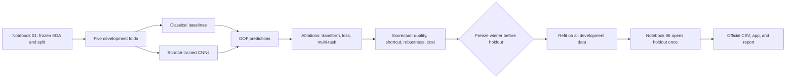

# Task 2 - Fashion Season Classification

## Short conclusion

Task 2 is not difficult because it has four classes. It is difficult because
**season is a weak visual label**: many products do not show an obvious season in a
catalogue image. The data also contains strong acquisition traces from collection year
and JPEG compression. A CNN may obtain a good score by learning those traces instead of
learning the clothing itself.

Recommended direction:

1. Use the five existing `cv_fold` values. Each product receives exactly one
   out-of-fold prediction.
2. Compare five levels: majority, HOG + colour + SVM, a small CNN, ResNet18, and
   MobileNetV3-Small.
3. Every submitted model must be trained from scratch. TorchVision models must use
   `weights=None`.
4. Test two justified improvements on the strongest architecture:
   - class-balanced loss;
   - multi-task training with `season` as the main target and `articleType` as an
     auxiliary target, while keeping inference image-only.
5. Select the model with a scorecard covering quality, robustness, calibration, speed,
   and size. Do not select by accuracy alone.
6. Freeze every choice before Notebook 06 opens the holdout once.

No plan can guarantee a full mark because the mark also depends on real results and the
quality of the final written argument. This plan covers the HD signals in the assignment
and rubric. Following it with real evidence, honest limitations, and no leakage gives the
strongest defensible submission path.

## Contents

1. [Material reviewed](#1-material-reviewed)
2. [Current project state](#2-current-project-state)
3. [Task 2 contract](#3-task-2-contract)
4. [What the EDA shows](#4-what-the-eda-shows)
5. [Problems that must be solved](#5-problems-that-must-be-solved)
6. [Solution design](#6-solution-design)
7. [Experiment matrix](#7-experiment-matrix)
8. [Evaluation and model selection](#8-evaluation-and-model-selection)
9. [Final Notebook 03 structure](#9-final-notebook-03-structure)
10. [Completion plan](#10-completion-plan)
11. [Knowledge to understand](#11-knowledge-to-understand)
12. [HD checklist and sources](#12-hd-checklist-and-sources)

## 1. Material reviewed

- All nine pages of `docs/COSC2753_2026B_Assignment 2.pdf`, including the Task 2,
  HD/DI, and submission requirements.
- `rubrics/RUBRIC.md`: Approach 50, Ultimate Judgement 30, and Presentation 20. The
  rubric does not award a separate accuracy mark.
- `AGENTS.md`, the repository README files, roadmap, notebook guide, and active
  decision records.
- The complete `notebooks/03_task2_season.ipynb` scaffold, Notebook 00, the Season,
  shortcut, and transform evidence in Notebook 01, and the holdout lock in Notebook 06.
- The APIs under `src/fashion/data/`, the canonical split, label maps, class summaries,
  and generated figures and evidence.
- The current environment: Python 3.12.13 and an RTX 4070 Laptop GPU with 8 GB VRAM.
  PyTorch, TorchVision, scikit-learn, and scikit-image are not yet pinned or installed in
  `.venv`.
- The original papers and official documentation listed at the end of this report.

## 2. Current project state

| Area | Current state | Meaning for Task 2 |
|---|---|---|
| Data and EDA | Complete and executed | Modelling can begin |
| Split | `32,773 development`, `5,778 holdout`, `61 quarantine` | Do not create another split |
| CV | Five folds with no family crossing | Fair comparisons are possible |
| Season label | Four classes and 20 blank labels | Filter with `has_season_label` |
| Notebook 03 | Execution-ready scaffold after this change | Code, outputs, and findings still need to be filled |
| `fashion.train.registry` | Does not exist | Large experiments must wait for Phase 0 |
| `results/runs.csv` | Does not exist | There is no model evidence yet |
| Training packages | Not pinned or installed | Phase 0 is required first |

Important: **do not write a large training loop directly in the notebook**. Build the
reusable dataset, training, metric, checkpoint, and registry paths under `src/fashion/`.
Notebook 03 should orchestrate those functions and tell the evidence-backed story.

## 3. Task 2 contract

| Item | Frozen decision |
|---|---|
| User | Catalogue staff who need a suggested or checked season label |
| Inference input | Image only; `id` is used only to locate the image and write output |
| Output | One of `Fall`, `Spring`, `Summer`, or `Winter` |
| Unit | One product ID, not an augmentation or duplicate row |
| Missing labels | Exclude the 20 blank Season rows from training and validation; do not impute |
| Task 2 data | Teacher images only, following decision 0015 |
| Forbidden inputs | Do not use year, file size, true `articleType`, or other metadata at inference |
| App behaviour | The app may request human review when confidence is low |
| Official CSV | Always emit one label; the CSV cannot abstain or leave Season blank |

`articleType` may be used only as an **auxiliary training label** in the multi-task
experiment. It must not be supplied to the model at inference.

## 4. What the EDA shows

### 4.1 Evidence that must guide the experiments

| Development-only evidence | Value | Consequence |
|---|---:|---|
| Rows with a valid Season label | 32,753 / 32,773 | Only 20 rows are excluded |
| Summer | 16,235 - 49.57% | The majority baseline is strong |
| Fall | 8,928 - 27.26% | Second-largest class |
| Winter | 6,261 - 19.12% | Sufficient training support |
| Spring | 1,329 - 4.06% | Minority recall can be ignored by accuracy |
| Largest-to-smallest ratio | 12.22:1 | Accuracy cannot be the selection metric |
| Season presence across folds | 4/4 classes in every fold | No class is untrainable |
| ArticleType-majority agreement | 65.05% versus global 49.57% | Article-type shortcut risk |
| ArticleType-Season NMI | 0.174 | Related, but not interchangeable |
| Rows from 2011-2012 | 22,896 - 69.9% | Data is concentrated in one acquisition era |
| Year-majority agreement | 74.46% | Strong acquisition-shortcut warning |
| Median Fall file size | 2.2 KiB | Very different compression trace |
| Median size of the other seasons | 15.0-18.1 KiB | Compression artifacts may survive decoding |

Internal evidence:

- `results/evidence/data_preparation/target_summary.csv`
- `data/processed/development_class_summary.csv`
- `results/evidence/data_preparation/acquisition_shortcut_summary.csv`
- `results/evidence/data_preparation/joint_target_nmi.csv`
- `results/figures/data_preparation/acquisition_shortcut_risk.png`
- `results/figures/data_preparation/season_file_size_shortcut.png`
- `results/figures/data_preparation/shortcut_risk_heatmaps.png`
- `results/figures/data_preparation/transform_risk.png`

### 4.2 What the EDA does not prove

- The 74.46% year-majority lookup is a description on the same data, **not** validation
  accuracy.
- Different file sizes do not prove that a CNN will use compression artifacts.
- NMI does not prove causation.
- A small contact sheet is not enough to declare Season labels correct or incorrect.

Task 2 must turn these warnings into controlled tests.

## 5. Problems that must be solved

| Problem | Risk if ignored | Required response |
|---|---|---|
| Season is visually ambiguous | Aggregate scores hide business-label ambiguity | Analyse errors by class, confidence, and real images |
| Spring is only 4.06% | The model predicts Summer too often | Use a four-class balanced primary metric and test class-balanced loss |
| Images are about 60 x 80 | A large stem removes detail too early | Use a 3 x 3 stride-1 ResNet stem and compare input sizes |
| Stretching or cropping changes shape | Product edges are lost or distorted | Preserve aspect ratio, use neutral padding, and avoid default centre crops |
| `articleType` shortcut | The model learns rules such as watches implying Winter | Measure aligned/conflict slices and run a multi-task ablation |
| Year/JPEG shortcut | CV looks good but real images fail | Test JPEG re-encoding and analyse year and file-size groups |
| Family or duplicate leakage | Validation is artificially high | Use only the saved `cv_fold` values and evaluate at product level |
| Miscalibrated confidence | The app is confidently wrong | Report NLL, Brier score, reliability, and risk-coverage |
| Heavy model | App integration becomes impractical | Compare latency, memory, model file size, and parameter count |
| Early holdout access | Independent evaluation is lost | Freeze config and hashes before Notebook 06 |

## 6. Solution design



### 6.1 Validation

Use **all five precomputed folds**.

```python
from fashion.data.dataset import iter_cv_folds, load_splits

splits = load_splits()
for fold, training, validation in iter_cv_folds(splits):
    training = training[training["has_season_label"]].copy()
    validation = validation[validation["has_season_label"]].copy()
```

Do not use `train_test_split`, `KFold`, `StratifiedKFold`, or a sampler to create new
folds. A fold-0 smoke run checks code only; its number is not comparison evidence.

### 6.2 Transforms

Compare two input sizes on the same ResNet18 and with the same budget:

- P0: `(height, width) = (80, 60)`, close to the source size;
- P1: `(128, 96)`, upscaled while preserving aspect ratio.

For both:

- apply EXIF transpose, convert to RGB, resize with preserved aspect ratio, and pad;
- fit mean and standard deviation on the **training folds of that round**, using content
  pixels only;
- apply the frozen transform to validation without refitting;
- do not stretch or centre-crop by default.

After selecting the size, compare:

- A0: horizontal flip and a very mild affine transform;
- A1: A0 plus mild colour jitter.

Colour jitter is an ablation, not a default. Colour may carry genuine Season signal, so
strong jitter may remove useful evidence.

### 6.3 Models

| ID | Algorithm | Why it is needed | Constraint |
|---|---|---|---|
| B0 | Training-fold majority | Lowest reference and pipeline check | Fit the majority class on each training fold |
| B1 | HOG + HSV histogram + linear SVM | Classical shape-and-colour baseline | No metadata or compressed-file bytes |
| C1 | Four-block SmallCNN | Simple and explainable deep baseline | Kaiming initialisation, trained from scratch |
| C2 | ResNet18 with a small-image stem | Tests residual learning and capacity | `weights=None`, 3 x 3 stride 1, no first max-pool |
| C3 | MobileNetV3-Small | Tests the deployment trade-off | `weights=None`, measure real CPU latency |
| I1 | Winner plus class-balanced loss | Addresses the Spring minority | Fit weights on each training fold only |
| I2 | Multi-task shared backbone | Tests useful structure between targets | Main Season plus auxiliary ArticleType; image-only inference |
| P* | Pretrained ResNet benchmark | The specification encourages a pretrained comparison | Benchmark only; never select or submit it as final |

Multi-task loss:

```text
L_total = L_season + lambda * L_articleType
lambda in {0.1, 0.3}
```

Reject multi-task learning if Season quality or the shortcut-conflict slice becomes
meaningfully worse. This is a test for **negative transfer**, where the auxiliary task
hurts the main task.

### 6.4 Training and tuning

- Start with seed `2753`; record deterministic settings and package versions.
- Use mixed precision to fit the RTX 4070 8 GB.
- Keep effective batch size equal through gradient accumulation when necessary.
- Screen all configurations with the same eight-epoch, five-fold budget.
- Fully train finalists with the same maximum of 30 epochs, warm-up plus cosine schedule,
  and one early-stopping rule.
- Keep finalist tuning small: three predeclared `(learning rate, weight decay)` pairs.
- Run a second seed over all five folds for the final two candidates.
- Append every run, including failed runs, to `results/runs.csv` with status and error.

### 6.5 Infrastructure required before long training

Minimum shared modules:

```text
src/fashion/models/season.py
src/fashion/train/engine.py
src/fashion/train/metrics.py
src/fashion/train/registry.py
src/fashion/train/reproducibility.py
tests/train/test_registry.py
tests/train/test_metrics.py
tests/train/test_scratch_models.py
```

Minimum registry fields:

```text
run_id, task, stage, model_family, benchmark_only, scratch,
fold, seed, split_sha256, config_sha256, transform_id, loss_id,
epochs, best_epoch, primary_metric, runtime_seconds, params,
checkpoint_path, status, timestamp, hardware
```

Place candidate checkpoints under `tmp/checkpoints/task2/`. Place only the final artifact
at `models/task2_season.pt`, add it manually to the submission ZIP, and do not commit model
weights to Git.

### 6.6 Reproducibility, cache, and Git trace contract

Notebook 03 uses `run_or_load` by default. A completed run may be reused only when its
config, split, label-map, implementation, fold, seed, and artifact hashes all match.
Documentation-only changes do not invalidate training artifacts. Failed, interrupted, or
incomplete runs are never reused.

The complete local registry and candidate checkpoints remain generated files. After each
experiment gate, Git stores a compact registry snapshot, the relevant evidence tables and
figures, and the exact run IDs used by the notebook. Final weights remain outside Git, but
their SHA-256 digest and manifest are tracked and the weight file is added to the submission
ZIP.

Every planned code commit includes its tests. When a real defect is found, first commit a
regression test that reproduces it, then commit the fix separately. Failed hypotheses and
failed runs remain visible; they are not removed to make the investigation appear cleaner.
Executed experiment configs are immutable. A correction creates a new experiment ID and a
new run rather than silently changing the old evidence.

## 7. Experiment matrix

### 7.1 Execution order

| Gate | Runs | Question answered | Pass condition |
|---|---|---|---|
| G0 | 16 images per class for 100 steps, then 512 images for 2 epochs on fold 0 | Are loader, loss, backpropagation, checkpointing, caching, and registry correct? | Tiny-batch accuracy reaches at least 95%, final loss is at most 20% of initial loss, and the integration run is registered |
| G1 | B0, B1, C1, C2, C3; 8 epochs x 5 folds | Which families deserve full training? | Every valid row has one OOF prediction |
| G2 | P0/P1 and A0/A1 on C2 | Which size and augmentation help? | Same model, seed, and budget |
| G3 | Top two families; full budget x 5 folds | Which model wins fairly? | Stable learning curves and no epoch cherry-picking |
| G4 | I1 and I2; full budget x 5 folds | Do improvements solve EDA problems? | Primary and slice evidence are both available |
| G5 | Top two, second seed x 5 folds | Is the result stable? | Winner does not reverse without explanation |
| G6 | Both finalists: robustness, calibration, and cost | Which finalist is safer to deploy? | Complete comparable scorecards |

### 7.2 Experiment stopping rules

- Do not add a sixth architecture unless it answers a new question.
- Stop tuning if confidence intervals substantially overlap while cost clearly increases.
- If time is short, remove one secondary model before removing error analysis,
  robustness, or report evidence.
- Never report only the best fold.

## 8. Evaluation and model selection

### 8.1 Primary metric

The primary metric is **pooled out-of-fold macro-F1** over exactly four labels, with each
product ID appearing once.

Macro-F1 calculates F1 for each class and takes their unweighted mean. Spring therefore
has equal influence to Summer. Set
`labels=["Fall", "Spring", "Summer", "Winter"]` and `zero_division=0` explicitly.

Secondary evidence:

- mean and standard deviation of fold macro-F1;
- per-class precision, recall, F1, and support;
- count and row-normalised confusion matrices;
- accuracy and balanced accuracy;
- NLL, multiclass Brier score, and a reliability diagram;
- batch-one CPU/GPU p50 and p95 latency, model size, and parameter count;
- training time and peak VRAM.

### 8.2 Uncertainty

- Use a paired bootstrap over `product_family_group`, not independent rows.
- Report a 95% confidence interval for the difference in pooled OOF macro-F1 between the
  two finalists.
- A family is a conservative blocking unit, not a verified SKU. Describe the interval as
  conservative too.

### 8.3 Predeclared slices and shortcut tests

| Slice or test | Method | Question |
|---|---|---|
| Spring | Separate recall and F1 | Does the model ignore the minority class? |
| ArticleType-aligned | True Season equals the training-fold ArticleType majority | How well does the model perform when the shortcut is correct? |
| ArticleType-conflict | True Season differs from that majority | Can the model work when the shortcut is wrong? |
| Year | 2011-2012 versus other years | Does it depend on the acquisition era? |
| File size | Quartiles fitted on the training fold | Is it sensitive to compression traces? |
| Family size | Singleton versus multi-row family | Does quality come from near-related products? |
| Greyscale/RGB | Use the existing structural mask | Does it fail on a rare image mode? |
| JPEG re-encode | Decode and encode at a fixed quality of 85 | What happens when compression traces change? |
| Brightness/blur | Brightness +/-15% and blur radius 1 | Do mildly degraded user images break it? |

Year and file size are used only to **slice predictions after inference**. They are never
model features.

### 8.4 Explainability and failure analysis

- Produce Grad-CAM for three correct and three incorrect examples per class, selected by
  a fixed confidence-then-ID rule.
- Check whether attention falls on the product or on borders and background.
- Create a contact sheet with ID, true label, prediction, confidence, ArticleType, year
  group, and failure note.
- Classify failures as label ambiguity, weak data, shortcut, transform, imbalance, or
  model limitation.
- Do not present only attractive examples.

### 8.5 Ultimate Judgement rule

1. Rank candidates by pooled OOF macro-F1.
2. Select P1 over P0 only for a gain of at least 0.5 percentage points. Select A1 over
   A0 only for a gain of at least 0.3 points and no robustness loss greater than one
   point. If tuning configurations differ by less than 0.3 points, retain T0.
3. Keep I1 only when Spring F1 improves by at least one point, overall macro-F1 falls by
   no more than 0.2 points, and no class loses more than two points.
4. Keep I2 only when overall macro-F1 improves by at least 0.3 points, or its
   ArticleType-conflict score improves by at least one point while overall macro-F1 loses
   no more than 0.2 points.
5. The winner must not have a much larger ArticleType-conflict or JPEG drop than its
   competitor.
6. If macro-F1 differs by less than 0.5 percentage points and the paired 95% interval
   contains zero, choose the smaller or faster model when its robustness is no more than
   one point worse.
7. State which models were rejected and why.
8. Freeze the `run_id`, config hash, metric, transform, label map, epoch rule, and
   checkpoint rule before holdout access.

After freezing:

- refit the exact configuration on all development rows with a valid Season label;
- use the median best epoch from CV, never holdout early stopping;
- refit mean, standard deviation, and class weights on all development data;
- fit one temperature scalar from development OOF logits if the app needs confidence;
- allow only Notebook 06 to request `evaluation_unlocked=True`;
- evaluate holdout once and do not modify the model afterward.

The app may use the OOF risk-coverage curve to choose a human-review threshold. The
official CSV must still contain all 5,829 rows and the exact required schema.

## 9. Final Notebook 03 structure

Notebook 03 keeps 15 top-level numbered sections. Every leaf `###` subsection owns
exactly one code cell followed by one interpretation prompt. A broader `###` subsection
owns no direct code cell; it is divided into `####` subsubsections, and every `####` leaf
owns exactly one code cell and one interpretation prompt.

| Section | Final purpose |
|---|---|
| 1. Task contract and reproducibility | Freeze user, image-only input, labels, seed, paths, and environment |
| 2. Data and EDA handoff | Reproduce valid counts, class balance, fold support, and saved EDA evidence |
| 3. Development-validation protocol | Build five fold views and verify one OOF prediction per product |
| 4. Preprocessing and leakage controls | Fit fold-only transforms and compare P0/P1 and A0/A1 |
| 5. Baselines | Run B0 majority and B1 HOG + HSV + linear SVM |
| 6. Scratch model families | Define and audit C1 SmallCNN, C2 ResNet18, and C3 MobileNetV3-Small |
| 7. Training and run registry | Smoke-test the engine and prove every run is registered |
| 8. Controlled experiment matrix | Run screening, transform, improvement, and seed ablations |
| 9. Cross-validated results | Build the OOF leaderboard, per-class evidence, calibration, and curves |
| 10. Error and shortcut analysis | Analyse Spring, ArticleType, year, file size, family, and image mode |
| 11. Robustness and efficiency | Test controlled perturbations and deployment cost |
| 12. Explainability and failure cases | Produce deterministic examples, Grad-CAM, and a failure taxonomy |
| 13. Statistical and external comparison | Run paired family bootstrap and make qualified literature comparisons |
| 14. Ultimate Judgement and freeze | Apply the fixed scorecard, reject alternatives, and write the freeze manifest |
| 15. Handoff to final evaluation | Audit artifacts and hand the frozen model to Notebook 06 without opening holdout |

Notebook presentation rules:

- Each important code cell has a short Markdown interpretation immediately after it.
- Reusable logic belongs in `src/fashion/`; the notebook contains orchestration and
  evidence.
- Save report figures under `results/figures/task2/`.
- Save compact evidence tables under `results/evidence/task2/`.
- Generate `results/notebooks/03_task2_season.html` after a clean Run All.
- Do not write fabricated results or a “best model” claim before real runs finish.

## 10. Completion plan

### Phase 0 - Shared infrastructure, 1-2 days

- [ ] Add and pin PyTorch, TorchVision, scikit-learn, and scikit-image; resolve
  `requirements/constraints-py312.txt` following decision 0006.
- [ ] Build the training engine, metrics, checkpointing, registry, and scratch-weight
  audit.
- [ ] Test `load_splits()` and prohibit direct reads of `splits.csv` in training code.
- [ ] Test safe registry append and stable schema.
- [ ] Test that final models use `weights=None` and never download weights.
- [ ] Run `pip check`, lint, and the full test suite.

**Gate:** do not start long GPU runs before Phase 0 passes.

### Phase 1 - Freeze the protocol, half a day

- [ ] Record Task 2 ownership and contract.
- [ ] Freeze five-fold CV, primary metric, labels, seed, OOF aggregation, and slices.
- [ ] Record decisions in Notebook 03 before viewing model results.
- [ ] Store CV digest
  `bad7bc4ae65fbbfd815567f4ccfa308d6e57dc650bc15c0b8e798867a335f2fd`
  in every run.

### Phase 2 - Smoke tests and baselines, 1 day

- [ ] Overfit a tiny batch to detect label/image-ordering errors.
- [ ] Run B0 and B1 over five folds.
- [ ] Run a C1 smoke test and equal-budget screen.
- [ ] Verify that every valid development ID appears once in OOF predictions and that
  holdout and quarantine are absent.

### Phase 3 - Comparison and tuning, 3-5 days

- [ ] Screen C1, C2, and C3 under the same budget.
- [ ] Run P0/P1 and A0/A1 transform ablations.
- [ ] Fully train the best two families.
- [ ] Run three small, predeclared tuning configurations on finalists.
- [ ] Run I1 and I2.
- [ ] Run the pretrained benchmark with `benchmark_only=true`.
- [ ] Run a second seed for both finalists over all five folds.

### Phase 4 - Analysis, 1-2 days

- [ ] Produce the OOF comparison table, confidence interval, and confusion matrices.
- [ ] Produce every predeclared slice and robustness test.
- [ ] Produce calibration, risk-coverage, and Grad-CAM contact sheets.
- [ ] Measure CPU/GPU latency, model size, RAM/VRAM, and training time.
- [ ] Write the failure taxonomy using real product IDs.

### Phase 5 - Freeze and independent evaluation, 1 day

- [ ] Select the winner with the frozen rule, not intuition.
- [ ] Record run ID, config hash, checkpoint rule, and limitations.
- [ ] Refit on all development data.
- [ ] Hash the final model and config.
- [ ] Hand off to Notebook 06.
- [ ] Open holdout once and never return to tuning.

### Phase 6 - Prediction, app, and report, 1-2 days

- [ ] Produce exactly `id,gender,articleType,season,usage`; Task 2 fills only `season`
  inside the shared pipeline.
- [ ] Validate 5,829 IDs, order, four allowed labels, and no blanks.
- [ ] Integrate image upload, label, probabilities, review flag, and latency in the app.
- [ ] Generate report tables and figures from artifacts rather than hand-copying values.
- [ ] Export Notebook 03 to HTML and verify Run All in a clean environment.

### Definition of done

Task 2 is complete only when all of the following exist:

- [ ] `results/runs.csv` contains every run and hash;
- [ ] OOF predictions cover all 32,753 valid development rows;
- [ ] at least three genuinely different algorithm families were evaluated;
- [ ] at least one improvement was implemented and evaluated;
- [ ] error, shortcut, robustness, calibration, and cost evidence is complete;
- [ ] the winner was frozen before holdout access;
- [ ] one independent holdout evaluation exists;
- [ ] a final scratch-trained checkpoint and inference function exist;
- [ ] the official prediction file is valid;
- [ ] the notebook reruns and every figure/table traces back to a run ID.

## 11. Knowledge to understand

| Topic | Required understanding |
|---|---|
| Multiclass classification | Logits, softmax, confusion matrix, precision, recall, and F1 |
| Class imbalance | Why accuracy favours Summer and why reweighting is fitted per training fold |
| CNNs | Convolution, receptive field, pooling, batch normalisation, and dropout |
| Residual networks | How skip connections help deep training and why the stem changes for small images |
| Mobile models | Depthwise convolution and the parameter/latency trade-off |
| Cross-validation | OOF predictions, fold mean/SD, and why the best fold is never selected |
| Leakage | Duplicate/family leakage, learned preprocessing, and protected holdout |
| Shortcut learning | A signal that predicts this dataset but does not represent the intended task |
| Multi-task learning | Shared backbone, auxiliary loss, and negative transfer |
| Calibration | Whether confidence matches empirical correctness; NLL, Brier, and reliability |
| Robustness | Controlled perturbations and performance drops |
| Explainability | Grad-CAM as a diagnostic, not causal proof |
| Statistical comparison | Paired family bootstrap and confidence intervals |
| Deployment | Batch-one latency, model hash, deterministic preprocessing, and human review |

## 12. HD checklist and sources

### 12.1 Direct rubric mapping

| Rubric signal | Required Task 2 evidence |
|---|---|
| Approach - multiple algorithms | B0/B1/C1/C2/C3/I1/I2 plus a pretrained benchmark |
| Approach - preprocessing | P0/P1, A0/A1, and fold-fitted normalisation |
| Approach - tuning | Equal-budget screen, three finalist configs, and run registry |
| Approach - unique problem | 60 x 80 images, Spring minority, Season ambiguity, and year/JPEG/ArticleType shortcuts |
| Approach - beyond class | Class-balanced loss, multi-task learning, Grad-CAM, calibration, and paired bootstrap |
| Approach - app | Image-only inference, confidence/review flag, and measured latency |
| Ultimate Judgement | Frozen winner rule, rejected alternatives, and limitations |
| Independent evaluation | Holdout opened once plus a qualified literature comparison |
| Real-world viability | Robustness, calibration, cost, failure examples, and human review |
| Presentation | One scorecard and one claim-focused figure; details in the appendix |

Within the five-page group report, Task 2 should use about 0.75-1 page:

- one paragraph for the problem and EDA evidence;
- one model scorecard;
- one useful confusion or robustness figure;
- one Ultimate Judgement and limitations paragraph.

Put per-class tables, intervals, Grad-CAM, and extra plots in the appendix. Every numeric
claim must point to a run ID or generated artifact.

### 12.2 Authoritative sources

1. The RMIT assignment PDF and repository rubric are the primary requirement sources.
2. He et al., [Deep Residual Learning for Image Recognition](https://openaccess.thecvf.com/content_cvpr_2016/html/He_Deep_Residual_Learning_CVPR_2016_paper.html), CVPR 2016.
3. Howard et al., [Searching for MobileNetV3](https://openaccess.thecvf.com/content_ICCV_2019/papers/Howard_Searching_for_MobileNetV3_ICCV_2019_paper.pdf), ICCV 2019.
4. Dalal and Triggs, [Histograms of Oriented Gradients for Human Detection](https://doi.org/10.1109/CVPR.2005.177), CVPR 2005.
5. Cui et al., [Class-Balanced Loss Based on Effective Number of Samples](https://openaccess.thecvf.com/content_CVPR_2019/html/Cui_Class-Balanced_Loss_Based_on_Effective_Number_of_Samples_CVPR_2019_paper.html), CVPR 2019.
6. Caruana, [Multitask Learning](https://doi.org/10.1023/A:1007379606734), Machine Learning 1997.
7. Geirhos et al., [Shortcut Learning in Deep Neural Networks](https://www.nature.com/articles/s42256-020-00257-z), Nature Machine Intelligence 2020.
8. Selvaraju et al., [Grad-CAM](https://openaccess.thecvf.com/content_ICCV_2017/html/Selvaraju_Grad-CAM_Visual_Explanations_ICCV_2017_paper.html), ICCV 2017.
9. Guo et al., [On Calibration of Modern Neural Networks](https://proceedings.mlr.press/v70/guo17a.html), ICML 2017.
10. Scikit-learn, [F1 score definition](https://scikit-learn.org/stable/modules/generated/sklearn.metrics.f1_score.html) and [probability calibration guide](https://scikit-learn.org/stable/modules/calibration.html).
11. TorchVision, [models and random initialisation with `weights=None`](https://docs.pytorch.org/vision/stable/models.html) and [MobileNetV3](https://docs.pytorch.org/vision/stable/models/mobilenetv3.html).
12. Seo et al., [Classification of fashion e-commerce products using ResNet-BERT](https://journals.plos.org/plosone/article?id=10.1371/journal.pone.0324621), PLOS One 2025: the same Fashion Product Images dataset but different targets, resolution, pretraining, and multimodal inputs.
13. Kolisnik et al., [Condition-CNN](https://www.sciencedirect.com/science/article/pii/S0957417421006291), Expert Systems with Applications 2021: the same dataset for hierarchical classification, not a direct Season benchmark.

The limited search found no peer-reviewed benchmark matching **Season + the current
teacher split + scratch-only training + the current metric**. Literature can therefore
compare objectives, data, splits, and assumptions, but its scores must not be presented
as directly comparable.

## Errors that must be avoided

- Creating another split or calling `train_test_split`.
- Reading holdout labels before the freeze.
- Using `pretrained=True`, `weights=DEFAULT`, or an external checkpoint for the final
  model.
- Using year, file size, or target metadata as inference features.
- Fitting mean, standard deviation, or class weights on all development data during CV.
- Oversampling validation or holdout.
- Selecting the best fold, cherry-picking an epoch after holdout, or changing the metric
  after viewing results.
- Calling the 74.46% year-majority agreement a model accuracy.
- Reporting only accuracy and ignoring Spring.
- Hand-copying numbers into the report without run IDs and artifacts.
- Comparing scores from a different target or split as though they were the same
  benchmark.
