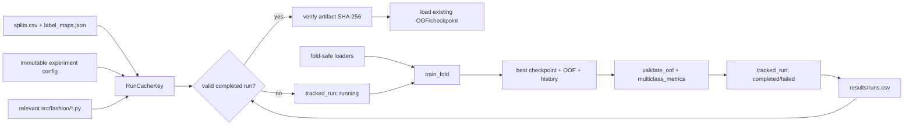
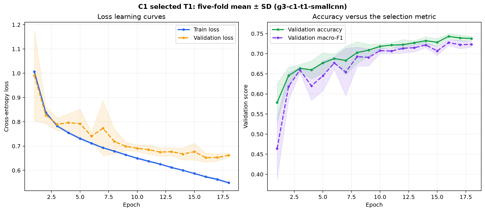
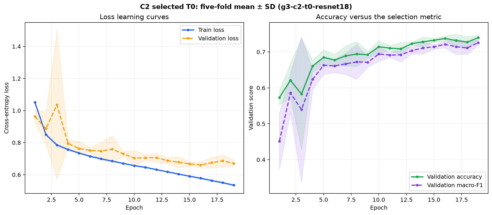
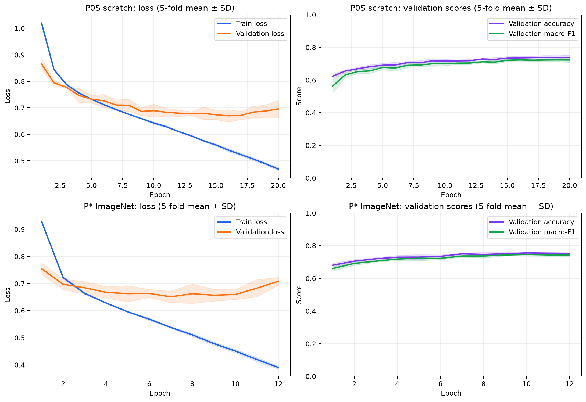
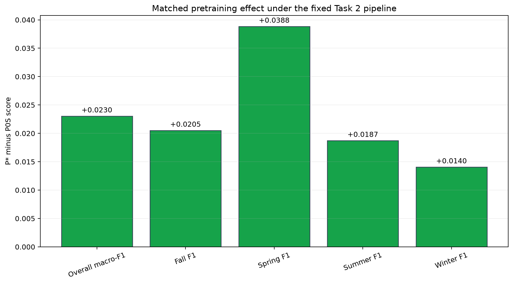
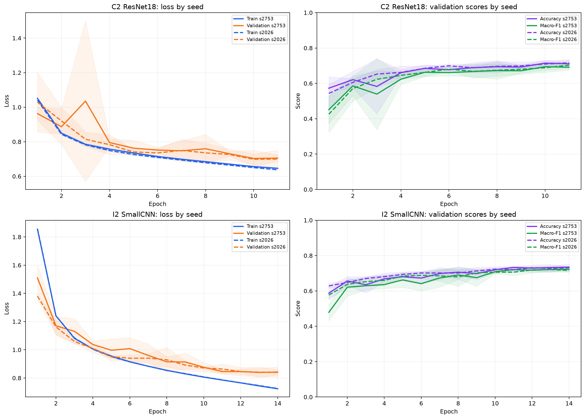
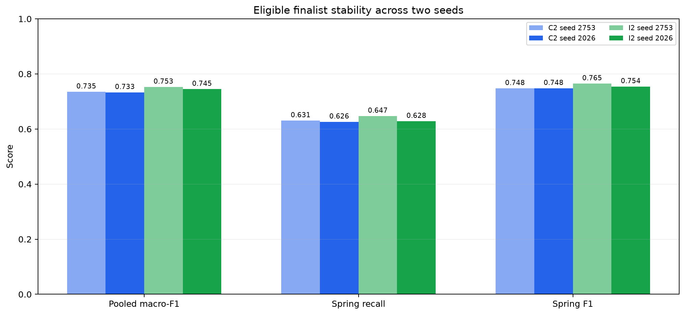
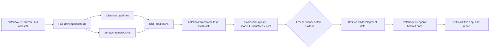
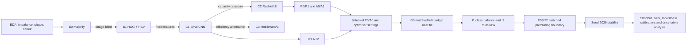

# Task 2 - Fashion Season Classification

## Short conclusion

Task 2 is not difficult because it has four classes. It is difficult because
**season is a weak visual label**: many products do not show an obvious season in a
catalogue image. The data also contains strong acquisition traces from collection year
and JPEG compression. A CNN may obtain a good score by learning those traces instead of
learning the clothing itself.

Recommended direction:

1. Use the five existing `cv_fold` values. Each product receives exactly one
   out-of-fold prediction.
2. Compare five levels: majority, HOG + colour + SVM, a small CNN, ResNet18, and
   MobileNetV3-Small.
3. Every submitted model must be trained from scratch. TorchVision models must use
   `weights=None`.
4. Test two justified improvements on the strongest architecture:
   - class-balanced loss;
   - multi-task training with `season` as the main target and `articleType` as an
     auxiliary target, while keeping inference image-only.
5. Select the model with a scorecard covering quality, robustness, calibration, speed,
   and size. Do not select by accuracy alone.
6. Freeze every choice before Notebook 06 opens the holdout once.

Current position on 31 August 2026: corrected G3, I1, I2, the matched pretrained
boundary, G5 seed stability, shortcut/error slices, robustness/cost, calibration,
paired grouped-bootstrap uncertainty, deterministic Grad-CAM/failure review, and the
G7 Ultimate Judgement is complete. I2 lambda `0.3` is the
**frozen Task 2 winner**. It
reached `0.752687` pooled OOF
macro-F1 at seed `2753` and `0.744743` at seed `2026`; C2 reached `0.735036` and
`0.733137`. The I2-minus-C2 paired family-bootstrap intervals are
`[0.013050, 0.022453]` at seed `2753` and `[0.005793, 0.017341]` at seed `2026`.
Both fitted pairs favour I2, but two seeds do not prove the ordering for every random
initialisation. The fixed 48-row Grad-CAM review found no empty heatmap or declared
border/background flag, but its selected severe errors still expose shortcut conflict,
weak-data proxies, and unresolved label ambiguity. All six direct G7 checks passed, so
the cost tie-break was not needed. The immutable selection record fixes a 24-epoch,
development-only refit. An integrity review invalidated the first package, and a later
rebuild completed training but was correctly rolled back when a canonical file-order bug
was detected. Both events remain traceable. The final replacement now passes the stronger
registry, lock, transaction, source-hash, finite-value, and boundary checks. It contains
the same frozen I2 model choice, seed, 24 epochs, and 32,753 development rows; no retuning
occurred. The shared inference API and command-line launcher now load only this verified
package, accept explicit image paths, and return calibrated Season probabilities with
the run, manifest, and bundle hashes. They do not read holdout labels or write the
official prediction CSV. Holdout remains sealed.

No plan can guarantee a full mark because the mark also depends on real results and the
quality of the final written argument. This plan covers the HD signals in the assignment
and rubric. Following it with real evidence, honest limitations, and no leakage gives the
strongest defensible submission path.

## Contents

1. [Material reviewed](#1-material-reviewed)
2. [Current project state](#2-current-project-state)
3. [Task 2 contract](#3-task-2-contract)
4. [What the EDA shows](#4-what-the-eda-shows)
5. [Problems that must be solved](#5-problems-that-must-be-solved)
6. [Solution design](#6-solution-design)
7. [Experiment matrix](#7-experiment-matrix)
8. [Evaluation and model selection](#8-evaluation-and-model-selection)
9. [Final Notebook 03 structure](#9-final-notebook-03-structure)
10. [Completion plan](#10-completion-plan)
11. [Knowledge to understand](#11-knowledge-to-understand)
12. [HD checklist and sources](#12-hd-checklist-and-sources)

## 1. Material reviewed

- All nine pages of `docs/COSC2753_2026B_Assignment 2.pdf`, including the Task 2,
  HD/DI, and submission requirements.
- `rubrics/RUBRIC.md`: Approach 50, Ultimate Judgement 30, and Presentation 20. The
  rubric does not award a separate accuracy mark.
- `AGENTS.md`, the repository README files, roadmap, notebook guide, and active
  decision records.
- The complete `notebooks/03_task2_season.ipynb` scaffold, Notebook 00, the Season,
  shortcut, and transform evidence in Notebook 01, and the holdout lock in Notebook 06.
- The APIs under `src/fashion/data/`, the canonical split, label maps, class summaries,
  and generated figures and evidence.
- The verified reference environment: Python 3.12.13, PyTorch 2.13.0 with CUDA 12.6,
  TorchVision 0.28.0, and an RTX 4070 Laptop GPU with 8 GB VRAM.
- The original papers and official documentation listed at the end of this report.

## 2. Current project state

| Area | Current state | Meaning for Task 2 |
|---|---|---|
| Data and EDA | Complete and executed | The frozen model continues to use this shared contract |
| Split | `32,773 development`, `5,778 holdout`, `61 quarantine` | Do not create another split |
| CV | Five folds with no family crossing | Fair comparisons are possible |
| Season label | Four classes and 20 blank labels | Filter with `has_season_label` |
| Notebook 03 | Fixed 55-code-cell scaffold; 52 cells are implemented and three handoff cells remain | Do not change the 193-cell structure |
| Shared training core | Implemented and unit-tested | Ready for physical Task 2 runs |
| Task 2 foundation | Training, comparison, learning curves, EDA reflection, G5-G8 analysis, immutable freeze, hardened refit code, verified image-only inference, and Notebook Sections 9-14.3 are implemented | Build only the sealed handoff; do not add or retune a candidate |
| `results/runs.csv` | 122 append-only rows: 115 completed, two failed, and five interrupted | The replacement refit and both earlier lifecycle outcomes remain traceable |
| Training packages | Pinned and installed on the reference machine | CPU/CUDA selection is documented |
| Milestone C gate | `pip check`, Ruff, Notebook Run All smoke, and `162` tests passed | Foundation was pushed at commit `7eeaa75` |
| Current G8 gate | The replacement bundle, manifest, 24-row history, runtime, and one completed registry row are hash-verified; holdout remains sealed | Build the sealed handoff only after all group tasks freeze |
| Current verification | Ruff and all `541` repository tests pass, including `31` Notebook contracts; all 193 Notebook cells validate and all 55 code cells compile | G8, inference, and Notebook Section 14.3 are green |

Important: **do not write a large training loop directly in the notebook**. Build the
reusable dataset, training, metric, checkpoint, and registry paths under `src/fashion/`.
Notebook 03 should orchestrate those functions and tell the evidence-backed story.

### 2.1 Implemented shared training core

| Module | Owns | Must not own |
|---|---|---|
| `fashion.train.reproducibility` | Seeds model initialisation and training; captures runtime/Git provenance | Data splitting |
| `fashion.train.artifacts` | Atomic writes and SHA-256 verification | Model selection |
| `fashion.train.registry` | One immutable lifecycle row per physical run | Rewriting failed runs |
| `fashion.train.recovery` | Explicitly close an externally killed process as interrupted | Changing model-cache identity |
| `fashion.train.metrics` | OOF IDs, canonical truth, run identity, cached-metric validation, and fixed-label metrics | Opening the holdout |
| `fashion.train.engine` | One fold's optimisation and best checkpoint | Experiment comparison |
| `fashion.train.cache` | Exact run-or-load identity and artifact checks | Trusting Git commit alone |

The engine is deliberately lower-level than the Task 2 runner. It does not choose a
split, model, transform, or winner. This keeps later experiment comparisons explicit and
testable.

### 2.2 Runtime call order and file effects



The real execution order is:

1. Build the cache key from config, canonical data files, relevant Python source, fold,
   and seed.
2. Reuse only a completed registry row whose declared artifact bytes still match every
   SHA-256 digest.
3. On a miss, append a `running` row before optimisation starts.
4. Apply the declared seed before model construction, train exactly one fold, and write
   the best checkpoint atomically.
5. Validate OOF IDs, canonical true labels, run identity, probabilities, and cached
   metrics before attaching evidence to the run.
6. Finalise the same row as `completed`, `failed`, or `interrupted`; a terminal row is
   immutable.

Changing training code, config, split assignment, label order, fold, or seed creates a
new cache identity. Changing this Markdown report does not. The Git commit is still
recorded as provenance, but it is not used as a proxy for implementation content.

### 2.3 Implemented Task 2 foundation

| Module or artifact | Implemented responsibility |
|---|---|
| `fashion.data.torch` | Training-fold statistics, aspect-preserving P0/P1 transforms, A0/A1, and canonical loaders |
| `fashion.task2.baselines` | B0 training-fold majority with fixed four-label OOF output |
| `fashion.task2.classical` | B1 HOG plus content-only HSV features and a fold-fitted linear SVM |
| `fashion.models.season` | Scratch C1/C2/C3, benchmark-only P0S/P*, and image-only multi-task boundaries |
| `fashion.task2.experiments` | Immutable JSON configs, seeded model construction, run-or-load cache, registry lifecycle, and atomic artifacts |
| `fashion.task2.class_balance` | Frozen I1 runner with fold-fitted effective-number weights and an isolated cache identity |
| `fashion.data.multitask` | Keeps every valid Season row, masks missing ArticleType labels, and builds the final all-development loader with no validation or protected side |
| `fashion.train.multitask` | Optimises Season plus masked ArticleType loss; CV selects by Season macro-F1, while final refit runs every frozen epoch with no selection metric |
| `fashion.task2.multitask` | Enforces the frozen I2 configs, image-only inference boundary, isolated cache, and five-fold run-or-load execution |
| `fashion.task2.refit` | Verifies the G7 freeze, runs or loads one 24-epoch development refit, writes the scratch bundle, and fails closed on hash or boundary drift |
| `fashion.task2.multitask_evidence` | Fits ArticleType-to-Season mappings on four training folds only, measures aligned/conflict transfer, applies the frozen I2 gate, and draws teacher-style curves |
| `fashion.task2.pretraining` | Enforces the matched P0S/P* pair so only model identity and initial weights differ |
| `fashion.task2.pretraining_evidence` | Audits both boundaries, folds, hashes, histories, and OOF products; measures P* minus P0S without making P* selectable |
| `fashion.task2.stability` | Enforces seed-2026 clones of the retained C2 comparator and selected I2 candidate, then preflights primary-seed implementation hashes before any training |
| `fashion.task2.stability_evidence` | Audits four complete OOF packs, measures seed drift and paired-fold ordering, applies the frozen G5 rule, and draws two-seed learning curves |
| `fashion.task2.slices` and `slice_evidence` | Build leakage-safe post-inference slices, compare C2/I2 errors, and keep metadata outside model inputs |
| `fashion.task2.robustness` and `robustness_evidence` | Apply fixed perturbations, measure machine-specific cost, and compare candidates without reopening selection |
| `fashion.task2.calibration` and `calibration_evidence` | Fit five-fold cross-fitted temperatures and build probability-quality and diagnostic risk-coverage evidence |
| `fashion.task2.bootstrap` and `bootstrap_evidence` | Resample conservative family blocks, compare the two fitted seed pairs, and write hash-linked uncertainty evidence |
| `fashion.task2.evidence` | File-impact flow, complete-fold OOF packs, verified G1 ranking, audited G2-P/G2-A/G2-T/G3/I1 decisions, learning curves, and a hash-linked selection story |
| `scripts/run_task2_experiment.py` | Windows-safe shared config launcher with a guarded `main()` |
| `scripts/run_task2_i1_experiment.py` | Windows-safe launcher restricted by the frozen I1 validator |
| `scripts/run_task2_i2_experiments.py` | Runs or loads exactly the two frozen I2 lambdas |
| `scripts/build_task2_i2_evidence.py` | Loads ten verified folds and builds both OOF packs plus the closed I2 decision |
| `scripts/run_task2_pretraining_benchmark.py` | Runs or loads exactly the matched P0S/P* pair |
| `scripts/build_task2_pretraining_evidence.py` | Load-only builder for the paired benchmark evidence and figures |
| `scripts/run_task2_stability.py` | Runs or loads exactly five C2 and five I2 folds at seed `2026` after strict clone and implementation preflight checks |
| `scripts/build_task2_stability_evidence.py` | Load-only builder for four hash-verified candidate/seed OOF packs and the closed G5 decision |
| `scripts/build_task2_slice_evidence.py` | Load-only builder for shortcut and error slices from verified OOF packs |
| `scripts/build_task2_robustness_evidence.py` | Reproducible fixed-perturbation and deployment-cost evidence builder |
| `scripts/build_task2_calibration_evidence.py` | Load-only cross-fitted calibration and risk-coverage evidence builder |
| `scripts/build_task2_bootstrap_evidence.py` | Load-only 10,000-draw paired family-bootstrap evidence builder |
| `scripts/refit_task2_season.py` | Windows-safe run-or-load launcher for the frozen development-only refit |
| Notebook 03 sections 1-4 | Frozen contract, runtime, EDA handoff, folds, OOF, metrics, transforms, and leakage audit |
| Notebook 03 sections 6 and 7.2 | Scratch forward audits, benchmark rejection, state hashes, and registry health |
| Notebook 03 section 8.4 | SHA-256 verification, two-seed tables, teacher-style curves, trace table, EDA reflection, and the non-freeze G5 decision |

Measured evidence is stored under `results/evidence/task2/` and
`results/figures/task2/`. The G1 screen links capacity, training cost, and pooled OOF
quality for `1,174,244`-parameter C1, `11,170,884`-parameter C2, and
`1,521,956`-parameter C3. These values are now measured comparison evidence, not only
forward-pass capacity facts. G2-P verifies that only image size changes before applying
the frozen `+0.005` rule. G2-A then verifies that only augmentation changes before
applying the frozen `+0.003` quality and `0.010` robustness-loss rule. G2-T verifies that
only learning rate and weight decay change, then applies the frozen `+0.003` gain rule
separately to C1 and C2. G3 then verifies that the selected C1-T1 and retained C2-T0
configs differ from their G2 inputs only in the declared full training budget and
early-stopping patience. It compares all five folds, full histories, per-class metrics,
cost, and the predeclared near-tie rule without freezing an ultimate winner.
I1 then verifies that only experiment identity, stage, and loss differ from corrected
G3-C1. It audits all five fold-fitted class counts, weights, training-ID hashes,
histories, OOF predictions, and the three predeclared keep/reject criteria.
I2 verifies the auxiliary head and leakage-safe ArticleType slices without changing
image-only inference. The P0S/P* boundary then verifies identical folds, transforms,
optimiser, loss, budget, implementation hash, parameter count, and VRAM before
attributing the measured paired difference only to initial weights inside that fixed
pipeline.

### 2.4 Trace corrections kept in Git history

The history is intentionally not rewritten. These corrections help a junior understand
what actually failed:

- Commit `e9ed2c2` says 23 focused loader tests passed; the captured command actually
  reported 22. The implementation was green; only the commit-body count was wrong.
- Commit `1fb1107` was created after PowerShell continued past a failed parameter-count
  assertion. Commit `577cabc` records the corrected C1 parameter expectation.
- `63bd722` then `4cc89b3` preserve the Pandas runtime-table failure and fix.
- `757e600` then `5f83da9` preserve the uninformative all-content mask and the fix that
  selects a real letterbox example.
- `84f3faf` then `9d2a827` preserve the interactive Matplotlib dependency and the
  headless Agg fix. `2c211f5` then `dff0c80` preserve the absolute-path manifest fix.
- `3cbe0c1` then `f854db5` preserve the cached fold-stat tuple regression and fix.
- `1dd96c3` then `b12e38e` preserve the clipped rightmost G1 label and Matplotlib layout
  fix.
- `9d4e8e7` then `ba6c0f1` preserve the G1-to-G2 handoff mismatch and the correction
  that keeps transform ablations on leading C2 while retaining C1 for G3.
- `60264b9` then `6fc6568` preserve misleading execution counts on unfinished TODO
  cells and the fix that leaves only implemented cells visibly executed.
- `11dda77`, `7d70e3f`, `9d18996`, and `4407755` preserve the dirty G0 provenance
  discovery, addition of `git_dirty` to tracked evidence, clean external rerun, and
  final clean-cache Notebook handoff. The dirty physical row remains append-only.
- `22b94e1` then `e4ce303` preserve the orphaned `running`-row regression and the
  explicit external-termination recovery. `e7946eb` then `f4992e8` preserve the
  follow-up cache-boundary regression and move recovery outside model implementation
  hashing, so operational recovery cannot invalidate scientifically identical weights.
- P1 run `g2-p1-c2-resnet18-f1-s2753-7327d09ce2cf` was externally interrupted. The
  first background retry lacked a Windows `__main__` guard, leaving parent run
  `g2-p1-c2-resnet18-f1-s2753-dce57b0c7883` interrupted and worker run
  `g2-p1-c2-resnet18-f1-s2753-48ece6ab6852` failed. Commits `cf1184f` and `1fe31d4`
  add and document the guarded launcher; the five evidence runs are separate and clean.
- `358549a` then `6db73de` preserve the misleading truncated quality-bar regression and
  the point-plot fix. Signed paired-fold deltas still use a zero-centred bar chart.
- `eea0b08` then `eb9bc3c` preserve the real missing-artifact-path regression and the
  fix that keeps checkpoint, prediction, and history paths in tracked snapshots.
- `898532d` then `487e089` preserve the compressed 0-to-1 learning-curve scale and the
  adaptive score-axis fix. The chart still shows the real five-fold mean and SD.
- C2-T2 fold 2 attempt `g2-t2-c2-resnet18-f2-s2753-8e30e034fb67` ended when its parent
  PTY closed. It remains `interrupted`; the separate completed fold-2 run is the only one
  used by G2-T evidence.
- C1 full-budget fold 2 attempt `g3-c1-t1-smallcnn-f2-s2753-2283b6495a44` ended outside
  Python. It remains `interrupted`; old clean replacement
  `g3-c1-t1-smallcnn-f2-s2753-e46d771b6d56` belongs only to the withdrawn first G3
  attempt. Corrected fold-2 run `g3-c1-t1-smallcnn-f2-s2753-8439c63a5bac` is the row
  used by current G3 evidence.
- `74dad3d` then `1704d71` preserve the Notebook Run All evidence-note drift and its
  fix. The fix reuses the registered probability note, keeps unfinished TODO cells
  visibly unexecuted, and prevents a narrative-only wording change from rewriting G3
  input-manifest hashes. Commit `1e9d81b` records a second clean Run All where the G3
  manifests remained unchanged.
- Independent review then found three reproducibility gaps. `2fdb3bc` then `420cd23`
  scope Notebook validation to the ten run IDs returned by the current cache lookup,
  while historical retries remain visible but cannot break Run All. `da6d431` then
  `3baaa61` reject duplicate manifest run IDs before a fold can be double-weighted.
  `272fd2e` then `798ba6b` verify the G2 screen score against the hash-checked
  leaderboard instead of trusting a copied manifest scalar.
- `810f523` then `2a33531` make an exact-score tie deterministic: smaller parameter
  count, then lower runtime, then family name. The first local red-test attempt exposed
  that a test using the default output directory could overwrite tracked evidence; the
  committed test uses a temporary directory, and the real G3 evidence was regenerated
  from its ten hash-verified runs. Commit `61c32bc` records the clean post-review Run
  All; both learning-curve PNG hashes remained unchanged.
- `63ae24a` then `64273e6` preserve the model-initialisation seed regression and fix.
  The audit proved that model parameters were created before `train_fold` applied seed
  2753. Both the shared deep runner and I1 now seed before model construction; old G3
  cache identities are intentionally invalid.
- `895e482` then `9ad82b3` preserve three unsafe-cache regressions and their fix. Cached
  OOF now must match canonical `id -> season`, requested run/fold/seed identity, and
  metrics recomputed from its saved probabilities.
- `e4d11eb` then `77e448a` preserve the incomplete implementation-hash regression and
  add `config.py`, data hashing, metadata filtering, and split validation to every deep
  cache identity. `4cb5c1f` separately proves that fold-fitted I1 weights reach the
  actual `CrossEntropyLoss` passed into the engine.
- Commit `47442a2` freezes the corrected protocol before physical execution. Ten clean
  runs then completed with seed-controlled model initialisation and one shared
  implementation hash. Commit `f7525a9` records their hash-linked G3 evidence.
- The corrected evidence build exposed a second, separate audit defect: the validator
  used raw `max(history)` even though the engine selects a checkpoint only after a
  `min_delta` improvement. Commits `c46a0ff`, `a9c4800`, and `62e57e2` preserve the red
  regression, a real temporary-path test correction, and the sequential selection fix.
  The model checkpoints were coherent, so this audit fix required no retraining.
- Commit `eb9bd4d` refreshes only Notebook 03's G3 output and interpretation. Its
  semantic audit found no change to any other notebook cell.
- I1 fold-1 attempt `g4-i1-effective-number-c1-f1-s2753-b4387f2c1023` remained
  `running` after its parent PTY closed. Explicit recovery marked only that row
  `interrupted`; completed fold 0 was reused, and replacement fold-1 run
  `g4-i1-effective-number-c1-f1-s2753-a6b4939bacc5` is the row used by evidence.
- `af196ce` then `f02401f` preserve the clipped Fall-value label regression and the
  axis-padding fix for the I1 per-class chart. Commit `57e2fcb` records the rebuilt
  hash-linked evidence, and `68a4f48` updates only Notebook 03's I1 code, outputs,
  interpretation, and its structural contract.
- Commit `7a6bb49` freezes the masked I2 runner and evidence builder before physical
  execution. Ten clean folds then completed with one implementation hash and two config
  hashes. `7055afd` and `7b2485e` preserve a real JSON-hash failure caused by missing
  ArticleType values and the explicit `<missing>`/`<unmapped>` fix. `a995819` records the
  rebuilt hash-linked I2 evidence, and `89b52da` executes only Notebook 03's I2 leaf.
- Commits `37825d4`, `38b3491`, and `e74d0fd` declare, run, and audit the P0S/P*
  boundary before physical execution. The first real learning-curve render exposed
  overlapping panel titles. `fcbd79c` preserves the failing bounding-box regression
  test; `8f4cf4a` fixes the titles; `70f5308` records regenerated evidence; and
  `2a4b801` executes only Notebook 03's P* leaf.
- Commits `1341254`, `b6540b8`, and `99d5f90` freeze the G5 configs, load-or-run
  matrix, and four-pack evidence contract before physical execution. A preflight review
  then found that a new stability run could start after implementation drift;
  `2da2754` preserves the failing regression and `04ef69d` blocks training until both
  primary-seed implementation hashes match current code.
- Ten clean seed-2026 folds then completed under commit `04ef69d`. A load-only rerun
  returned all ten rows from cache without changing the 119-row registry. Commit
  `daf65c8` records the measured two-seed evidence, and `e6939c3` executes only Notebook
  03's G5 leaf. Full Ruff then exposed a 107-character Styler line; `62e8cda` preserves
  the separate formatting fix without changing outputs.

### 2.5 Measured execution status

The table preserves every measured gate. G0-B1 remain valid non-deep anchors. G1 and G2
remain useful exploratory history, but their deep-run seed did not control initial
weights. Corrected G3 is selection-valid: all ten rows are completed, clean, unique,
seeded before model construction, and tied to implementation commit `47442a2`. I1 is
also selection-valid: its five chosen rows are completed, clean, unique, and tied to
implementation commit `2f0c1f0`. I2 is selection-valid: all ten rows are completed,
clean, unique, use seed `2753`, cover folds 0-4 for both lambdas, and share implementation
commit `7a6bb49`. Historical retries remain traceable in Git and `results/runs.csv`, but
they are excluded from comparison evidence. P0S/P* are benchmark-valid: their ten rows
are completed, clean, cover folds 0-4, use seed `2753`, share implementation commit
`e74d0fd`, and differ only in model identity and initial weights. G5 is stability-valid:
its ten new rows are completed, clean, cover folds 0-4 at seed `2026`, use commit
`04ef69d`, and preserve the candidate-specific implementation hashes from seed `2753`.

| Gate | Measured result | Decision | Trace |
|---|---|---|---|
| G0 pipeline smoke | The balanced 64-image batch reached 100% accuracy after 100 steps; final loss was `0.0000145` of initial loss; the 512/128 integration run completed two epochs | Pipeline passed; its macro-F1 is excluded from model comparison | `results/evidence/task2/g0/manifest.json`; clean run `g0-pipeline-smoke-f0-s2753-5ad5ee9d433c` |
| B0 majority | 32,753 OOF products; accuracy `0.495680`; pooled macro-F1 `0.165704`; balanced accuracy `0.250000`; Spring F1 `0.000000` | All learned models must beat this macro-F1 and recover minority-class recall | `results/evidence/task2/b0_majority/manifest.json`; five run IDs recorded there |
| B1 HOG + HSV + LinearSVC | 32,753 OOF products; accuracy `0.657405`; pooled macro-F1 `0.609561`; balanced accuracy `0.620671`; Spring F1 `0.486901` | Treat B1 as the serious model-family threshold, not a token baseline | `results/evidence/task2/b1_hog_hsv_svm/manifest.json`; five run IDs recorded there |
| G1 C1 SmallCNN | Pooled macro-F1 `0.699902`; fold SD `0.010936`; Spring F1 `0.726168`; 1,174,244 parameters; 19.11 training minutes | Retain as the compact efficiency finalist | `results/evidence/task2/g1_c1_smallcnn/manifest.json`; five run IDs recorded there |
| G1 C2 ResNet18 | Pooled macro-F1 `0.707099`; fold SD `0.003872`; Spring F1 `0.738433`; 11,170,884 parameters; 29.21 training minutes | Rank first and use for the G2 transform gate | `results/evidence/task2/g1_c2_resnet18/manifest.json`; five run IDs recorded there |
| G1 C3 MobileNetV3-Small | Pooled macro-F1 `0.638495`; fold SD `0.008339`; Spring F1 `0.668816`; 1,521,956 parameters; 16.66 training minutes | Stop: deployment savings do not offset the quality loss | `results/evidence/task2/g1_c3_mobilenetv3/manifest.json`; five run IDs recorded there |
| G2-P P1 ResNet18 | Pooled macro-F1 `0.705312`; fold SD `0.006467`; Spring F1 `0.738673`; 58.18 training minutes; 1,321.9 MB peak VRAM | Do not select P1: quality did not improve and measured cost increased | `results/evidence/task2/g2_p1_c2_resnet18/manifest.json`; five clean run IDs recorded there |
| G2-P size decision | P1 minus P0 macro-F1 `-0.001787`; four of five paired folds favoured P0; runtime ratio `1.992`; peak-VRAM ratio `2.180` | Retain P0 `(80, 60)` under the frozen `+0.005` rule and pass it to G2-A | `results/evidence/task2/g2_input_size_ablation/manifest.json` |
| G2-A A1 ResNet18 | Pooled macro-F1 `0.696662`; fold SD `0.006778`; Spring F1 `0.727354`; 24.56 training minutes; 606.4 MB peak VRAM | Reject A1: it lost overall and minority-class discrimination | `results/evidence/task2/g2_a1_c2_resnet18/manifest.json`; five clean run IDs recorded there |
| G2-A augmentation decision | A1 minus A0 macro-F1 `-0.010438`; all five paired folds favoured A0; Fall F1 `-0.035008`; Spring F1 `-0.011079` | Retain A0 under the frozen `+0.003` rule; robustness is not required after the quality gate fails | `results/evidence/task2/g2_augmentation_ablation/manifest.json` |
| G2-T C1 tuning | T0 `0.699902`; T1 `0.708075`; T2 `0.700275`; T1 minus T0 `+0.008173`; T1 Spring F1 `0.741112` | Select C1-T1 because it passes the frozen `+0.003` gain rule | `results/evidence/task2/g2_compact_tuning/manifest.json`; the three C1 source manifests record 15 run IDs |
| G2-T C2 tuning | T0 `0.707099`; T1 `0.700537`; T2 `0.708246`; best observed gain `+0.001146` | Retain C2-T0 because T2 does not pass the frozen gain rule | `results/evidence/task2/g2_compact_tuning/manifest.json`; the three C2 source manifests record 15 run IDs |
| G3 C1-T1 SmallCNN - corrected | Pooled macro-F1 `0.737661`; fold SD `0.010013`; Spring F1 `0.744975`; 1,174,244 parameters; 60.21 training minutes; median best epoch 21 | Keep as the compact provisional reference | `results/evidence/task2/g3_c1_t1_smallcnn/manifest.json`; five corrected run IDs recorded there |
| G3 C2-T0 ResNet18 - corrected | Pooled macro-F1 `0.735036`; fold SD `0.006340`; Spring F1 `0.747547`; 11,170,884 parameters; 91.58 training minutes; median best epoch 24 | Retain because Spring and Summer remain slightly stronger | `results/evidence/task2/g3_c2_t0_resnet18/manifest.json`; five corrected run IDs recorded there |
| G3 full-budget decision - current | C1 minus C2 `+0.002626`; C2/C1 parameter ratio `9.513`; C2/C1 runtime ratio `1.521`; both cover the same 32,753 OOF products | Near tie: keep C1 provisional, retain C2, and do not freeze an ultimate winner | `results/evidence/task2/g3_full_budget/manifest.json` |
| G4-I1 effective-number loss | Pooled macro-F1 `0.701471`; fold SD `0.034919`; Spring F1 `0.702439`; I1 minus G3-C1 macro-F1 `-0.036191`; Spring F1 `-0.042536`; Fall F1 `-0.060738` | Reject I1: Spring, overall, and other-class criteria all failed; retain G3-C1 | `results/evidence/task2/i1_class_balance/manifest.json`; five selected run IDs and all class-weight audits recorded there |
| G4-I2 lambda 0.1 | Pooled macro-F1 `0.750758`; fold SD `0.004995`; Spring F1 `0.762031`; overall `+0.013097`; conflict slice `+0.031917` versus G3-C1 | Passes both frozen I2 routes; retain as a measured alternative | `results/evidence/task2/g4_i2_article_type_lambda_0_1_c1/manifest.json`; five clean run IDs |
| G4-I2 lambda 0.3 | Pooled macro-F1 `0.752687`; fold SD `0.006752`; Spring F1 `0.764784`; overall `+0.015026`; aligned `+0.013792`; conflict `+0.027598` | Passes both routes and wins the predeclared highest-overall priority | `results/evidence/task2/g4_i2_article_type_lambda_0_3_c1/manifest.json`; five clean run IDs |
| G4-I2 decision | Both lambdas improve overall, Spring, aligned, and conflict evidence; lambda 0.1 has the larger conflict gain, while lambda 0.3 has the larger pooled score | Keep lambda `0.3` as current candidate; do not claim causation or freeze the ultimate winner | `results/evidence/task2/i2_multitask/manifest.json` |
| G4-P0S standard-stem scratch control | Pooled macro-F1 `0.731172`; fold SD `0.006199`; Spring F1 `0.729537`; median best epoch `22`; 32.47 training minutes | Use only as the matched scratch control; it is benchmark-only and final-ineligible | `results/evidence/task2/g4_p0s_resnet18_standard_scratch/manifest.json`; five clean run IDs |
| G4-P* ImageNet benchmark | Pooled macro-F1 `0.754196`; fold SD `0.008002`; Spring F1 `0.768366`; median best epoch `11`; 22.69 training minutes | Record the representation ceiling, but never select or submit it | `results/evidence/task2/g4_pstar_resnet18_standard_pretrained/manifest.json`; five clean run IDs |
| G4-PSTAR decision | P* minus P0S macro-F1 `+0.023024`; Spring F1 `+0.038829`; all five paired folds positive; parameters and peak VRAM matched | Close the benchmark boundary without changing the current I2 candidate | `results/evidence/task2/pretraining_benchmark/manifest.json` |
| G5 C2 seed `2026` | Pooled macro-F1 `0.733137`; fold SD `0.020605`; Spring F1 `0.747865`; seed drift `-0.001899`; 60.92 training minutes | Retain as the scratch comparator; its pooled score is stable but fold spread increases | `results/evidence/task2/g5_c2_t0_resnet18_s2026/manifest.json`; five clean run IDs |
| G5 I2 seed `2026` | Pooled macro-F1 `0.744743`; fold SD `0.015412`; Spring F1 `0.754291`; seed drift `-0.007944`; 26.44 training minutes | Keep I2 lambda `0.3` as the current candidate, while recording greater seed sensitivity | `results/evidence/task2/g5_i2_article_type_lambda_0_3_c1_s2026/manifest.json`; five clean run IDs |
| G5 stability decision | I2 minus C2 macro-F1 is `+0.017651` at seed `2753` and `+0.011607` at seed `2026`; three of five seed-2026 folds favour I2 | Ordering is supported across two seeds; close architecture search but do not freeze the ultimate winner | `results/evidence/task2/seed_stability/manifest.json` links four configs, twenty runs, drift tables, and two figures |

B0 predicted Summer for every product. Its Summer F1 was `0.662815`; Fall, Spring,
and Winter F1 were zero. This is the concrete reason accuracy is not the primary metric.
The five fold macro-F1 values were stable with SD `0.000029`, so the poor result is not
caused by one unusual validation fold. The near-zero ECE only says that the training-fold
class prior matches the pooled class frequency; it does not show image discrimination.

B1 improved macro-F1 by `0.443857` over B0. Its fold macro-F1 mean and SD were
`0.609586 ± 0.006962`. Fall-to-Summer (3,664 products) and Winter-to-Summer (1,589)
were the largest named confusions. The five CPU runs took `36.14` minutes in total.
LinearSVC decision scores were softmax-transformed only for the shared OOF schema; B1
NLL, Brier, and ECE are not calibration evidence.

Every G1 family covered the same 32,753 valid products exactly once, used no protected
ID, and ran under the same P0/A0, seed 2753, five-fold, eight-epoch screen. C2 beat C1
by only `0.007197` macro-F1 while using about 9.51 times as many parameters and 10.10
more training minutes. C1 therefore remains a justified efficiency finalist rather than
being rejected by rank alone. C3 beat B1 by `0.028934`, but it trailed C2 by `0.068604`;
this is a useful negative result, not a reason to hide the family.

G1 closes only the family-screen question. It does not freeze a final winner. The
hash-linked leaderboard, figure, shortlist, and all 15 run IDs are in
`results/evidence/task2/g1_family_screen/manifest.json` and Notebook 03 section 8.1.1.
G2-P held C2, A0, folds, seed, optimiser, effective batch size, and eight-epoch budget
fixed. Upscaling to P1 changed pooled macro-F1 from `0.707099` to `0.705312` while
training time rose from `29.21` to `58.18` minutes and peak VRAM from `606.4` to
`1,321.9` MB. Spring F1 changed by only `+0.000239`. P1 therefore adds interpolation
and cost without meeting the predeclared quality threshold.

G2-A then held C2, P0, folds, seed, optimiser, effective batch size, and budget fixed.
Adding mild colour jitter reduced pooled macro-F1 from `0.707099` to `0.696662` and
Spring F1 from `0.738433` to `0.727354`. Every paired fold favoured A0. A1 slightly
improved Summer and Winter F1, but Fall fell by `0.035008` and Spring by `0.011079`.
The quality condition failed, so the AND rule closes without extra robustness work.

G2-T then reused the C1/C2 T0 rows and ran only the four new T1/T2 configurations. C1
was tuning-sensitive: T1 gained `0.008173` macro-F1 over T0 and improved Spring F1 from
`0.726168` to `0.741112`. C2 was comparatively insensitive: T2's best observed gain was
only `0.001146`, while T1 lost `0.006562`. The predeclared rule therefore selects C1-T1
and retains C2-T0 without expanding the search.

Corrected G3 gave both families the same maximum 30 epochs and patience 5. C1 improved
by `0.029586` over its eight-epoch screen; C2 improved by `0.027936`. The screen ordering
therefore reversed, but the mature gap is only `0.002626`. C1 is better on Fall by
`0.011802` F1 and Winter by `0.004266`; C2 is better on Spring by `0.002571` and Summer
by `0.002993`. C1 led in four paired folds, but C2 led fold 4 by `0.011802`; no
uncertainty claim is allowed before grouped bootstrap. This is why the report keeps C2
rather than declaring that one aggregate rank settles every risk.

I1 then held the split, images, SmallCNN, P0/A0, optimiser, seed, and full budget fixed.
Only fold-fitted effective-number cross-entropy changed. Spring received weight
`2.511-2.513`, while Summer received `0.348`. Spring recall improved by `0.022573`, but
precision fell by `0.152558`; extra Spring predictions created too many false positives.
All four class F1 scores fell, pooled macro-F1 lost `0.036191`, and fold SD increased
from `0.010013` to `0.034919`. This is a useful negative result: the EDA imbalance claim
was accurate, but this specific remedy was not. The frozen rule rejects I1 without
trying another beta after seeing the result.

I2 then held those same G3-C1 choices fixed and added only a masked ArticleType head and
auxiliary loss. ArticleType is never supplied at inference. Lambda `0.3` improved pooled
macro-F1 by `0.015026` and Spring F1 by `0.019809`. It also improved the 11,619-row
ArticleType-conflict slice by `0.027598`, so the gain is not limited to rows where the
training-fold shortcut agrees with Season. Lambda `0.1` improved conflict more
(`+0.031917`) but overall less (`+0.013097`). The rule was not changed after seeing this
trade-off: among passing candidates, highest pooled macro-F1 wins, so lambda `0.3` is kept.

P0S/P* then held the standard-stem ResNet18, five folds, P0/A0 transform, optimiser,
ordinary cross-entropy, budget, seed, parameter count, and peak VRAM fixed. P* improved
pooled macro-F1 by `0.023024`, Spring F1 by `0.038829`, and every paired fold.
Its median best epoch fell from `22` to `11`, so the five-fold runtime fell from
`32.47` to `22.69` minutes. This is evidence that ImageNet initialisation improves
representation learning inside the fixed 80 x 60 pipeline. It is not evidence that P*
may become the final model, and it is not a causal comparison with I2 because architecture
and loss differ.

The learning-curve figures use the same visual grammar as the teacher's example. The
left panel shows train and validation loss. The right panel replaces training accuracy
with validation accuracy and validation macro-F1 because macro-F1 is the selection
metric and training accuracy was not logged. Every line is the five-fold mean with an SD
band. The compact-tuning figures are
`results/figures/task2/g2_tuning_c1_learning_curves.png` and
`results/figures/task2/g2_tuning_c2_learning_curves.png`.

The G3 figures use a common five-fold horizon so the number of folds never silently
shrinks after early stopping: epoch 18 for C1 and epoch 19 for C2.
The I1 learning curve uses the same grammar and a common 11-epoch horizon at
`results/figures/task2/i1_effective_number_learning_curves.png`. Its weighted loss
values are not compared numerically with G3 ordinary cross-entropy. The separate
`results/figures/task2/i1_per_class_f1_delta.png` shows that every class lost F1.
I2 uses the same grammar at
`results/figures/task2/i2_multitask_learning_curves.png`, with common five-fold horizons
of 27 epochs for lambda `0.1` and 19 for lambda `0.3`. The paired overall/aligned/conflict
changes and frozen thresholds are visible at
`results/figures/task2/i2_multitask_transfer_deltas.png`.
P0S/P* use common horizons of 20 and 12 epochs at
`results/figures/task2/pretraining_benchmark_learning_curves.png`. The separate
`results/figures/task2/pretraining_benchmark_effect.png` shows overall and per-class
P* minus P0S changes. These charts show validation scores flattening while training loss
continues to fall, which justifies best-macro-F1 checkpointing and early stopping.
G5 overlays seeds `2753` and `2026` with solid and dashed lines at
`results/figures/task2/seed_stability_learning_curves.png`. It uses common five-fold
horizons of 11 epochs for C2 and 14 for I2, so no late point silently averages fewer
folds. `results/figures/task2/seed_stability_comparison.png` shows pooled macro-F1,
Spring recall, and Spring F1 without hiding the smaller seed-2026 I2 margin.

The chart-to-EDA link is now explicit. Accuracy remaining above macro-F1 supports the
earlier class-imbalance warning. C2 being 9.51 times larger yet slightly behind C1
contradicts the earlier expectation that capacity alone would clearly improve quality.
P* reaching a higher plateau in fewer epochs weakens the idea that the development data
alone lets a standard-stem scratch model close the representation gap. I2 remaining
ahead at both seeds supports the ArticleType feature-learning direction, but its larger
seed drift and two reversed seed-2026 folds contradict a uniform-gain interpretation.

| C1-T1 SmallCNN | C2-T0 ResNet18 |
|---|---|
|  |  |

| P0S/P* matched learning curves | P* minus P0S effect |
|---|---|
|  |  |

| G5 learning curves across two seeds | G5 pooled and Spring stability |
|---|---|
|  |  |

### 2.6 Verified image-only inference handoff

`fashion.task2.inference` exposes immutable `SeasonBundle` and `SeasonPrediction`
records plus `load_season_bundle`, `predict_season`, and `predict_manifest`. Loading
delegates to the hardened G8 verifier before model construction. Prediction reuses the
frozen `(80, 60)` transform, label order, temperature, and scratch I2 image-only method.
The result contains four probabilities, confidence, end-to-end latency, and provenance
hashes. `review_required` remains `None` because no review threshold was frozen.

`scripts/predict_task2_season.py` is the thin Windows-safe launcher. It accepts only
explicit image paths and `--device`; it prints ordered JSON and fails with JSON error
output for missing, corrupt, unsafe oversized, or otherwise invalid images. It has no
holdout-manifest or official-CSV path. Those group-level actions remain sealed.

## 3. Task 2 contract

| Item | Frozen decision |
|---|---|
| User | Catalogue staff who need a suggested or checked season label |
| Inference input | Image only; `id` is used only to locate the image and write output |
| Output | One of `Fall`, `Spring`, `Summer`, or `Winter` |
| Unit | One product ID, not an augmentation or duplicate row |
| Missing labels | Exclude the 20 blank Season rows from training and validation; do not impute |
| Task 2 data | Teacher images only, following decision 0015 |
| Forbidden inputs | Do not use year, file size, true `articleType`, or other metadata at inference |
| App behaviour | The app may request human review when confidence is low |
| Official CSV | Always emit one label; the CSV cannot abstain or leave Season blank |

`articleType` may be used only as an **auxiliary training label** in the multi-task
experiment. It must not be supplied to the model at inference.

## 4. What the EDA shows

### 4.1 Evidence that must guide the experiments

| Development-only evidence | Value | Consequence |
|---|---:|---|
| Rows with a valid Season label | 32,753 / 32,773 | Only 20 rows are excluded |
| Summer | 16,235 - 49.57% | The majority baseline is strong |
| Fall | 8,928 - 27.26% | Second-largest class |
| Winter | 6,261 - 19.12% | Sufficient training support |
| Spring | 1,329 - 4.06% | Minority recall can be ignored by accuracy |
| Largest-to-smallest ratio | 12.22:1 | Accuracy cannot be the selection metric |
| Season presence across folds | 4/4 classes in every fold | No class is untrainable |
| ArticleType-majority agreement | 65.05% versus global 49.57% | Article-type shortcut risk |
| ArticleType-Season NMI | 0.174 | Related, but not interchangeable |
| Rows from 2011-2012 | 22,896 - 69.9% | Data is concentrated in one acquisition era |
| Year-majority agreement | 74.46% | Strong acquisition-shortcut warning |
| Median Fall file size | 2.2 KiB | Very different compression trace |
| Median size of the other seasons | 15.0-18.1 KiB | Compression artifacts may survive decoding |

Internal evidence:

- `results/evidence/data_preparation/target_summary.csv`
- `data/processed/development_class_summary.csv`
- `results/evidence/data_preparation/acquisition_shortcut_summary.csv`
- `results/evidence/data_preparation/joint_target_nmi.csv`
- `results/figures/data_preparation/acquisition_shortcut_risk.png`
- `results/figures/data_preparation/season_file_size_shortcut.png`
- `results/figures/data_preparation/shortcut_risk_heatmaps.png`
- `results/figures/data_preparation/transform_risk.png`

### 4.2 What the EDA does not prove

- The 74.46% year-majority lookup is a description on the same data, **not** validation
  accuracy.
- Different file sizes do not prove that a CNN will use compression artifacts.
- NMI does not prove causation.
- A small contact sheet is not enough to declare Season labels correct or incorrect.

Task 2 must turn these warnings into controlled tests.

### 4.3 Reflection after measured gates

This reflection is explicit because an EDA claim is only useful when a later experiment
can support, weaken, or reject it.

| Earlier EDA insight | Current verdict | Measured reason | Required next check |
|---|---|---|---|
| Class imbalance can make accuracy misleading | Supported | B0 reached 49.568% accuracy but only `0.165704` macro-F1; Spring F1 was zero | Keep macro-F1 primary even though I1 failed |
| Fold-fitted class weighting may recover rare Spring | Contradicted for frozen I1 | Spring recall rose `0.022573`, but precision fell `0.152558`; Spring F1 fell `0.042536` and pooled macro-F1 fell `0.036191` | Reject I1; test I2 as a separate feature-learning hypothesis |
| Shape and colour contain Season signal | Supported | B1 reached `0.609561`, far above B0 | Let C1 learn task-specific features |
| Learned features should improve fixed HOG/HSV | Supported | Corrected full-budget C1 and C2 reached `0.737661` and `0.735036`, both well above B1 `0.609561` | Keep learned features and analyse their failures |
| More capacity should clearly improve quality | Contradicted at full budget | C1 beat C2 by `0.002626` despite C2 using 9.51 times more parameters; the gap is a near tie | Keep C1 provisional for efficiency and retain C2 for class-specific checks |
| A larger input should preserve useful detail | Contradicted | P1 changed macro-F1 by `-0.001787` and used `1.992x` runtime | Retain P0 and stop adding image sizes |
| Extra colour jitter should improve generalisation | Contradicted | A1 changed macro-F1 by `-0.010438` and hurt Fall and Spring | Retain A0; colour may be real signal |
| ArticleType contains useful structure for Season | Supported across two seeds, with limits | I2 leads C2 by `0.017651` at seed `2753` and `0.011607` at seed `2026`, but the I2 seed drift is `-0.007944` | Use the frozen I2 model; do not call association causation or assume a uniform gain |
| I2 may only strengthen the ArticleType shortcut | Weakened, not disproved | The primary conflict slice improved by `0.027598`, although aligned rows remain much easier | Preserve aligned/conflict evidence as a deployment limitation |
| Development data alone may close the representation gap | Weakened for standard-stem ResNet18 | Matched ImageNet initialisation improved macro-F1 by `0.023024`, Spring F1 by `0.038829`, and all five folds | Keep P* as a ceiling only; it remains outside the eligible two-seed gate |
| File size and acquisition year may be shortcuts | Supported as risks, not causes | I2 seed `2753` has higher accuracy but lower macro-F1 on 2011-2012 rows than other years (`0.774764/0.591334` versus `0.733996/0.682438`); its largest-minus-smallest file-quartile macro-F1 gap is `+0.038842` | Keep year/file size post-prediction only; retain JPEG and brightness stress tests |

The baseline-to-G2 rows are generated at
`results/evidence/task2/selection_story/eda_reflection.csv`. The measured I1 and I2
updates are hash-linked at `results/evidence/task2/i1_class_balance/manifest.json` and
`results/evidence/task2/i2_multitask/manifest.json`. The pretraining reflection is
hash-linked at `results/evidence/task2/pretraining_benchmark/manifest.json`, and G5 is
hash-linked at `results/evidence/task2/seed_stability/manifest.json`. Notebook 03
sections 8.3.1-8.4 interpret all four boundaries. None of these paths opens holdout.

## 5. Problems that must be solved

| Problem | Risk if ignored | Required response |
|---|---|---|
| Season is visually ambiguous | Aggregate scores hide business-label ambiguity | Analyse errors by class, confidence, and real images |
| Spring is only 4.06% | The model predicts Summer too often | Use a four-class balanced primary metric and test class-balanced loss |
| Images are about 60 x 80 | A large stem removes detail too early | Use a 3 x 3 stride-1 ResNet stem and compare input sizes |
| Stretching or cropping changes shape | Product edges are lost or distorted | Preserve aspect ratio, use neutral padding, and avoid default centre crops |
| `articleType` shortcut | The model learns rules such as watches implying Winter | Measure aligned/conflict slices and run a multi-task ablation |
| Year/JPEG shortcut | CV looks good but real images fail | Test JPEG re-encoding and analyse year and file-size groups |
| Family or duplicate leakage | Validation is artificially high | Use only the saved `cv_fold` values and evaluate at product level |
| Miscalibrated confidence | The app is confidently wrong | Report NLL, Brier score, reliability, and risk-coverage |
| Heavy model | App integration becomes impractical | Compare latency, memory, model file size, and parameter count |
| Early holdout access | Independent evaluation is lost | Freeze config and hashes before Notebook 06 |

## 6. Solution design



### 6.1 Validation

Use **all five precomputed folds**.

```python
from fashion.data.dataset import iter_cv_folds, load_splits

splits = load_splits()
for fold, training, validation in iter_cv_folds(splits):
    training = training[training["has_season_label"]].copy()
    validation = validation[validation["has_season_label"]].copy()
```

Do not use `train_test_split`, `KFold`, `StratifiedKFold`, or a sampler to create new
folds. A fold-0 smoke run checks code only; its number is not comparison evidence.

### 6.2 Transforms

Compare two input sizes on the same ResNet18 and with the same budget:

- P0: `(height, width) = (80, 60)`, close to the source size;
- P1: `(128, 96)`, upscaled while preserving aspect ratio.

For both:

- apply EXIF transpose, convert to RGB, resize with preserved aspect ratio, and pad;
- fit mean and standard deviation on the **training folds of that round**, using content
  pixels only;
- apply the frozen transform to validation without refitting;
- do not stretch or centre-crop by default.

After selecting the size, compare:

- A0: horizontal flip and a very mild affine transform;
- A1: A0 plus mild colour jitter.

Colour jitter is an ablation, not a default. Colour may carry genuine Season signal, so
strong jitter may remove useful evidence.

### 6.3 Models

| ID | Algorithm | Why it is needed | Constraint |
|---|---|---|---|
| B0 | Training-fold majority | Lowest reference and pipeline check | Fit the majority class on each training fold |
| B1 | HOG + HSV histogram + linear SVM | Classical shape-and-colour baseline | No metadata or compressed-file bytes |
| C1 | Four-block SmallCNN | Simple and explainable deep baseline | Kaiming initialisation, trained from scratch |
| C2 | ResNet18 with a small-image stem | Tests residual learning and capacity | `weights=None`, 3 x 3 stride 1, no first max-pool |
| C3 | MobileNetV3-Small | Tests the deployment trade-off | `weights=None`, measure real CPU latency |
| I1 | Winner plus class-balanced loss | Addresses the Spring minority | Fit weights on each training fold only |
| I2 | Multi-task shared backbone | Tests useful structure between targets | Main Season plus auxiliary ArticleType; image-only inference |
| P* | Pretrained ResNet benchmark | The specification encourages a pretrained comparison | Benchmark only; never select or submit it as final |

#### 6.3.1 Incremental model-selection logic

The models are not an arbitrary list. Each one answers the limitation exposed immediately
before it.



- **B0 was selected first** because it is the cheapest leakage-safe lower bound and tests
  whether the EDA imbalance can fool accuracy. Its strength is deterministic simplicity;
  its limitation is total image blindness.
- **B1 was selected next** because HOG and HSV directly test the EDA shape-and-colour
  hypothesis. Its strength is an interpretable serious baseline; its limitation is fixed
  hand-designed features and uncalibrated decision scores.
- **C1 follows B1** to learn image features end to end while remaining compact and easy to
  audit. Its limitation is intentionally modest capacity.
- **C2 follows C1** to test whether residual depth and a small-image stem add enough quality
  to justify much higher cost. **C3 is a parallel alternative**, not an assumed upgrade: it
  tests whether mobile efficiency can preserve enough quality.
- **P/A ablations and compact tuning follow the shortlist**. They change one question at a
  time. Failed P1, A1, C1-T2, C2-T1, and C2-T2 hypotheses remain visible rather than being
  hidden.
- **G3 follows the selected settings** and changes only the training budget and patience.
  Both models improved by about 2.8-2.9 macro-F1 points, so the eight-epoch screen was
  useful for filtering but not sufficient for the final ranking. The ordering reversed
  by only 0.214 points; C1 becomes the provisional efficiency reference, while C2 remains
  a comparator because it is more stable and slightly stronger on Spring and Summer.
- **I1 and I2 follow G3** because the next question is no longer generic capacity. I1
  directly tests the Spring imbalance limitation. I2 tests whether ArticleType structure
  helps Season without turning the auxiliary relationship into an inference-time input.
- **P0S/P* follows as a boundary, not another candidate search.** The pair holds the
  standard-stem architecture and full protocol fixed, then changes only initial weights.
  P* shows how much transferred representation can help this pipeline, but the assignment
  still requires the submitted model to start from scratch. The measured ceiling therefore
  informs the limitation discussion and never changes the eligible winner table.
- **G5 follows after candidate selection** and changes only the random seed for the
  retained C2 comparator and I2 candidate. I2 remains ahead on pooled OOF macro-F1 at
  both seeds, so architecture search closes. The smaller second-seed margin, two reversed
  folds, and larger I2 drift prevent a stronger claim and lead directly to failure,
  robustness, calibration, cost, and uncertainty analysis.

The generated ladder is
`results/evidence/task2/selection_story/incremental_model_selection.csv`.

Multi-task loss:

```text
L_total = L_season + lambda * L_articleType
lambda in {0.1, 0.3}
```

Reject multi-task learning if Season quality or the shortcut-conflict slice becomes
meaningfully worse. This is a test for **negative transfer**, where the auxiliary task
hurts the main task.

### 6.4 Training and tuning

- Start with seed `2753`; record deterministic settings and package versions.
- Use mixed precision to fit the RTX 4070 8 GB.
- Keep effective batch size equal through gradient accumulation when necessary.
- Screen all configurations with the same eight-epoch, five-fold budget.
- Fully train finalists with the same maximum of 30 epochs, warm-up plus cosine schedule,
  and one early-stopping rule.
- Keep finalist tuning small: three predeclared `(learning rate, weight decay)` pairs.
- Run a second seed over all five folds for the final two candidates.
- Append every run, including failed runs, to `results/runs.csv` with status and error.

### 6.5 Infrastructure required before long training

Minimum shared modules:

```text
src/fashion/models/season.py
src/fashion/train/artifacts.py
src/fashion/train/cache.py
src/fashion/train/engine.py
src/fashion/train/metrics.py
src/fashion/train/registry.py
src/fashion/train/reproducibility.py
tests/train/test_registry.py
tests/train/test_metrics.py
tests/train/test_cache.py
tests/train/test_engine.py
tests/train/test_scratch_models.py
```

Implemented registry fields include:

```text
run_id, experiment_id, task, stage, model_family, benchmark_only,
final_eligible, scratch, fold, seed, git_commit, git_dirty,
config_sha256, split_sha256, label_map_sha256, implementation_sha256,
transform_id, loss_id, epochs_requested, epochs_completed, best_epoch,
primary_metric_name, primary_metric_value, metrics, runtime_seconds,
peak_vram_mb, parameter_count, checkpoint_path, checkpoint_sha256,
prediction_path, prediction_sha256, history_path, history_sha256,
status, error_type, error_message, started_at_utc, finished_at_utc, runtime
```

Place candidate checkpoints under `tmp/task2/checkpoints/`. Place only the final artifact
at `models/task2_season.pt`, add it manually to the submission ZIP, and do not commit model
weights to Git.

### 6.6 Reproducibility, cache, and Git trace contract

Notebook 03 uses `run_or_load` by default. A completed run may be reused only when its
config, split, label-map, implementation, fold, seed, and artifact hashes all match.
Documentation-only changes do not invalidate training artifacts. Failed, interrupted, or
incomplete runs are never reused.

The complete local registry and candidate checkpoints remain generated files. After each
experiment gate, Git stores a compact registry snapshot, the relevant evidence tables and
figures, and the exact run IDs used by the notebook. Final weights remain outside Git, but
their SHA-256 digest and manifest are tracked and the weight file is added to the submission
ZIP.

Every planned code commit includes its tests. When a real defect is found, first commit a
regression test that reproduces it, then commit the fix separately. Failed hypotheses and
failed runs remain visible; they are not removed to make the investigation appear cleaner.
Executed experiment configs are immutable. A correction creates a new experiment ID and a
new run rather than silently changing the old evidence.

### 6.7 Frozen I1 effective-number contract

I1 answers one narrow question: can extra loss weight recover the rare Spring class
without harming overall Season quality? It copies G3 C1-T1 exactly: scratch SmallCNN,
P0 `(80, 60)`, A0, learning rate `1e-3`, weight decay `1e-4`, effective batch 128,
maximum 30 epochs, patience 5, five canonical folds, and seed 2753. Only identity,
stage, and loss change.

For class `c`, count `n_c` comes only from the current fold's training rows. With
`beta=0.9999`, the raw weight is `(1 - beta) / (1 - beta**n_c)`. The four weights are
then normalized to mean one before building weighted cross-entropy. Each history file
stores label order, counts, weights, beta, and the SHA-256 of the exact training IDs.
Validation labels never fit the weights.

The rule was frozen before training:

- keep I1 only if pooled Spring F1 improves by at least `+0.010`;
- pooled macro-F1 may fall by at most `0.002`;
- no other class may lose more than `0.020` F1;
- compare OOF macro-F1 and per-class precision/recall/F1, not weighted validation-loss
  values, because I1 and ordinary cross-entropy use different loss scales.

The declaration is `configs/task2/g4_i1_effective_number_c1.json`. The dedicated
launcher is `scripts/run_task2_i1_experiment.py`. Cui et al. (2019), listed in Section
12.2, is the primary source for the effective-number formula.

### 6.8 Measured I1 outcome

All five selected I1 folds are completed and cover the same 32,753 development products
exactly once. No protected ID appears. The result fails every frozen criterion:

| Criterion | Required | Observed | Result |
|---|---:|---:|---|
| Spring F1 gain | at least `+0.010` | `-0.042536` | Fail |
| Pooled macro-F1 loss | no worse than `-0.002` | `-0.036191` | Fail |
| Worst other-class F1 loss | no worse than `-0.020` | Fall `-0.060738` | Fail |

The intervention did what its mechanics suggest: it made the model predict Spring more
often. Spring recall rose from `0.627540` to `0.650113`, but precision fell from
`0.916484` to `0.763926`. The extra false positives reduced Spring F1 rather than
repairing it. The evidence therefore retains ordinary-cross-entropy G3-C1 and closes I1
as an honest negative result. It does not tune `beta` after seeing the outcome.

### 6.9 Frozen I2 multi-task contract

I2 asks whether ArticleType supervision teaches a better shared image representation for
Season. It copies G3-C1 and changes only these declared parts:

- add an ArticleType classification head during training;
- mask missing ArticleType labels with ignore index `-100` instead of dropping valid
  Season rows;
- optimise `Season loss + lambda * masked ArticleType loss` for lambda `0.1` and `0.3`;
- select the best checkpoint only by Season validation macro-F1;
- keep inference image-only: no true or predicted ArticleType enters `predict_season`.

For each validation fold, the ArticleType-to-Season majority mapping is fit on the other
four training folds. This creates leakage-safe `aligned`, `conflict`, `unseen`, and
`missing` slices. Keep I2 when overall pooled macro-F1 gains at least `0.003`, or when the
conflict slice gains at least `0.010` while overall loses no more than `0.002`. If both
lambdas pass, select the highest pooled macro-F1; an exact tie selects the lower lambda.

### 6.10 Measured I2 outcome

All ten I2 folds are complete, clean, and cover the same 32,753 valid development IDs
exactly once per lambda. No holdout or quarantine ID appears.

| Candidate | Overall delta | Spring F1 delta | Aligned delta | Conflict delta | Frozen result |
|---|---:|---:|---:|---:|---|
| Lambda `0.1` | `+0.013097` | `+0.017055` | `+0.010465` | `+0.031917` | Pass |
| Lambda `0.3` | `+0.015026` | `+0.019809` | `+0.013792` | `+0.027598` | Pass and select |

Lambda `0.1` is better on the conflict gain, so it is not hidden as a failed model.
Lambda `0.3` is selected because the rule already gave overall pooled macro-F1 first
priority. This is a primary-seed decision only. The 19 unseen-ArticleType rows are too few
for a strong subgroup claim, and there are no missing-ArticleType rows in this valid
Season set. G5 later confirms the ordering at seed `2026`; the subsequent slice,
robustness, calibration, and grouped-bootstrap gates retain I2 without reopening model
selection.

### 6.11 Measured P0S/P* pretraining boundary

P0S and P* use a standard-stem ResNet18 under the same five folds, P0/A0 input,
ordinary cross-entropy, optimiser, effective batch size 128, maximum 30 epochs,
patience 5, and seed `2753`. Both are benchmark-only and final-ineligible. P0S starts
randomly; P* declares `ResNet18_Weights.DEFAULT`, resolved by TorchVision to
`ResNet18_Weights.IMAGENET1K_V1`. This isolates initial weights inside this exact
pipeline; it does not compare P* causally with the different SmallCNN multi-task model.

| Measure | P0S scratch | P* ImageNet | P* minus P0S |
|---|---:|---:|---:|
| Pooled OOF macro-F1 | `0.731172` | `0.754196` | `+0.023024` |
| Spring F1 | `0.729537` | `0.768366` | `+0.038829` |
| Fold SD | `0.006199` | `0.008002` | descriptive only |
| Median best epoch | `22` | `11` | `-11` epochs |
| Five-fold runtime | `32.47` min | `22.69` min | `-9.78` min |
| Parameters | `11,178,564` | `11,178,564` | matched |
| Peak VRAM | `279.0` MB | `279.0` MB | matched |

Every paired fold and every class F1 favoured P*. The teacher-style curves show that P*
reaches its score plateau earlier; both variants continue lowering training loss after
validation loss and macro-F1 stop improving. This supports early stopping. The boundary
closes without changing candidate selection: I2 lambda `0.3` remains the current
eligible scratch candidate. Limitations are one seed, a fixed 80 x 60 transform rather
than the standard 224 x 224 ImageNet recipe, and uncalibrated probabilities.

### 6.12 Measured G5 seed-stability outcome

G5 changes only the seed from `2753` to `2026` for the retained C2 comparator and I2
lambda `0.3`. It preserves each candidate's data, transform, model, loss, optimiser,
budget, split hash, label-map hash, and implementation hash. All ten new rows are clean,
completed, and cover folds 0-4. Each candidate/seed OOF pack contains exactly 32,753
development IDs and no protected ID.

| Measure | C2 seed 2753 | C2 seed 2026 | I2 seed 2753 | I2 seed 2026 |
|---|---:|---:|---:|---:|
| Pooled OOF macro-F1 | `0.735036` | `0.733137` | `0.752687` | `0.744743` |
| Fold SD | `0.006340` | `0.020605` | `0.006752` | `0.015412` |
| Spring recall | `0.630549` | `0.626035` | `0.647103` | `0.628292` |
| Spring F1 | `0.747547` | `0.747865` | `0.764784` | `0.754291` |
| Five-fold runtime | `91.58` min | `60.92` min | `28.56` min | `26.44` min |

I2 minus C2 pooled macro-F1 is positive at both seeds: `+0.017651` at seed `2753`
and `+0.011607` at seed `2026`. The frozen ordering rule therefore passes, and I2
remains the current eligible candidate. The conclusion is deliberately limited: I2
drifts by `-0.007944`, two of five seed-2026 folds favour C2, and the Spring-recall
advantage narrows to `+0.002257`. Two seeds support the direction, not every possible
random start. The later grouped-bootstrap intervals support a positive I2-minus-C2
difference for each fitted seed pair. At the G5 gate the winner was still unfrozen;
G7 later integrated the closed G6 evidence and froze I2 through the direct rule.

## 7. Experiment matrix

### 7.1 Execution order

| Gate | Runs | Question answered | Pass condition |
|---|---|---|---|
| G0 | 16 images per class for 100 steps, then 512 images for 2 epochs on fold 0 | Are loader, loss, backpropagation, checkpointing, caching, and registry correct? | Tiny-batch accuracy reaches at least 95%, final loss is at most 20% of initial loss, and the integration run is registered |
| G1 | B0, B1, C1, C2, C3; 8 epochs x 5 folds | Which families deserve full training? | Every valid row has one OOF prediction |
| G2 | P0/P1 and A0/A1 on C2; T0/T1/T2 on C1 and C2 | Which size, augmentation, learning rate, and weight decay help? | One controlled change, same folds, seed, and eight-epoch budget |
| G3 - complete | C1-T1 and C2-T0; maximum 30 epochs, patience 5 x 5 folds | Does equal mature training change the screen ordering under a real deterministic seed? | Passed: both corrected five-fold runs and evidence hashes exist; old G3 artifacts are trace only |
| G4 - complete | I1 and two I2 lambdas; full budget x 5 folds | Do improvements solve EDA problems? | I1 rejected; both I2 lambdas pass; lambda `0.3` is the current candidate |
| G4-PSTAR - complete | Matched P0S scratch and P* ImageNet standard-stem ResNet18 x 5 folds | What is the initialisation gap under one fixed pipeline? | P* gained `0.023024` macro-F1 but remains benchmark-only and final-ineligible |
| G5 - complete | Retained C2 and selected I2 at seed `2026` x 5 folds | Is the result stable? | Passed: I2 remains ahead by `0.011607`; close architecture search but do not freeze the ultimate winner |
| G6 - complete | C2 and I2: slices, robustness/cost, cross-fitted calibration, paired family bootstrap, and Grad-CAM | Where do the fitted models fail, and which is safer? | Passed: all declared analysis artifacts are hash-linked; no new model was added and holdout stayed sealed |
| G7 - complete | Verified C2/I2 scorecard plus immutable selection record | Which eligible scratch model is the Ultimate Judgement? | I2 passed all six direct checks; tie-break unused; 24-epoch development refit frozen before holdout |
| G8 - complete | Frozen I2 refit on all 32,753 valid development rows for exactly 24 epochs | Can the selected model be packaged without any new validation or holdout choice? | Passed after integrity hardening: the replacement final-epoch scratch bundle is registry-bound and hash-verified; holdout stayed sealed |

### 7.2 Experiment stopping rules

- Do not add a sixth architecture unless it answers a new question.
- Stop tuning if confidence intervals substantially overlap while cost clearly increases.
- If time is short, remove one secondary model before removing error analysis,
  robustness, or report evidence.
- Never report only the best fold.

## 8. Evaluation and model selection

### 8.1 Primary metric

The primary metric is **pooled out-of-fold macro-F1** over exactly four labels, with each
product ID appearing once.

Macro-F1 calculates F1 for each class and takes their unweighted mean. Spring therefore
has equal influence to Summer. Set
`labels=["Fall", "Spring", "Summer", "Winter"]` and `zero_division=0` explicitly.

Secondary evidence:

- mean and standard deviation of fold macro-F1;
- per-class precision, recall, F1, and support;
- count and row-normalised confusion matrices;
- accuracy and balanced accuracy;
- NLL, multiclass Brier score, and a reliability diagram;
- batch-one CPU/GPU p50 and p95 latency, model size, and parameter count;
- training time and peak VRAM.

### 8.2 Uncertainty

The closed G6 uncertainty gate resamples `product_family_group`, not independent rows.
Each draw samples all `22,885` groups with replacement and keeps every row inside a
selected group. C2 and I2 use the same draw within each comparison, so the difference is
paired. The protocol uses `10,000` draws and a 95% percentile interval over all `32,753`
valid development rows.

| Fitted pair | Observed I2 minus C2 macro-F1 | 95% paired family-bootstrap interval | Contains zero | Inside +/-0.005 practical tie |
|---|---:|---:|---|---|
| Seed `2753` | `+0.017651` | `[+0.013050, +0.022453]` | No | No |
| Seed `2026` sensitivity | `+0.011607` | `[+0.005793, +0.017341]` | No | No |

Cluster resampling therefore supports a positive I2-minus-C2 difference for each of the
two **already-fitted** pairs. It does not measure every source of training randomness,
and two seeds cannot support a universal random-seed claim. A family is also a
conservative dependency block, not a verified SKU. No protected ID entered the audit,
the holdout remains sealed, no new candidate is allowed, and this gate does not freeze
the winner. The trace is in
`results/evidence/task2/paired_bootstrap/manifest.json`; the figure is
`results/figures/task2/paired_group_bootstrap.png`.

### 8.3 Predeclared slices and shortcut tests

| Slice or test | Method | Question |
|---|---|---|
| Spring | Separate recall and F1 | Does the model ignore the minority class? |
| ArticleType-aligned | True Season equals the training-fold ArticleType majority | How well does the model perform when the shortcut is correct? |
| ArticleType-conflict | True Season differs from that majority | Can the model work when the shortcut is wrong? |
| Year | 2011-2012 versus other years | Does it depend on the acquisition era? |
| File size | Quartiles fitted on the training fold | Is it sensitive to compression traces? |
| Family size | Singleton versus multi-row family | Does quality come from near-related products? |
| Greyscale/RGB | Use the existing structural mask | Does it fail on a rare image mode? |
| JPEG re-encode | Decode and encode at a fixed quality of 85 | What happens when compression traces change? |
| Brightness/blur | Brightness +/-15% and blur radius 1 | Do mildly degraded user images break it? |

Year and file size are used only to **slice predictions after inference**. They are never
model features.

### 8.4 Explainability and failure analysis

The closed review uses predicted-class Grad-CAM on C2 and I2 at seed `2753`. Selection
comes from cross-fitted calibrated OOF predictions: for each candidate and true class,
take the three highest-confidence correct rows and the three highest-confidence incorrect
rows, breaking ties by ascending ID. This produces 48 review rows: 24 per model, balanced
across all four true classes and both correctness groups. Four IDs appear for both models,
so the manifest declares 44 distinct image files. No holdout or quarantine ID appears.

| Diagnostic | C2 | I2 | Careful reading |
|---|---:|---:|---|
| Reviewed rows | `24` | `24` | Fixed examples, not a random sample |
| Empty heatmaps | `0` | `0` | Every selected prediction produced a usable map |
| Foreground attention share, mean | `0.633160` | `0.642716` | Non-white product proxy only |
| Foreground attention lift, mean | `1.490200` | `1.719056` | Both exceed neutral lift `1.0` |
| Border attention lift, mean | `0.674038` | `0.623785` | Neither model overweights the declared border band on average |
| Declared attention-review flags | `0` | `0` | No row crossed the frozen border/foreground thresholds |
| Maximum raw-probability reconciliation error | `0.000077` | `0.000015` | Both are below the frozen `0.0001` tolerance |

This supports one narrow conclusion: **there is no obvious border/background shortcut in
this fixed high-confidence subset**. It does not prove that the highlighted pixels caused
the prediction. Grad-CAM is a coarse final-layer localization method, and saliency methods
need sanity checks before they are treated as faithful explanations. The non-white
foreground mask can also undercount white products. No performance claim is based on the
heatmap colour.

The 24 incorrect rows receive non-causal diagnostic tags from metadata that is never fed
to inference. C2 has six primary `article_type_shortcut_conflict` hypotheses and six
`weak_data_proxy` hypotheses. I2 has nine and three respectively. Every error is marked
for human label-ambiguity review. These counts are **not failure prevalence**: the sample
deliberately contains only the most confident mistakes, and its global ranking selected
folds 0, 1, 3, and 4 rather than balancing by fold. The stronger population-level claim
must continue to come from the complete OOF slice tables, where I2 improved the conflict
slice; the contact sheets expose concrete exceptions to that average.

The contact sheets keep only ID, true/predicted label, and cross-fitted confidence readable.
ArticleType, year group, file-size quartile, family size, image mode, run ID, checkpoint
hash, attention measures, and failure note remain in the linked CSV tables. The trace is:

- `results/evidence/task2/gradcam_failure_review/manifest.json`;
- `results/evidence/task2/gradcam_failure_review/attention_metrics.csv`;
- `results/evidence/task2/gradcam_failure_review/failure_taxonomy.csv`;
- `results/figures/task2/gradcam_c2_contact_sheet.png`;
- `results/figures/task2/gradcam_i2_contact_sheet.png`.

The evidence was generated twice with the same manifest SHA-256
`3dd2893d7d38f3dd25833e7895ab8910ba85119f16f1245a060b98b09d57df25` from clean
commit `a04eb019acbbff8b9ecdae5ecace320df5756087`. The gate does not reopen model search,
does not freeze the winner, and does not open holdout.

### 8.5 Ultimate Judgement rule

1. Rank candidates by pooled OOF macro-F1.
2. Select P1 over P0 only for a gain of at least 0.5 percentage points. Select A1 over
   A0 only for a gain of at least 0.3 points and no robustness loss greater than one
   point. If tuning configurations differ by less than 0.3 points, retain T0.
3. Keep I1 only when Spring F1 improves by at least one point, overall macro-F1 falls by
   no more than 0.2 points, and no class loses more than two points.
4. Keep I2 only when overall macro-F1 improves by at least 0.3 points, or its
   ArticleType-conflict score improves by at least one point while overall macro-F1 loses
   no more than 0.2 points.
5. The winner must not have a much larger ArticleType-conflict or JPEG drop than its
   competitor.
6. If macro-F1 differs by less than 0.5 percentage points and the paired 95% interval
   contains zero, choose the smaller or faster model when its robustness is no more than
   one point worse.
7. State which models were rejected and why.
8. Freeze the `run_id`, config hash, metric, transform, label map, epoch rule, and
   checkpoint rule before holdout access.

After freezing:

- refit the exact configuration on all development rows with a valid Season label;
- use the median best epoch from CV, never holdout early stopping;
- refit mean and standard deviation on development content pixels; the frozen I2 loss
  uses no Season class weights;
- fit one temperature scalar from development OOF logits if the app needs confidence;
- allow only Notebook 06 to request `evaluation_unlocked=True`;
- evaluate holdout once and do not modify the model afterward.

G7 selected I2 through the direct rule: it led C2 at both seeds, both paired grouped
bootstrap intervals stayed above zero, ArticleType-conflict and JPEG guards passed, and
I2 stayed above C2 in all declared robustness conditions. The cost tie-break was not
used. The selection is recorded in
`results/evidence/task2/selection_freeze.json` with SHA-256
`51475a6e83c3e49e904633e1fa8a7e86bcc5e2f592c81f981561dac9f7cff995`; the G7 manifest
SHA-256 is `cd87705b94219bd07bebb720fb4bd3736b4442afe6f1316c046b4cd98c960ab0`.
No app review threshold is frozen because no business error cost was supplied. The
official CSV must still contain all 5,829 rows and the exact required schema.

### 8.6 Measured G8 outcome and integrity history

G8 consumes the immutable G7 record; it does not reopen model selection. The selected
scratch I2 configuration was rebuilt from `weights=None`, then trained on all `32,753`
development rows with a valid Season label for exactly 24 epochs and seed `2753`.
ArticleType remained a masked training-only auxiliary target, Season class weights
remained `None`, and no validation or holdout early stopping was available.

| Refit evidence | Measured value |
|---|---:|
| Valid development rows per epoch | `32,753` |
| Optimiser updates | `6,144` |
| First to final total training loss | `1.789050` to `0.551781` |
| First to final training accuracy | `0.559124` to `0.820505` |
| Parameters | `1,206,112` |
| Runtime | `249.72 s` |
| Peak VRAM | `135.04 MB` |
| Bundle size | `4,856,199 bytes` |

These diagnostics show that optimisation continued as expected;
they are not unbiased model-quality estimates. The teacher-style train/validation curves
used for comparison remain the five-fold curves in Notebook Section 8.4. The final
refit chart intentionally contains only training loss and training accuracy because
adding a validation curve here would require a new post-freeze selection split.

Final replacement trace:

- run `task2-season-i2-refit-fall-s2753-4ab5682a30e1`;
- bundle `models/task2_season.pt`, SHA-256
  `e2511acc2b4e383790d4ba844bb368b1e4b7a40974614a8687a34724aad2566d`;
- manifest `models/task2_season.manifest.json`, SHA-256
  `f4af02a73595380ca14a69b99b0e4f99ebb7479226e4fff4905b3d096f21c24f`;
- history `results/evidence/task2/development_refit/training_history.csv`;
- chart `results/figures/task2/development_refit_training_curve.png`.

The first package, run `task2-season-i2-refit-fall-s2753-3d60bd14cc91`, is retained under
`results/evidence/task2/development_refit/invalidated/` and must not be used. The next run,
`task2-season-i2-refit-fall-s2753-294dece2c93b`, completed 24 epochs but was recorded as
failed and rolled back because the manifest file order disagreed with the canonical hash
order. Regression commits preserve both discoveries. The corrected lifecycle now
requires exactly one matching completed registry row, stages artifacts before publication,
locks concurrent launches, rejects non-finite values, checks strict booleans, and uses one
canonical implementation order. The final replacement passes all of these checks.

## 9. Final Notebook 03 structure

Notebook 03 keeps 15 top-level numbered sections. Every leaf `###` subsection owns
exactly one code cell followed by one interpretation prompt. A broader `###` subsection
owns no direct code cell; it is divided into `####` subsubsections, and every `####` leaf
owns exactly one code cell and one interpretation prompt.

Current measured progress is 52 implemented code cells and three clean placeholders.
Sections 1-13 now cover the shared contract, EDA reflection, baselines, incremental model
selection, learning curves, G5 stability, slices, robustness/cost, calibration,
bootstrap uncertainty, Grad-CAM, failure cases, and literature boundaries. Sections 14.1
and 14.2 load the verified G7 scorecard, rejected alternatives, and immutable selection
freeze. Section 14.3 contains the verified replacement G8 audit, refreshed hashes, and
training-only diagnostic. The remaining cells are sealed handoff work only. The
notebook has zero error outputs and keeps its fixed 193-cell structure.

| Section | Final purpose |
|---|---|
| 1. Task contract and reproducibility | Freeze user, image-only input, labels, seed, paths, and environment |
| 2. Data and EDA handoff | Reproduce valid counts, class balance, fold support, and saved EDA evidence |
| 3. Development-validation protocol | Build five fold views and verify one OOF prediction per product |
| 4. Preprocessing and leakage controls | Fit fold-only transforms and compare P0/P1 and A0/A1 |
| 5. Baselines | Run B0 majority and B1 HOG + HSV + linear SVM |
| 6. Scratch model families | Define and audit C1 SmallCNN, C2 ResNet18, and C3 MobileNetV3-Small |
| 7. Training and run registry | Smoke-test the engine and prove every run is registered |
| 8. Controlled experiment matrix | Run screening, transform, improvement, and seed ablations |
| 9. Cross-validated results | Build the OOF leaderboard, per-class evidence, calibration, and curves |
| 10. Error and shortcut analysis | Analyse Spring, ArticleType, year, file size, family, and image mode |
| 11. Robustness and efficiency | Test controlled perturbations and deployment cost |
| 12. Explainability and failure cases | Produce deterministic examples, Grad-CAM, and a failure taxonomy |
| 13. Statistical and external comparison | Run paired family bootstrap and make qualified literature comparisons |
| 14. Ultimate Judgement and freeze | Apply the fixed scorecard, freeze I2, and audit its all-development refit |
| 15. Handoff to final evaluation | Audit artifacts and hand the frozen model to Notebook 06 without opening holdout |

Notebook presentation rules:

- Each important code cell has a short Markdown interpretation immediately after it.
- Reusable logic belongs in `src/fashion/`; the notebook contains orchestration and
  evidence.
- Save report figures under `results/figures/task2/`.
- Save compact evidence tables under `results/evidence/task2/`.
- Do not write fabricated results or a “best model” claim before real runs finish.

## 10. Completion plan

### Phase 0 - Shared infrastructure, 1-2 days

- [x] Add and pin PyTorch, TorchVision, scikit-learn, and scikit-image; resolve
  `requirements/constraints-py312.txt` following decision 0006.
- [x] Build the shared training engine, metrics, checkpointing, registry, and cache.
- [x] Build and test the scratch-weight audit with the model families.
- [x] Test `load_splits()` and keep training orchestration on the canonical loader API.
- [x] Test safe registry append, terminal immutability, and stable schema.
- [x] Test that final models use `weights=None` and never download weights.
- [x] Run `pip check`, Ruff, Notebook Run All smoke, and the full 162-test suite at the
  Milestone C gate.

**Gate:** do not start long GPU runs before Phase 0 passes.

### Phase 1 - Freeze the protocol, half a day

- [x] Record Task 2 ownership and contract.
- [x] Freeze five-fold CV, primary metric, labels, seed, OOF aggregation, and slices.
- [x] Record decisions in Notebook 03 before viewing model results.
- [x] Wire the runner to store CV digest
  `bad7bc4ae65fbbfd815567f4ccfa308d6e57dc650bc15c0b8e798867a335f2fd`
  in every run.

**Next safe action:** build the sealed handoff only after the whole group has frozen every
task. Do not add another architecture, input size, augmentation, loss beta, auxiliary
lambda, or tuning pair. Do not open holdout in this Task 2 workstream.

### Phase 2 - Smoke tests and baselines, 1 day

- [x] Overfit a tiny batch to detect label/image-ordering errors.
- [x] Run B0 over five folds and record its complete OOF evidence.
- [x] Run B1 over five folds and mark its decision-score softmax as uncalibrated.
- [x] Run a C1 smoke test and the equal-budget C1/C2/C3 screen.
- [x] Verify that every valid development ID appears once in B0 OOF predictions and that
  holdout and quarantine are absent.
- [x] Repeat the exactly-once OOF audit for B1 and every G1 learned-model experiment.

### Phase 3 - Comparison and tuning, 3-5 days

- [x] Screen C1, C2, and C3 under the same budget and shortlist C2 plus C1.
- [x] Run P0/P1, apply the frozen threshold, and retain P0 `(80, 60)`.
- [x] Run A0/A1 at P0, apply the frozen threshold, and retain A0.
- [x] Run three small, predeclared tuning configurations on both finalists; select C1-T1
  and retain C2-T0 with the frozen gain rule.
- [x] Preserve the first C1-T1/C2-T0 G3 attempt and teacher-style learning curves as
  historical trace.
- [x] Rerun C1-T1 and C2-T0 after seeding before model construction; replace selection
  claims only after corrected evidence passes all hashes.
- [x] Run I1, apply the frozen rule, and retain G3-C1 after all three criteria fail.
- [x] Run I2 for lambdas `0.1` and `0.3`; keep lambda `0.3` under the frozen rule.
- [x] Run the matched pretrained benchmark with `benchmark_only=true` and keep both
  P0S/P* rows `final_eligible=false`.
- [x] Run a second seed for both finalists over all five folds; keep I2 after the pooled
  ordering remains positive at both seeds.

### Phase 4 - Analysis, 1-2 days

- [x] Produce the OOF comparison table, paired confidence interval, and confusion matrices.
- [x] Produce every predeclared slice and robustness test.
- [x] Produce cross-fitted calibration and diagnostic risk-coverage evidence.
- [x] Produce deterministic Grad-CAM contact sheets.
- [x] Measure CPU/GPU latency, model size, RAM/VRAM, and training time.
- [x] Write the non-causal failure taxonomy using real product IDs and preserve the human
  review boundary.

### Phase 5 - Freeze and independent evaluation, 1 day

- [x] Select I2 with the frozen rule, not intuition.
- [x] Record run IDs, config hash, checkpoint rule, and limitations.
- [x] Rebuild on all valid development data after the integrity fix.
- [x] Hash and verify the replacement model, config, preprocessing, history, and runtime.
- [ ] Hand off to Notebook 06.
- [ ] Open holdout once and never return to tuning.

### Phase 6 - Prediction and deferred integration, 1-2 days

- [x] Provide the verified image-only Season API and explicit-path JSON launcher.
- [ ] Produce exactly `id,gender,articleType,season,usage`; Task 2 fills only `season`
  inside the shared pipeline.
- [ ] Validate 5,829 IDs, order, four allowed labels, and no blanks.

Future work outside the current analysis window: integrate the app workflow and assemble
report tables and figures directly from verified artifacts.

### Definition of done

Task 2 is complete only when all of the following exist:

- [ ] `results/runs.csv` contains every run and hash;
- [x] Current B0, B1, C1, C2, and C3 OOF predictions each cover all 32,753 valid development rows;
- [x] G3 C1-T1 and C2-T0 each cover the same 32,753 valid rows, and their paired
  full-budget comparison is hash-audited;
- [x] I1 covers the same 32,753 valid rows, records fold-fitted class weights, and is
  rejected by the frozen Spring/overall/other-class rule;
- [x] both I2 lambdas cover the same 32,753 valid rows; lambda `0.3` is selected by the
  frozen overall/conflict rule without supplying ArticleType at inference;
- [x] matched P0S/P* evidence covers the same 32,753 valid rows, quantifies the
  initialisation gap, and keeps P* outside the eligible winner table;
- [x] At least three genuinely different algorithm families were evaluated;
- [x] at least one improvement was implemented and evaluated: C1-T1 improved pooled
  macro-F1 by `0.008173` over C1-T0, and I2 lambda `0.3` then improved by `0.015026`
  over corrected G3-C1;
- [x] error, shortcut, robustness, calibration, cost, and paired-bootstrap evidence is complete;
- [x] deterministic Grad-CAM and the real-ID failure taxonomy are complete;
- [x] the winner was frozen before holdout access;
- [x] a final scratch-trained checkpoint and hash-verified manifest exist after the integrity fix;
- [ ] one independent holdout evaluation exists;
- [x] a final image-only inference function exists;
- [ ] the official prediction file is valid;
- [ ] the notebook reruns and every figure/table traces back to a run ID.

## 11. Knowledge to understand

| Topic | Required understanding |
|---|---|
| Multiclass classification | Logits, softmax, confusion matrix, precision, recall, and F1 |
| Class imbalance | Why accuracy favours Summer and why reweighting is fitted per training fold |
| CNNs | Convolution, receptive field, pooling, batch normalisation, and dropout |
| Residual networks | How skip connections help deep training and why the stem changes for small images |
| Mobile models | Depthwise convolution and the parameter/latency trade-off |
| Cross-validation | OOF predictions, fold mean/SD, and why the best fold is never selected |
| Leakage | Duplicate/family leakage, learned preprocessing, and protected holdout |
| Shortcut learning | A signal that predicts this dataset but does not represent the intended task |
| Multi-task learning | Shared backbone, auxiliary loss, and negative transfer |
| Calibration | Whether confidence matches empirical correctness; NLL, Brier, and reliability |
| Robustness | Controlled perturbations and performance drops |
| Explainability | Grad-CAM as a diagnostic, not causal proof |
| Statistical comparison | Paired family bootstrap and confidence intervals |
| Deployment | Batch-one latency, model hash, deterministic preprocessing, and human review |

## 12. HD checklist and sources

### 12.1 Direct rubric mapping

| Rubric signal | Required Task 2 evidence |
|---|---|
| Approach - multiple algorithms | B0/B1/C1/C2/C3/I1/I2 plus a pretrained benchmark |
| Approach - preprocessing | P0/P1, A0/A1, and fold-fitted normalisation |
| Approach - tuning | Equal-budget screen, three finalist configs, and run registry |
| Approach - unique problem | 60 x 80 images, Spring minority, Season ambiguity, and year/JPEG/ArticleType shortcuts |
| Approach - beyond class | Class-balanced loss, multi-task learning, Grad-CAM, calibration, and paired bootstrap |
| Approach - app | Image-only inference, confidence/review flag, and measured latency |
| Ultimate Judgement | Frozen winner rule, rejected alternatives, and limitations |
| Independent evaluation | Holdout opened once plus a qualified literature comparison |
| Real-world viability | Robustness, calibration, cost, failure examples, and human review |
| Presentation | One scorecard and one claim-focused figure; details in the appendix |

Within the five-page group report, Task 2 should use about 0.75-1 page:

- one paragraph for the problem and EDA evidence;
- one model scorecard;
- one useful confusion or robustness figure;
- one Ultimate Judgement and limitations paragraph.

Put per-class tables, intervals, Grad-CAM, and extra plots in the appendix. Every numeric
claim must point to a run ID or generated artifact.

### 12.2 Authoritative sources

1. The RMIT assignment PDF and repository rubric are the primary requirement sources.
2. He et al., [Deep Residual Learning for Image Recognition](https://openaccess.thecvf.com/content_cvpr_2016/html/He_Deep_Residual_Learning_CVPR_2016_paper.html), CVPR 2016.
3. Howard et al., [Searching for MobileNetV3](https://openaccess.thecvf.com/content_ICCV_2019/papers/Howard_Searching_for_MobileNetV3_ICCV_2019_paper.pdf), ICCV 2019.
4. Dalal and Triggs, [Histograms of Oriented Gradients for Human Detection](https://doi.org/10.1109/CVPR.2005.177), CVPR 2005.
5. Cui et al., [Class-Balanced Loss Based on Effective Number of Samples](https://openaccess.thecvf.com/content_CVPR_2019/html/Cui_Class-Balanced_Loss_Based_on_Effective_Number_of_Samples_CVPR_2019_paper.html), CVPR 2019.
6. Caruana, [Multitask Learning](https://doi.org/10.1023/A:1007379606734), Machine Learning 1997.
7. Geirhos et al., [Shortcut Learning in Deep Neural Networks](https://www.nature.com/articles/s42256-020-00257-z), Nature Machine Intelligence 2020.
8. Selvaraju et al., [Grad-CAM](https://openaccess.thecvf.com/content_ICCV_2017/html/Selvaraju_Grad-CAM_Visual_Explanations_ICCV_2017_paper.html), ICCV 2017.
9. Guo et al., [On Calibration of Modern Neural Networks](https://proceedings.mlr.press/v70/guo17a.html), ICML 2017.
10. Scikit-learn, [F1 score definition](https://scikit-learn.org/stable/modules/generated/sklearn.metrics.f1_score.html) and [probability calibration guide](https://scikit-learn.org/stable/modules/calibration.html).
11. TorchVision, [models and random initialisation with `weights=None`](https://docs.pytorch.org/vision/stable/models.html) and [MobileNetV3](https://docs.pytorch.org/vision/stable/models/mobilenetv3.html).
12. Seo et al., [Classification of fashion e-commerce products using ResNet-BERT](https://journals.plos.org/plosone/article?id=10.1371/journal.pone.0324621), PLOS One 2025: the same Fashion Product Images dataset but different targets, resolution, pretraining, and multimodal inputs.
13. Kolisnik et al., [Condition-CNN](https://www.sciencedirect.com/science/article/pii/S0957417421006291), Expert Systems with Applications 2021: the same dataset for hierarchical classification, not a direct Season benchmark.
14. Field and Welsh, [Bootstrapping clustered data](https://doi.org/10.1111/j.1467-9868.2007.00593.x), Journal of the Royal Statistical Society: Series B 2007.
15. Rifkin and Klautau, [In Defense of One-Vs-All Classification](https://www.jmlr.org/papers/v5/rifkin04a.html), JMLR 2004.
16. Adebayo et al., [Sanity Checks for Saliency Maps](https://papers.nips.cc/paper/2018/hash/294a8ed24b1ad22ec2e7efea049b8737-Abstract.html), NeurIPS 2018: saliency output must not be treated as a causal explanation without method and model checks.

The limited search found no peer-reviewed benchmark matching **Season + the current
teacher split + scratch-only training + the current metric**. Literature can therefore
compare objectives, data, splits, and assumptions, but its scores must not be presented
as directly comparable.

## Errors that must be avoided

- Creating another split or calling `train_test_split`.
- Reading holdout labels before the freeze.
- Using `pretrained=True`, `weights=DEFAULT`, or an external checkpoint for the final
  model.
- Using year, file size, or target metadata as inference features.
- Fitting mean, standard deviation, or class weights on all development data during CV.
- Oversampling validation or holdout.
- Selecting the best fold, cherry-picking an epoch after holdout, or changing the metric
  after viewing results.
- Calling the 74.46% year-majority agreement a model accuracy.
- Reporting only accuracy and ignoring Spring.
- Hand-copying numbers into the report without run IDs and artifacts.
- Comparing scores from a different target or split as though they were the same
  benchmark.
