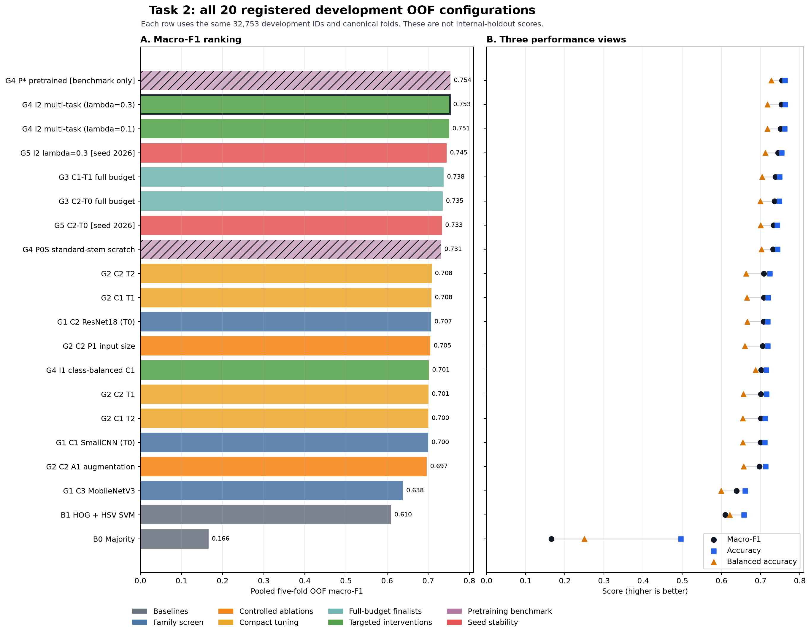
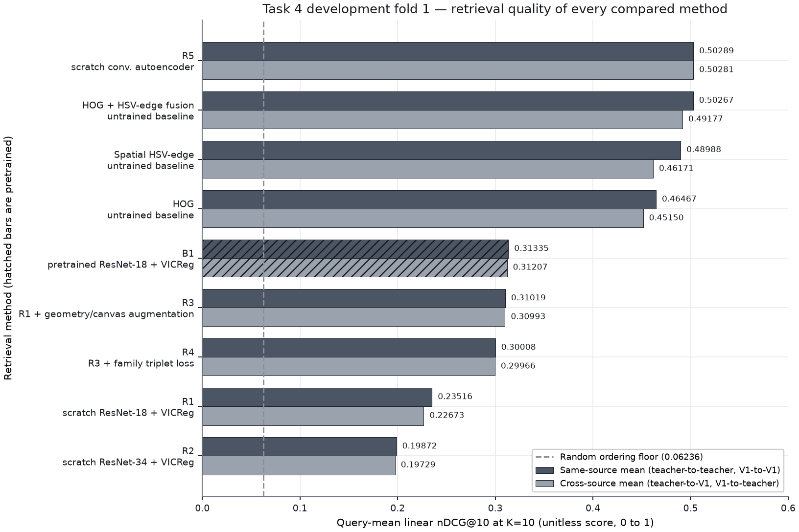
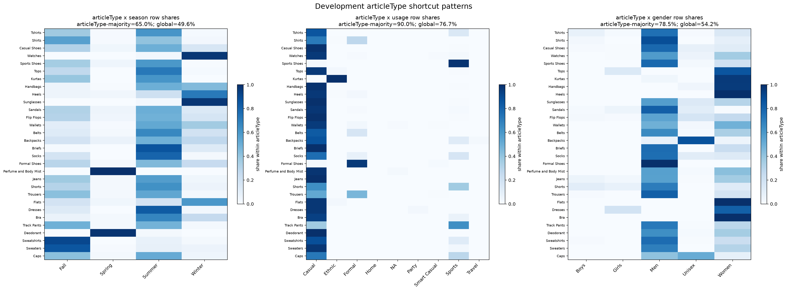
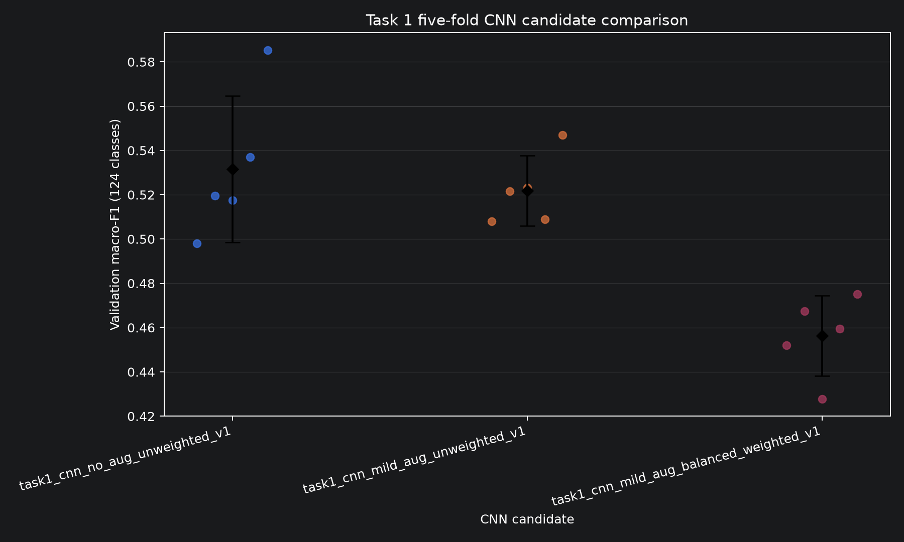
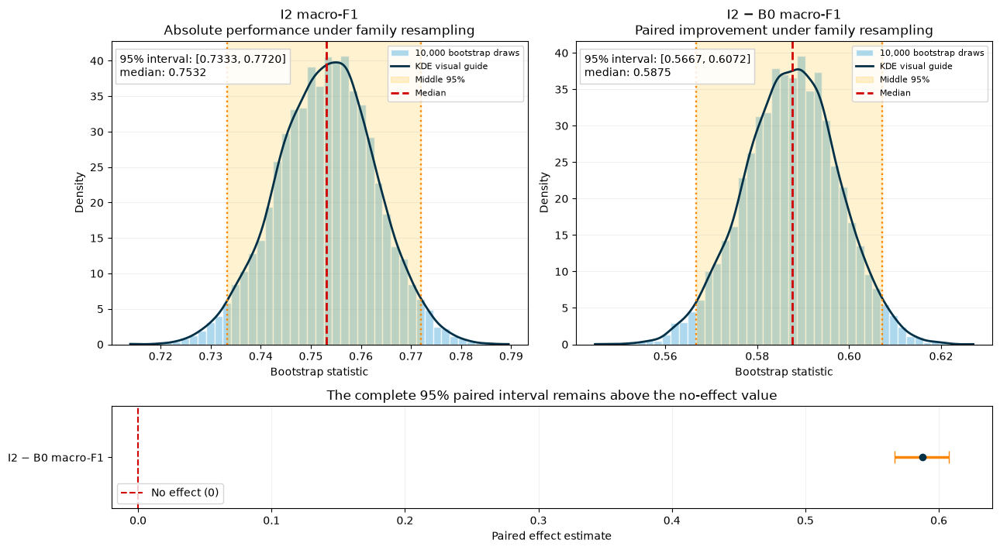
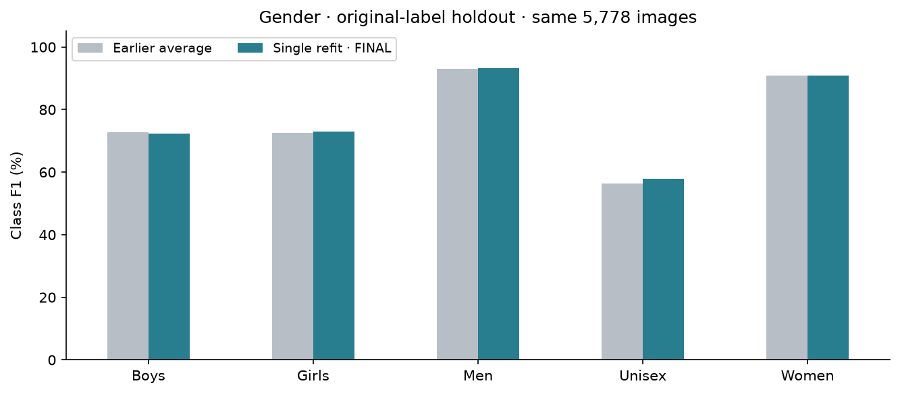
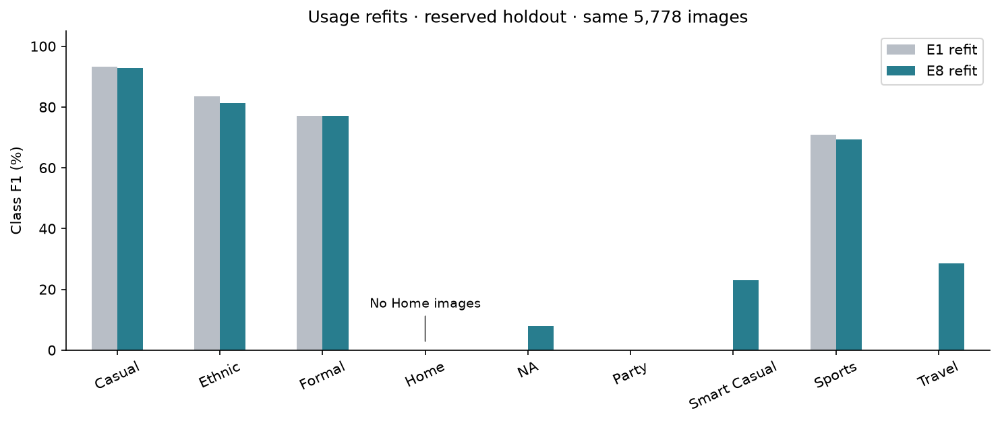
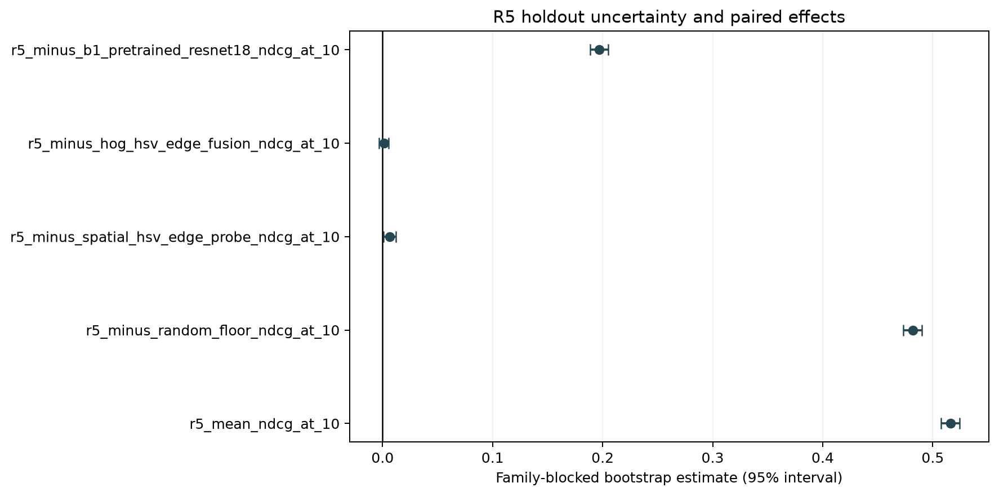

# Fashion Intelligence from Audited Catalogue Images

**COSC2753 Machine Learning - Assignment 2**  
**Group:** `[INSERT CANVAS GROUP ID]`  
**Members:** `[INSERT FULL NAME - STUDENT ID FOR EVERY MEMBER]`  
**Submission date:** `[INSERT DATE]`

<!--
AUTHORING NOTE - DELETE BEFORE SUBMISSION

This is the complete evidence-led Markdown draft. The assessed report must remain within five
pages of main text plus two appendix pages. The cover and IEEE reference list do not count.
Use a single column. The detailed assignment PDF says 11 pt; the Canvas wrapper says 12 pt.
Use 12 pt unless the teaching team confirms otherwise, because it is the stricter space limit.

Do not remove a limitation merely to make a result sound stronger. If space is tight, shorten
method descriptions and retain the decision, evidence, limitation, and notebook pointer.
-->

## 1. Problem Definition and System Constraints

The system supports a catalogue worker who has one fashion-product image and needs four editable
labels plus visually similar products. The prediction unit is one product image. Tasks 1-3 output
`articleType`, `season`, `gender`, and `usage`; Task 4 outputs a ranked list of unique product IDs.
These are not one identical learning problem: ArticleType has 124 imbalanced classes, Season has
four contextual labels, Gender and Usage contain socially or semantically ambiguous boundaries,
and visual search has no single correct class.

The final models must be trained from scratch. Pretrained weights may be used only as an explicitly
ineligible comparison. All model development must reuse the saved family-safe split, and the
official 5,829-image teacher set has no labels. Therefore it can verify prediction coverage and
file format, but cannot provide an accuracy claim. “Best” is decided inside each task only after its
data risks are understood; it combines class-sensitive quality, failures, uncertainty, robustness,
and deployment cost rather than maximising one headline number. The complete problem contract is
in [Notebook 00, Sections 2-10](../notebooks/00_problem_definition.ipynb).

## 2. Shared Data and Technical Foundations

### 2.1 Data provenance and preparation

The provenance chain begins at the course-supplied package, not at the original image collector.
The brief identifies an educational fashion catalogue and its schema, but does not identify the
retailer, geography, sampling rule, annotation instructions, annotator agreement, or prior image
editing. Following the documentation principle in Datasheets for Datasets [1], we therefore treat
the targets as *catalogue labels*, not objective truths or evidence about all fashion markets.

Raw bytes were hashed before decoding. Cleaning was conservative: the audit reconciled CSV IDs
with image files, excluded five labelled records without a valid image, ignored one unsupported
non-image file, and quarantined 61 unsafe products: 41 label-conflicting exact duplicates, 11
cross-role exact duplicates, and nine cross-role near-duplicates. Remaining exact and reviewed
near-duplicates were grouped into product families *before* splitting, while missing target labels
were masked per task rather than guessed. The frozen manifest assigns 32,773 development rows to
five fixed, family-safe folds, reserves 5,778 internal-holdout rows, and quarantines 61 rows. In a
complete five-fold run, each eligible development row serves as validation once; this supports
controlled tuning and pooled out-of-fold comparison. The intended protocol keeps the holdout
untouched until the task-level model and hyperparameters are frozen, then opens it once to estimate
generalisation to unseen, same-source catalogue data; it cannot prove transfer to new retailers or
cameras. Task 3's later post-review refit acceptance is therefore reported separately in Section 5
as non-blind. Development has 22,905 conservative families and zero active family crossings.
Season has 20 blank development labels and Usage has one. All teacher-only work reads
`data/processed/splits.csv`; documented Task 3 external-data
comparisons use versioned derived manifests that preserve the original teacher folds. During
cross-validation, learned normalisation is fitted only on the training fold; after selection is
frozen, final refits recompute it from the full development set. Full lineage, hashes, cleaning
decisions, and fold checks are in
[Notebook 01, Sections 1-3 and 5](../notebooks/01_data_preparation.ipynb).

### 2.2 Shared EDA and pre-training hypotheses

Development-only exploratory data analysis (EDA) showed that ArticleType and Usage have severe
long tails, related product rows are not independent, target labels are associated, and catalogue
year, compressed file size, image brightness, geometry, and background may act as shortcuts.
For example, 69.9% of valid Season rows come from 2011-2012, and predicting each year's majority
Season agrees with 74.5% of labels. These are associations, not causes.

The findings produced EDA-derived hypotheses before each task's comparison: family leakage could
inflate validation; accuracy could hide rare-class collapse; fixed shape/colour features might be
strong baselines; ArticleType could assist Season while also creating shortcut risk; and source or
canvas changes could damage retrieval. The later evidence partly confirmed these expectations.
Rare-class failure and brightness sensitivity were real; Task 2 benefited from the ArticleType
auxiliary training signal. Other ideas failed: full class weighting and mild augmentation did not
improve Task 1 macro-F1, Task 2 colour jitter was rejected, external rare-Usage images did not
establish transfer to teacher images, and Task 4's high-resolution V1/two-view gallery did not beat
the simpler teacher-only policy. This is reflection, not retrospective preregistration; the full
finding and hypothesis register is in [Notebook 01, Section 4.8](../notebooks/01_data_preparation.ipynb).
The full target-coverage table and log-scale class-support plots are in
[Notebook 01, Sections 4.1.1 and 4.1.3](../notebooks/01_data_preparation.ipynb); they motivate
class-sensitive metrics and per-class error reporting but do not by themselves justify a
weighting method.

### 2.3 Common method and evaluation pipeline

Every image is EXIF-corrected, converted to RGB, resized without changing its aspect ratio, padded,
and normalised with training-only content-pixel statistics. Random augmentation is training-only.
Classical pipelines turn pixels into a fixed vector: HOG encodes local edge directions [2], HSV
histograms encode colour, scaling aligns feature magnitudes, and a linear support-vector machine
(SVM) selects the largest margin score, `argmax_k(w_k^T x + b_k)` [3]. CNNs instead learn spatial
filters end to end: convolutional feature maps are pooled into an embedding, a linear head produces
class logits, and softmax converts logits into probabilities [4]. Residual [5] and MobileNetV3 [6]
families tested capacity and efficiency, while AdamW separated weight decay from the gradient
update [7].

Classification candidates receive pooled five-fold out-of-fold (OOF) predictions: each development
row is predicted by a model that did not train on its fold. Because class imbalance is task-relevant,
macro-F1 is the primary classification development metric; accuracy, per-class precision/recall,
confusion routes, calibration, and cost remain supporting evidence [8]. Final choices are frozen,
refitted when the declared task protocol permits it, and then evaluated on the reserved holdout.
Related rows remain together in the 10,000-draw family-blocked bootstrap [9]. Fixed JPEG, blur,
brightness, source, and canvas probes expose sensitivity without claiming their frequency in
production [10]. Calibration is task-specific: Task 2's scalar temperature scaling is defined in
Section 4 rather than assumed to apply to every classifier.

## 3. Task 1 - ArticleType Classification

Task 1 asks which of 124 article types appears in a 60 x 80 RGB catalogue image. The EDA made
macro-F1 the development criterion: 37 classes have at most ten development products, so high
accuracy can coexist with ignored labels. The baseline comparison used HOG with k-nearest
neighbours and linear SVM. These fixed edges provided interpretable, low-complexity anchors, but
could not adapt features to visually overlapping categories such as `Tshirts`/`Tops` or
`Sports Shoes`/`Casual Shoes`.

The scratch candidate passes the image through five 5 x 5 convolution layers, max pooling,
adaptive average pooling, a 128-unit hidden layer, and 124 logits. Controlled changes tested mild
augmentation and inverse-frequency weighting while keeping the architecture, folds, and budget
fixed. The plain CNN led development at **0.5315 +/- 0.0331 mean fold macro-F1**, versus 0.5218
with augmentation, 0.5023 for HOG-kNN, 0.4889 for HOG-SVM, and 0.4564 for the weighted CNN.
Weighting reduced zero-F1 classes only from 21 to 20 while damaging common performance, so it was
rejected rather than assumed helpful. See [Notebook 02, Sections 7-14](../notebooks/02_task1_part1_article_type.ipynb).

The frozen plain CNN was refitted from scratch on all development rows for 20 epochs. On the
5,778-row holdout it achieved **0.5752 macro-F1, 84.93% Top-1 accuracy, and 98.43% Top-5
coverage**. However, 18 represented labels had zero F1, 14 more were absent, and brightness 0.85
reduced macro-F1 to 0.3236. Its 1.91 MB checkpoint and measured CPU median of 5.58 ms support an
assisted suggestion workflow, not autonomous tagging of all 124 labels. This is the Task 1
ultimate judgement; errors and robustness are in [Notebook 03, Sections 7-10](../notebooks/03_task1_part2_final_evaluation.ipynb).

## 4. Task 2 - Season Classification

Season has four labels but weak visual ground truth: colour and garment form can suggest a season,
while year, compression, ArticleType, and catalogue policy can also leak context. The investigation
therefore moved incrementally. B0 predicted the training-fold majority (0.1657 OOF macro-F1). B1
concatenated HOG edges and HSV colour, standardised the vector, and applied LinearSVC (0.6096).
C1 SmallCNN, C2 small-stem ResNet18, and C3 MobileNetV3-Small then tested learned features under an
equal eight-epoch budget. Input size, augmentation, learning rate, and weight decay were changed
one declared factor at a time before C1 and C2 received equal full budgets. However, G1/G2 remain
exploratory because their initial weights were not seed-controlled; selection-critical comparisons
begin at corrected G3.

The targeted I1 intervention used effective-number class weights [11] but fell to 0.7015 macro-F1.
I2 instead shared C1's four convolution blocks and 256-value embedding between a four-logit Season
head and a 124-logit ArticleType training head. Its loss was
`CE(Season) + 0.3 x masked CE(ArticleType)`; inference still requires only the image and discards the
auxiliary head. This multi-task mechanism [12] improved the primary-seed OOF result to **0.7527**
and also led C2 under seed 2026 (0.7447 versus 0.7331). A standard-stem ImageNet ResNet18 scored
0.7542, only 0.0230 above its matched scratch control, but remained final-ineligible.

The page limit prevents repeating all 20 configurations and their experiment labels. Read
[Notebook 04, Sections 5-8](../notebooks/04_task2_part1_season.ipynb) for each label where it is
introduced. Then read [Notebook 05, Sections 3.1-3.3](../notebooks/05_task2_part2_final_evaluation.ipynb)
for the complete configuration/technical audit, G0-G9 question-rule-result-action map, and
all-model chart. Notebook 04, Sections 5-15 retains the fold evidence, learning curves, rejected
results, run IDs, hashes, freeze, and refit trace.

**Figure 1.** All 20 registered configurations use the same 32,753 labelled development rows.
Hatching marks benchmark-only controls and the dark border marks the selected primary-seed I2.
These are point estimates from different gates, budgets, and seeds; the gate map, not raw rank,
determines eligibility and advancement.

The frozen I2 model was refitted for 24 epochs and evaluated once. Holdout macro-F1 was **0.7534**,
balanced accuracy 0.7197, and accuracy 0.7643; class F1 was 0.6970 Fall, 0.7577 Spring, 0.7999
Summer, and 0.7589 Winter. The family-blocked 95% interval was **[0.7333, 0.7720]**, while the
I2-minus-B0 interval was **[0.5667, 0.6072]** (Figure A3). For logits $z$ and $T>0$, temperature
scaling uses $p_k(T)=\exp(z_k/T)/\sum_j\exp(z_j/T)$. The development-OOF value $T=1.365$ was frozen
before holdout; it softened confidence without changing the winning class and reduced holdout ECE
from 0.0476 to 0.0195 [13]. The model has 1.21 M parameters, a 4.86 MB bundle, and 6.49 ms
development CPU median latency. The key failure is shift: brightness 0.85 reduced macro-F1 to
0.3712 and Spring recall to
0.0043. Grad-CAM is used only as a non-causal review aid [14]. We judge I2 conditionally viable for
reviewed, same-source catalogue support, not as an objective or fully automatic Season oracle. See
[Notebook 05, Sections 5-15](../notebooks/05_task2_part2_final_evaluation.ipynb), especially Section
8 for the 10,000-draw uncertainty distributions and their limits.

## 5. Task 3 - Gender and Usage Classification

### 5.1 Gender

Gender EDA exposed dominant Men/Women support, ambiguous Unisex boundaries, label conflicts with
product-name cues, and a large training-validation gap. The shared scratch SmallCNN baseline was
therefore followed by pooling, augmentation, fixed label-basis review, MixUp [15], and
sharpness-aware minimisation (SAM) [16]. The final model uses four 3 x 3 convolution stages
(32/64/128/256 channels), fixed GeM pooling, a 256-value representation, and five logits. During
training, MixUp alpha 0.20 blends examples, SAM radius 0.05 searches for a flatter update, and 30%
dropout regularises the head. The selected single 25-epoch refit has 390,181 parameters.

On the same 5,778 holdout images, it achieved **0.7744 macro-F1 and 90.00% accuracy**, compared
with 0.7714 and 89.82% for the earlier five-model average. The improvement is only ten net correct
images, while Unisex recall remains 47.27%. Hence the simpler one-checkpoint handoff is accepted,
but every audience label remains an editable catalogue suggestion rather than a statement about a
person. The original-label score is primary; the fixed name-rule score is a separate diagnostic.

### 5.2 Usage

Usage EDA found a 76.86% Casual holdout share and extremely small Home, Party, Smart Casual, and
Travel support. The experiment path tested the baseline, class weighting, translation, classical
HOG-SVM, rare-source additions, MixUp/SAM, and source-transfer diagnostics. The final E8 scratch
SmallCNN uses the same four convolution widths, average pooling, a 256-value vector, and nine
logits. Effective-number class weights (beta 0.999, capped at 5) influence weighted cross-entropy;
they do not alter probabilities after inference.

E8 improved development OOF macro-F1 from E1's 0.3738 to **0.4194**. On holdout, the single E8
refit reached **0.4226 macro-F1 and 88.70% accuracy**, versus E1's 0.3609 and 89.46%: a 6.17-point
class-balanced gain at the cost of 44 more wrong predictions. It detected some NA, Smart Casual,
and Travel cases, but Party remained missed and Home had no holdout examples. Added external images
did not establish transfer to teacher catalogue images, so the submitted E8 model is teacher-only.

These Task 3 refits were accepted after holdout review. Reserved images were not used for fitting,
but final acceptance is not a fresh blind confirmation; repeated development selection can bias
small apparent gains [17]. The honest judgement is limited viability for human-reviewed tagging.
The full path is in [Notebook 06, Sections 9-19](../notebooks/06_task3_part1_gender_usage.ipynb),
with final evidence in [Notebook 07, Sections 9-12](../notebooks/07_task3_part2_final_evaluation.ipynb).

## 6. Task 4 - Visual Search

Task 4 returns Top-K unique products rather than a class. Protocol A gives relevance grade 2 to the
same ArticleType and base colour, 1 to the same ArticleType only, and 0 otherwise. It selects by
mean linear nDCG@10, which rewards relevant results near the top [18]. Protocol B separately checks
same-family recovery. These metadata rules are reproducible proxies for visual relevance, not
human similarity judgements.

The baseline maps a 240 x 320 letterboxed image to spatial HSV and edge features, then ranks exact
cosine distance. HOG fusion strengthened this fixed representation. Learned candidates mapped the
image through scratch ResNet encoders trained with VICReg [19], family triplet loss, or, for R5, a
scratch convolutional autoencoder. R5 reconstructs the image during training, L2-normalises its
128-value bottleneck at inference, collapses duplicate product views by minimum distance, and
returns the smallest-distance unique IDs. R1/R2 non-finite failures, R3/R4 weaker scores, the
pretrained B1 comparison, five-fold stability, and teacher/V1/two-view gallery policies remain
visible in [Notebook 09, Sections 6-15](../notebooks/task-4/09_task4_part2_visual_search.ipynb).

**Figure 2.** R5 led the frozen development comparison; pretrained B1 is hatched because it was
never eligible for submission. The strong fixed-feature methods remain essential baselines.

On holdout, R5 achieved **0.5162 teacher-query nDCG@10**, versus 0.5151 for HOG fusion, 0.5096
for the spatial probe, 0.3195 for pretrained B1, and 0.0343 for random ranking. The R5-minus-HOG
95% interval **[-0.0035, 0.0055]** crosses zero, so R5 is not proven better than HOG fusion;
R5 remains final because it was the pre-holdout eligible winner. Its package is 57.2 MB, gallery
24.4 MB, and CPU query p50/p95 23.39/24.90 ms. Wide and tall canvases caused severe drops, so input
validation/cropping and human inspection are required. Published fashion retrieval systems use
different datasets, relevance rules, and often pretrained backbones; their scores are context, not
a common leaderboard [20], [21]. See [Notebook 10, Sections 3-15](../notebooks/task-4/10_task4_part3_final_evaluation.ipynb).

## 7. Integrated Application and Overall Judgement

The intended application flow is: validate an uploaded image; apply each saved model's exact
preprocessing; run the four scratch classifiers and R5 encoder; display editable labels,
probabilities, review warnings, and Top-K products; then log the model/hash, suggestion, correction,
and approval. A decode or inference failure must leave manual entry available. No confidence
threshold is authorised for automatic publication because no business error cost or user study has
validated one. **This paragraph defines the integration contract; replace it with measured GUI/API
evidence only if the team's final application actually implements and tests it.**

Our overall judgement is therefore task-specific, not a claim that one system is universally
ready. Task 1 is useful for Top-5 assisted type suggestions but fails rare labels; Task 2 is the
strongest calibrated classifier on same-source data but is brightness-sensitive; Task 3 supports
editable Gender/Usage suggestions with weak rare-class and independence evidence; and Task 4 gives
useful ranked catalogue matches but is statistically tied with its strongest fixed baseline and
fragile to large canvases. The system is suitable for a monitored catalogue-assistance pilot with
human approval. Fully automatic publication and transfer to new retailers, cameras, or populations
remain unproven.

The four official classifier exports each contain all **5,829** requested IDs and must be merged in
the required unchanged order and schema: `id,gender,articleType,season,usage`. Because this official
prediction set has no ground-truth labels, it verifies coverage and format but cannot support a
performance claim. Future improvement requires a target-domain dataset with documented source,
sampling, annotation rules, time and capture conditions, representative labels, and a new untouched
evaluation set. This would support targeted cleaning, rare-case collection, drift analysis,
recalibration, and retraining; clearer provenance alone does not guarantee a better model.

---

## Appendix A - Evidence Figures

<!-- Keep at most two appendix pages in the final PDF. Resize or remove panels; do not move the
ultimate judgement out of the five-page main body. -->

**Figure A1. Shared shortcut audit.** Associations motivated controlled tests and slices; they do
not prove causal prediction mechanisms. Source: Notebook 01, Section 4.3.

**Figure A2. Task 1 five-fold CNN comparison.** Points are fold scores; the plain unweighted CNN
has the highest mean, while augmentation reduces spread but not the mean. Source: Notebook 02,
Sections 9-12.

**Figure A3. Task 2 family-blocked uncertainty.** Histograms show 10,000 product-family resamples;
KDE is only a smooth visual guide and orange marks the empirical middle 95%. The paired I2-minus-B0
interval stays above zero, supporting improvement over the baseline but not a p-value or a
new-source guarantee. Source: Notebook 05, Section 8.

**Figure A4. Task 3 Gender class F1.** The single refit is similar to the five-model average;
Unisex remains the principal weakness. Source: Notebook 07, Section 10.1.

**Figure A5. Task 3 Usage class F1.** E8 expands observed rare-class coverage, but Party remains
zero and Home is unassessed. Source: Notebook 07, Sections 9.5 and 10.3.

**Figure A6. Task 4 family-blocked 95% intervals.** R5 clearly beats random and pretrained B1,
slightly beats the spatial probe, but is not distinguishable from HOG fusion. Source: Notebook 10,
Section 8.

## Appendix B - Evidence Navigation and Submission Checks

The concise report deliberately points to, rather than duplicates, the full audit trail:

- Shared provenance, cleaning, family-safe folds, EDA, and hypotheses: [Notebook 01](../notebooks/01_data_preparation.ipynb), especially Sections 1-5.
- Task 1 development and final evidence: [Notebook 02](../notebooks/02_task1_part1_article_type.ipynb), Sections 7-14; [Notebook 03](../notebooks/03_task1_part2_final_evaluation.ipynb), Sections 7-12.
- Task 2 gates and final evidence: [Notebook 04](../notebooks/04_task2_part1_season.ipynb), Sections 8-14; [Notebook 05](../notebooks/05_task2_part2_final_evaluation.ipynb), Sections 3-15.
- Task 3 development and evaluation: [Notebook 06](../notebooks/06_task3_part1_gender_usage.ipynb), Sections 9-20; [Notebook 07](../notebooks/07_task3_part2_final_evaluation.ipynb), Sections 9-16.
- Task 4 development and evaluation: [Notebook 09](../notebooks/task-4/09_task4_part2_visual_search.ipynb), Sections 6-15; [Notebook 10](../notebooks/task-4/10_task4_part3_final_evaluation.ipynb), Sections 3-15.

Before submission, replace the author placeholders; confirm the actual application state; generate
the combined prediction file without changing its schema; verify every final model is scratch;
check all bundle hashes; and export at no more than five main pages plus two appendix pages. Do not
present a proposed GUI, missing class, synthetic corruption frequency, or official-test score as
measured evidence.

## References

[1] T. Gebru *et al*., [“Datasheets for datasets,”](https://doi.org/10.1145/3458723)
*Commun. ACM*, vol. 64, no. 12, pp. 86-92, Dec. 2021.

[2] N. Dalal and B. Triggs, [“Histograms of oriented gradients for human detection,”](https://doi.org/10.1109/CVPR.2005.177)
in *Proc. IEEE Comput. Soc. Conf. Comput. Vis. Pattern Recognit. (CVPR)*, 2005, pp. 886-893.

[3] C. Cortes and V. Vapnik, [“Support-vector networks,”](https://doi.org/10.1007/BF00994018)
*Mach. Learn.*, vol. 20, pp. 273-297, 1995.

[4] Y. LeCun, L. Bottou, Y. Bengio, and P. Haffner,
[“Gradient-based learning applied to document recognition,”](https://doi.org/10.1109/5.726791)
*Proc. IEEE*, vol. 86, no. 11, pp. 2278-2324, Nov. 1998.

[5] K. He, X. Zhang, S. Ren, and J. Sun,
[“Deep residual learning for image recognition,”](https://openaccess.thecvf.com/content_cvpr_2016/html/He_Deep_Residual_Learning_CVPR_2016_paper.html)
in *Proc. IEEE Conf. Comput. Vis. Pattern Recognit. (CVPR)*, 2016, pp. 770-778.

[6] A. Howard *et al*., [“Searching for MobileNetV3,”](https://openaccess.thecvf.com/content_ICCV_2019/html/Howard_Searching_for_MobileNetV3_ICCV_2019_paper.html)
in *Proc. IEEE/CVF Int. Conf. Comput. Vis. (ICCV)*, 2019, pp. 1314-1324.

[7] I. Loshchilov and F. Hutter, [“Decoupled weight decay regularization,”](https://openreview.net/forum?id=Bkg6RiCqY7)
in *Proc. Int. Conf. Learn. Representations (ICLR)*, 2019.

[8] M. Sokolova and G. Lapalme,
[“A systematic analysis of performance measures for classification tasks,”](https://doi.org/10.1016/j.ipm.2009.03.002)
*Inf. Process. Manage.*, vol. 45, no. 4, pp. 427-437, 2009.

[9] C. A. Field and A. H. Welsh, [“Bootstrapping clustered data,”](https://doi.org/10.1111/j.1467-9868.2007.00593.x)
*J. R. Stat. Soc. Series B Stat. Methodol.*, vol. 69, no. 3, pp. 369-390, 2007.

[10] D. Hendrycks and T. Dietterich,
[“Benchmarking neural network robustness to common corruptions and perturbations,”](https://arxiv.org/abs/1903.12261)
in *Proc. Int. Conf. Learn. Representations (ICLR)*, 2019.

[11] Y. Cui, M. Jia, T.-Y. Lin, Y. Song, and S. Belongie,
[“Class-balanced loss based on effective number of samples,”](https://openaccess.thecvf.com/content_CVPR_2019/html/Cui_Class-Balanced_Loss_Based_on_Effective_Number_of_Samples_CVPR_2019_paper.html)
in *Proc. IEEE/CVF Conf. Comput. Vis. Pattern Recognit. (CVPR)*, 2019, pp. 9268-9277.

[12] R. Caruana, [“Multitask learning,”](https://doi.org/10.1023/A:1007379606734)
*Mach. Learn.*, vol. 28, pp. 41-75, 1997.

[13] C. Guo, G. Pleiss, Y. Sun, and K. Q. Weinberger,
[“On calibration of modern neural networks,”](https://proceedings.mlr.press/v70/guo17a.html)
in *Proc. 34th Int. Conf. Mach. Learn. (ICML)*, 2017, pp. 1321-1330.

[14] R. R. Selvaraju *et al*.,
[“Grad-CAM: Visual explanations from deep networks via gradient-based localization,”](https://openaccess.thecvf.com/content_iccv_2017/html/Selvaraju_Grad-CAM_Visual_Explanations_ICCV_2017_paper.html)
in *Proc. IEEE Int. Conf. Comput. Vis. (ICCV)*, 2017, pp. 618-626.

[15] H. Zhang, M. Cisse, Y. N. Dauphin, and D. Lopez-Paz,
[“mixup: Beyond empirical risk minimization,”](https://openreview.net/forum?id=r1Ddp1-Rb)
in *Proc. Int. Conf. Learn. Representations (ICLR)*, 2018.

[16] P. Foret, A. Kleiner, H. Mobahi, and B. Neyshabur,
[“Sharpness-aware minimization for efficiently improving generalization,”](https://openreview.net/forum?id=6Tm1mposlrM)
in *Proc. Int. Conf. Learn. Representations (ICLR)*, 2021.

[17] G. C. Cawley and N. L. C. Talbot,
[“On over-fitting in model selection and subsequent selection bias in performance evaluation,”](https://www.jmlr.org/papers/v11/cawley10a.html)
*J. Mach. Learn. Res.*, vol. 11, pp. 2079-2107, 2010.

[18] K. Järvelin and J. Kekäläinen,
[“Cumulated gain-based evaluation of IR techniques,”](https://doi.org/10.1145/582415.582418)
*ACM Trans. Inf. Syst.*, vol. 20, no. 4, pp. 422-446, 2002.

[19] A. Bardes, J. Ponce, and Y. LeCun,
[“VICReg: Variance-invariance-covariance regularization for self-supervised learning,”](https://openreview.net/forum?id=xm6YD62D1Ub)
in *Proc. Int. Conf. Learn. Representations (ICLR)*, 2022.

[20] Z. Liu, P. Luo, S. Qiu, X. Wang, and X. Tang,
[“DeepFashion: Powering robust clothes recognition and retrieval with rich annotations,”](https://openaccess.thecvf.com/content_cvpr_2016/html/Liu_DeepFashion_Powering_Robust_CVPR_2016_paper.html)
in *Proc. IEEE Conf. Comput. Vis. Pattern Recognit. (CVPR)*, 2016, pp. 1096-1104.

[21] M. H. Kiapour, X. Han, S. Lazebnik, A. C. Berg, and T. L. Berg,
[“Where to buy it: Matching street clothing photos in online shops,”](https://openaccess.thecvf.com/content_iccv_2015/html/Kiapour_Where_to_Buy_ICCV_2015_paper.html)
in *Proc. IEEE Int. Conf. Comput. Vis. (ICCV)*, 2015, pp. 3343-3351.
