# Fashion Intelligence from Audited Catalogue Images

**COSC2753 Machine Learning - Assignment 2** 
**Instructor:** Dr. Bao 
**Group:** SG_G6 
**Repository:** [github.com/TrnLin/MLA2](https://github.com/TrnLin/MLA2) 
**Members:** 
Linh Tran Hoang - s4043097 
Tran Dinh Quan - s4193655 
Khoa Phan Tuan - s4103952 
Nguyen Xuan Khoai - s4126139 
**Submission date:** 12/9/2026

## 1. Problem Definition and System Constraints

The system supports a catalogue worker who has one fashion-product image and needs four editable
labels plus visually similar products. The prediction unit is one product image. Tasks 1-3 output
`articleType`, `season`, `gender`, and `usage`; Task 4 outputs a ranked list of unique product IDs.
These are not one identical learning problem: ArticleType has 124 imbalanced classes, Season has
four contextual labels, Gender and Usage contain socially or semantically ambiguous boundaries,
and visual search has no single correct class.

The final models must be trained from scratch. Pretrained weights may be used only as an explicitly
ineligible comparison. All model development must reuse the saved family-safe split, and the
official 5,829-image teacher set has no labels. Therefore it can verify prediction coverage and
file format, but cannot provide an accuracy claim. “Best” is decided inside each task only after its
data risks are understood; it combines class-sensitive quality, failures, uncertainty, robustness,
and deployment cost rather than maximising one headline number. The complete problem contract is
in [Notebook 00, Sections 2-10](../notebooks/00_problem_definition.ipynb).

## 2. Shared Data and Technical Foundations

### 2.1 Data provenance and preparation

The teacher-package provenance begins at the course-supplied archive. The reported upstream
catalogue source is the Kaggle Fashion Product Images Dataset [23]; Task 4 separately uses a
validated local copy of its version-1 high-resolution images for source/gallery comparisons. The
source page does not identify the retailer, geography, sampling rule, annotation instructions,
annotator agreement, or prior image editing. Following the documentation principle in Datasheets
for Datasets [1], we therefore treat the targets as *catalogue labels*, not objective truths or
evidence about all fashion markets.

Raw bytes were hashed before decoding. Cleaning was conservative: the audit reconciled CSV IDs
with image files, excluded five labelled records without a valid image, ignored one unsupported
non-image file, and quarantined 61 unsafe products: 41 label-conflicting exact duplicates, 11
cross-role exact duplicates, and nine cross-role near-duplicates. Remaining exact and reviewed
near-duplicates were grouped into product families *before* splitting, while missing target labels
were masked per task rather than guessed. The frozen manifest assigns 32,773 development rows to
five fixed, family-safe folds, reserves 5,778 internal-holdout rows, and quarantines 61 rows. In a
complete five-fold run, each eligible development row serves as validation once; this supports
controlled tuning and pooled out-of-fold comparison. The intended protocol keeps the holdout
untouched until the task-level model and hyperparameters are frozen, then opens it once to estimate
generalisation to unseen, same-source catalogue data; it cannot prove transfer to new retailers or
cameras. Task 3's selected-refit assessment and its limits are reported in Section 5.
Development has 22,905 conservative families and zero active family crossings.
Season has 20 blank development labels and Usage has one. All teacher-only work reads
`data/processed/splits.csv`; documented Task 3 external-data
comparisons use versioned derived manifests that preserve the original teacher folds. During
cross-validation, learned normalisation is fitted only on the training fold; after selection is
frozen, final refits recompute it from the full development set. Full lineage, hashes, cleaning
decisions, and fold checks are in
[Notebook 01, Sections 1-3 and 5](../notebooks/01_data_preparation.ipynb).

### 2.2 Shared EDA and pre-training hypotheses

Development-only exploratory data analysis (EDA) showed that ArticleType and Usage have severe
long tails, related product rows are not independent, target labels are associated, and catalogue
year, compressed file size, image brightness, geometry, and background may act as shortcuts.
For example, 69.9% of valid Season rows come from 2011-2012, and predicting each year's majority
Season agrees with 74.5% of labels. These are associations, not causes.

The findings produced EDA-derived hypotheses before each task's comparison: family leakage could
inflate validation; accuracy could hide rare-class collapse; fixed shape/colour features might be
strong baselines; ArticleType could assist Season while also creating shortcut risk; and source or
canvas changes could damage retrieval. The later evidence partly confirmed these expectations.
Rare-class failure and brightness sensitivity were real; Task 2 benefited from the ArticleType
auxiliary training signal. Other ideas failed: full class weighting and mild augmentation did not
improve Task 1 macro-F1, Task 2 colour jitter was rejected, external rare-Usage images did not
establish transfer to teacher images, and Task 4's high-resolution V1/two-view gallery did not beat
the simpler teacher-only policy. This is reflection, not retrospective preregistration; the full
finding and hypothesis register is in [Notebook 01, Section 4.8](../notebooks/01_data_preparation.ipynb).
The full target-coverage table and log-scale class-support plots are in
[Notebook 01, Sections 4.1.1 and 4.1.3](../notebooks/01_data_preparation.ipynb); they motivate
class-sensitive metrics and per-class error reporting but do not by themselves justify a
weighting method.

**Evidence trace.** `raw audit -> family grouping -> fixed folds -> OOF comparison -> frozen choice
-> one-shot holdout`. Each completed run binds its score to split, configuration, seed, code, and
artifact hashes; failed runs retain status and error provenance. Notebook tables are generated from
those artifacts, while rejected runs remain visible beside the winner. The holdout opens only after
freeze and never feeds back into tuning. The task sections then state which EDA hypothesis survived
controlled comparison.

### 2.3 Common method and evaluation pipeline

Every image is EXIF-corrected, converted to RGB, resized without changing its aspect ratio, padded,
and normalised with training-only content-pixel statistics. Random augmentation is training-only.
Classical pipelines turn pixels into a fixed vector: HOG encodes local edge directions [2], HSV
histograms encode colour, scaling aligns feature magnitudes, and a linear support-vector machine
(SVM) selects the largest margin score, `argmax_k(w_k^T x + b_k)` [3]. CNNs instead learn spatial
filters end to end: convolutional feature maps are pooled into an embedding, a linear head produces
class logits, and softmax converts logits into probabilities [4]. Residual [5] and MobileNetV3 [6]
families tested capacity and efficiency, while AdamW separated weight decay from the gradient
update [7].

Classification candidates receive pooled five-fold out-of-fold (OOF) predictions: each development
row is predicted by a model that did not train on its fold. Because class imbalance is task-relevant,
macro-F1 is the primary classification development metric; accuracy, per-class precision/recall,
confusion routes, calibration, and cost remain supporting evidence [8]. Final choices are frozen,
refitted when the declared task protocol permits it, and then evaluated on the reserved holdout.
Related rows remain together in the 10,000-draw family-blocked bootstrap [9]. Fixed JPEG, blur,
brightness, source, and canvas probes expose sensitivity without claiming their frequency in
production [10]. Calibration is task-specific: Task 2's scalar temperature scaling is defined in
Section 4 rather than assumed to apply to every classifier.

## 3. Task 1 - ArticleType Classification

Task 1 asks which of 124 article types appears in a 60 x 80 RGB catalogue image. The EDA made
macro-F1 the development criterion: 37 classes have at most ten development products, so high
accuracy can coexist with ignored labels. The baseline comparison used HOG with k-nearest
neighbours and linear SVM. These fixed edges provided interpretable, low-complexity anchors, but
could not adapt features to visually overlapping categories such as `Tshirts`/`Tops` or
`Sports Shoes`/`Casual Shoes`.

The scratch candidate passes the image through five 5 x 5 convolution layers, max pooling,
adaptive average pooling, a 128-unit hidden layer, and 124 logits. Controlled changes tested mild
augmentation and inverse-frequency weighting while keeping the architecture, folds, and budget
fixed. The plain CNN led development at **0.5315 ± 0.0331 mean fold macro-F1**, versus 0.5218
with augmentation, 0.5023 for HOG-kNN, 0.4889 for HOG-SVM, and 0.4564 for the weighted CNN.
Weighting reduced zero-F1 classes only from 21 to 20 while lowering overall macro-F1, so it was
rejected rather than assumed helpful. See [Notebook 02, Sections 7-14](../notebooks/02_task1_part1_article_type.ipynb).

**Figure 1. Task 1 five-fold CNN comparison.** Points are fold scores; diamonds and bars summarise
their mean and spread. The plain unweighted CNN leads, while augmentation narrows spread without
raising the mean and class weighting lowers it. Source: Notebook 02, Sections 9-12.

The frozen plain CNN was refitted from scratch on all development rows for 20 epochs. On the
5,778-row holdout it achieved **0.5752 macro-F1, 84.93% Top-1 accuracy, and 98.43% Top-5
coverage**. However, 18 labels present in the holdout had zero F1, and 14 labels were absent,
so their performance could not be assessed. Reducing image brightness to 85% of its original
level lowered macro-F1 to 0.3236, showing sensitivity to lighting changes. The plain scratch CNN
was selected because it achieved the highest average macro-F1 during development. Its high Top-5 coverage
suggests it could help users choose a product label from five predictions. However, failures on
some labels and poorer results on darker images mean its predictions still need checking. Figure 1
shows the selection evidence, Figure A2 grounds the largest confusion routes in example images,
Figure A3 shows the fixed-photo robustness profile, and Figure A4 shows validation flattening while
training loss continues to fall. Detailed per-label results and altered-image tests are in
[Notebook 03, Sections 7-10](../notebooks/03_task1_part2_final_evaluation.ipynb).

## 4. Task 2 - Season Classification

Season labels are visually ambiguous: form/colour may help; imbalance, ArticleType, year,
compression, and catalogue policy may mislead. Development EDA motivated family-safe folds, pooled
OOF macro-F1, shortcut slices, and robustness tests. Hypotheses were retrospective; holdout labels
stayed sealed. See [Notebook 01, Section 4.8](../notebooks/01_data_preparation.ipynb),
[Notebook 04, Sections 2-4](../notebooks/04_task2_part1_season.ipynb), and the experiment-code key in
[Notebook 05, Section 3.1](../notebooks/05_task2_part2_final_evaluation.ipynb).

**G0, B0, B1 - verify and establish baselines.** SmallCNN overfit and registry/checkpoint smoke tests
passed, validating implementation, not performance. Training-fold-majority B0 obtained 0.4957
accuracy through Summer-only predictions, hence 0.1657 macro-F1. B1 used
`image -> [HOG edges || HSV colour histogram] -> standardisation -> four LinearSVC margins -> argmax`
[2], [3] and reached 0.6096: fixed shape/colour carried signal but could not learn task-specific
spatial features, justifying CNNs.

**G1-G3 - screen, ablate, then correct the shortlist.** Equal eight-epoch, five-fold G1 mapped
padded 80 x 60 RGB through C1 four-block SmallCNN, C2 small-stem ResNet18, or C3
MobileNetV3-Small, pooling/classification, and four cross-entropy logits [4]-[6]. C2/C1/C3 scored
0.7071/0.6999/0.6385, advancing C1/C2. G2 isolated size, colour jitter, or AdamW learning
rate/weight decay [7]: P1-P0 = -0.0018, A1-A0 = -0.0104, C1-T1 = +0.0082, and C2-T2 = +0.0011,
yielding P0/A0 and C1-T1/C2-T0. An audit found construction preceded seeding, making G1/G2
descriptive, not causal. Corrected G3 seeded first and trained up to 30 epochs: C1 = 0.7377, C2 =
0.7350. Their 0.0026 gap was below the 0.005 rule; both remained, while discarded options stayed
unvalidated.

**G4 - test EDA-driven interventions and the pretrained boundary.** Effective-number loss I1
($\beta=0.9999$) tested minority repair [11], but macro-F1 fell to 0.7015 and Spring worsened. I2
tested related-label transfer [12]: C1's four blocks/256-value embedding fed four Season logits and
124 training-only ArticleType logits under
$L=CE_{Season}+\lambda CE_{ArticleType}^{masked}$. Both $\lambda=0.1/0.3$ passed; 0.3 achieved
0.7527, +0.0150 over C1 and +0.0276 on the ArticleType-conflict slice. Inference remains image-only
and discards the auxiliary head. Matched standard-stem ResNet18 found ImageNet P* [13] +0.0230
above scratch P0S; both were benchmark-only, and P* was final-ineligible under the scratch rule.

**G5-G7 - test stability, diagnose, and freeze.** At seed 2026, I2 again led C2 (0.7447 versus
0.7331). G6 added no models: it tested shortcut/error slices, perturbations [10], cost, calibration,
10,000 family-bootstrap draws [9], and Grad-CAM. I2 passed all six predeclared G7 checks and was frozen.
Figures 2a-2b pair selection and uncertainty without equating different budgets/seeds. Full gates:
[Notebook 05, Sections 3.1-3.3 and 8](../notebooks/05_task2_part2_final_evaluation.ipynb); fold
evidence, curves, rejected results, run IDs, hashes, and freeze trace are in
[Notebook 04, Sections 5-15](../notebooks/04_task2_part1_season.ipynb).

**Figure 2a. Development selection.** Macro-F1 ranks all 20 configurations on the same 32,753
development rows; the companion panel retains accuracy and balanced accuracy. The outlined I2 is
selected, while the hatched pretrained P* remains benchmark-only.

**Figure 2b. Holdout uncertainty.** 10,000 product-family resamples show I2 macro-F1 and its paired
improvement over B0; KDE curves are visual guides, while the orange limits are empirical middle
95% intervals and the lower panel marks the zero-effect reference. Full-size plots and
interpretation: Notebook 05, Sections 3.3 and 8.

**G8-G9 - refit once, evaluate once, then judge.** G8 retrained frozen I2 from random weights for 24
epochs on all 32,753 labelled development rows, packaging image-only inference without reopening
selection. G9 predicted before label unlock and scored once: holdout macro-F1 =
**0.7534**, balanced accuracy = 0.7197, accuracy = 0.7643, and Fall/Spring/Summer/Winter F1 =
0.6970/0.7577/0.7999/0.7589. Family-blocked 95% intervals were **[0.7333, 0.7720]** for I2 and
**[0.5667, 0.6072]** for I2-minus-B0.

Temperature scaling applies $p_k(T)=\exp(z_k/T)/\sum_j\exp(z_j/T)$. Frozen development-OOF
$T=1.365$ changed confidence, not labels, and reduced holdout ECE from 0.0476 to 0.0195 [14]. The
1.21 M-parameter, 4.86 MB bundle measured 6.49 ms development CPU median latency. Yet brightness
0.85 cut macro-F1 to 0.3712 and Spring recall to 0.0043; Figure A4 retains the full predeclared slice
and perturbation profile. Grad-CAM was only a non-causal review aid
[15]. I2 is conditionally viable for reviewed, same-source support, not as an objective/automatic
Season oracle. Complete evaluation and limitations:
[Notebook 05, Sections 5-15](../notebooks/05_task2_part2_final_evaluation.ipynb).

## 5. Task 3 - Gender and Usage Classification

EDA suggested different interventions for Gender and Usage. Figures 3-4 cover the full
development comparison; separate fold and scoring-label groups prevent unlike scores from
being treated as one ranking.

### 5.1 Gender

Men/Women account for 90.9% of development labels, while image review exposed overlapping
adult, child and Unisex cues. The later name audit found explicit Boys/Girls descriptions
labelled Men/Women, suggesting that inconsistent targets contributed to the difficulty.
A fixed rule therefore treated exactly one explicit name cue as authoritative, changing
350 development labels, including 182 Men→Boys and 156 Women→Girls. Ambiguous names stayed
unchanged. This tests a documented label convention, not proof that every supplied label was
wrong: canonical labels and folds remain intact, and corrected-label scores stay separate.

Near-perfect training fit with weaker validation motivated regularisation rather than simply
more capacity. **Select MixUp ($\alpha=0.20$, 30 epochs)** [16]. Against G2 Translation,
original-label five-fold macro-F1 rises from 0.7502 to 0.7573, while accuracy falls slightly from
90.34% to 90.03%; the decision prioritises equal-class recognition. Stronger
dropout/mixing lost useful signal; SAM [17] shrank the gap mainly through lower training fit.
The retained GeM, dropout, augmentation and label-review recipe balances these costs; neither
its score nor the uncertain paired comparison isolates MixUp's contribution.

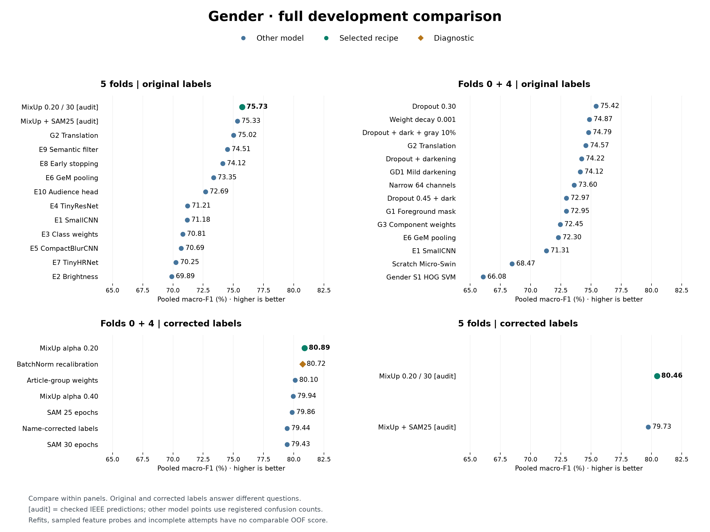

**Figure 3. Gender development comparison.** All model variants and the BatchNorm diagnostic are
shown. Green marks the selected
recipe; fold/label panels and audited re-scoring remain separate.

### 5.2 Usage

Casual accounts for 76.7% of eligible development rows; Home has one example, Party 12,
Travel 22 and Smart Casual 47. Weighting could increase their influence but could not supply
missing visual variety. This motivated 120, then 687 total reviewed external images preserved in
the group's versioned Drive folder [24], while teacher folds stayed fixed and transfer was scored
only on teacher rows. The larger expansion recognised outside Party/Smart Casual images but missed
all teacher examples of both classes. Different product coverage and source appearance were
plausible limits; MixUp/SAM and 130 replacements did not repair them. More outside data therefore
did not justify replacing teacher-only E8.

**Select single E8** with class weighting [11] and translation: five-fold F1 improves from
E1's 0.3738 to 0.4194, while accuracy falls from 89.30% to 88.85%. Against weighted E2,
shift damage falls from 8.69 to 2.69 F1 points, but darkening damage rises from 12.89 to 16.19.
The E2+E3+E8 average scores higher (0.4231), yet needs three passes and lacks matched corruption
evidence. E8 prioritises measured shift tolerance and one-model inference over those gains.

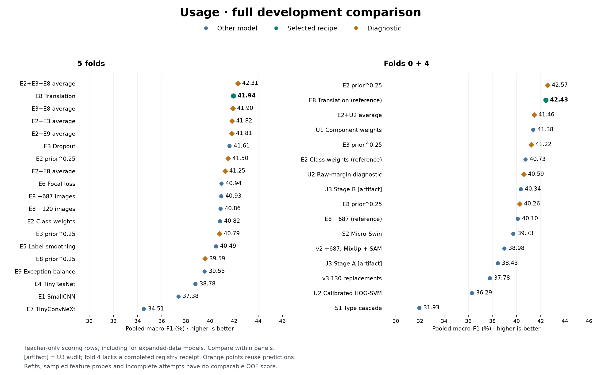

**Figure 4. Usage development comparison.** All model variants and prediction diagnostics use
teacher rows. Orange marks
diagnostics; the three-model average's advantage remains visible.

### 5.3 Final assessment

On 5,778 original-label holdout images, the scratch epoch-30 refits achieve **0.7874 macro-F1 /
90.46% accuracy** for Gender and **0.4226 / 88.70%** for Usage. Gender misses 140/311 Unisex
products; Usage finds only five of 22 rare-occasion examples. Unsupported Home remains in the
nine-class score. These results support reviewed suggestions; one seed, repeated selection [18]
and untested refit robustness limit broader claims. Figures A8-A9 preserve whole-family intervals
and raw reliability diagnostics; neither demonstrates transfer or calibrated probabilities.

See [Notebook 06, Sections 3–8 (EDA), 9–15 (Gender) and 16–18 (Usage)](../notebooks/06_task3_part1_gender_usage.ipynb)
for experiment labels, rules and trade-offs; Section 19 summarises development findings and limits,
while Section 2 inventories probes and incomplete attempts.
[Notebook 07, Sections 3–15](../notebooks/07_task3_part2_final_evaluation.ipynb) gives recipes,
uncertainty, cost and final judgement.

## 6. Task 4 - Visual Search

Task 4 returns Top-K unique products rather than a class. The main metadata-based similarity
evaluation, Protocol A, assigns relevance grade 2 when both `articleType` and `baseColour` match
the query, 1 when only `articleType` matches, and 0 otherwise. Method selection uses mean linear
nDCG@10, which rewards relevant results near the top [19]. Protocol B separately measures
product-family recovery in the first ten results after removing the query itself and exact
duplicates; Recall@10, hit rate, precision, and coverage are retained. These metadata rules are
reproducible proxies for visual relevance, not human similarity judgements.

The baseline maps a 240 x 320 letterboxed image to spatial HSV and edge features, then ranks exact
cosine distance. HOG fusion strengthened this fixed representation. Learned candidates mapped the
image through scratch ResNet encoders trained with VICReg [20], family triplet loss, or, for R5, a
scratch convolutional autoencoder. R5 reconstructs the image during training, L2-normalises its
128-value bottleneck at inference, collapses duplicate product views by minimum distance, and
returns the smallest-distance unique IDs. R1/R2 non-finite failures, R3/R4 weaker scores, the
pretrained B1 comparison, five-fold stability, and teacher/V1/two-view gallery policies remain
visible in [Notebook 09, Sections 2-15](../notebooks/task-4/09_task4_part2_visual_search.ipynb);
V1 is the Kaggle Fashion Product Images Dataset [23].

**Figure 5. Task 4 development comparison.** R5 led the frozen comparison; pretrained B1 is hatched because it was
never eligible for submission. The strong fixed-feature methods remain essential baselines.

On holdout, R5 achieved **0.5162 teacher-query nDCG@10**, versus 0.5151 for HOG fusion, 0.5096
for the spatial probe, 0.3195 for pretrained B1, and 0.0343 for random ranking. The R5-minus-HOG
95% interval **[-0.0035, 0.0055]** crosses zero, so R5 is not proven better than HOG fusion;
R5 remains final because it was the pre-holdout eligible winner. Its package is 57.2 MB, gallery
24.4 MB, and CPU query p50/p95 23.39/24.90 ms. Wide and tall canvases caused severe drops, so input
validation/cropping and human inspection are required. Published fashion retrieval systems use
different datasets, relevance rules, and often pretrained backbones; their scores are context, not
a common leaderboard [21], [22]. Figures A10-A11 separate the near-tie interval from the large-canvas
failure profile. See [Notebook 10, Sections 3-15](../notebooks/task-4/10_task4_part3_final_evaluation.ipynb).

## 7. Proposed Application Integration and Overall Judgement

The proposed Assessment 2 application flow is: validate an uploaded image; apply each saved model's exact
preprocessing; run the four scratch classifiers and R5 encoder; display editable labels,
probabilities, review warnings, and Top-K products; then log the model/hash, suggestion, correction,
and approval. A decode or inference failure must leave manual entry available. No confidence
threshold is authorised for automatic publication because no business error cost or user study has
validated one. Figure A12 likewise shows Task 4's measured retrieval quality/coverage trade-off as
a diagnostic, not a chosen service threshold. This defines an integration design; it is not evidence
that a GUI/API was implemented, tested, or evaluated in Assessment 2.

Our overall judgement is therefore task-specific, not a claim that one system is universally
ready. Task 1 is useful for Top-5 assisted type suggestions but fails rare labels; Task 2 provides
a calibrated classifier with strong same-source holdout performance but is brightness-sensitive;
Task 3 supports editable Gender/Usage suggestions with weak rare-class recognition and unproven
new-source transfer; and Task 4 gives useful ranked catalogue matches but is statistically tied
with its strongest fixed baseline and fragile to large canvases. The system is suitable for a
monitored catalogue-assistance pilot with human approval. Fully automatic publication and transfer
to new retailers, cameras, or populations remain unproven.

The four official classifier exports must each contain all **5,829** requested IDs and be merged in
the required unchanged order and schema: `id,gender,articleType,season,usage`. Task 3's selected-refit
assessment does not create that combined file; export coverage must be checked against the exact
selected checkpoints. Because this official
prediction set has no ground-truth labels, it verifies coverage and format but cannot support a
performance claim. Future improvement requires a target-domain dataset with documented source,
sampling, annotation rules, time and capture conditions, representative labels, and a new untouched
evaluation set. This would support targeted cleaning, rare-case collection, drift analysis,
recalibration, and retraining; clearer provenance alone does not guarantee a better model.

---

## Appendix A - Evidence Figures

**Figure A1. Shared shortcut audit.** Associations motivated controlled tests and slices; they do
not prove causal prediction mechanisms. Source: Notebook 01, Section 4.3.

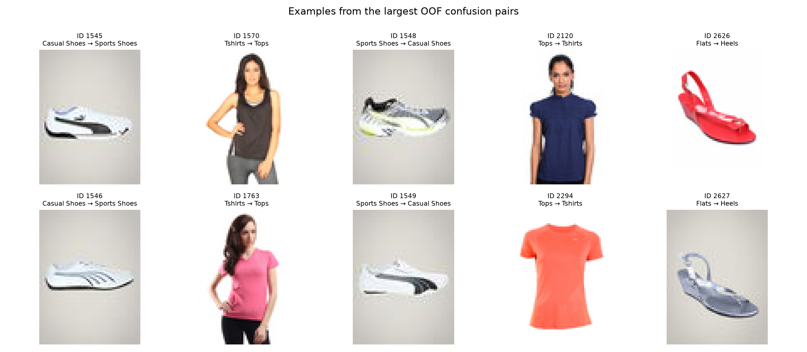

**Figure A2. Task 1 confusion examples.** Representative OOF errors show why visually adjacent
catalogue labels remain difficult: Sports Shoes/Casual Shoes, Tshirts/Tops, and Flats/Heels share
substantial appearance. These examples explain failure modes; they do not estimate prevalence.
Source: Notebook 02, Section 13.

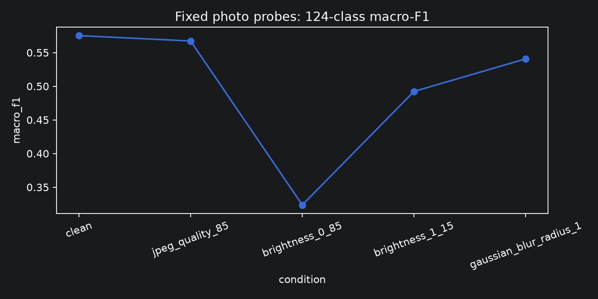

**Figure A3. Task 1 fixed-photo robustness.** The selected scratch CNN is stable under JPEG quality
85 but loses substantial 124-class macro-F1 under brightness 0.85; brightening and mild blur also
reduce performance. Source: Notebook 03, Section 9.

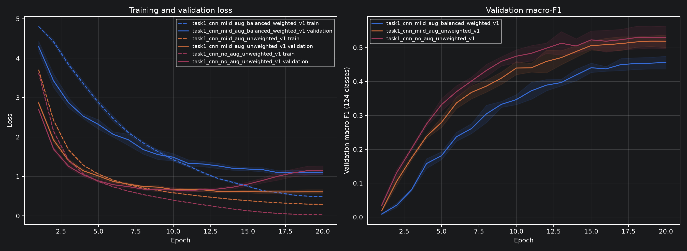

**Figure A4. Task 1 learning dynamics.** Mean fold curves show falling training loss but flattening
validation macro-F1; more optimisation alone would not address the remaining class errors. Source:
Notebook 02, Sections 9-12.

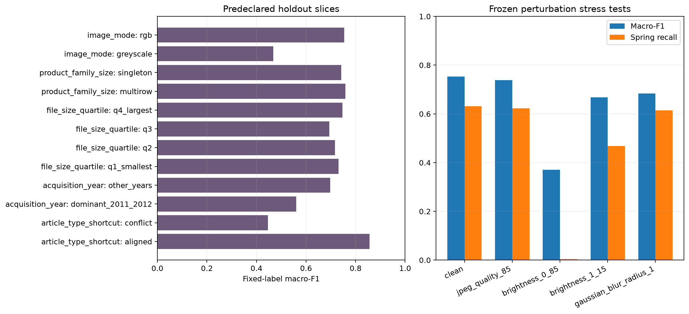

**Figure A5. Task 2 holdout slices and robustness.** Predeclared slices expose weaker greyscale,
older-acquisition, and ArticleType-conflict performance. Frozen perturbations show brightness 0.85
as the dominant failure for both macro-F1 and Spring recall. Source: Notebook 05, Sections 10-11.

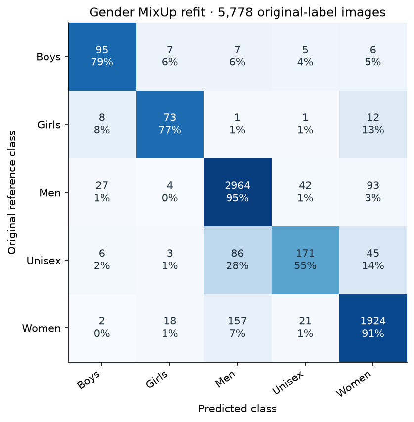

**Figure A6. Task 3 Gender MixUp refit confusion matrix.** Counts and row percentages show
the 140 missed Unisex products, including 86 tagged Men and 45 tagged Women. Reference labels
are unchanged; the matrix assesses the single selected refit. Source: Notebook 07, Section 7.

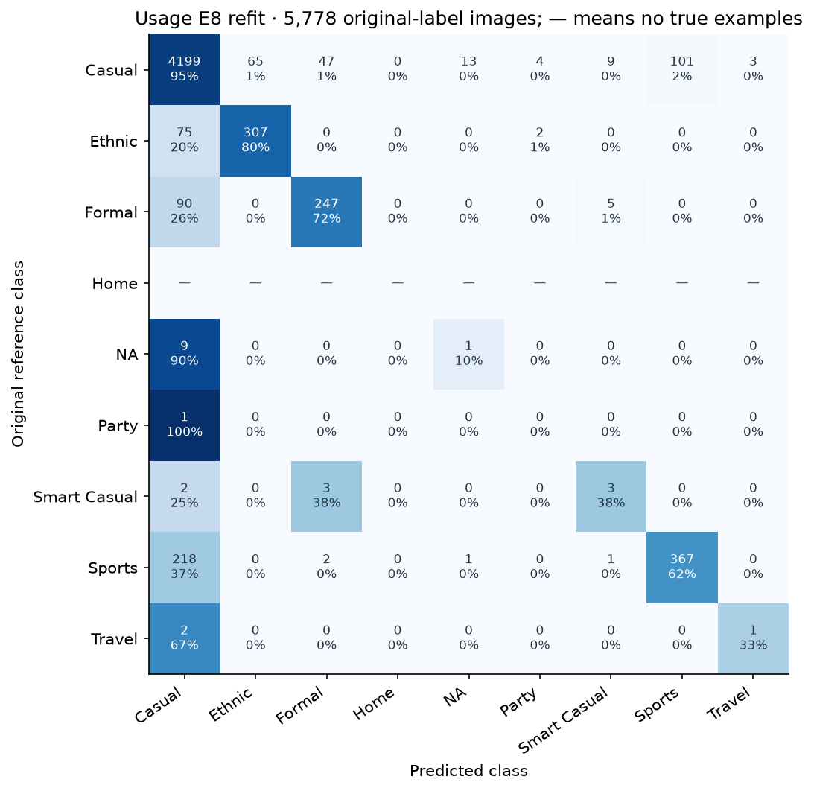

**Figure A7. Task 3 Usage E8 refit confusion matrix.** Common classes account for most correct
predictions; only five of 22 rare-occasion examples are recognised. Party remains missed and
Home is unassessed, although its zero F1 stays in the nine-class mean. Source: Notebook 07, Section 8.

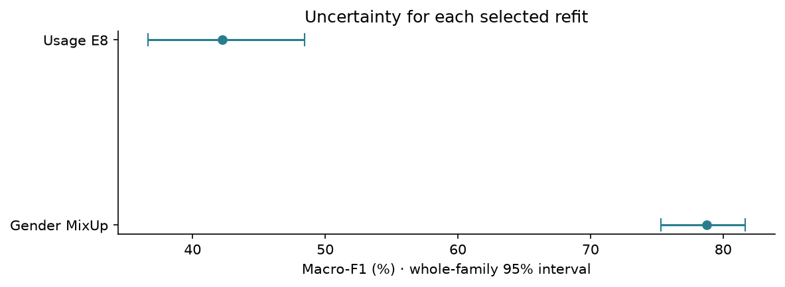

**Figure A8. Task 3 selected-refit uncertainty.** Whole-family 95% intervals retain uncertainty for
both selected models without treating Gender and Usage as one leaderboard. Source: Notebook 07,
Section 10.

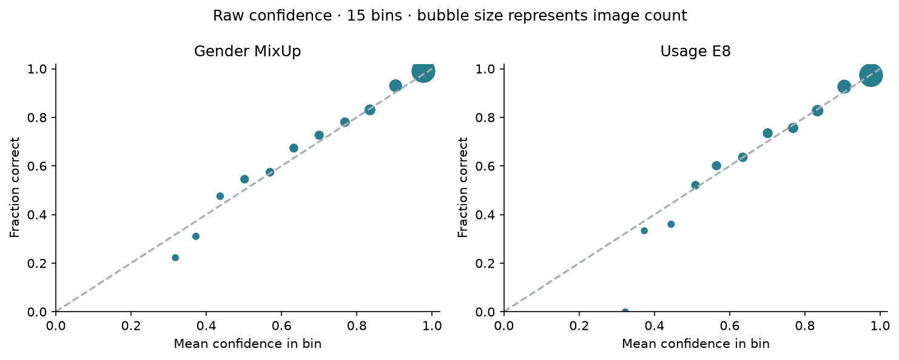

**Figure A9. Task 3 raw reliability diagnostics.** Fifteen-bin plots compare mean confidence with
observed correctness. They expose descriptive confidence gaps but do not authorise a calibrated
decision threshold. Source: Notebook 07, Section 11.

**Figure A10. Task 4 family-blocked 95% intervals.** R5 clearly beats random and pretrained B1,
slightly beats the spatial probe, but is not distinguishable from HOG fusion. Source: Notebook 10,
Section 8.

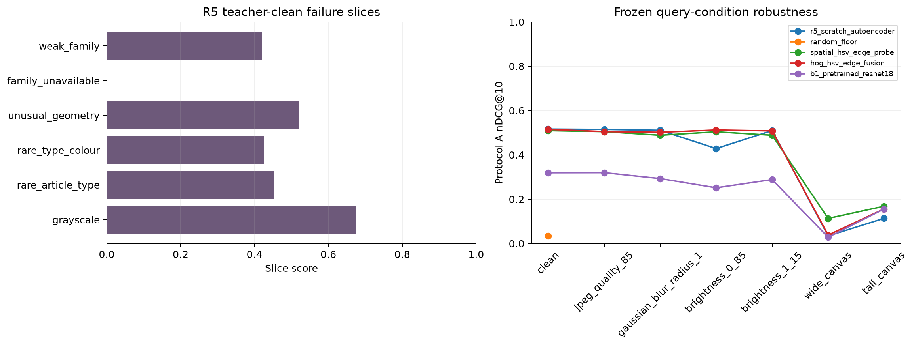

**Figure A11. Task 4 failure slices and robustness.** R5 is comparatively stable under JPEG, blur,
and brightness probes but fails sharply on wide and tall canvases; input-shape review is therefore
part of the deployment boundary. Source: Notebook 10, Sections 9-10.

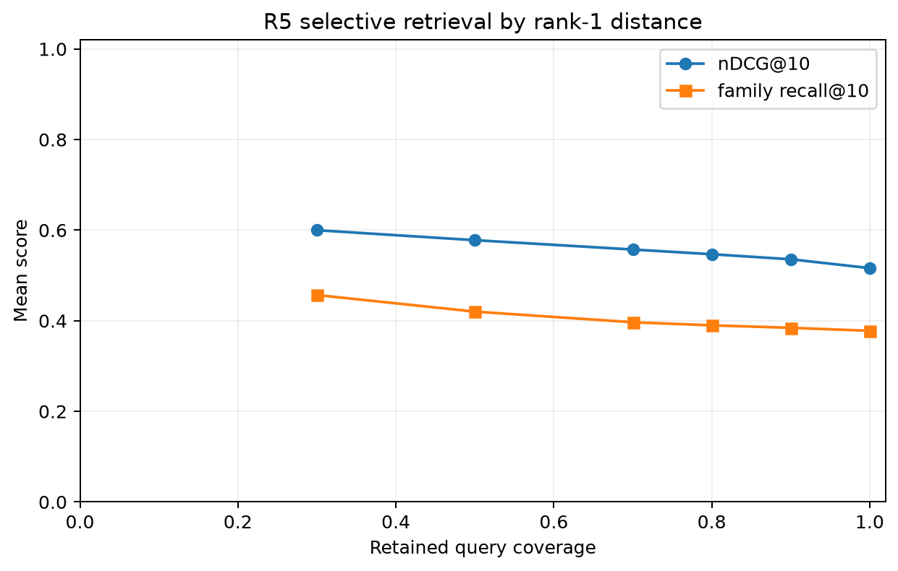

**Figure A12. Task 4 selective retrieval diagnostic.** Smaller rank-1-distance cutoffs retain fewer
queries and raise average nDCG@10 and family recall@10. The opened-holdout curve is not a frozen
operating rule. Source: Notebook 10, Section 9.

## Appendix B - Evidence Navigation

The concise report deliberately points to, rather than duplicates, the full audit trail:

- Shared provenance, cleaning, family-safe folds, EDA, and hypotheses: [Notebook 01](../notebooks/01_data_preparation.ipynb), especially Sections 1-5.
- Task 1 development and final evidence: [Notebook 02](../notebooks/02_task1_part1_article_type.ipynb), Sections 7-14; [Notebook 03](../notebooks/03_task1_part2_final_evaluation.ipynb), Sections 7-12.
- Task 2 gates and final evidence: [Notebook 04](../notebooks/04_task2_part1_season.ipynb), Sections 8-14; [Notebook 05](../notebooks/05_task2_part2_final_evaluation.ipynb), Sections 3-15.
- Task 3 development and evaluation: [Notebook 06](../notebooks/06_task3_part1_gender_usage.ipynb), Sections 3-19; [Notebook 07](../notebooks/07_task3_part2_final_evaluation.ipynb), Sections 3-15.
- Task 4 development and evaluation: [Notebook 09](../notebooks/task-4/09_task4_part2_visual_search.ipynb), Sections 2-15; [Notebook 10](../notebooks/task-4/10_task4_part3_final_evaluation.ipynb), Sections 3-15.

## References

[1] T. Gebru *et al*., [“Datasheets for datasets,”](https://doi.org/10.1145/3458723)
*Commun. ACM*, vol. 64, no. 12, pp. 86-92, Dec. 2021.

[2] N. Dalal and B. Triggs, [“Histograms of oriented gradients for human detection,”](https://doi.org/10.1109/CVPR.2005.177)
in *Proc. IEEE Comput. Soc. Conf. Comput. Vis. Pattern Recognit. (CVPR)*, 2005, pp. 886-893.

[3] C. Cortes and V. Vapnik, [“Support-vector networks,”](https://doi.org/10.1007/BF00994018)
*Mach. Learn.*, vol. 20, pp. 273-297, 1995.

[4] Y. LeCun, L. Bottou, Y. Bengio, and P. Haffner,
[“Gradient-based learning applied to document recognition,”](https://doi.org/10.1109/5.726791)
*Proc. IEEE*, vol. 86, no. 11, pp. 2278-2324, Nov. 1998.

[5] K. He, X. Zhang, S. Ren, and J. Sun,
[“Deep residual learning for image recognition,”](https://openaccess.thecvf.com/content_cvpr_2016/html/He_Deep_Residual_Learning_CVPR_2016_paper.html)
in *Proc. IEEE Conf. Comput. Vis. Pattern Recognit. (CVPR)*, 2016, pp. 770-778.

[6] A. Howard *et al*., [“Searching for MobileNetV3,”](https://openaccess.thecvf.com/content_ICCV_2019/html/Howard_Searching_for_MobileNetV3_ICCV_2019_paper.html)
in *Proc. IEEE/CVF Int. Conf. Comput. Vis. (ICCV)*, 2019, pp. 1314-1324.

[7] I. Loshchilov and F. Hutter, [“Decoupled weight decay regularization,”](https://openreview.net/forum?id=Bkg6RiCqY7)
in *Proc. Int. Conf. Learn. Representations (ICLR)*, 2019.

[8] M. Sokolova and G. Lapalme,
[“A systematic analysis of performance measures for classification tasks,”](https://doi.org/10.1016/j.ipm.2009.03.002)
*Inf. Process. Manage.*, vol. 45, no. 4, pp. 427-437, 2009.

[9] C. A. Field and A. H. Welsh, [“Bootstrapping clustered data,”](https://doi.org/10.1111/j.1467-9868.2007.00593.x)
*J. R. Stat. Soc. Series B Stat. Methodol.*, vol. 69, no. 3, pp. 369-390, 2007.

[10] D. Hendrycks and T. Dietterich,
[“Benchmarking neural network robustness to common corruptions and perturbations,”](https://arxiv.org/abs/1903.12261)
in *Proc. Int. Conf. Learn. Representations (ICLR)*, 2019.

[11] Y. Cui, M. Jia, T.-Y. Lin, Y. Song, and S. Belongie,
[“Class-balanced loss based on effective number of samples,”](https://openaccess.thecvf.com/content_CVPR_2019/html/Cui_Class-Balanced_Loss_Based_on_Effective_Number_of_Samples_CVPR_2019_paper.html)
in *Proc. IEEE/CVF Conf. Comput. Vis. Pattern Recognit. (CVPR)*, 2019, pp. 9268-9277.

[12] R. Caruana, [“Multitask learning,”](https://doi.org/10.1023/A:1007379606734)
*Mach. Learn.*, vol. 28, pp. 41-75, 1997.

[13] J. Deng, W. Dong, R. Socher, L.-J. Li, K. Li, and L. Fei-Fei,
[“ImageNet: A large-scale hierarchical image database,”](https://doi.org/10.1109/CVPR.2009.5206848)
in *Proc. IEEE Conf. Comput. Vis. Pattern Recognit. (CVPR)*, 2009, pp. 248-255.

[14] C. Guo, G. Pleiss, Y. Sun, and K. Q. Weinberger,
[“On calibration of modern neural networks,”](https://proceedings.mlr.press/v70/guo17a.html)
in *Proc. 34th Int. Conf. Mach. Learn. (ICML)*, 2017, pp. 1321-1330.

[15] R. R. Selvaraju *et al*.,
[“Grad-CAM: Visual explanations from deep networks via gradient-based localization,”](https://openaccess.thecvf.com/content_iccv_2017/html/Selvaraju_Grad-CAM_Visual_Explanations_ICCV_2017_paper.html)
in *Proc. IEEE Int. Conf. Comput. Vis. (ICCV)*, 2017, pp. 618-626.

[16] H. Zhang, M. Cisse, Y. N. Dauphin, and D. Lopez-Paz,
[“mixup: Beyond empirical risk minimization,”](https://openreview.net/forum?id=r1Ddp1-Rb)
in *Proc. Int. Conf. Learn. Representations (ICLR)*, 2018.

[17] P. Foret, A. Kleiner, H. Mobahi, and B. Neyshabur,
[“Sharpness-aware minimization for efficiently improving generalization,”](https://openreview.net/forum?id=6Tm1mposlrM)
in *Proc. Int. Conf. Learn. Representations (ICLR)*, 2021.

[18] G. C. Cawley and N. L. C. Talbot,
[“On over-fitting in model selection and subsequent selection bias in performance evaluation,”](https://www.jmlr.org/papers/v11/cawley10a.html)
*J. Mach. Learn. Res.*, vol. 11, pp. 2079-2107, 2010.

[19] K. Järvelin and J. Kekäläinen,
[“Cumulated gain-based evaluation of IR techniques,”](https://doi.org/10.1145/582415.582418)
*ACM Trans. Inf. Syst.*, vol. 20, no. 4, pp. 422-446, 2002.

[20] A. Bardes, J. Ponce, and Y. LeCun,
[“VICReg: Variance-invariance-covariance regularization for self-supervised learning,”](https://openreview.net/forum?id=xm6YD62D1Ub)
in *Proc. Int. Conf. Learn. Representations (ICLR)*, 2022.

[21] Z. Liu, P. Luo, S. Qiu, X. Wang, and X. Tang,
[“DeepFashion: Powering robust clothes recognition and retrieval with rich annotations,”](https://openaccess.thecvf.com/content_cvpr_2016/html/Liu_DeepFashion_Powering_Robust_CVPR_2016_paper.html)
in *Proc. IEEE Conf. Comput. Vis. Pattern Recognit. (CVPR)*, 2016, pp. 1096-1104.

[22] M. H. Kiapour, X. Han, S. Lazebnik, A. C. Berg, and T. L. Berg,
[“Where to buy it: Matching street clothing photos in online shops,”](https://openaccess.thecvf.com/content_iccv_2015/html/Kiapour_Where_to_Buy_ICCV_2015_paper.html)
in *Proc. IEEE Int. Conf. Comput. Vis. (ICCV)*, 2015, pp. 3343-3351.

[23] P. Aggarwal,
[“Fashion Product Images Dataset,”](https://www.kaggle.com/datasets/paramaggarwal/fashion-product-images-dataset)
Kaggle, version 1. [Online]. Accessed: Sep. 11, 2026.

[24] SG_G6,
[“Task 3 additional-data folder,”](https://drive.google.com/drive/folders/1U_seBSZcvOOkSSdJ41zzncL4Fom3KATI)
Google Drive. [Online]. Accessed: Sep. 11, 2026.
