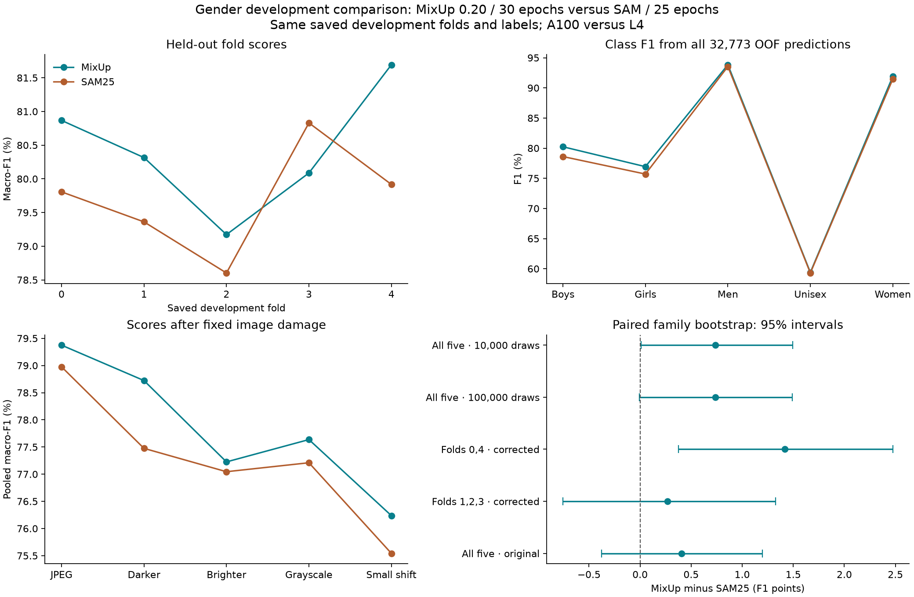
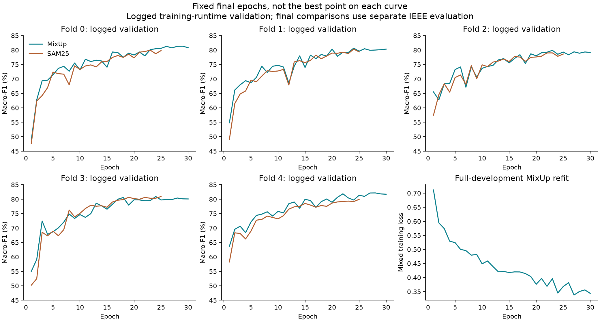

# Gender selection review — 11 September 2026

**Select the MixUp 0.20, 30-epoch recipe on the development evidence.** Its
completed full-development refit is the candidate checkpoint for that choice.
It has the better observed balance of class F1, accuracy, confidence quality
and scores under image damage. SAM25 retains a smaller clean fit gap and
slightly less fold spread. The evidence does **not** establish a certain
population-level win for MixUp.

This recommendation revisits the earlier SAM choice with the previously
missing five-fold MixUp comparison. It does not rewrite the old experiment
gates or the September 7 acceptance record. The existing frozen SAM25 model
package remains unchanged by this analysis.

## The completed runs are valid

All five fresh MixUp folds finished 30 epochs. Every one of the 32,773
development images has exactly one prediction from the model that excluded
its saved fold. No development ensemble is used. Both recipes use the same
folds, product families, corrected labels, class order, fold-fitted image
normalization, architecture and image augmentation. The training precision
settings match; final predictions use the same IEEE FP32 evaluation policy.

The comparison is **MixUp/30 epochs against MixUp + SAM/25 epochs**. It is
not an isolated estimate of SAM's effect. MixUp used an A100; SAM25 used an
L4. A common seed and precision policy do not make those training trajectories
identical. The old MixUp two-fold screen scored 80.89%; the new runs on those
same two folds score 81.28%. Keep both recorded results instead of replacing
the old screen with the more favourable rerun.

The audit checks saved file hashes, the recorded Git source, registry entries,
training rows, 30 epoch receipts, final-epoch selection and learning-rate
schedules. All six new checkpoints load with the expected 390,181 parameters
and finite tensors. This was a structural check, with no new training or
inference. The original teacher-label diagnostic rescored the same saved
predictions; it did not change labels or models. The fixed name rule changes
350 development labels.

## The full five-fold comparison

Scores below pool the held-out predictions. The gap is the mean of each
fold's clean training F1 minus its validation F1. These are different
calculations; the pooled score should not be subtracted from mean training F1.

| Measure | MixUp 0.20, 30 epochs | SAM25 |
|---|---:|---:|
| Corrected-label macro-F1 | **80.46%** | 79.73% |
| Original teacher-label macro-F1 | **75.73%** | 75.33% |
| Corrected-label accuracy | **90.86%** | 90.46% |
| Mean clean training F1 | 93.80% | 89.86% |
| Mean clean train–validation gap | 13.37 points | **10.15 points** |
| Fold F1 sample standard deviation | 0.94 points | **0.81 points** |
| NLL: probability error, lower is better | **0.2675** | 0.2811 |
| Brier score: probability error, lower is better | **0.1373** | 0.1440 |
| ECE: confidence mismatch, lower is better | **1.14%** | 2.77% |

MixUp wins four folds; SAM wins fold 3 by 0.74 points. MixUp's worst fold
scores 79.17%, against SAM's 78.60%. Fold spread is descriptive: these
models share training rows and are not five independent experiment repeats.
MixUp fixes **571** SAM errors and introduces **442**, leaving **129 fewer
errors** overall. On original teacher labels, accuracy also improves
(90.03% versus 89.68%), and all three confidence-quality measures favour MixUp.

**Why the smaller SAM gap is not enough to select it:** SAM's training F1 is
3.94 points lower, while mean fold validation F1 is about 0.72 points lower.
Most of its 3.22-point gap reduction therefore comes from fitting training
images less well. That can be useful regularisation, but here it does not
translate into a better held-family score or better confidence quality.
MixUp's larger gap remains a real weakness; a small gap is not the objective
by itself. This is a revised overall judgement, not a claim that the old
gap-focused screen failed its recorded rules.



## Bootstrap: a small lead with meaningful uncertainty

The paired bootstrap resamples **whole product families within each saved
fold**, using the same sampled families for both models. It keeps all five
classes in macro-F1, uses seed 2753, and includes 22,905 development families.
Positive differences favour MixUp. The original 10,000-draw procedure is
retained; 100,000 draws check the stability of its near-zero lower endpoint.

| Comparison | F1 gain | Paired 95% interval |
|---|---:|---:|
| All five folds, corrected labels, 10,000 draws | +0.74 points | +0.01 to +1.50 |
| Same comparison, 100,000 draws | +0.74 points | **−0.01 to +1.49** |
| Screen folds 0 and 4 | +1.42 points | +0.38 to +2.47 |
| Additional folds 1, 2 and 3 | +0.27 points | **−0.76 to +1.33** |
| All five folds, original teacher labels | +0.41 points | **−0.38 to +1.20** |

The 100,000-draw lower endpoint is −0.00797 points; the 10,000-draw endpoint
is +0.00937 points. This change is Monte Carlo variation in estimating a
boundary near zero. More draws do not create more independent data. Calling
the result a robustly significant win would overstate the evidence.

The smaller gain on additional folds matters: MixUp scores 79.90% there and
SAM25 79.63%. These folds extend the comparison, but do not independently
establish superiority. The intervals describe variation across the saved
families for these trained models. They do not cover new training seeds,
hardware effects, repeated experiment selection or arbitrary real-world
image changes. They are marginal intervals, not a correction for the many
comparisons made during development.

## Robustness: final score and damage are different questions

These tests use each fold's held-out images with the same fixed corruption.
All scores below use corrected labels and pool all five folds. “Drop” is
each model's own clean pooled F1 minus its corrupted pooled F1. Separate
mean-fold drops are retained in the CSV; they are not substituted here.

| Condition | MixUp F1 | SAM25 F1 | MixUp drop | SAM25 drop | 95% interval for F1 gain |
|---|---:|---:|---:|---:|---:|
| JPEG quality 75 | **79.37%** | 78.98% | 1.09 | **0.75** | −0.38 to +1.19 |
| Brightness ×0.85 | **78.72%** | 77.48% | **1.74** | 2.25 | +0.29 to +2.21 |
| Brightness ×1.15 | **77.23%** | 77.05% | 3.24 | **2.68** | −0.72 to +1.10 |
| Grayscale | **77.64%** | 77.21% | 2.83 | **2.52** | −0.39 to +1.23 |
| Small translation | **76.24%** | 75.54% | 4.23 | **4.18** | −0.17 to +1.54 |

MixUp has the higher final F1 in every corrected-label condition, including
the worst condition, translation. Darkening is the clearest observed benefit;
the other paired intervals cross zero. However, SAM loses less relative to
its own clean score in four conditions. Thus “MixUp has better corrupted
scores” is supported; “MixUp is less sensitive to every corruption” is false.

The original-label check is less one-sided. MixUp wins four conditions,
but SAM wins brighter images **73.28% versus 73.13%**. JPEG is nearly tied
(74.57% versus 74.59%). The selection is therefore a practical balance, not
universal robustness dominance. These are five mild catalogue-image tests,
not evidence about severe crops, phone photos or unseen acquisition domains.
They evaluate the fold models, not the full-development refit.

## Class behaviour and failures

| Class | MixUp F1 | SAM25 F1 | MixUp correct / support | SAM25 correct |
|---|---:|---:|---:|---:|
| Boys | **80.24%** | 78.61% | 682 / 868 | 667 |
| Girls | **76.93%** | 75.71% | 512 / 700 | 508 |
| Men | **93.84%** | 93.54% | 16,815 / 17,572 | 16,718 |
| Unisex | **59.39%** | 59.30% | 901 / 1,763 | 896 |
| Women | **91.92%** | 91.47% | 10,866 / 11,870 | 10,858 |

All class F1 point estimates improve, but **Unisex is essentially unresolved**.
Its recall is 51.11% versus 50.82%, and MixUp still misses 862 items. Of all
true Unisex items, 528 become Men and 280 become Women. Its mean clean class
gap is 23.55 points with MixUp versus 14.68 with SAM, mostly reflecting lower
SAM training fit rather than a useful change in validation F1.

There are concrete regressions despite the total gain. MixUp loses 11 correct
Women perfume/body-mist products, eight Men sports shoes and seven Unisex caps.
It gains 20 Men perfume/body-mist products, 18 Men watches and ten Girls tops.
These are descriptive slices; small groups are not reliable independent tests.
The audience tag is sometimes ambiguous from the image alone. The observed
errors support catalogue suggestions with review, not automatic certainty.

## Why this follows the wider development investigation

The accompanying [stage table](all_gender_development_stages.csv) rebuilds
32 historical Gender stage/scope entries from the saved run registries.
It labels the fold set, label basis and original numerical basis. It is not
a leaderboard that mixes incompatible scores. The newer IEEE audit above
is authoritative for the final MixUp–SAM comparison.

- **Features first:** on five folds and original labels, the baseline scores
  71.18% F1, GeM 73.35%, and the later G2 translation recipe 75.02%.
  The original brightness, class-weight, residual, blur and high-resolution
  branches did not replace that path. Early stopping and semantic filtering
  reached 74.12% and 74.51%, but did not establish a better full solution.
  The audience head reached 72.69%. Those branches are not cumulative gains.
- **Alternative learners:** on matched screen folds, HOG-SVM scored 66.08%
  and scratch Micro-Swin 68.47%, below GeM's 72.30%. This supports the tested
  compact CNN, not a claim that all classical or transformer methods fail.
- **Augmentation and capacity:** dropout helped part of the fit gap.
  Darkening and grayscale targeted measured weaknesses, with clean-score
  costs recorded. Foreground masks, component weights, stronger weight decay,
  narrower channels and stronger dropout did not establish a better balance.
  Their older labels and parents prevent adding their effects to today's model.
- **Label review:** the fixed name rule improved recognition under the
  corrected-label target, but the name-label model still failed its original
  gap checks. Original-label results remained separate. This is why both
  label bases are reported in the new comparison too.
- **MixUp:** the original matched two-fold audit raised F1 from 79.44% to
  80.89% and reduced the clean gap from 17.38 to 12.91 points. The old family
  interval for that gain was +0.15 to +2.82 points. Article-group weighting
  instead added 66 errors and failed its gap target. Stronger MixUp 0.40
  scored about 79.87% in the IEEE audit; its small further gap reduction
  came with worse Boys/Girls scores. Training-only BatchNorm recalibration
  also failed to improve the balance.
- **SAM:** SAM30 reduced training fit but lost F1 and five Unisex detections.
  SAM25 restored those detections and passed the recorded gap-focused screen.
  It was reasonable to investigate; the new five-fold head-to-head evidence
  now shows why its smaller gap is insufficient to prefer it overall.

These findings support retaining the useful MixUp 0.20 recipe and avoiding
extra regularisation solely to make the gap smaller. The new comparison
fills an evidence gap; it does not retrospectively turn every preceding
experiment into a clean, independent hypothesis test.

## The full-development refit

The completed refit is
`t3_gender_name_truth_mixup_alpha020_refit_20260911T041436Z_3af0b94e`.
Its checkpoint SHA-256 is
`860f688162cccfcd903e8e4874b368697c0637b6e6a15baae3b4d4a3008f4ef9`.

It trained from scratch on all 32,773 development images for 30 epochs,
with 257 updates per epoch: **7,710 updates** in total. It uses no SAM,
validation selection or early stopping. Its mixed training loss fell from
0.7113 to 0.3439, with ordinary fluctuations and no non-finite weights.
Recorded time is **9 minutes 20 seconds** on A100; peak allocated GPU memory
is **476.6 MB**. The five CV runs together recorded about 44.5 training
minutes, versus 39.8 for SAM on L4. These different hardware and evaluation
workloads are not a speed benchmark.

The fixed refit uses the same GeM p=3 CNN, dropout 0.30, seed 2753, batch 128,
AdamW learning rate 0.001, weight decay 0.0001, and cosine T_max=30 with
minimum rate 0.00001. Keep the saved translation, darkening and grayscale
augmentation, and its own full-development RGB normalization. Inference is
one model, softmax then argmax, with class order Boys, Girls, Men, Unisex, Women.
Both single-model recipes have the same inference architecture. MixUp's
simpler training update is not evidence of faster single-model inference.

**The refit has no independent development score.** The 80.46% F1 and the
corruption results belong to the five fold models. Assigning them directly
to the refit would be false. No new holdout or teacher-test predictions were
used here. Those sets were opened in earlier work, so this later decision
must not be described as newly blind or the old holdout reused as fresh tuning
data. This review recommends a recipe and validates its completed artifact;
it does not supply new independent evaluation of that artifact.



## Reproduce and inspect

Run the saved-artifact audit with:

```bash
PYTHONPATH=src OPENBLAS_NUM_THREADS=1 ./.venv/bin/python reports/task3/gender_mixup_selection_20260911/analyze.py
```

It checks the inputs, rebuilds metrics, resamples families and saves tables
and figures. Cached bootstrap results are tied to the exact paired rows,
predictions, draw count and implementation. It never trains or runs inference.
The bulk input folders are local copies from these existing Drive paths:

- `MLA2/task3/experiments/t3_gender_name_truth_mixup_alpha020_cv/gender`
- `MLA2/task3/experiments/t3_gender_name_truth_mixup_alpha020_refit/gender`
- `MLA2/task3/experiments/t3_gender_name_truth_mixup_alpha020_sam005_epoch25_cv/gender/comparison_name_truth_ieee`
- `MLA2/task3/results/runs.csv`

The compact results include [summary](summary.json),
[bootstrap intervals](bootstrap_intervals.json),
[fold comparison](fold_comparison.csv), [class comparison](class_comparison.csv),
[class gaps](class_gaps.csv), [robustness](robustness_comparison.csv),
[original-label robustness](original_label_robustness.csv),
[article-level changes](article_error_changes.csv),
[verified registry rows](verified_registry_rows.csv), and
[artifact hash checks](verified_artifact_hashes.json).

Earlier evidence: [MixUp screen](../gender_mixup_result_20260906/README.md),
[SAM25 screen](../gender_sam25_result_20260906/README.md),
[SAM25 five folds](../gender_sam25_cv_result_20260906/README.md),
[other regularisation probes](../gender_overfitting_research_20260906/README.md).
