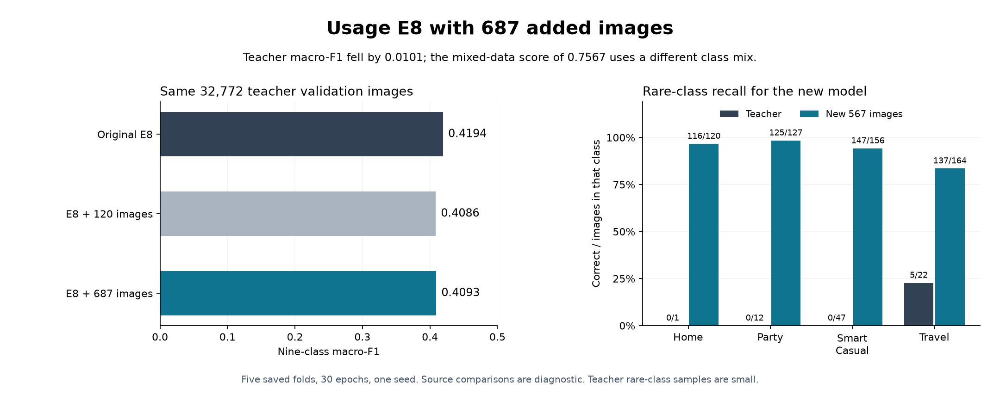
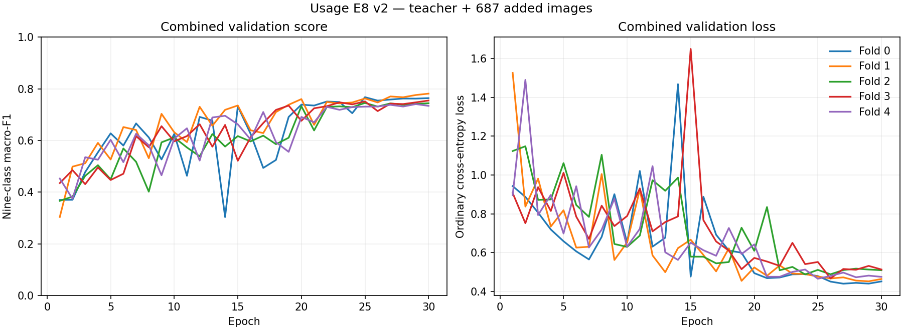

# Usage E8 with 687 added images: result review

**The run worked, but the added data did not establish an improvement on the teacher task.**
All five folds completed 30 epochs. The teacher folds and all earlier external folds stayed fixed.
Use the original teacher validation images to judge this experiment.

| Same 32,772 teacher validation images | Macro-F1 |
|---|---:|
| Original E8 | **0.4194** |
| E8 with the earlier 120 additions | 0.4086 |
| E8 with all 687 additions | 0.4093 |

The new run is **0.0101 below original E8** and only **0.0006 above the first expansion**.
It wins two of five teacher folds against each reference. Do not replace original E8 on this
evidence. This decision does not freeze a final deployment model or judge other candidates.

## What improved and what failed

| Teacher class | Images | Original E8 F1 | New F1 |
|---|---:|---:|---:|
| Casual | 25,151 | 0.9305 | 0.9339 |
| Ethnic | 2,183 | 0.8474 | 0.8624 |
| Formal | 1,949 | 0.7771 | 0.7991 |
| Home | 1 | 0.0000 | 0.0000 |
| NA | 61 | 0.1690 | 0.2362 |
| Party | 12 | 0.0769 | 0.0000 |
| Smart Casual | 47 | 0.1034 | 0.0000 |
| Sports | 3,346 | 0.6661 | 0.6905 |
| Travel | 22 | 0.2041 | 0.1613 |

Casual, Ethnic, Formal, Sports and NA improve. However, the classes targeted by the intake
still do poorly on teacher images. The new model gets **0/12 Party**, **0/47 Smart Casual**,
**0/1 Home**, and **5/22 Travel** correct. The Home sample is too small for a broad conclusion.

The same model gets **525/567 new-source images correct (92.6%)**:

| Class | Teacher correct | New-source correct |
|---|---:|---:|
| Home | 0 / 1 | 116 / 120 |
| Party | 0 / 12 | 125 / 127 |
| Smart Casual | 0 / 47 | 147 / 156 |
| Travel | 5 / 22 | 137 / 164 |

This is consistent with poor transfer between source datasets: useful patterns for the new
retailer images do not reliably identify the teacher's corresponding classes. The results
alone do not tell whether product mix, photo style, label meaning or another factor caused it.
They do not prove the reviewed labels are wrong. NA improved despite receiving no new images.

## Why the 0.7567 score is misleading for model selection

The **0.7567** score combines 32,772 teacher images with 687 external images. It measures a
different class and source mix from the teacher-only score. Macro-F1 gives equal weight to
each class, so adding many external examples to the rare classes' tiny evaluation samples
can change the score sharply even though external images are only 2.1% of the pooled rows.

For example, teacher Party has 12 images and teacher Smart Casual has 47. The combined set
has 236 Party and 209 Smart Casual images, dominated by external sources for these classes.
The mixed score therefore cannot demonstrate an improvement on the teacher task. The old
models were not re-evaluated on the new mixed set in this review.

The source table keeps the same nine classes when calculating macro-F1. A source containing
only the four added classes cannot score 1.0 under that fixed nine-class average. Use the
correct counts and recall above when comparing the rare classes across sources.

## Fit, stability and limits

- Mean clean teacher training F1 is **0.8375**, versus mean teacher validation F1 **0.4083**.
  The **0.4292** gap indicates substantial overfitting. These are fold means, not pooled F1.
- The learning curves fluctuate early and become steadier near the end. All models use
  epoch 30; this review does not select a different checkpoint from the plotted curves.
- A 15% brightness reduction drops mean **combined** validation F1 from **0.7555 to 0.2432**.
  Sensitivity to darker images remains severe. This diagnostic includes external images and
  is not a teacher-only robustness comparison against original E8.
- A paired bootstrap with 10,000 whole-family resamples within the saved folds gives a 95%
  interval of **[-0.0348, +0.0144]** for the teacher F1 change against original E8. Against the
  earlier expansion, it is **[-0.0148, +0.0154]**. Both include zero. The observed decrease
  is not a demonstrated statistical loss, and there is no demonstrated gain either.
- One training seed and tiny teacher rare-class samples limit certainty. Resampling does not
  remove earlier model-selection bias or measure variation across training seeds.
- This review uses the saved development predictions for the fixed recipe and fold scope.

## Checks and files

Downloaded the complete saved run with `rclone`, using read-only access to Drive. Verified:

- Five unique complete registry rows and 30 history rows per fold, with epoch 30 selected.
- All **40 recorded hashes**: checkpoints, validation predictions and six diagnostic files
  per fold. The frozen recipe, split, class map, training counts and class weights match.
- Exact IDs, labels, folds, families and valid probabilities for validation and clean training.
- Every source score recomputed from predictions; aggregate predictions equal the five fold
  prediction files; the saved comparison agrees with the recomputed teacher scores.
- Both reference sets verified, covering ten earlier folds on the same teacher IDs.

No training, checkpoint promotion, holdout evaluation or teacher-test evaluation ran during
this review. The registered fit time totals 43.4 minutes across the five folds.

`verified_summary.json` contains full scores and bootstrap results. `checks.json` records
the data contract and file hashes. The CSV files contain fold comparisons, class scores,
teacher confusions and combined robustness. The plots were visually inspected.





To reproduce from the project root:

```bash
rclone copy gdrive:MLA2/task3_usage_expanded_v2_e8/experiments/t3_usage_expanded_v2_e8/usage results/evidence/task3/usage_expanded_v2_e8_20260906 --exclude '*.lock'
./.venv/bin/python reports/task3/usage_expanded_v2_e8_result_20260906/review_result.py
./.venv/bin/python reports/task3/usage_expanded_v2_e8_result_20260906/plot_result.py
```

Sources: [saved run log](https://drive.google.com/file/d/1tBR_8cfogOauZkTCe6Ad9HM5Pm3NMKGR/view),
[teacher comparison](https://drive.google.com/file/d/1dFR-cddRBGGp0bVOCyv0DoMf_n2wkJ_W/view),
and [complete saved results](https://drive.google.com/drive/folders/1UpA3KtncUC2GZ-RLraXwMXknJS2C7qiy).
